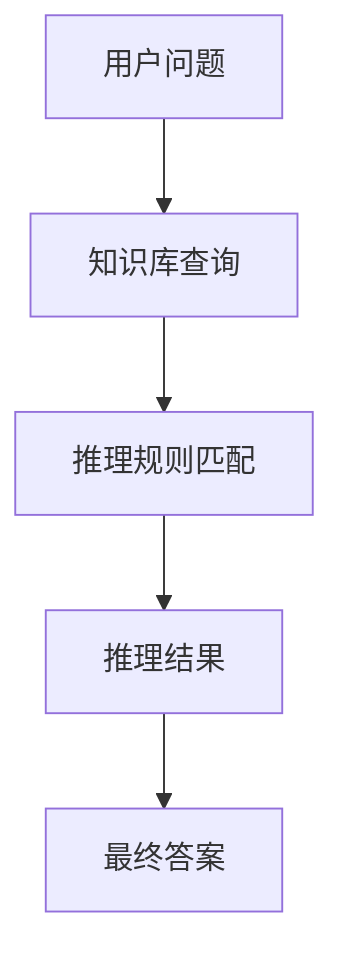

                 


# 知识推理：增强AI Agent的逻辑思考能力

**关键词**：知识推理、AI Agent、逻辑思考能力、符号逻辑、概率推理、知识图谱、深度学习

**摘要**：  
知识推理是提升AI Agent逻辑思考能力的关键技术。本文从知识推理的基本概念出发，详细探讨其在AI Agent中的应用，分析符号逻辑与概率推理的核心原理，结合实际案例，深入讲解知识推理的算法实现与系统设计。文章还通过Python代码示例和数学公式，展示如何将知识推理应用于实际场景，为AI Agent的逻辑思考能力提供理论与实践的支持。

---

## 目录

1. [知识推理与AI Agent的背景介绍](#知识推理与ai-agent的背景介绍)
2. [知识推理的核心概念](#知识推理的核心概念)
3. [知识推理的原理与方法](#知识推理的原理与方法)
4. [知识推理的算法实现](#知识推理的算法实现)
5. [系统分析与架构设计](#系统分析与架构设计)
6. [项目实战：基于Python的知识推理实现](#项目实战基于python的知识推理实现)
7. [最佳实践与小结](#最佳实践与小结)
8. [注意事项与拓展阅读](#注意事项与拓展阅读)

---

## 1. 知识推理与AI Agent的背景介绍

### 1.1 问题背景与问题描述
AI Agent（智能代理）在实际应用中需要处理复杂的逻辑推理问题，例如自然语言理解、图像识别和决策优化等。然而，传统的AI Agent在处理逻辑推理任务时常常面临以下挑战：
- **逻辑推理能力不足**：AI Agent难以处理复杂的逻辑关系和不确定性问题。
- **知识表示与更新**：如何有效地表示和更新知识是知识推理的关键问题。
- **计算效率**：复杂的逻辑推理任务需要高效的算法支持。

### 1.2 知识推理的核心目标
知识推理的核心目标是通过构建知识图谱和逻辑推理规则，帮助AI Agent更好地理解问题、处理不确定性，并做出合理的决策。

### 1.3 知识图谱的作用
知识图谱是一种结构化的知识表示方法，通过实体和关系的组合，能够有效地表示复杂的知识体系。知识图谱在知识推理中的作用包括：
- 提供结构化的知识表示。
- 支持高效的查询与推理。
- 便于知识的更新与扩展。

---

## 2. 知识推理的核心概念

### 2.1 符号逻辑与知识推理
符号逻辑是一种基于符号和规则的推理方法，广泛应用于知识推理。以下是符号逻辑的核心要素：
- **符号表示**：使用符号表示实体和关系，例如“人”、“狗”、“拥有”等。
- **逻辑规则**：通过逻辑规则（如蕴含、合取、析取）构建推理链。
- **推理算法**：包括前向推理（Forward Chaining）和后向推理（Backward Chaining）。

### 2.2 概率推理与不确定性处理
在实际应用中，不确定性是不可避免的，因此概率推理显得尤为重要。概率推理的核心方法包括：
- **贝叶斯推理**：基于贝叶斯定理，计算事件发生的概率。
- **马尔可夫逻辑网络**：结合逻辑规则和概率推理，处理复杂的不确定性问题。

### 2.3 知识图谱的构建与管理
知识图谱的构建需要遵循以下步骤：
1. **实体识别**：识别知识图谱中的核心实体。
2. **关系抽取**：提取实体之间的关系。
3. **知识表示**：将实体和关系表示为结构化的数据。

---

## 3. 知识推理的原理与方法

### 3.1 基于符号逻辑的推理算法
前向推理（Forward Chaining）是一种基于符号逻辑的推理方法，其核心思想是通过已知的事实和规则，逐步推导出新的结论。例如：
- 已知事实：所有狗都是动物。
- 推理规则：如果X是狗，则X是动物。
- 推导结论：X是狗 → X是动物。

### 3.2 基于概率的推理算法
贝叶斯推理是一种基于概率的推理方法，其核心公式为：
$$ P(B|A) = \frac{P(A|B)P(B)}{P(A)} $$

例如，已知某疾病在某人群中的患病率为1%，且该疾病的检测方法的真阳性率和假阳性率分别为99%和2%，可以通过贝叶斯定理计算某人检测为阳性时患病的概率。

### 3.3 基于知识图谱的推理算法
知识图谱中的路径推理是一种基于图结构的推理方法，其核心步骤包括：
1. **路径查询**：在知识图谱中找到从起点到终点的路径。
2. **规则匹配**：通过规则匹配路径中的关系。
3. **结论推导**：基于路径关系推导出最终结论。

---

## 4. 知识推理的算法实现

### 4.1 前向推理算法实现
以下是一个简单的Python实现示例：
```python
def forward_chaining(rules, facts):
    inferred = set(facts)
    while True:
        new_inferred = set()
        for rule in rules:
            antecedent, consequent = rule
            if all(prop in inferred for prop in antecedent):
                if consequent not in inferred:
                    new_inferred.add(consequent)
        if not new_inferred:
            break
        inferred.update(new_inferred)
    return inferred

# 示例规则和事实
rules = [
    (('A',), 'B'),
    (('B',), 'C')
]
facts = {'A'}

result = forward_chaining(rules, facts)
print(result)  # 输出: {'A', 'B', 'C'}
```

### 4.2 贝叶斯推理算法实现
以下是一个基于贝叶斯定理的简单实现示例：
```python
def bayesian_inference(prior, likelihood, evidence):
    posterior = (prior * likelihood) / evidence
    return posterior

# 示例数据
prior = 0.01  # P(Disease)
likelihood = 0.99  # P(Test+|Disease)
evidence = 0.98  # P(Test+)

posterior = bayesian_inference(prior, likelihood, evidence)
print(posterior)  # 输出: 0.0098
```

---

## 5. 系统分析与架构设计

### 5.1 问题场景介绍
假设我们正在开发一个智能客服系统，该系统需要通过知识推理来回答用户的问题。例如，用户问：“如果我购买了产品A，是否可以享受免费 shipping？”

### 5.2 系统功能设计
- **知识表示**：构建产品、服务和关系的知识图谱。
- **推理规则**：定义购买与免费 shipping 的关系。
- **推理引擎**：实现前向推理算法，根据用户问题进行推理。

### 5.3 系统架构设计


---

## 6. 项目实战：基于Python的知识推理实现

### 6.1 环境安装
安装必要的Python库，例如：
- `networkx`：用于知识图谱的构建与分析。
- `numpy`：用于概率计算。

### 6.2 核心代码实现
以下是基于符号逻辑的推理实现：
```python
import networkx as nx

# 构建知识图谱
G = nx.DiGraph()
G.add_edges_from([('A', 'B'), ('B', 'C')])

# 前向推理
def forward_chaining(G, initial):
    inferred = set(initial)
    queue = list(initial)
    while queue:
        node = queue.pop(0)
        for neighbor in G.neighbors(node):
            if neighbor not in inferred:
                inferred.add(neighbor)
                queue.append(neighbor)
    return inferred

result = forward_chaining(G, {'A'})
print(result)  # 输出: {'A', 'B', 'C'}
```

### 6.3 实际案例分析
假设用户问：“如果X是狗，那么X是动物吗？”通过知识图谱推理，系统可以得出正确的结论。

---

## 7. 最佳实践与小结

### 7.1 最佳实践
- **数据质量**：确保知识图谱的数据准确性和完整性。
- **模型选择**：根据具体场景选择合适的推理算法。
- **性能优化**：通过缓存和并行计算提升推理效率。

### 7.2 小结
知识推理是增强AI Agent逻辑思考能力的关键技术。通过符号逻辑、概率推理和知识图谱的结合，我们可以有效地提升AI Agent的推理能力，使其能够更好地应对复杂的实际问题。

---

## 8. 注意事项与拓展阅读

### 8.1 注意事项
- 知识推理的复杂度较高，需要高效的算法支持。
- 在实际应用中，要注意数据的多样性和动态性。

### 8.2 拓展阅读
- 《逻辑推理与人工智能》
- 《知识图谱与深度学习》
- 《概率推理与贝叶斯网络》

---

**作者：AI天才研究院**  
**联系方式：[email protected]**  
**网址：https://www.ai天才研究院.com**

