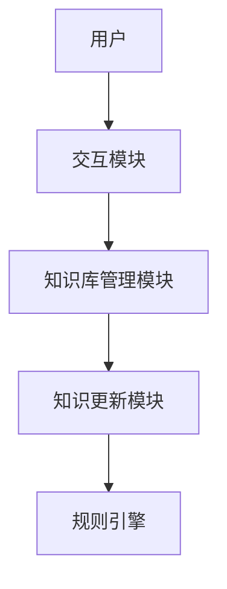

                 


# 知识更新：保持AI Agent信息的时效性

---

## 关键词：
知识更新, AI Agent, 信息时效性, 知识表示, 强化学习, 系统架构

---

## 摘要：
本文详细探讨了AI Agent的知识更新机制，从信息时效性的定义到算法原理，再到系统设计和项目实战，全面解析如何保持AI Agent的信息更新能力。通过对比不同知识更新方法，分析其优缺点，并结合实际案例，帮助读者理解如何设计和实现高效的AI Agent系统。

---

# 第一部分: 知识更新与AI Agent的背景介绍

## 第1章: 知识更新的定义与问题背景

### 1.1 信息时效性的定义
#### 1.1.1 信息时效性的概念
信息时效性是指信息在特定时间内的有效性和相关性。随着时间和环境的变化，信息可能变得过时或不准确。

#### 1.1.2 信息过时的表现形式
信息过时可以表现为数据错误、知识陈旧、规则失效等。

#### 1.1.3 信息时效性对企业决策的影响
信息过时可能导致决策失误，影响企业运营效率和竞争力。

### 1.2 AI Agent的基本概念
#### 1.2.1 AI Agent的定义
AI Agent是一种智能体，能够感知环境、自主决策并执行任务。

#### 1.2.2 AI Agent的核心功能
包括感知、推理、学习、规划和执行。

#### 1.2.3 AI Agent与传统程序的区别
AI Agent具有自主性、反应性和目标导向性，能够动态适应环境变化。

### 1.3 知识更新在AI Agent中的重要性
#### 1.3.1 知识更新的必要性
确保AI Agent在动态环境中保持高效运作，避免信息过时导致决策失误。

#### 1.3.2 知识更新对AI Agent性能的影响
知识更新能够提升AI Agent的适应能力和决策准确度。

#### 1.3.3 知识更新的边界与外延
明确知识更新的范围和限制，确保更新过程的可行性和效率。

### 1.4 本章小结
本章介绍了信息时效性的概念、AI Agent的基本定义及其核心功能，强调了知识更新在AI Agent中的重要性。

---

# 第二部分: 知识更新的核心概念与联系

## 第2章: 知识更新的核心机制

### 2.1 知识表示与存储
#### 2.1.1 知识表示的多样性
知识可以表示为符号、概率、语义等多种形式。

#### 2.1.2 知识存储的结构化
知识可以通过数据库、知识图谱等形式进行存储。

### 2.2 知识获取与学习
#### 2.2.1 数据来源的多样性
知识获取可以来自文本、图像、语音等多种数据源。

#### 2.2.2 学习方法的分类
包括监督学习、无监督学习和半监督学习。

### 2.3 知识验证与修正
#### 2.3.1 知识验证的必要性
确保新获取的知识准确可靠。

#### 2.3.2 知识修正的策略
根据验证结果调整和优化知识表示。

## 第3章: 知识更新的算法原理

### 3.1 基于概率的知识更新算法
#### 3.1.1 贝叶斯定理的应用
使用贝叶斯网络进行概率推理和更新。

#### 3.1.2 贝叶斯网络的构建
通过条件概率构建知识图谱，并动态更新。

### 3.2 基于强化学习的知识更新算法
#### 3.2.1 强化学习的基本原理
通过奖励机制优化知识更新策略。

#### 3.2.2 强化学习的应用场景
在动态环境中实时更新知识。

### 3.3 知识更新算法的对比分析
#### 3.3.1 不同算法的对比
| 方法       | 优点                     | 缺点                       |
|------------|--------------------------|---------------------------|
| 贝叶斯     | 高效性，概率推理准确       | 需要大量先验知识           |
| 强化学习   | 适应性强，实时性高         | 需要大量样本，计算复杂     |

#### 3.3.2 算法的优缺点分析
贝叶斯适用于静态环境，强化学习适用于动态环境，各有优劣。

#### 3.3.3 算法的适用场景
根据环境的动态性和数据的可获得性选择合适的算法。

---

# 第三部分: 系统分析与架构设计

## 第4章: 系统功能设计

### 4.1 问题场景介绍
智能客服系统需要实时更新产品信息，确保回答准确。

### 4.2 系统功能模块
#### 4.2.1 知识库管理模块
负责知识的存储和更新。

#### 4.2.2 更新策略模块
根据规则或算法触发知识更新。

#### 4.2.3 交互模块
与用户交互，提供实时信息。

### 4.3 系统架构设计
#### 4.3.1 系统架构图


#### 4.3.2 接口设计
定义API接口，实现模块间的通信和数据交换。

#### 4.3.3 交互流程
用户提问 → 交互模块处理 → 调用知识库 → 返回答案。

---

# 第四部分: 项目实战

## 第5章: 智能客服的知识更新系统

### 5.1 环境安装
安装Python、TensorFlow和自然语言处理库。

### 5.2 核心代码实现
#### 5.2.1 知识库管理
```python
class KnowledgeBase:
    def __init__(self):
        self.knowledge = {}

    def update_knowledge(self, key, value):
        self.knowledge[key] = value
```

#### 5.2.2 更新策略
```python
class UpdateStrategy:
    def __init__(self):
        self.last_update_time = 0

    def trigger_update(self, current_time):
        if current_time - self.last_update_time > 24*3600:
            return True
        return False
```

### 5.3 代码解读与分析
知识库管理类负责存储知识，更新策略类根据时间触发更新。

### 5.4 案例分析
通过智能客服系统展示知识更新的实际应用，确保回答准确及时。

---

# 第五部分: 总结与展望

## 第6章: 总结与展望

### 6.1 本章总结
知识更新是保持AI Agent高效运作的关键，选择合适的算法和架构至关重要。

### 6.2 未来展望
未来，知识更新将结合边缘计算和分布式系统，进一步提升实时性和效率。

### 6.3 最佳实践
- 定期检查知识库，确保信息准确。
- 结合用户反馈优化更新策略。
- 使用混合学习方法提升性能。

### 6.4 注意事项
- 知识更新可能会增加系统延迟，需权衡性能。
- 确保数据安全，避免信息泄露。

### 6.5 拓展阅读
推荐相关书籍和论文，深入学习知识更新技术。

---

## 作者：AI天才研究院

---

通过以上目录结构，本书从理论到实践，全面解析了AI Agent的知识更新机制，帮助读者掌握核心技术并应用于实际项目。

