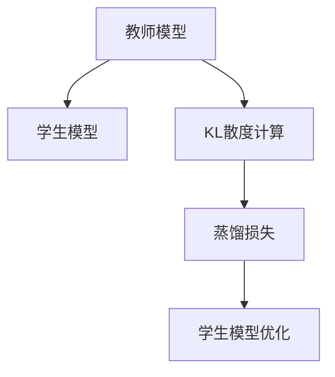
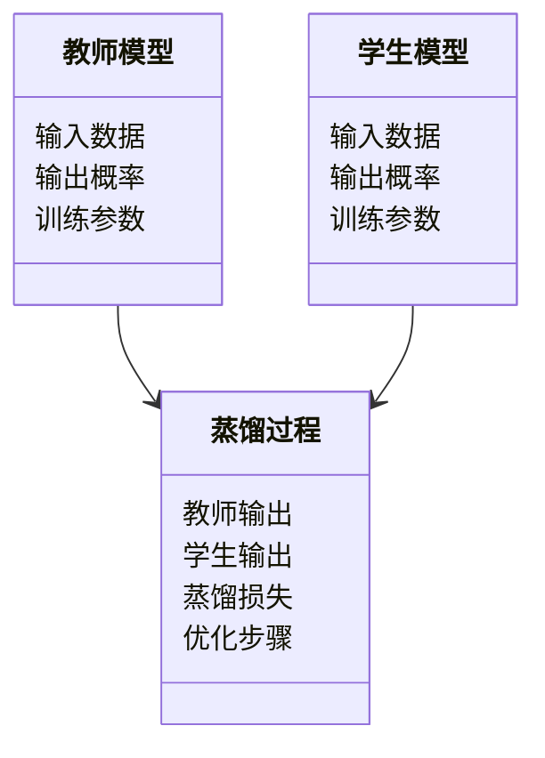
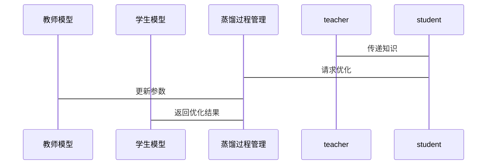

                 


```markdown
# 知识蒸馏：压缩模型大小的同时保持性能

## 关键词：知识蒸馏、模型压缩、机器学习、教师模型、学生模型、性能优化

## 摘要：知识蒸馏是一种有效的模型压缩技术，通过将大型教师模型的知识迁移到小型学生模型，从而在减少模型大小的同时保持甚至提升性能。本文将详细介绍知识蒸馏的背景、原理、算法实现、系统设计以及实际应用，帮助读者全面理解并掌握这一技术。

---

## 目录大纲

### 第一部分：知识蒸馏背景与基础

#### 第1章：知识蒸馏概述
##### 1.1 问题背景与挑战
###### 1.1.1 大模型的计算与存储问题
###### 1.1.2 模型压缩的必要性
###### 1.1.3 知识蒸馏的提出与目标

##### 1.2 知识蒸馏的核心概念
###### 1.2.1 教师模型与学生模型
###### 1.2.2 知识蒸馏的基本流程
###### 1.2.3 蒸馏过程中的关键因素

##### 1.3 知识蒸馏的技术优势
###### 1.3.1 模型压缩的效果
###### 1.3.2 训练效率的提升
###### 1.3.3 跨平台的适用性

##### 1.4 与其他模型压缩技术的对比
###### 1.4.1 知识蒸馏与剪枝的异同
###### 1.4.2 知识蒸馏与量化压缩的对比
###### 1.4.3 知识蒸馏与模型蒸馏的联系

#### 第2章：知识蒸馏的核心概念与联系
##### 2.1 核心概念原理
###### 2.1.1 教师模型的作用
###### 2.1.2 学生模型的学习机制
###### 2.1.3 蒸馏过程中的知识传递

##### 2.2 知识蒸馏的特征对比
###### 2.2.1 不同蒸馏方法的特征对比表
###### 2.2.2 蒸馏过程中的关键参数分析

##### 2.3 实体关系架构图


### 第二部分：知识蒸馏的算法原理

#### 第3章：知识蒸馏的算法原理
##### 3.1 软蒸馏与硬蒸馏
###### 3.1.1 软蒸馏的定义与实现
###### 3.1.2 硬蒸馏的定义与实现
###### 3.1.3 软蒸馏与硬蒸馏的对比

##### 3.2 蒸馏过程中的数学模型
###### 3.2.1 软蒸馏的KL散度计算
$$\text{KL}(P || Q) = \sum P_i \log \frac{P_i}{Q_i}$$
###### 3.2.2 蒸馏损失函数
$$L_{\text{distill}} = -\sum_{i=1}^{n} T_i \log S_i$$
其中，\(T_i\) 是教师模型的输出概率，\(S_i\) 是学生模型的输出概率。

##### 3.3 蒸馏过程中的优化策略
###### 3.3.1 温度缩放
$$T = \exp(\tau / T_{\text{init}})$$
其中，\(\tau\) 是训练步骤，\(T_{\text{init}}\) 是初始温度。

###### 3.3.2 跨任务蒸馏
###### 3.3.3 跨模态蒸馏

##### 3.4 蒸馏算法实现步骤


### 第三部分：系统分析与架构设计

#### 第4章：系统分析与架构设计
##### 4.1 问题场景介绍
###### 4.1.1 高性能计算需求
###### 4.1.2 模型部署的环境限制
###### 4.1.3 实时响应的要求

##### 4.2 项目介绍
###### 4.2.1 项目目标
###### 4.2.2 项目范围
###### 4.2.3 项目参与者

##### 4.3 系统功能设计
###### 4.3.1 领域模型


##### 4.4 系统架构设计
###### 4.4.1 系统架构图


##### 4.5 系统接口设计
###### 4.5.1 输入接口
###### 4.5.2 输出接口
###### 4.5.3 交互接口

##### 4.6 系统交互设计


### 第四部分：项目实战

#### 第5章：知识蒸馏的项目实战
##### 5.1 环境安装与配置
###### 5.1.1 安装依赖
###### 5.1.2 配置环境变量
###### 5.1.3 数据集准备

##### 5.2 核心代码实现
###### 5.2.1 教师模型定义
```python
class TeacherModel(torch.nn.Module):
    def __init__(self):
        super(TeacherModel, self).__init__()
        self.conv1 = torch.nn.Conv2d(3, 64, 3, padding=1)
        self.conv2 = torch.nn.Conv2d(64, 128, 3, padding=1)
        self.fc = torch.nn.Linear(128 * 32 * 32, 10)
```

###### 5.2.2 学生模型定义
```python
class StudentModel(torch.nn.Module):
    def __init__(self):
        super(StudentModel, self).__init__()
        self.conv1 = torch.nn.Conv2d(3, 32, 3, padding=1)
        self.conv2 = torch.nn.Conv2d(32, 64, 3, padding=1)
        self.fc = torch.nn.Linear(64 * 32 * 32, 10)
```

###### 5.2.3 蒸馏过程实现
```python
def distillation_loss(teacher_logits, student_logits, temp):
    teacher_probs = F.softmax(teacher_logits / temp, dim=1)
    student_probs = F.softmax(student_logits, dim=1)
    loss = -torch.sum(teacher_probs * torch.log(student_probs))
    return loss
```

##### 5.3 代码应用解读与分析
###### 5.3.1 训练过程分析
###### 5.3.2 模型评估结果
###### 5.3.3 性能对比分析

##### 5.4 实际案例分析
###### 5.4.1 案例背景介绍
###### 5.4.2 案例实施过程
###### 5.4.3 案例结果与总结

### 第五部分：扩展与最佳实践

#### 第6章：扩展与最佳实践
##### 6.1 性能优化技巧
###### 6.1.1 参数选择优化
###### 6.1.2 训练策略优化
###### 6.1.3 硬件加速优化

##### 6.2 注意事项与常见问题
###### 6.2.1 模型选择的注意事项
###### 6.2.2 蒸馏过程中的问题处理
###### 6.2.3 模型压缩后的性能验证

##### 6.3 未来研究方向
###### 6.3.1 新型蒸馏方法探索
###### 6.3.2 多模态蒸馏技术发展
###### 6.3.3 知识蒸馏的行业应用拓展

##### 6.4 最佳实践总结
###### 6.4.1 知识蒸馏的高效应用策略
###### 6.4.2 不同场景下的优化建议
###### 6.4.3 未来技术发展的趋势预测

---

## 作者：AI天才研究院/AI Genius Institute & 禅与计算机程序设计艺术 /Zen And The Art of Computer Programming
```

