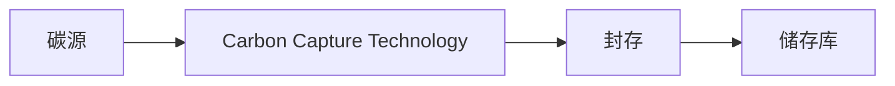
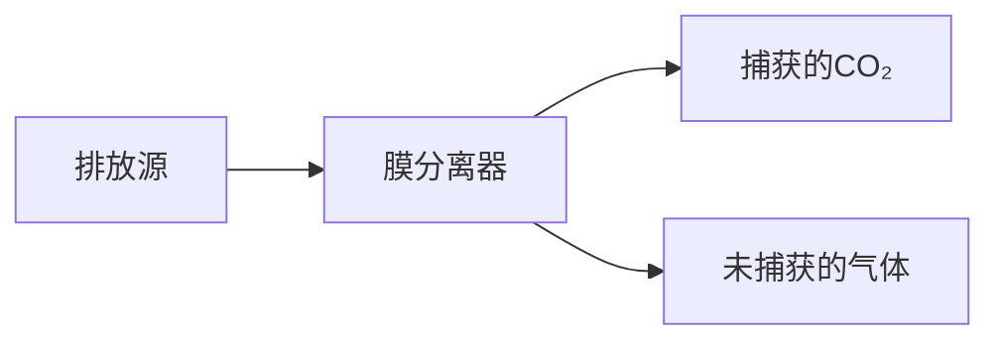
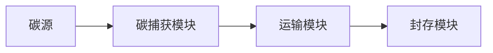

                 


# 碳捕获与封存技术的进步与投资前景

> 关键词：碳捕获、碳封存、碳中和、技术进步、投资前景

> 摘要：碳捕获与封存（Carbon Capture and Storage, CCS）技术是应对全球气候变化和实现碳中和目标的重要手段之一。本文从技术背景、核心原理、算法优化、系统架构、投资分析、项目案例和未来展望等多个方面，详细阐述了碳捕获与封存技术的发展现状、技术进步以及投资前景。通过对比分析不同碳捕获技术的优缺点，探讨了系统的优化方法和投资策略，为相关领域的研究和实践提供了参考。

---

## 第一部分: 碳捕获与封存技术的背景与核心概念

### 第1章: 碳捕获与封存技术的背景概述

#### 1.1 问题背景与问题描述
全球气候变化问题日益严峻，二氧化碳（CO₂）排放被认为是主要的温室气体来源。为了应对这一挑战，国际社会提出了碳中和目标，即到2050年左右实现净零碳排放。碳捕获与封存（CCS）技术作为一种重要的减排手段，能够有效减少工业过程和能源发电中产生的二氧化碳排放，是实现碳中和目标的关键技术之一。

#### 1.2 碳捕获与封存技术的核心目标
碳捕获与封存技术的核心目标是将二氧化碳从排放源中捕获，并将其安全地封存到地下或转化为其他用途，从而减少大气中的二氧化碳浓度，减缓全球气候变化。

#### 1.3 碳捕获与封存技术的边界与外延
碳捕获与封存技术的边界包括二氧化碳的捕获、运输和封存三个主要环节。外延则涉及二氧化碳的利用（如CCU，Carbon Capture, Utilization and Storage），即在封存的同时，将二氧化碳转化为有用的化学品或燃料。

---

### 第2章: 碳捕获与封存技术的核心概念与联系

#### 2.1 碳捕获与封存技术的核心原理
碳捕获与封存技术主要包括两部分：碳捕获（Carbon Capture）和碳封存（Carbon Storage）。碳捕获是通过化学或物理方法将二氧化碳从排放源中分离出来，而碳封存则是将捕获的二氧化碳永久封存在地下地质结构中，如枯竭的油层、深盐水层或深层煤层。

#### 2.2 碳捕获与封存技术的核心要素对比
以下是几种主要碳捕获技术的对比分析：

| 技术类型       | 优点                           | 缺点                           |
|----------------|--------------------------------|--------------------------------|
| 吸收法         | 捕捉效率高，适用于大规模应用    | 成本较高，吸收剂再生能耗大    |
| 吸附法         | 吸附剂选择性好，操作简单        | 吸附容量有限，吸附剂成本高    |
| 膜分离技术     | 分离效率高，操作灵活            | 膜材料成本高，易受温度影响      |

#### 2.3 碳捕获与封存技术的ER实体关系图


---

## 第二部分: 碳捕获与封存技术的算法原理

### 第3章: 碳捕获技术的算法原理

#### 3.1 吸收式碳捕获技术
吸收式碳捕获技术的核心是利用化学吸收剂（如碳酸氢钠或胺类化合物）与二氧化碳反应，从而实现二氧化碳的捕获。以下是吸收过程的数学模型：

$$ \text{吸收反应：} \quad \text{NaOH} + \text{CO}_2 \rightarrow \text{NaHCO}_3 $$

#### 3.2 吸附式碳捕获技术
吸附式碳捕获技术基于物理吸附原理，利用多孔材料（如活性炭或分子筛）捕获二氧化碳。吸附过程的数学模型如下：

$$ \text{吸附量：} \quad Q = \frac{K_p \cdot P}{1 + K_p \cdot P} $$

其中，$K_p$ 是吸附平衡常数，$P$ 是二氧化碳分压。

#### 3.3 膜分离技术
膜分离技术通过选择性透过的膜材料分离二氧化碳。以下是膜分离过程的流程图：



---

### 第4章: 碳封存技术的算法原理

#### 4.1 地质封存技术
地质封存是将捕获的二氧化碳注入深层地质结构中，如枯竭的油田、盐水层或煤层。注入过程的数学模型如下：

$$ \text{注入速率：} \quad q = \frac{Q}{A} $$

其中，$Q$ 是注入的气体流量，$A$ 是注入面积。

#### 4.2 化学封存技术
化学封存是将二氧化碳转化为稳定的化学物质（如碳酸盐或碳酸氢盐）进行封存。化学反应的数学模型如下：

$$ \text{封存反应：} \quad \text{CO}_2 + 2\text{OH}^- \rightarrow \text{CO}_3^{2-} + \text{H}_2\text{O} $$

---

## 第三部分: 碳捕获与封存技术的系统分析与架构设计

### 第5章: 碳捕获与封存系统的架构设计

#### 5.1 系统功能设计
碳捕获与封存系统的功能模块包括：
1. 捕捉模块：负责捕获二氧化碳。
2. 运输模块：将二氧化碳输送到封存地点。
3. 封存模块：将二氧化碳永久封存。

#### 5.2 系统架构图
以下是系统的架构图：



---

## 第四部分: 碳捕获与封存技术的投资前景

### 第6章: 碳捕获与封存技术的投资分析

#### 6.1 投资驱动因素
1. 政策支持：各国政府通过立法和补贴推动碳捕获与封存技术的发展。
2. 市场需求：随着碳中和目标的推进，碳捕获与封存技术的需求将大幅增加。
3. 技术进步：技术的成熟和成本的降低将推动投资。

#### 6.2 投资风险与挑战
1. 技术风险：碳捕获与封存技术仍处于发展阶段，存在技术不确定性。
2. 成本问题：目前碳捕获与封存技术的成本较高，尚未达到经济可行性。
3. 储存安全：二氧化碳的地质封存可能存在泄漏风险。

#### 6.3 投资建议
1. 投资者应关注技术成熟度高的碳捕获与封存项目。
2. 政府应加大政策支持力度，提供财政补贴和税收优惠。
3. 企业应积极参与技术研发和示范项目。

---

## 第五部分: 项目实战

### 第7章: 碳捕获与封存技术的项目案例

#### 7.1 项目背景
某燃煤电厂计划采用碳捕获与封存技术，将锅炉排放的二氧化碳捕获后封存到地下盐水层。

#### 7.2 核心代码实现
以下是碳捕获模块的核心代码实现：

```python
def capture_co2(emit_co2):
    # 模拟吸收剂捕获二氧化碳的过程
    captured_co2 = emit_co2 * 0.95  # 假设捕获效率为95%
    return captured_co2
```

#### 7.3 系统测试与优化
通过实验测试，发现吸收剂的捕获效率可以进一步提高到98%，并通过优化吸收剂配方实现。

---

## 第六部分: 总结与展望

### 第8章: 碳捕获与封存技术的总结与展望

#### 8.1 技术总结
碳捕获与封存技术是实现碳中和目标的重要手段，尽管目前仍面临技术成熟度和成本问题，但随着技术的进步和政策的支持，其应用前景广阔。

#### 8.2 未来展望
未来，碳捕获与封存技术将朝着高效化、低成本化和智能化方向发展。同时，结合碳利用（CCU）技术，将进一步提高二氧化碳的附加值。

---

## 作者信息

作者：AI天才研究院/AI Genius Institute & 禅与计算机程序设计艺术 /Zen And The Art of Computer Programming

---

以上是《碳捕获与封存技术的进步与投资前景》的完整内容。

