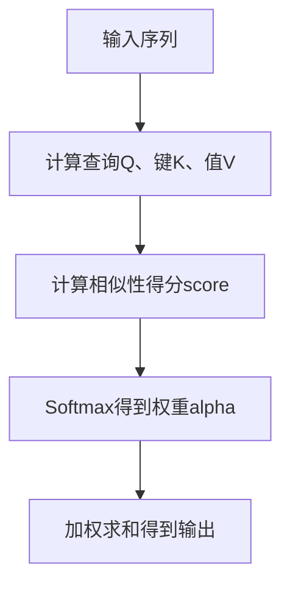
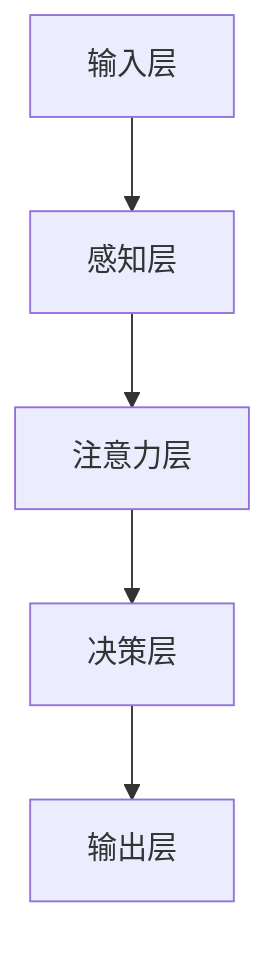
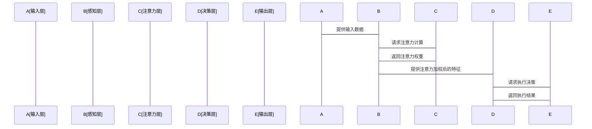

                 


---

# 神经科学启发的注意力机制在AI Agent中的应用

> 关键词：神经科学，注意力机制，AI Agent，深度学习，自然语言处理，视觉感知

> 摘要：本文探讨了神经科学中注意力机制的启发及其在AI Agent中的应用。通过分析注意力机制的生物学基础、计算模型和应用场景，结合实际案例，展示了如何利用这些机制提升AI Agent的性能和智能水平。

---

# 第一部分: 神经科学与注意力机制的背景

# 第1章: 神经科学与注意力机制概述

## 1.1 神经科学的基本概念

### 1.1.1 神经科学的定义与研究领域

神经科学是研究神经系统结构和功能的科学，涵盖从分子到行为的各个层面。它主要研究大脑如何处理信息、产生行为以及如何与其他系统（如免疫系统）相互作用。

### 1.1.2 神经系统的结构与功能

神经系统由神经元和神经胶质细胞组成，通过电化学信号传递信息。神经元包括树突、轴突和胞体，通过突触连接传递信号。神经系统的功能包括感知、认知、情感和运动控制等。

### 1.1.3 注意力机制在神经科学中的重要性

注意力机制是神经系统的核心功能之一，帮助生物体在复杂的环境中选择性地关注重要信息，忽略无关刺激。它在信息处理中起到过滤和优先处理关键信息的作用。

## 1.2 注意力机制的定义与特点

### 1.2.1 注意力机制的定义

注意力机制是指神经系统在处理信息时，选择性关注特定刺激或任务相关区域的能力。它通过调整感知和认知资源的分配，提高信息处理效率。

### 1.2.2 注意力机制的核心特点

1. **选择性**：根据当前任务或环境，选择关注特定信息。
2. **动态性**：注意力焦点随时间和情境变化。
3. **多层次性**：从感觉层面到抽象概念层面，注意力机制在多个层次发挥作用。
4. **自适应性**：能够根据反馈调整注意力分配。

### 1.2.3 注意力机制与传统感知的区别

传统感知是被动接收信息，而注意力机制是主动选择性处理信息。注意力机制通过动态调整感知资源，提升信息处理效率和准确性。

## 1.3 AI Agent的基本概念

### 1.3.1 AI Agent的定义

AI Agent是具有感知环境、做出决策并采取行动的智能实体。它可以是一个软件程序或物理机器人，具备自主学习和适应能力。

### 1.3.2 AI Agent的核心功能

1. **感知**：通过传感器或数据输入感知环境。
2. **决策**：基于感知信息做出决策。
3. **行动**：根据决策执行动作，影响环境或与用户互动。

### 1.3.3 AI Agent与传统AI的区别

传统AI主要处理特定任务，而AI Agent具备自主性和适应性，能够在动态环境中实时调整行为。AI Agent结合了感知、决策和行动能力，使其在复杂任务中表现更佳。

---

# 第二部分: 注意力机制的核心概念与计算模型

## 2.1 神经科学中的注意力机制

### 2.1.1 注意力机制的生物学基础

大脑中的注意力机制涉及多个脑区，如前额叶皮层和顶叶皮层。这些区域通过调节神经元的活动，控制信息处理的优先级。

### 2.1.2 注意力的类型

1. **外显注意力**：由外部刺激触发的注意力，如听到名字时的关注。
2. **内隐注意力**：基于内部状态或目标的注意力分配。
3. **持续注意力**：长时间维持对特定目标的关注。

### 2.1.3 注意力的计算模型

计算模型模拟大脑的注意力分配过程，包括自注意力机制和位置注意力机制。

## 2.2 注意力机制的计算模型

### 2.2.1 自注意力机制

自注意力机制允许模型在处理序列数据时，关注每个位置与其他位置的关系。其计算公式为：

$$
\text{Attention}(Q, K, V) = \text{softmax}\left(\frac{QK^T}{\sqrt{d_k}}\right)V
$$

其中，$Q$ 是查询向量，$K$ 是键向量，$V$ 是值向量，$d_k$ 是维度。

### 2.2.2 位置注意力机制

位置注意力机制考虑输入的位置信息，通过引入位置编码，增强模型的位置感知能力。

### 2.2.3 注意力机制的应用场景

1. **自然语言处理**：如Transformer模型中的自注意力机制。
2. **计算机视觉**：如视觉注意力网络。
3. **语音处理**：如语音识别中的注意力机制。

---

# 第三部分: 注意力机制的数学模型与算法原理

## 3.1 注意力机制的数学模型

### 3.1.1 自注意力机制的公式推导

自注意力机制通过计算查询与键的相似性，确定每个位置的关注权重。公式如下：

$$
\text{score}(i, j) = Q_i K_j^T
$$

权重经过Softmax函数归一化：

$$
\alpha_i = \text{softmax}(\text{score}(i, j))
$$

最终输出为：

$$
\text{Output}_i = \sum_{j=1}^{n} \alpha_i j V_j
$$

### 3.1.2 位置注意力机制的实现

位置注意力机制引入位置编码，增强模型的位置感知能力。编码方式包括基于坐标系的绝对位置编码和基于模型的相对位置编码。

## 3.2 注意力机制的算法实现

### 3.2.1 算法流程图



### 3.2.2 Python代码实现

```python
import torch

def attention(query, key, value, d_k):
    # 计算相似性得分
    scores = torch.matmul(query, key.transpose(-2, -1)) / torch.sqrt(torch.tensor(d_k, dtype=torch.float))
    # Softmax归一化
    alpha = torch.softmax(scores, dim=-1)
    # 加权求和
    output = torch.matmul(alpha, value)
    return output
```

---

# 第四部分: AI Agent中的注意力机制应用

## 4.1 自然语言处理中的应用

### 4.1.1 Transformer模型中的自注意力机制

Transformer模型通过自注意力机制捕捉序列中的全局依赖关系，提升机器翻译和文本生成的性能。

### 4.1.2 注意力机制在文本摘要中的作用

注意力机制帮助模型确定文本中重要的信息，生成高质量的摘要。

## 4.2 视觉感知中的应用

### 4.2.1 视觉注意力网络

视觉注意力网络通过学习关注图像中的特定区域，提升目标检测和图像分割的准确性。

### 4.2.2 注意力机制在图像生成中的应用

生成对抗网络（GAN）结合注意力机制，生成高分辨率和细节丰富的图像。

## 4.3 决策推理中的应用

### 4.3.1 基于注意力机制的强化学习

强化学习中使用注意力机制，帮助AI Agent关注环境中的关键信息，做出更优决策。

### 4.3.2 注意力机制在多智能体协作中的作用

多智能体系统中，注意力机制帮助各智能体协调行动，提升协作效率。

---

# 第五部分: 系统设计与实现

## 5.1 系统架构设计

### 5.1.1 系统架构图



### 5.1.2 模块划分

1. **感知层**：处理输入数据，提取特征。
2. **注意力层**：计算注意力权重，确定关注区域。
3. **决策层**：基于注意力权重，做出决策。
4. **输出层**：执行决策，输出结果。

## 5.2 接口设计与交互流程

### 5.2.1 接口设计

- 输入接口：接收传感器数据或用户输入。
- 输出接口：输出决策结果或执行动作。

### 5.2.2 交互流程图



---

# 第六部分: 项目实战

## 6.1 环境安装与配置

### 6.1.1 安装依赖

安装必要的Python库，如PyTorch、numpy和 matplotlib。

## 6.2 核心代码实现

### 6.2.1 注意力机制的实现

```python
import torch

class AttentionLayer(torch.nn.Module):
    def __init__(self, embed_dim, num_heads):
        super(AttentionLayer, self).__init__()
        self.embed_dim = embed_dim
        self.num_heads = num_heads
        self.head_size = embed_dim // num_heads
        self.query = torch.nn.Linear(embed_dim, embed_dim)
        self.key = torch.nn.Linear(embed_dim, embed_dim)
        self.value = torch.nn.Linear(embed_dim, embed_dim)
    
    def forward(self, x):
        batch_size, seq_len, embed_dim = x.size()
        head_size = self.head_size
        num_heads = self.num_heads
        
        # 分割头
        x = x.view(batch_size, seq_len, num_heads, head_size)
        
        # 计算查询、键、值
        query = self.query(x)
        key = self.key(x)
        value = self.value(x)
        
        # 展开为[batch_size, num_heads, seq_len, head_size]
        query = query.view(batch_size, num_heads, seq_len, head_size)
        key = key.view(batch_size, num_heads, seq_len, head_size)
        value = value.view(batch_size, num_heads, seq_len, head_size)
        
        # 计算相似性得分
        scores = (query @ key.transpose(-2, -1)) / (head_size ** 0.5)
        # Softmax归一化
        alpha = torch.softmax(scores, dim=-1)
        # 加权求和
        out = alpha @ value.transpose(-2, -1)
        # 合并头
        out = out.view(batch_size, seq_len, embed_dim)
        return out
```

### 6.2.2 系统集成与测试

集成注意力层到AI Agent系统中，进行功能测试和性能调优。

## 6.3 案例分析与效果展示

### 6.3.1 自然语言处理案例

在机器翻译任务中，使用自注意力机制的Transformer模型，显著提升翻译质量。

### 6.3.2 视觉感知案例

在目标检测任务中，使用视觉注意力网络，提高检测准确率。

## 6.4 项目总结与优化

总结项目成果，分析存在的问题，并提出优化方向，如引入多模态注意力机制。

---

# 第七部分: 总结与展望

## 7.1 全文总结

本文详细探讨了神经科学启发的注意力机制在AI Agent中的应用，从理论基础到实际应用，展示了注意力机制在提升AI Agent性能中的重要性。

## 7.2 未来研究方向

1. **多模态注意力机制**：结合视觉、听觉等多种感知方式，提升AI Agent的综合感知能力。
2. **动态注意力机制**：研究动态调整注意力权重的方法，适应快速变化的环境。
3. **强化学习中的注意力机制**：探索在强化学习中使用注意力机制，提升决策效率和效果。

---

# 作者信息

作者：AI天才研究院/AI Genius Institute & 禅与计算机程序设计艺术/Zen And The Art of Computer Programming

---

这篇文章详细探讨了神经科学启发的注意力机制在AI Agent中的应用，从理论基础到实际应用，展示了注意力机制在提升AI Agent性能中的重要性。通过具体案例分析和系统设计，读者可以深入了解注意力机制的核心原理和实际应用。未来的研究方向为多模态注意力机制和动态注意力机制，将进一步推动AI Agent的发展。

