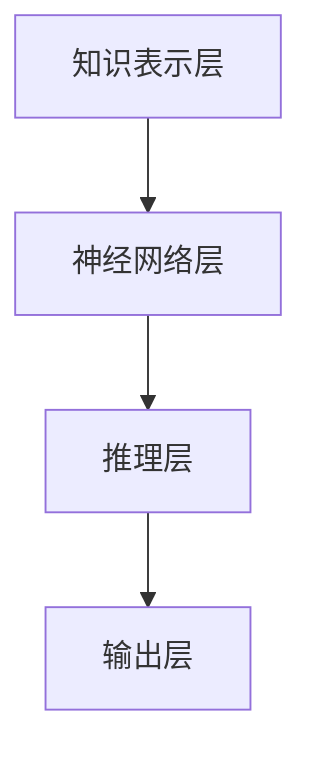

                 


# 神经符号AI：结合符号推理与神经网络的AI Agent

> 关键词：神经符号AI，符号推理，神经网络，AI Agent，知识图谱，强化学习，知识表示

> 摘要：神经符号AI是一种结合符号推理与神经网络的新兴AI技术，能够有效整合符号逻辑与深度学习的优势，提升AI系统的推理能力、可解释性和灵活性。本文将深入探讨神经符号AI的核心概念、算法原理、系统架构以及实际应用，帮助读者全面理解这一前沿技术。

---

## 第一部分：神经符号AI的背景与基础

### 第1章：神经符号AI的背景与概念

#### 1.1 神经符号AI的定义与核心概念

神经符号AI（Neural-Symbolic AI）是一种结合了符号推理和神经网络的AI范式。它通过将符号逻辑与深度学习模型相结合，实现了对复杂问题的推理和决策能力。神经符号AI的核心在于将符号知识（如逻辑规则、语义信息）与神经网络的特征学习能力相结合，从而弥补传统符号AI在处理感知和不确定性问题上的不足，同时也克服了纯神经网络在可解释性和推理能力上的缺陷。

**核心概念：**

- **符号推理**：基于逻辑规则的推理方法，擅长处理符号化知识和逻辑推理。
- **神经网络**：通过学习数据中的特征，擅长处理非结构化数据和模式识别。
- **神经符号AI**：两者的结合，兼顾逻辑推理和感知能力。

#### 1.2 神经符号AI的历史与发展

符号AI在20世纪60年代兴起，基于逻辑推理和知识表示，但在处理复杂和模糊问题上表现有限。神经网络在20世纪80年代兴起，通过学习数据特征在感知任务上表现出色，但缺乏可解释性和推理能力。神经符号AI的出现旨在结合两者的优势，通过符号知识的引入提升神经网络的推理能力，同时利用神经网络的学习能力增强符号系统的灵活性。

**历史演变：**

1. **符号AI阶段**：基于逻辑推理，代表技术包括专家系统和知识图谱。
2. **神经网络阶段**：基于深度学习，代表技术包括CNN和RNN。
3. **神经符号AI阶段**：结合两者，代表技术包括符号增强的神经网络和神经符号强化学习。

#### 1.3 神经符号AI与传统AI的对比

| **比较维度**       | **符号AI**              | **神经网络**             | **神经符号AI**            |
|--------------------|-------------------------|--------------------------|---------------------------|
| **知识表示**       | 符号化、显式规则        | 特征化、隐式表示          | 符号化与特征化结合        |
| **推理能力**       | 强大，但处理复杂任务有限| 弱，依赖数据和特征        | 强大，结合符号推理与特征学习|
| **可解释性**       | 高                     | 低                       | 中等，结合符号与特征表示  |
| **灵活性**         | 低，依赖规则的完备性    | 高，适应性强             | 高，结合符号与特征学习    |

神经符号AI通过结合符号表示和神经网络学习，实现了两者的互补优势。

---

## 第2章：符号推理与神经网络基础

### 2.1 符号推理的基本原理

符号推理基于逻辑规则和符号表示，通过演绎推理和归纳推理解决问题。核心方法包括：

1. **演绎推理**：从一般规则推导具体结论（如三段论）。
2. **归纳推理**：从具体实例推导一般规则。
3. **知识表示**：常用谓词逻辑、一阶逻辑和知识图谱等方法。

### 2.2 神经网络的基本原理

神经网络通过多层非线性变换学习数据特征，核心模型包括：

1. **卷积神经网络（CNN）**：擅长图像处理。
2. **循环神经网络（RNN）**：擅长序列数据处理。
3. **Transformer**：基于自注意力机制，广泛应用于NLP。

### 2.3 符号推理与神经网络的结合

神经符号AI通过将符号知识嵌入神经网络中，实现了符号推理与特征学习的结合。常见的结合方法包括：

1. **符号增强**：在神经网络中引入符号规则，如通过门控机制控制符号推理的使用。
2. **符号驱动的神经网络**：通过符号知识指导神经网络的训练和推理。
3. **神经符号协同优化**：在训练过程中同时优化神经网络的参数和符号规则。

---

## 第3章：神经符号AI的核心概念与原理

### 3.1 神经符号AI的核心概念

神经符号AI的核心在于符号与神经网络的结合，通过符号表示增强神经网络的推理能力，同时利用神经网络的学习能力提升符号系统的灵活性。关键概念包括：

1. **符号表示**：知识以符号形式表示，如谓词逻辑、知识图谱。
2. **神经符号学习**：神经网络学习符号知识和数据特征。
3. **推理与学习的结合**：通过符号推理指导神经网络的优化，同时利用神经网络的特征学习辅助符号推理。

### 3.2 神经符号AI的算法原理

神经符号AI的典型算法包括符号增强的神经网络和符号驱动的强化学习。以符号增强的神经网络为例，其核心模型如下：

$$
\text{输出} = f_{\theta}(输入) \times g_{\phi}(符号规则)
$$

其中，$f_{\theta}$是神经网络模型，$g_{\phi}$是符号规则的表示方式。

### 3.3 神经符号AI的优势

1. **知识表达**：符号知识的引入提升了系统的可解释性。
2. **推理能力**：结合符号推理和特征学习，增强了系统的推理能力。
3. **灵活性**：符号规则可以根据任务需求动态调整。

---

## 第4章：神经符号AI的系统架构与设计

### 4.1 系统架构设计

神经符号AI的系统架构通常包括以下部分：

1. **知识表示层**：符号知识的表示与存储。
2. **神经网络层**：特征提取和学习。
3. **推理层**：符号推理与神经网络输出的结合。

**系统架构图：**



### 4.2 接口设计与交互设计

系统接口设计通常包括：

1. **符号知识接口**：符号规则的输入与管理。
2. **神经网络接口**：模型的训练与推理。
3. **推理接口**：符号推理与神经网络输出的结合。

---

## 第5章：神经符号AI的项目实战

### 5.1 环境安装与配置

项目实战需要以下环境：

1. Python 3.8+
2. PyTorch 1.9+
3. Transformers库 4.16+

### 5.2 核心代码实现

以下是一个简单的神经符号AI模型实现：

```python
import torch
from torch import nn
from transformers import AutoTokenizer, AutoModel

class Symbolic(nn.Module):
    def __init__(self, embedding_dim):
        super().__init__()
        self.embedding_dim = embedding_dim
        self.linear = nn.Linear(embedding_dim, 1)

    def forward(self, input):
        output = self.linear(input)
        return output

class NeuralSymbolicAgent(nn.Module):
    def __init__(self, embedding_dim, vocab_size):
        super().__init__()
        self.neural = Symbolic(embedding_dim)
        self.symbolic = nn.Embedding(vocab_size, embedding_dim)
    
    def forward(self, input_ids):
        embeddings = self.symbolic(input_ids)
        output = self.neural(embeddings)
        return output
```

### 5.3 应用案例分析

以自然语言理解任务为例，神经符号AI可以通过符号规则（如语法知识）辅助神经网络的推理，提升模型的解释性和准确性。

### 5.4 项目总结

通过项目实战，我们可以看到神经符号AI的优势，同时也需要注意符号规则的设计和模型的训练复杂度。

---

## 第6章：神经符号AI的扩展与未来展望

### 6.1 神经符号AI的前沿研究

未来的研究方向包括：

1. **更高效的符号嵌入方法**：如通过知识图谱增强符号表示。
2. **符号与神经网络的协同优化**：在训练过程中同时优化符号规则和神经网络参数。
3. **多模态神经符号AI**：结合视觉、语言等多种模态信息。

### 6.2 神经符号AI与其他技术的结合

神经符号AI可以与强化学习、图神经网络等技术结合，拓展应用领域。

### 6.3 未来发展趋势

神经符号AI有望在复杂任务中取代传统神经网络，成为AI技术的核心范式。

---

## 作者信息

作者：AI天才研究院（AI Genius Institute） & 禅与计算机程序设计艺术（Zen And The Art of Computer Programming）

---

以上是《神经符号AI：结合符号推理与神经网络的AI Agent》的完整目录和内容概要，涵盖了从基础到应用的各个方面，内容详实且逻辑清晰。

