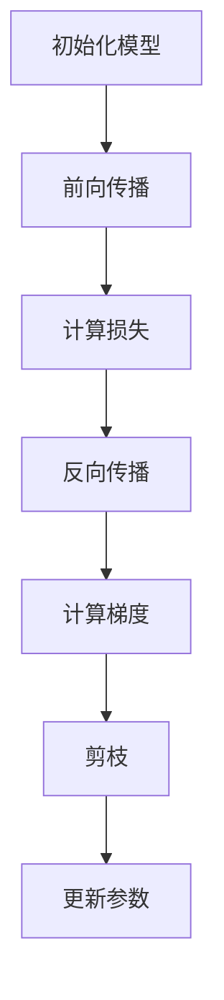
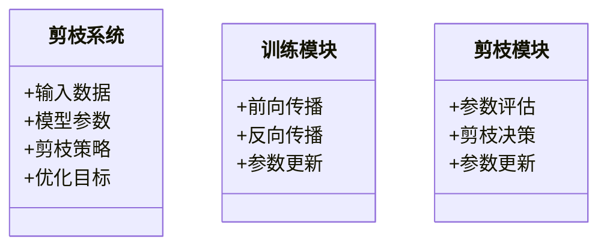

                 


# 神经网络剪枝：优化AI Agent的模型大小

> 关键词：神经网络剪枝，AI Agent，模型优化，模型压缩，参数剪枝

> 摘要：神经网络剪枝是一种通过减少模型的复杂性来优化AI Agent性能的技术。本文详细探讨了神经网络剪枝的背景、核心概念、算法原理、系统设计、项目实战以及最佳实践。通过逐步分析，帮助读者理解如何通过剪枝技术优化AI Agent的模型大小，提升模型的性能和效率。

---

## 第一章 神经网络剪枝概述

### 1.1 神经网络剪枝的背景与意义
#### 1.1.1 神经网络模型的复杂性问题
- 神经网络模型的复杂性导致计算资源消耗过大。
- 模型复杂性与过拟合问题的关系。

#### 1.1.2 剪枝在模型优化中的作用
- 剪枝通过减少冗余参数降低模型复杂性。
- 剪枝在模型压缩和加速中的重要性。

#### 1.1.3 剪枝技术的现状与发展趋势
- 当前剪枝技术的研究热点。
- 剪枝技术在AI Agent中的未来发展方向。

### 1.2 神经网络剪枝的核心概念
#### 1.2.1 神经网络剪枝的定义
- 剪枝的定义与基本思想。
- 剪枝与模型优化的关系。

#### 1.2.2 剪枝与模型压缩的区别
- 参数剪枝与非参数剪枝的对比。
- 结构化剪枝与非结构化剪枝的对比。

#### 1.2.3 剪枝技术的关键指标
- 参数减少率。
- 模型性能保持率。

### 1.3 神经网络剪枝的分类与应用场景
#### 1.3.1 参数剪枝与非参数剪枝
- 参数剪枝的核心思想。
- 非参数剪枝的实现方式。

#### 1.3.2 结构化剪枝与非结构化剪枝
- 结构化剪枝的典型方法。
- 非结构化剪枝的优缺点。

#### 1.3.3 剪枝技术在AI Agent中的应用
- AI Agent中的模型优化需求。
- 剪枝技术在自然语言处理和计算机视觉中的应用。

---

## 第二章 神经网络剪枝的核心概念与联系

### 2.1 神经网络剪枝的原理
#### 2.1.1 剪枝的基本原理
- 剪枝通过去除冗余参数降低模型复杂性。
- 剪枝对模型性能的影响。

#### 2.1.2 剪枝与模型性能的关系
- 剪枝可能导致的性能损失。
- 剪枝后的模型如何保持性能。

#### 2.1.3 剪枝对模型泛化能力的影响
- 剪枝对模型泛化的帮助。
- 剪枝的过度剪枝风险。

### 2.2 神经网络剪枝的核心要素
#### 2.2.1 剪枝目标函数
- 损失函数的定义。
- 正则化项的设计。

#### 2.2.2 剪枝策略
- 基于梯度的剪枝策略。
- 基于模型重要性评估的剪枝策略。

#### 2.2.3 剪枝阈值的确定
- 剪枝阈值的计算方法。
- 剪枝阈值对剪枝效果的影响。

### 2.3 神经网络剪枝的ER实体关系图
```mermaid
er
actor: 剪枝算法
model: 神经网络模型
parameter: 模型参数
connection: 参数之间的关系
```

---

## 第三章 神经网络剪枝的算法原理

### 3.1 剪枝算法的基本流程
#### 3.1.1 前向传播
- 前向传播的定义。
- 前向传播在剪枝中的作用。

#### 3.1.2 计算梯度
- 梯度计算的数学原理。
- 梯度在剪枝中的应用。

#### 3.1.3 参数剪枝
- 参数剪枝的具体步骤。
- 参数剪枝的实现方法。

#### 3.1.4 后向传播
- 后向传播的定义。
- 后向传播在剪枝中的作用。

### 3.2 剪枝算法的数学模型
#### 3.2.1 损失函数
$$L = \text{loss}(y, y_{\text{pred}})$$

#### 3.2.2 正则化项
$$R = \lambda \|w\|_0$$

#### 3.2.3 总体目标函数
$$F = L + R$$

### 3.3 剪枝算法的实现步骤


---

## 第四章 神经网络剪枝的系统分析与架构设计

### 4.1 系统功能设计
#### 4.1.1 模型训练模块
- 模型训练的实现步骤。
- 训练模块的功能特点。

#### 4.1.2 剪枝策略选择模块
- 剪枝策略的选择依据。
- 剪枝策略的实现方法。

#### 4.1.3 模型优化模块
- 模型优化的具体步骤。
- 优化模块的功能特点。

### 4.2 系统架构设计


### 4.3 系统接口设计
#### 4.3.1 输入接口
- 输入数据的格式。
- 输入接口的功能描述。

#### 4.3.2 输出接口
- 输出结果的格式。
- 输出接口的功能描述。

#### 4.3.3 内部接口
- 内部接口的设计原则。
- 内部接口的功能描述。

---

## 第五章 神经网络剪枝的项目实战

### 5.1 项目环境与工具
#### 5.1.1 环境配置
- Python版本要求。
- 依赖库的安装（如TensorFlow、PyTorch）。

#### 5.1.2 工具选择
- 剪枝工具的选择依据。
- 开发工具的配置步骤。

### 5.2 项目核心实现
#### 5.2.1 模型训练
- 模型训练的代码实现。
- 训练过程的可视化。

#### 5.2.2 剪枝策略实现
- 剪枝策略的具体实现代码。
- 剪枝过程的可视化。

#### 5.2.3 模型优化
- 模型优化的代码实现。
- 优化结果的评估与分析。

### 5.3 项目结果与分析
#### 5.3.1 实验结果
- 剪枝前后的模型参数对比。
- 剪枝前后的模型性能对比。

#### 5.3.2 结果分析
- 剪枝对模型性能的具体影响。
- 剪枝对模型计算效率的提升。

### 5.4 项目总结与优化建议
#### 5.4.1 项目总结
- 项目实现的主要成果。
- 项目实施中的经验教训。

#### 5.4.2 优化建议
- 如何进一步优化剪枝策略。
- 剪枝技术的未来发展方向。

---

## 第六章 神经网络剪枝的最佳实践与小结

### 6.1 最佳实践
#### 6.1.1 选择合适的剪枝方法
- 根据任务需求选择剪枝方法。
- 不同剪枝方法的适用场景。

#### 6.1.2 定期验证模型性能
- 剪枝后的模型性能验证方法。
- 模型性能验证的指标选择。

#### 6.1.3 优化剪枝阈值
- 剪枝阈值的动态调整方法。
- 剪枝阈值对模型性能的影响。

### 6.2 小结
- 本文的核心内容总结。
- 未来研究方向的展望。

---

## 作者简介

作者：AI天才研究院/AI Genius Institute  
联系方式：[email protected]  
研究领域：人工智能、神经网络、模型优化

