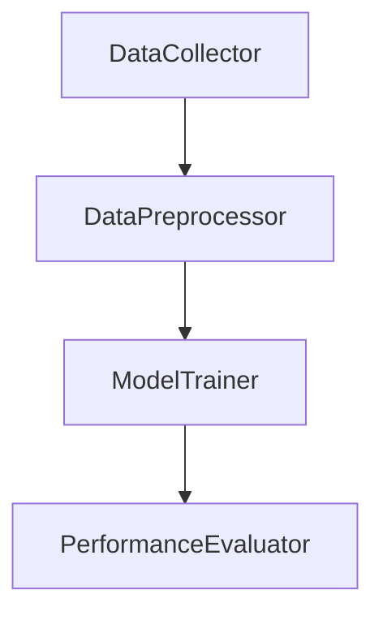
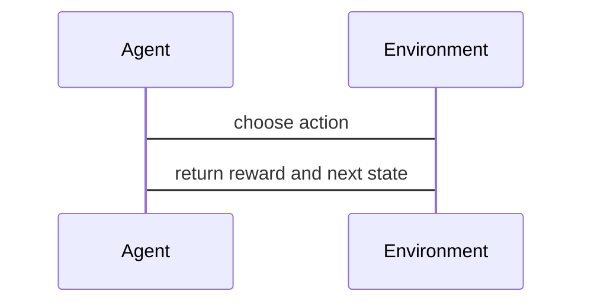

                 


# 离线强化学习：利用历史数据训练AI Agent

> 关键词：离线强化学习，强化学习，机器学习，AI Agent，历史数据，算法，系统架构设计

> 摘要：本文深入探讨了离线强化学习的原理、算法及其在训练AI代理中的应用。从基本概念到系统架构设计，再到实际项目案例，全面解析了如何利用历史数据高效训练强化学习模型。

---

# 离线强化学习概述

## 1.1 离线强化学习的基本概念

### 1.1.1 离线强化学习的定义

离线强化学习（Offline Reinforcement Learning）是一种通过利用历史数据来训练强化学习模型的方法。与在线强化学习不同，离线学习不需要实时与环境交互，而是使用预先收集的数据进行训练。这种模式特别适用于那些无法频繁与真实环境交互的场景，如自动驾驶、游戏AI和机器人控制。

### 1.1.2 离线强化学习的特点

- **数据依赖性**：依赖于高质量的历史数据。
- **无需实时交互**：减少了对真实环境的依赖。
- **高效性**：可以快速迭代和优化策略。

### 1.1.3 离线强化学习的应用场景

- **游戏AI**：在游戏训练中，可以利用历史对战数据进行优化。
- **机器人控制**：在模拟环境中训练机器人，减少物理环境的限制。
- **金融交易**：利用历史市场数据训练交易策略。

---

## 1.2 离线强化学习与在线强化学习的对比

| 特性                | 离线强化学习                          | 在线强化学习                          |
|---------------------|--------------------------------------|--------------------------------------|
| 数据来源            | 历史数据                              | 实时环境交互数据                      |
| 训练效率            | 高                                   | 低                                   |
| 环境交互            | 无                                   | 需要实时交互                         |
| 适用场景            | 离线优化、模拟训练                    | 真实环境实时控制                      |

### 1.2.3 离线强化学习的优势

- **成本低**：无需频繁与环境交互，节省资源。
- **风险低**：在模拟环境中训练，避免实际操作中的风险。

---

# 离线强化学习的数学模型

## 2.1 状态-动作-奖励模型

### 2.1.1 状态空间的定义

状态空间是强化学习问题中的环境信息集合。例如，在游戏中，状态可以是玩家的位置、剩余生命值等。

### 2.1.2 动作空间的定义

动作空间是AI代理可以执行的所有可能动作的集合。例如，在游戏中，动作可以是移动、攻击、使用道具等。

### 2.1.3 奖励函数的设计

奖励函数用于衡量代理行为的好坏。例如，在游戏中，击败敌人可以得到正奖励，失败则得到负奖励。

---

## 2.2 策略函数的数学表达

### 2.2.1 策略函数的定义

策略函数 $\pi(a|s)$ 表示在状态 $s$ 下选择动作 $a$ 的概率。

### 2.2.2 策略函数的优化目标

最大化累积奖励：$$ \max_{\pi} \mathbb{E}[R] $$

### 2.2.3 策略函数的更新公式

使用梯度上升法更新策略：

$$ \theta \leftarrow \theta + \alpha \nabla_\theta J(\pi) $$

其中，$\alpha$ 是学习率，$J(\pi)$ 是目标函数。

---

## 2.3 Q-learning算法的数学推导

### 2.3.1 Q-learning的基本原理

Q值更新公式：

$$ Q(s, a) \leftarrow Q(s, a) + \alpha (r + \gamma \max_{a'} Q(s', a') - Q(s, a)) $$

其中，$\alpha$ 是学习率，$\gamma$ 是折扣因子。

---

# 离线强化学习的核心算法

## 3.1 Q-learning算法

### 3.1.1 Q-learning的算法流程

1. 初始化Q表为零。
2. 重复以下步骤：
   - 选择动作并执行。
   - 更新Q值。
3. 直到收敛。

### 3.1.2 Q-learning的优缺点

- 优点：简单易实现。
- 缺点：收敛速度慢，可能陷入局部最优。

---

## 3.2 Deep Q-Network (DQN)算法

### 3.2.1 DQN的基本原理

使用神经网络近似Q值函数，通过经验回放和目标网络减少偏差。

### 3.2.2 DQN的网络结构

- 输入层：接收状态输入。
- 隐藏层：处理特征。
- 输出层：输出Q值。

### 3.2.3 DQN的训练流程

1. 从经验回放池中抽取小批量数据。
2. 训练神经网络最小化损失函数。

---

## 3.3 Proximal Policy Optimization (PPO)算法

### 3.3.1 PPO的基本原理

优化策略，保持策略更新幅度在限制范围内。

### 3.3.2 PPO的策略优化方法

使用异策略评估和策略梯度结合。

---

# 离线强化学习的系统架构设计

## 4.1 离线强化学习系统的组成

### 4.1.1 数据收集模块

收集历史数据，包括状态、动作和奖励。

### 4.1.2 数据处理模块

预处理数据，去除噪声，归一化。

### 4.1.3 策略训练模块

训练策略网络，优化模型参数。

### 4.1.4 结果评估模块

评估模型性能，计算回报。

---

## 4.2 系统功能设计

### 4.2.1 数据预处理功能

- 去除冗余数据。
- 填充缺失值。

### 4.2.2 策略训练功能

- 初始化模型。
- 执行训练循环。

### 4.2.3 性能评估功能

- 计算平均回报。
- 绘制学习曲线。

---

## 4.3 系统架构图



---

# 离线强化学习的项目实战

## 5.1 环境安装与配置

### 5.1.1 安装Python环境

使用Anaconda安装Python 3.8以上版本。

### 5.1.2 安装必要的库

安装TensorFlow和Keras：

```bash
pip install tensorflow keras
```

### 5.1.3 配置开发环境

设置虚拟环境，安装ipython。

---

## 5.2 离线数据集的准备

### 5.2.1 数据格式

存储状态、动作和奖励的JSON文件。

### 5.2.2 数据加载

使用Python读取数据：

```python
import json

data = json.load(open('data.json'))
```

---

## 5.3 离线强化学习的核心实现

### 5.3.1 DQN实现

```python
class DQNetwork:
    def __init__(self, state_size, action_size, learning_rate):
        self.model = Sequential()
        self.model.add(Dense(24, activation='relu', input_dim=state_size))
        self.model.add(Dense(24, activation='relu'))
        self.model.add(Dense(action_size, activation='linear'))
        self.model.compile(loss='mean_squared_error', optimizer=Adam(lr=learning_rate))
```

### 5.3.2 训练循环

```python
import numpy as np

def train_offline():
    agent = DQNetwork(state_size, action_size, LEARNING_RATE)
    for episode in range(NUM_EPISODES):
        state = get_state()
        action = choose_action(state)
        reward = get_reward(action)
        next_state = get_next_state(action, reward)
        agent.train(state, action, reward, next_state)
```

---

## 5.4 实际案例分析

### 5.4.1 游戏AI训练

使用DQN算法训练游戏AI，优化得分。

### 5.4.2 系统交互图



---

## 5.5 项目小结

通过项目实战，我们掌握了离线强化学习的实现步骤，从数据准备到模型训练，再到结果评估，每一步都需要细致处理。

---

# 最佳实践与小结

## 6.1 小结

离线强化学习通过利用历史数据，为训练AI代理提供了高效的方法，减少了对真实环境的依赖。

---

## 6.2 注意事项

- 数据质量影响模型性能。
- 算法选择需根据任务特点。
- 模型调参需耐心优化。

---

## 6.3 拓展阅读

- 经典书籍：《Reinforcement Learning: Theory and Algorithms》
- 开源库：OpenAI Gym

---

# 作者

作者：AI天才研究院 & 禅与计算机程序设计艺术

---

通过本文，读者可以系统地了解离线强化学习的核心概念、算法实现和系统设计，并通过实际案例掌握其应用方法。

