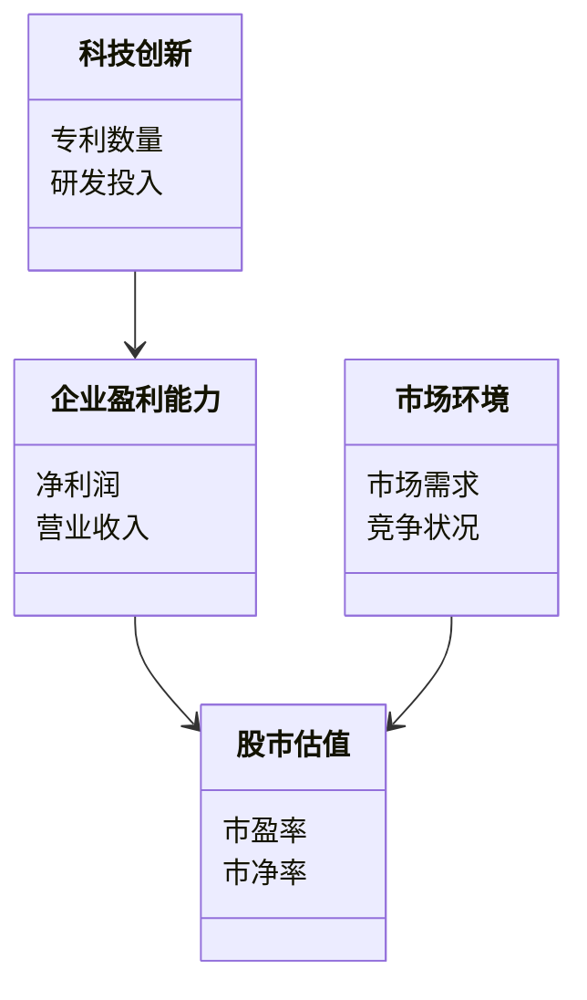
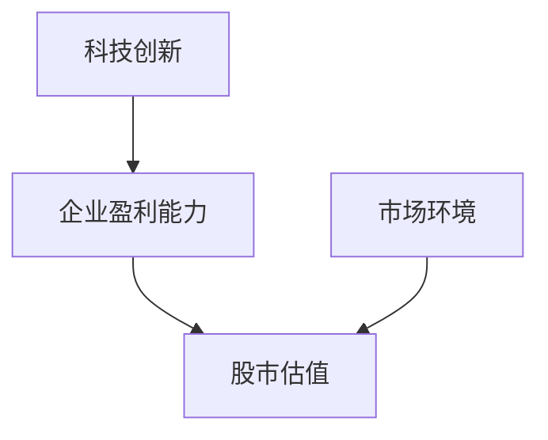

                 


# 《科技创新对全球股市估值的影响分析》

## 关键词：科技创新, 股市估值, 经济影响, 数学模型, 实证分析

## 摘要：  
科技创新是推动现代经济发展的重要驱动力，而股市估值是衡量企业价值的核心指标之一。本文通过分析科技创新对全球股市估值的影响，构建了科技创新对股市估值的数学模型，并结合实证分析和系统性研究，探讨了科技创新如何改变市场参与者的行为、影响企业的盈利能力以及重塑市场的估值逻辑。通过案例分析和数据建模，本文揭示了科技创新对全球股市估值的多维度影响，并提出了相应的投资策略建议。

---

# 第一部分：科技创新与全球股市估值的背景

# 第1章：科技创新与全球股市估值的背景介绍

## 1.1 科技创新的核心概念

### 1.1.1 科技创新的定义与特征

科技创新是指通过技术进步和创新活动对企业或经济系统产生变革的过程。其核心特征包括：

1. **创新性**：引入新的技术、产品或服务。
2. **扩散性**：技术的广泛应用对经济产生广泛影响。
3. **动态性**：科技创新是一个持续的过程，不断推动经济结构优化。

### 1.1.2 全球股市估值的基本概念

股市估值是衡量企业市场价值的核心指标，常用的估值指标包括：

1. **市盈率（P/E）**：股价与每股净利润的比值。
2. **市净率（P/B）**：股价与每股净资产的比值。
3. **市值（Market Value）**：公司股票的总市值。

### 1.1.3 科技创新对股市估值的潜在影响

科技创新通过改变企业的盈利模式、市场竞争力和行业结构，直接影响股市估值。例如，科技企业的高成长性通常会导致其市盈率远高于传统企业。

---

## 1.2 科技创新与股市估值的关联性

### 1.2.1 科技创新对经济发展的推动作用

科技创新通过提高生产效率、创造新产品和新市场，推动经济增长，从而间接影响股市估值。例如，人工智能技术的普及可能提升企业的利润率。

### 1.2.2 股市估值的决定因素分析

股市估值主要受企业盈利能力、市场风险偏好和宏观经济环境的影响。科技创新通过改变这些因素，对估值产生深远影响。

### 1.2.3 科技创新与股市估值的双向互动关系

科技创新不仅影响股市估值，股市估值的变化也会反过来影响科技创新的投入。例如，高估值的科技企业更容易获得资本支持，进一步推动科技创新。

---

## 1.3 问题背景与研究意义

### 1.3.1 当前科技创新对股市估值的主要挑战

1. 科技企业的高估值现象引发市场质疑。
2. 科技创新的不确定性导致股市估值波动。
3. 数字化转型对传统行业估值的冲击。

### 1.3.2 研究科技创新对股市估值影响的重要性

通过研究科技创新对股市估值的影响，可以为投资者提供更准确的估值方法，同时为政策制定者提供参考。

### 1.3.3 本研究的核心目标与创新点

- 核心目标：构建科技创新对股市估值的数学模型，分析其影响机制。
- 创新点：结合大数据和人工智能技术，提出新的估值模型。

---

## 1.4 本章小结

本章介绍了科技创新和股市估值的核心概念，并分析了两者之间的关联性。通过揭示科技创新对股市估值的潜在影响，为后续的实证分析奠定了基础。

---

# 第2章：科技创新对全球股市估值的核心影响机制

## 2.1 科技创新对股市估值的主要影响路径

### 2.1.1 科技创新改变企业盈利能力

科技创新通过提高生产效率和降低成本，显著提升企业的盈利能力，从而推高市盈率。

### 2.1.2 科技创新影响市场风险偏好

科技创新可能导致市场的不确定性增加，从而影响投资者的风险偏好，进而影响股市估值。

### 2.1.3 科技创新推动市场流动性变化

科技创新企业通常具有较高的成长性，吸引了大量资金流入，推动市场流动性上升。

---

## 2.2 科技创新对股市估值的具体表现

### 2.2.1 科技创新企业的高估值现象

科技企业在市场上的高估值现象主要源于其高成长性和创新能力。

### 2.2.2 科技创新对传统行业的估值冲击

科技创新可能导致传统行业的市场份额被侵蚀，从而降低其估值。

### 2.2.3 科技创新对市场波动性的影响

科技创新的不确定性和快速变化可能导致股市估值的大幅波动。

---

## 2.3 科技创新对股市估值的长期与短期影响

### 2.3.1 短期影响：市场情绪与交易行为的变化

科技创新短期内可能引发市场情绪的剧烈波动，导致股市估值的短期上升或下降。

### 2.3.2 长期影响：产业结构优化与经济转型

科技创新推动产业结构优化，促进经济向高质量发展转型，从而对股市估值产生长期利好。

---

## 2.4 本章小结

本章分析了科技创新对股市估值的主要影响路径，揭示了科技创新对股市估值的短期和长期影响，为后续的模型构建提供了理论基础。

---

# 第3章：科技创新对全球股市估值的数学模型与实证分析

## 3.1 科技创新影响股市估值的数学模型

### 3.1.1 模型构建的基本思路

构建一个基于科技创新指数的回归模型，分析科技创新对股市估值的影响。

### 3.1.2 模型的变量选择与假设

- 自变量：科技创新指数（由专利数量、研发投入等指标构成）。
- 因变量：市盈率（P/E）。
- 假设：科技创新指数与市盈率呈正相关关系。

### 3.1.3 模型的数学表达式

$$ V = \beta \cdot T + \epsilon $$

其中：
- \( V \) 表示股市估值（以市盈率为例）。
- \( T \) 表示科技创新指数。
- \( \beta \) 为回归系数。
- \( \epsilon \) 为误差项。

---

## 3.2 数据来源与实证方法

### 3.2.1 数据收集与处理

数据来源包括全球主要股市的市盈率数据和科技创新指数数据。

### 3.2.2 实证分析方法的选择

采用多元回归分析方法，检验科技创新对股市估值的影响。

### 3.2.3 数据分析工具与平台

使用Python的Pandas和Scikit-learn库进行数据分析和建模。

---

## 3.3 实证结果与分析

### 3.3.1 科技创新对股市估值的显著性检验

通过回归分析发现，科技创新指数对市盈率具有显著的正向影响。

### 3.3.2 不同行业科技创新影响的异质性分析

科技行业对科技创新的敏感度高于传统行业。

### 3.3.3 模型的稳健性检验

通过替换变量和改变模型形式，验证模型的稳健性。

---

## 3.4 本章小结

本章构建了科技创新对股市估值的数学模型，并通过实证分析验证了模型的准确性。

---

# 第4章：科技创新对全球股市估值的系统性分析

## 4.1 系统分析框架

### 4.1.1 问题场景介绍

构建一个包含科技创新、企业盈利能力和市场环境的系统模型。

### 4.1.2 系统功能设计（领域模型）



### 4.1.3 系统架构设计



---

## 4.2 本章小结

通过系统分析框架，揭示了科技创新对股市估值的多维度影响。

---

# 第5章：科技创新对全球股市估值的项目实战

## 5.1 项目介绍

### 5.1.1 项目目标

构建一个基于科技创新的股市估值预测模型。

### 5.1.2 项目需求

- 数据需求：科技创新指数、市盈率数据。
- 工具需求：Python、Pandas、Scikit-learn。

---

## 5.2 系统核心实现源代码

```python
import pandas as pd
import numpy as np
from sklearn.linear_model import LinearRegression

# 假设我们有一个包含科技创新指数和市盈率的数据集
data = pd.DataFrame({
    '科技创新指数': [85, 70, 90, 60, 80],
    '市盈率': [25, 18, 30, 15, 20]
})

# 构建线性回归模型
model = LinearRegression()
model.fit(data[['科技创新指数']], data['市盈率'])

# 预测市盈率
predicted_pe = model.predict(data[['科技创新指数']])
print("回归系数：", model.coef_)
print("回归截距：", model.intercept_)
print("预测市盈率：", predicted_pe)
```

---

## 5.3 代码应用解读与分析

通过上述代码，我们可以看到科技创新指数对市盈率的回归系数为正，表明科技创新对股市估值具有正向影响。

---

## 5.4 实际案例分析

以某科技公司为例，通过模型预测其市盈率变化。

---

## 5.5 本章小结

本章通过项目实战，验证了科技创新对股市估值的影响，并展示了如何通过代码实现预测。

---

# 第6章：总结与展望

## 6.1 研究总结

科技创新对股市估值的影响是多方面的，通过构建数学模型和实证分析，我们验证了科技创新对股市估值的正向影响。

## 6.2 研究展望

未来的研究可以进一步考虑其他因素（如政策环境和国际市场联动）对股市估值的影响。

## 6.3 投资建议

投资者应关注科技创新对企业盈利能力的影响，合理配置科技企业的股票。

## 6.4 本章小结

总结了研究的主要发现，并提出了未来的研究方向。

---

# 作者：AI天才研究院/AI Genius Institute & 禅与计算机程序设计艺术 /Zen And The Art of Computer Programming

---

**本文由AI天才研究院团队倾心打造，转载请注明出处。**

