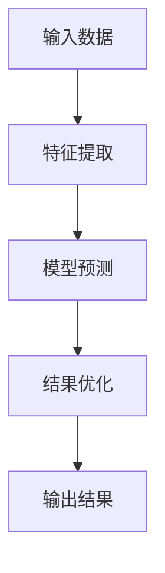

                 


# 移动端AI Agent：轻量化与性能的平衡

> 关键词：移动端AI Agent，轻量化，性能优化，模型压缩，知识蒸馏，量化

> 摘要：本文深入探讨了移动端AI Agent的轻量化与性能优化的平衡问题，从理论到实践，详细分析了AI Agent的核心概念、算法原理、系统设计和项目实现。文章通过丰富的图表和代码示例，结合实际案例，全面解析了如何在移动端实现高效、轻量化的AI Agent系统。

---

## 第一部分：移动端AI Agent基础

### 第1章：移动端AI Agent概述

#### 1.1 AI Agent的基本概念
- **什么是AI Agent**  
  AI Agent（人工智能代理）是指能够感知环境、做出决策并执行操作的智能实体。它能够通过传感器获取信息，利用算法进行分析，并通过执行器与环境交互。

- **AI Agent的核心特征**  
  - 自主性：无需外部干预，自主完成任务。  
  - 反应性：能够实时感知环境并做出反应。  
  - 持续性：能够在长时间运行中保持稳定。  
  - 学习能力：能够通过数据优化自身性能。  

- **移动端AI Agent的特殊性**  
  移动端AI Agent需要在资源受限的环境下运行，对计算资源（如CPU、GPU）、内存和带宽都有严格限制。因此，轻量化与性能优化是其核心挑战。

#### 1.2 移动端AI Agent的背景与挑战
- **应用场景**  
  移动端AI Agent广泛应用于语音助手（如Siri、小爱同学）、图像识别（如拍照识物）、推荐系统（如个性化推荐）等领域。  

- **核心问题**  
  1. **资源限制**：移动端设备的计算能力有限，如何在有限资源下实现高效的AI功能？  
  2. **延迟问题**：移动端AI Agent需要实时响应，如何优化延迟？  
  3. **模型复杂度**：复杂的模型难以在移动端运行，如何在模型复杂度和性能之间找到平衡？  

- **轻量化与性能优化的重要性**  
  轻量化通过减少模型大小和计算量，降低资源消耗；性能优化则通过算法改进，提升运行效率。两者的平衡是实现高效移动端AI Agent的关键。

#### 1.3 本书的目标与结构
- **核心目标**  
  本文旨在帮助读者理解移动端AI Agent的核心概念，掌握轻量化与性能优化的技术，能够实际设计和实现高效的移动端AI Agent系统。

- **主要内容**  
  本文将从AI Agent的基本概念出发，逐步深入讲解轻量化技术、性能优化算法、系统设计与实现，并通过实际案例展示如何在移动端实现高效的AI Agent。

- **读者群体**  
  本文适合AI开发人员、移动应用开发者以及对AI技术感兴趣的读者阅读。

---

### 第2章：移动端AI Agent的核心概念与联系

#### 2.1 AI Agent的组成与功能
- **感知层**  
  感知层负责获取环境信息，通常包括传感器数据（如摄像头、麦克风）和用户输入。  

- **决策层**  
  决策层基于感知层获取的信息，结合预设的规则或学习得到的模型，做出决策。  

- **执行层**  
  执行层根据决策层的指令，通过执行器（如扬声器、屏幕）与环境交互。

#### 2.2 轻量化与性能优化的平衡
- **轻量化的目标**  
  通过模型压缩、量化等技术，减少模型的体积和计算量，使其能够在移动端高效运行。  

- **性能优化的关键点**  
  优化计算效率、减少内存占用、降低网络延迟是性能优化的核心。  

- **平衡策略的制定**  
  在保证功能的前提下，找到模型复杂度与性能的最优平衡点。例如，可以通过调整模型参数或使用轻量级模型来实现。

#### 2.3 核心概念的ER实体关系图
```mermaid
er
    actor(Agent,轻量化,性能优化)
    relation(轻量化-性能优化,平衡点)
```

---

## 第二部分：算法原理

### 第3章：移动端AI Agent的算法原理

#### 3.1 模型压缩技术
- **知识蒸馏**  
  知识蒸馏是一种通过教师模型（大模型）指导学生模型（小模型）学习的技术。学生模型通过模仿教师模型的输出，逐步掌握复杂的任务。  

- **权重剪枝**  
  权重剪枝通过去除模型中冗余的权重，降低模型的复杂度。例如，可以通过设定一个阈值，去除小于阈值的权重。  

- **参数量化**  
  参数量化将模型的权重和激活值进行量化，通常使用低比特位（如8位或4位）表示，从而减少存储空间和计算量。

#### 3.2 模型优化算法
- **勺子法（Sliding Window）**  
  勺子法通过滑动窗口技术，动态调整模型的输入数据，减少计算量。  

- **模型蒸馏**  
  模型蒸馏是通过将大模型的知识迁移到小模型的技术，类似于知识蒸馏。  

- **动态剪枝**  
  动态剪枝在模型运行时动态调整剪枝策略，根据实时需求优化计算效率。

#### 3.3 算法流程图


#### 3.4 算法实现代码
```python
def model_compression(model):
    # 权重剪枝
    pruned_model = prune_layer(model, threshold=0.1)
    # 参数量化
    quantized_model = quantize_weights(pruned_model, bits=8)
    return quantized_model
```

#### 3.5 数学模型与公式
- **剪枝算法**  
  假设模型的权重矩阵为$W$，剪枝算法通过计算权重的绝对值，去除小于阈值的权重：  
  $$ W_{\text{pruned}} = \{w \mid |w| > \text{threshold}\} $$  

- **量化算法**  
  量化算法将权重值从浮点数转换为整数，例如，使用8位整数量化：  
  $$ w_{\text{quantized}} = \text{round}(w \times 256) $$  

---

## 第三部分：系统分析与架构设计

### 第4章：系统分析与架构设计

#### 4.1 问题场景介绍
- **用户场景**  
  以语音助手为例，用户在移动端设备上发出语音指令，AI Agent需要快速识别指令并执行操作。  

- **系统需求**  
  系统需要支持实时语音识别、快速响应和低资源消耗。

#### 4.2 系统功能设计
- **功能模块**  
  1. **语音识别模块**：负责将语音信号转换为文本。  
  2. **意图理解模块**：分析文本意图，生成响应。  
  3. **执行模块**：根据意图执行相应的操作。  

- **领域模型（类图）**  
  ```mermaid
  classDiagram
      class Agent {
          - id: int
          - name: string
          - state: string
          + execute(action: string): void
          + perceive(input: string): void
          + decide(output: string): void
      }
      class Environment {
          + send(input: string): void
          + receive(output: string): void
      }
      Agent --> Environment: interact
  ```

#### 4.3 系统架构设计
- **架构图**  
  ```mermaid
  architecture
      Client ---(请求)--> Server
      Server ---(处理)--> Database
      Server ---(反馈)--> Client
  ```

- **系统交互流程图**  
  ```mermaid
  sequenceDiagram
      User -> Agent: 发出语音指令
      Agent -> Environment: 获取环境信息
      Agent -> Database: 查询意图
      Agent -> Execute: 执行操作
      Execute -> Agent: 返回结果
      Agent -> User: 反馈结果
  ```

---

## 第四部分：项目实战

### 第5章：项目实战

#### 5.1 环境安装
- **工具与库**  
  - Python 3.8+  
  - TensorFlow Lite  
  - PyTorch Mobile  

#### 5.2 系统核心实现源代码
```python
import torch
from torch import nn

class SimpleAgent(nn.Module):
    def __init__(self):
        super(SimpleAgent, self).__init__()
        self.conv = nn.Conv2d(in_channels=3, out_channels=8, kernel_size=3, stride=1)
        self.pool = nn.MaxPool2d(kernel_size=2, stride=2)
        self.fc = nn.Linear(8 * 8 * 8, 10)

    def forward(self, x):
        x = self.conv(x)
        x = self.pool(x)
        x = x.view(-1, 8 * 8 * 8)
        x = self.fc(x)
        return x

# 模型剪枝
def prune_layer(model, threshold=0.1):
    for param in model.parameters():
        mask = torch.abs(param) > threshold
        param.data.mul_(mask.float())
    return model
```

#### 5.3 代码应用解读与分析
- **模型结构**  
  上面的代码定义了一个简单的卷积神经网络模型，用于图像分类任务。  

- **剪枝实现**  
  `prune_layer`函数通过比较权重的绝对值与阈值，动态生成剪枝掩码，从而实现模型剪枝。

#### 5.4 实际案例分析
- **案例背景**  
  假设我们有一个用于图像分类的AI Agent，需要在移动端运行。  

- **优化过程**  
  1. 使用知识蒸馏技术将大模型的知识迁移到小模型。  
  2. 对模型进行权重剪枝和参数量化，降低模型体积和计算量。  
  3. 在移动端设备上测试模型的运行效率，优化延迟和资源消耗。  

#### 5.5 项目小结
- **经验总结**  
  - 模型压缩是实现轻量化的核心技术。  
  - 系统设计需要充分考虑资源限制和实际应用场景。  
  - 实验和测试是优化过程中的重要环节。  

---

## 第五部分：总结与展望

### 第6章：总结与展望

#### 6.1 内容回顾
- 本文从移动端AI Agent的基本概念出发，详细讲解了轻量化与性能优化的技术，包括模型压缩、算法优化和系统设计。  

#### 6.2 最佳实践 tips
- 在模型设计阶段，优先考虑轻量化技术。  
- 在实际应用中，结合具体场景进行优化。  
- 使用工具和框架（如TensorFlow Lite、PyTorch Mobile）简化实现过程。  

#### 6.3 未来展望
- 随着AI技术的不断发展，移动端AI Agent将更加智能化和高效。  
- 跨设备协作和边缘计算的应用将越来越广泛。  

#### 6.4 注意事项
- 模型压缩需要权衡准确率和性能，避免过度压缩导致功能下降。  
- 系统设计需要充分考虑资源限制和用户体验。  

#### 6.5 拓展阅读
- 《Mobile AI: Challenges and Opportunities》  
- 《Deep Learning for Mobile Platforms》  

---

## 作者

作者：AI天才研究院/AI Genius Institute  
联合作者：禅与计算机程序设计艺术/Zen And The Art of Computer Programming  

--- 

**注意**：本文为技术博客文章，版权归作者所有，未经授权不得转载或摘编。

