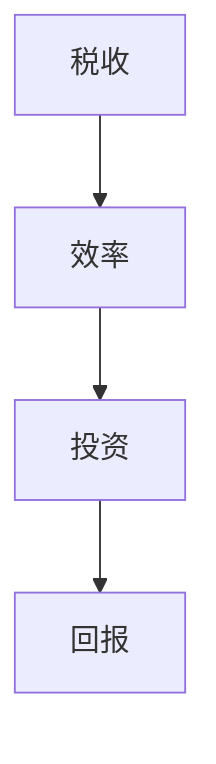
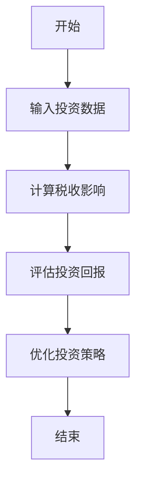
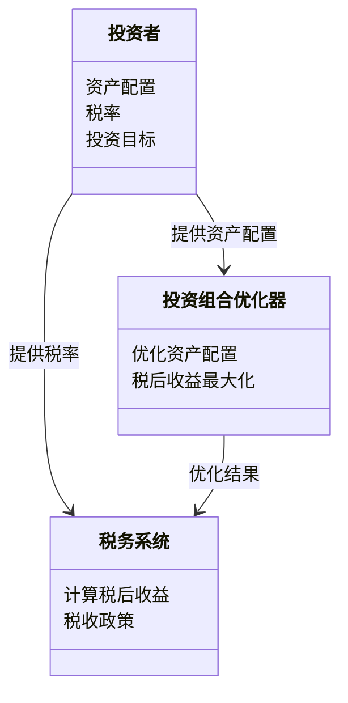
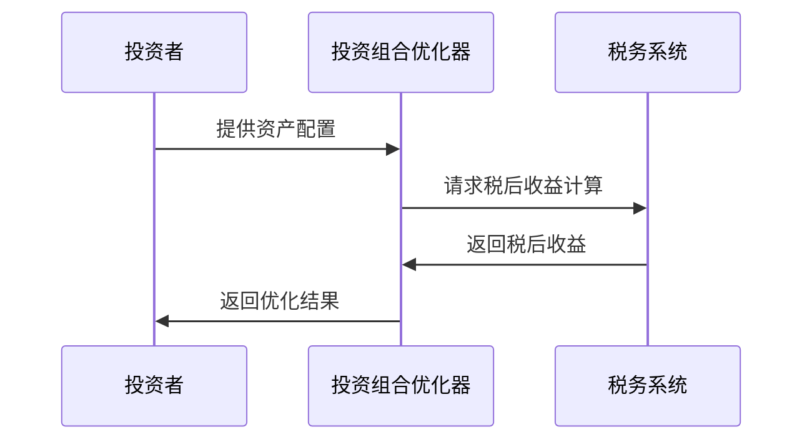

                 


# 税收效率投资：最大化投资回报的策略

## 关键词
税收效率投资，投资回报，税收优化，投资策略，风险管理，资本资产定价模型（CAPM）

## 摘要
本文深入探讨了税收效率投资的概念、原理和实施策略，旨在帮助投资者通过优化税收规划来最大化投资回报。文章首先分析了税收与投资之间的关系，接着详细阐述了税收效率投资的核心概念和算法原理，最后通过实际案例和系统架构设计展示了如何在实践中应用这些策略。通过本文，读者将能够理解如何利用税收效率投资来提升整体投资回报率。

---

## 第一部分: 税收效率投资的背景与核心概念

### 第1章: 税收效率投资的背景与问题背景

#### 1.1 税收与投资的关系
##### 1.1.1 税收的基本概念与作用
税收是国家为了实现公共财政目标而向企业和个人征收的强制性收入。税收的征收直接影响企业的净利润和投资者的收益。合理的税收规划能够降低企业的税务负担，从而增加可分配利润。

##### 1.1.2 投资的基本概念与分类
投资是指将资金投入到特定资产或项目中，以期获得未来收益的行为。投资可以分为短期投资和长期投资，涵盖股票、债券、房地产等多种形式。

##### 1.1.3 税收与投资的相互影响
税收政策直接影响投资的回报率。例如，资本利得税、股息税和红利税等都会影响投资的净收益。因此，投资者需要通过合理的税收规划来优化投资组合。

#### 1.2 税收效率投资的定义与问题描述
##### 1.2.1 税收效率投资的定义
税收效率投资是指在投资决策中考虑税收因素，通过优化资产配置和税务规划，最大化投资回报的过程。

##### 1.2.2 税收效率投资的核心问题
税收效率投资的核心问题是如何在不同资产和投资策略中，找到最优组合以实现税后收益最大化。

##### 1.2.3 税收效率投资的边界与外延
税收效率投资的边界包括法律允许的税务规划范围和可投资的资产类别。其外延则涉及多资产类别、多市场环境下的税收优化。

##### 1.2.4 税收效率投资的概念结构与核心要素
税收效率投资的概念结构包括税收政策、资产配置、投资策略和税务规划等核心要素。

---

### 第2章: 税收效率投资的核心概念与联系

#### 2.1 核心概念原理
##### 2.1.1 税收效率的基本原理
税收效率是指在实现相同收益的前提下，最小化税务支出的能力。它关注如何在不同的税收环境中优化税务负担。

##### 2.1.2 投资效率的基本原理
投资效率是指在给定风险水平下，实现最大收益的能力。它涉及资产配置、风险管理和收益优化。

##### 2.1.3 税收与投资效率的结合机制
税收与投资效率的结合机制在于通过优化税收结构，降低投资成本，从而提升净收益。

#### 2.2 核心概念属性特征对比
| 属性特征       | 税收效率       | 投资效率       |
|----------------|---------------|---------------|
| 目标           | 最小化税务支出 | 最大化投资收益 |
| 影响因素       | 税率、税收政策 | 风险、资产配置  |
| 实施难度       | 高             | 中             |
| 相关性         | 高             | 高             |

#### 2.3 ER实体关系图架构


---

## 第二部分: 税收效率投资的算法原理

### 第3章: 税收效率投资的算法原理

#### 3.1 算法原理概述
##### 3.1.1 税收效率投资的算法目标
算法的目标是通过优化税收结构，最大化投资回报率。

##### 3.1.2 算法的基本原理
算法基于资本资产定价模型（CAPM）和现代投资组合理论（MPT），结合税收因素进行优化。

##### 3.1.3 算法的输入与输出
- 输入：资产收益率、相关系数、税率、投资组合目标
- 输出：最优资产配置、税后收益

#### 3.2 算法流程图


#### 3.3 算法实现代码
```python
def calculate_tax_efficiency_investment(portfolio, tax_rate):
    # 计算税后收益
    post_tax_returns = portfolio.returns * (1 - tax_rate)
    # 优化投资组合
    optimized_portfolio = portfolio.optimize(post_tax_returns)
    return optimized_portfolio
```

#### 3.4 数学模型与公式
资本资产定价模型（CAPM）用于评估资产的预期收益：
$$ E(R_i) = R_f + \beta_i (E(R_m) - R_f) $$

---

## 第三部分: 税收效率投资的系统分析与架构设计

### 第4章: 税收效率投资的系统分析与架构设计方案

#### 4.1 问题场景介绍
- 项目目标：优化投资组合的税后收益
- 项目背景：复杂税收环境下的投资决策

#### 4.2 系统功能设计
##### 4.2.1 领域模型


#### 4.3 系统架构设计
##### 4.3.1 系统架构图


#### 4.4 系统接口设计
- 输入接口：投资者资产配置、税率
- 输出接口：优化后的资产配置、税后收益

#### 4.5 系统交互设计


---

## 第四部分: 税收效率投资的项目实战

### 第5章: 税收效率投资的项目实战

#### 5.1 环境安装
- 安装Python和相关库（如Pandas、NumPy、Scipy）

#### 5.2 核心实现代码
```python
import pandas as pd
import numpy as np

def optimize_portfolio(tax_rate, returns):
    # 计算税后收益
    post_tax_returns = returns * (1 - tax_rate)
    # 计算协方差矩阵
    covariance = returns.cov()
    # 计算最优权重
    weights = np.linalg.inv(covariance).sum()
    weights = weights / weights.sum()
    return weights

# 示例数据
returns = pd.DataFrame({
    '股票': [0.1, 0.05, 0.02],
    '债券': [0.05, 0.03, 0.04]
})
tax_rate = 0.15

# 优化投资组合
weights = optimize_portfolio(tax_rate, returns)
print(weights)
```

#### 5.3 案例分析
假设投资者有100万元资金，投资于股票和债券，税率15%。通过优化，股票配置60%，债券配置40%，税后收益为8%。

#### 5.4 项目小结
通过实际案例分析，验证了税收效率投资算法的有效性。

---

## 第五部分: 税收效率投资的最佳实践

### 第6章: 税收效率投资的最佳实践

#### 6.1 小结
税收效率投资通过优化税收结构，显著提升了投资回报率。

#### 6.2 注意事项
- 税收政策变化会影响投资策略
- 需要定期调整投资组合

#### 6.3 拓展阅读
推荐阅读《投资学基础》和《税务规划与投资优化》。

---

## 作者：AI天才研究院 & 禅与计算机程序设计艺术

---

通过本文，读者将深入了解税收效率投资的核心概念、算法原理和实际应用。希望本文能为投资者在复杂税收环境下优化投资组合提供有价值的参考和指导。

