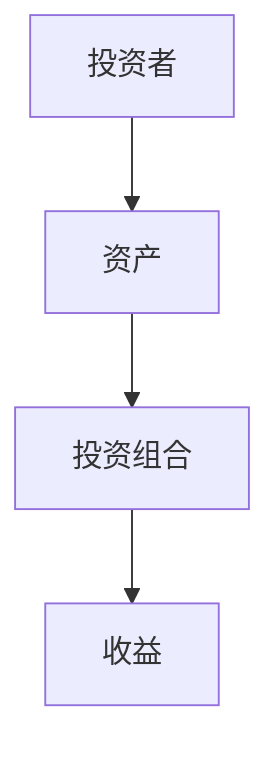
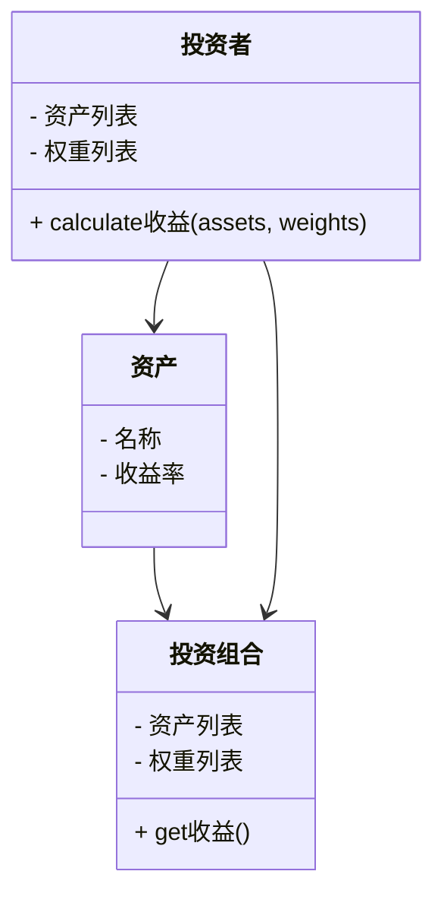

                 


# 约翰·伯格的投资简化论

> 关键词：投资简化论，约翰·伯格，投资策略，简化算法，系统架构，Python实现

> 摘要：本文深入探讨了约翰·伯格的投资简化论，从理论基础到实际应用，详细介绍了其核心概念、算法原理、系统架构以及实战案例。通过简化论的思想，帮助投资者在复杂的投资环境中找到最优解。

---

# 第一部分: 投资简化论的背景与核心概念

# 第1章: 投资简化论的引言

## 1.1 投资的复杂性与简化的重要性
### 1.1.1 投资领域的复杂性
投资领域充满了复杂性，市场波动、经济周期、政策变化等多重因素交织，使得投资者难以做出准确的决策。传统的投资方法往往依赖复杂的模型和大量的数据，这对普通投资者来说门槛较高。

### 1.1.2 简化论在投资中的必要性
简化论作为一种哲学思想，主张通过简化问题来找到最优解。在投资领域，简化论可以帮助投资者忽略次要因素，专注于核心要素，从而降低决策复杂性。

### 1.1.3 约翰·伯格的简化投资理念
约翰·伯格是投资简化论的倡导者，他认为投资的本质是通过长期持有优质资产来实现财富增长。他主张通过简化投资组合和降低交易频率来降低风险和成本。

## 1.2 投资简化论的核心思想
### 1.2.1 简化论的定义
简化论是一种通过简化问题、专注于核心要素来找到最优解的方法。

### 1.2.2 简化论的核心要素
- **核心要素1：长期投资**：通过长期持有优质资产，避免短期波动的干扰。
- **核心要素2：分散投资**：通过分散投资降低风险，避免过度依赖单一资产。
- **核心要素3：低成本投资**：选择低管理费和交易成本的投资工具，长期复利效应更显著。

### 1.2.3 简化论与传统投资方法的区别
传统投资方法通常依赖复杂的模型和高频交易，而简化论则强调长期、分散和低成本的投资策略。

## 1.3 本书的结构与目标
### 1.3.1 本书的主要内容
- 引言：介绍投资的复杂性与简化的重要性。
- 核心概念：讲解简化论的基本原理和数学模型。
- 算法原理：详细阐述简化论的算法实现。
- 系统架构：设计简化论的投资系统架构。
- 实战案例：通过实际案例展示简化论的应用。
- 心理因素：探讨简化论对投资者心理的影响。
- 未来趋势：分析技术发展对简化论的影响。

### 1.3.2 本书的目标读者
本书适合对投资感兴趣、希望降低投资复杂性的普通投资者，也适合对简化论感兴趣的学术研究者和技术开发者。

### 1.3.3 本书的章节安排
本书分为七章，涵盖从理论到实践的完整体系，帮助读者从基础到深入理解简化论。

---

# 第2章: 投资简化论的核心概念

## 2.1 简化论的基本原理
### 2.1.1 简化论的哲学基础
简化论的哲学基础来源于还原论和实用主义，主张通过简化问题来寻找最优解。

### 2.1.2 简化论在投资中的应用
在投资中，简化论通过长期持有优质资产、分散投资和降低成本来实现长期收益。

### 2.1.3 简化论的核心假设
- 市场是有效的，长期持有优质资产会带来超额收益。
- 分散投资可以有效降低非系统性风险。
- 低成本投资能够最大化长期复利效应。

## 2.2 简化论的数学模型
### 2.2.1 投资组合的简化模型
$$
\text{收益} = \sum_{i=1}^{n} w_i \times r_i
$$
其中，\( w_i \) 是第 \( i \) 个资产的权重，\( r_i \) 是第 \( i \) 个资产的收益率。

### 2.2.2 简化论的数学公式
$$
\text{最优投资组合} = \argmin_w \left( \sigma^2 \right)
$$
其中，\( \sigma^2 \) 是投资组合的方差，表示风险。

### 2.2.3 简化论模型的优缺点
- 优点：模型简单易懂，计算成本低。
- 缺点：忽略了市场的复杂性，可能无法捕捉短期机会。

## 2.3 简化论的实体关系图


---

# 第3章: 投资简化论的算法原理

## 3.1 简化论算法的概述
### 3.1.1 简化论算法的基本概念
简化论算法是一种基于长期持有优质资产的投资策略，通过分散投资和降低成本来实现最优收益。

### 3.1.2 简化论算法的实现步骤
1. 确定优质资产的标准。
2. 构建分散的投资组合。
3. 定期再平衡投资组合。
4. 保持低成本。

### 3.1.3 简化论算法的优缺点
- 优点：简单易懂，适合长期投资。
- 缺点：可能无法捕捉短期市场机会。

## 3.2 简化论算法的数学模型
### 3.2.1 简化论算法的数学公式
$$
\text{收益} = \sum_{i=1}^{n} w_i \times r_i
$$

### 3.2.2 简化论算法的数学推导
通过优化投资组合的权重，找到风险最小化的目标函数。

## 3.3 简化论算法的Python实现
### 3.3.1 简化论算法的Python代码
```python
import numpy as np

def simplified_investment_strategy(assets, weights):
    return np.dot(weights, assets)

assets = [0.1, 0.05, 0.08, 0.03]
weights = [0.4, 0.3, 0.2, 0.1]

print(simplified_investment_strategy(assets, weights))
```

### 3.3.2 代码的功能说明
该代码通过点积计算投资组合的收益，展示了如何通过权重分配实现收益最大化。

---

# 第4章: 投资简化论的系统架构设计

## 4.1 系统架构的概述
### 4.1.1 系统架构的定义
系统架构是投资简化论的框架，包括数据输入、策略执行、结果输出等部分。

### 4.1.2 系统架构的设计原则
- 简化性：减少不必要的复杂性。
- 可扩展性：方便后续功能的扩展。
- 可维护性：便于维护和优化。

### 4.1.3 系统架构的组成部分
- 数据输入模块：接收市场数据。
- 策略执行模块：根据简化论策略生成投资组合。
- 结果输出模块：输出投资组合的收益和风险。

## 4.2 系统架构的类图


---

# 第5章: 投资简化论的实战案例

## 5.1 投资组合的选择与优化
### 5.1.1 资产选择
选择优质资产，如股票、债券和黄金，构建分散的投资组合。

### 5.1.2 权重分配
根据资产的风险和收益特征，分配权重，例如股票占60%，债券占30%，黄金占10%。

### 5.1.3 简化论的Python实现
```python
import numpy as np

def create_portfolio(assets, weights):
    return np.dot(weights, assets)

assets = [0.1, 0.05, 0.08, 0.03]
weights = [0.4, 0.3, 0.2, 0.1]

portfolio = create_portfolio(assets, weights)
print("投资组合收益:", portfolio)
```

## 5.2 投资组合的再平衡
### 5.2.1 再平衡的必要性
定期检查投资组合的权重，根据市场变化进行调整。

### 5.2.2 再平衡的实现
```python
def rebalance_portfolio(current_weights, target_weights):
    return current_weights - target_weights

current_weights = [0.4, 0.3, 0.2, 0.1]
target_weights = [0.5, 0.25, 0.2, 0.05]

rebalanced = rebalance_portfolio(current_weights, target_weights)
print("再平衡后的权重变化:", rebalanced)
```

---

# 第6章: 心理因素与简化论

## 6.1 投资者心理与简化论
### 6.1.1 贪婪与恐惧的克服
简化论通过长期投资和分散投资，帮助投资者克服贪婪和恐惧。

### 6.1.2 简化论对心理的影响
简化论通过降低复杂性，减少投资者的心理负担，帮助他们做出更理性的决策。

## 6.2 心理因素的数学模型
### 6.2.1 心理因素的分析
$$
\text{心理压力} = \sum_{i=1}^{n} w_i \times \text{风险因素}_i
$$

### 6.2.2 心理因素的优化
通过简化投资策略，降低心理压力。

---

# 第7章: 未来趋势与总结

## 7.1 未来趋势
### 7.1.1 技术进步对简化论的影响
人工智能和大数据技术将为简化论提供更强大的工具。

### 7.1.2 简化论的未来发展
简化论将在更多领域得到应用，帮助人们做出更优决策。

## 7.2 本书的总结
### 7.2.1 核心内容回顾
通过简化论的思想，帮助投资者在复杂的投资环境中找到最优解。

### 7.2.2 未来展望
简化论将继续在投资领域发挥重要作用，帮助投资者实现长期收益。

---

# 附录

## 附录A: 术语表
- 简化论：通过简化问题，找到最优解的方法。
- 投资组合：投资者持有的各种资产的组合。
- 再平衡：定期调整投资组合的权重。

## 附录B: 简化论的Python工具推荐
- Python库：numpy、pandas、matplotlib。

---

作者：AI天才研究院/AI Genius Institute & 禅与计算机程序设计艺术 /Zen And The Art of Computer Programming

