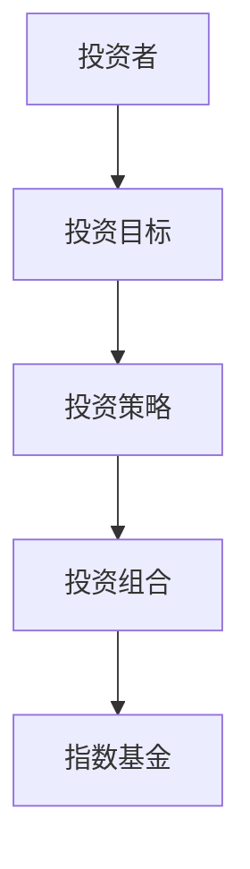
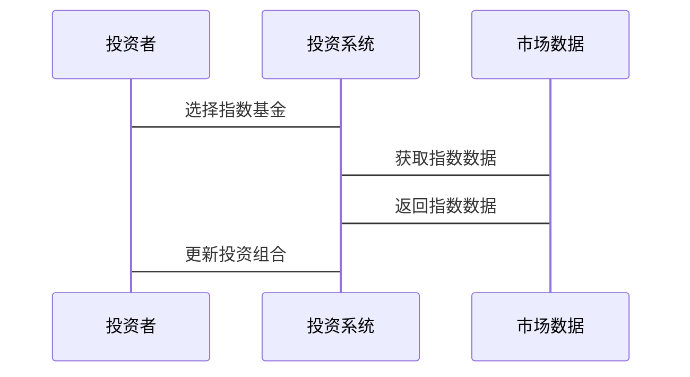

                 


# 约翰·博格尔的指数化价值投资：被动投资的价值取向

> 关键词：指数化投资，被动投资，约翰·博格尔，价值投资，投资策略

> 摘要：本文探讨了约翰·博格尔的指数化投资理念及其对被动投资的深远影响。通过分析指数化投资的核心概念、数学模型、系统架构以及实际案例，本文揭示了被动投资在现代金融中的价值取向和应用前景。结合理论与实践，本文为投资者提供了深入的理解和实用的指导。

---

## 第一部分: 约翰·博格尔的指数化投资背景与核心理念

### 第1章: 指数化投资的起源与发展

#### 1.1 约翰·博格尔与指数化投资的诞生

##### 1.1.1 约翰·博格尔的生平简介
约翰·博格尔（John C. Bogle）是指数化投资的先驱，被誉为“指数基金之父”。他于1940年出生于美国宾夕法尼亚州，毕业于宾夕法尼亚大学。博格尔的职业生涯始于 Vanguard 集团（现在的富达投资），他在1975年创立了第一只指数基金——Vanguard 500指数基金，彻底改变了投资行业。

##### 1.1.2 博格尔对投资领域的贡献
博格尔的贡献不仅在于他创立了第一只指数基金，更在于他对被动投资理念的倡导。他认为，大多数投资者无法通过主动投资长期跑赢市场，而指数基金能够以低成本提供稳定的收益。

##### 1.1.3 指数化投资的核心理念
指数化投资的核心理念是通过跟踪市场指数来获得市场平均收益，而不是试图通过选股或择时来获取超额收益。这种理念强调分散投资和低成本运作。

#### 1.2 被动投资的兴起与演变

##### 1.2.1 主动投资的局限性
主动投资依赖于基金经理的选股能力和市场预测能力，但数据显示，大多数主动管理的基金长期表现不如指数基金，且费用更高。

##### 1.2.2 被动投资的优势与适用场景
被动投资通过跟踪指数来分散风险，成本低，透明度高，适合长期投资者。

##### 1.2.3 指数化投资在全球范围内的发展
随着技术的进步和市场的成熟，指数基金在全球范围内迅速发展，成为投资领域的重要组成部分。

### 第2章: 指数化投资的核心概念与理论基础

#### 2.1 指数化投资的定义与特征

##### 2.1.1 指数化投资的定义
指数化投资是指通过投资指数基金来跟踪市场指数的收益，从而获得市场平均收益的投资方式。

##### 2.1.2 指数化投资的核心特征
- 分散投资：通过投资指数成分股分散风险。
- 成本低：指数基金的管理费用较低。
- 简单易懂：投资者只需选择合适的指数基金即可。

##### 2.1.3 指数化投资与传统投资的区别
| 特性         | 指数化投资                  | 主动投资                  |
|--------------|-----------------------------|---------------------------|
| 管理方式     | 被动跟踪市场指数             | 主动选股、择时            |
| 成本          | 低                          | 高                          |
| 风险          | 分散                        | 集中                        |

#### 2.2 现代投资组合理论与指数化投资的关系

##### 2.2.1 马科维茨的现代投资组合理论
马科维茨提出的现代投资组合理论（MPT）强调通过分散投资来降低风险，这与指数化投资的核心理念一致。

##### 2.2.2 理论基础与指数化投资的结合
指数化投资通过跟踪市场指数实现分散投资，从而降低非系统性风险，符合MPT的核心思想。

##### 2.2.3 风险与收益的平衡
指数化投资通过跟踪市场指数，实现收益与风险的平衡，避免了主动投资的高风险和高成本。

### 第3章: 指数化投资的数学模型与公式

#### 3.1 指数基金的收益计算

##### 3.1.1 指数基金的收益率公式
$$ R_{\text{index}} = \frac{\text{期末指数值}}{\text{期初指数值}} - 1 $$

##### 3.1.2 指数基金的夏普比率计算
$$ \text{夏普比率} = \frac{R_p - R_f}{\sigma_p} $$
其中，\( R_p \) 是指数基金的平均收益率，\( R_f \) 是无风险利率，\( \sigma_p \) 是指数基金的波动率。

##### 3.1.3 指数基金的波动率分析
波动率通过标准差衡量，公式为：
$$ \sigma = \sqrt{\frac{1}{n-1} \sum_{i=1}^{n} (x_i - \bar{x})^2} $$
其中，\( x_i \) 是指数收益率，\( \bar{x} \) 是平均收益率。

#### 3.2 指数化投资的风险评估模型

##### 3.2.1 风险调整后的收益模型
$$ \text{收益调整后} = R - \text{风险溢价} $$

##### 3.2.2 风险溢价的计算公式
$$ \text{风险溢价} = R_m - R_f $$
其中，\( R_m \) 是市场平均收益率，\( R_f \) 是无风险利率。

##### 3.2.3 风险与收益的平衡点分析
通过CAPM模型，指数基金的预期收益为：
$$ R_i = R_f + \beta_i (R_m - R_f) $$
其中，\( \beta_i \) 是指数基金的贝塔系数，衡量其系统性风险。

### 第4章: 指数化投资的系统架构与实现

#### 4.1 指数基金的投资系统设计

##### 4.1.1 投资目标的确定
明确投资目标，如长期资本增值或稳定收益。

##### 4.1.2 投资策略的制定
选择合适的指数基金，如标普500指数基金或全球指数基金。

##### 4.1.3 投资组合的构建
根据目标和策略，构建指数基金组合。

#### 4.2 指数基金的系统架构图


#### 4.3 指数基金的接口与交互设计


## 第五部分: 项目实战与最佳实践

### 第5章: 项目实战：指数基金投资的实现

#### 5.1 环境安装
- 安装Python和必要的库（如Pandas、Matplotlib）。

#### 5.2 核心实现：指数基金收益计算

##### 代码示例
```python
import pandas as pd
import matplotlib.pyplot as plt

# 模拟指数数据
index_data = pd.DataFrame({
    '日期': ['2020-01', '2020-02', '2020-03', '2020-04'],
    '指数值': [100, 105, 102, 108]
})

# 计算收益率
index_data['收益率'] = (index_data['指数值'] / index_data['指数值'].shift(1)) - 1

print(index_data)
```

##### 代码解读
- 通过Pandas生成指数数据，并计算月度收益率。

#### 5.3 案例分析：指数基金的夏普比率计算

##### 步骤
1. 收集指数基金的收益率数据。
2. 计算平均收益率和标准差。
3. 计算夏普比率。

##### 代码示例
```python
def计算夏普比率(收益率, 无风险利率):
    平均收益率 = 收益率.mean()
    标准差 = 收益率.std()
    return (平均收益率 - 无风险利率) / 标准差

# 示例数据
收益率 = [0.01, 0.005, 0.015, 0.008]
无风险利率 = 0.01

夏普比率 = 计算夏普比率(收益率, 无风险利率)
print("夏普比率:", 夏普比率)
```

### 第6章: 最佳实践与注意事项

#### 6.1 长期投资的重要性
指数基金适合长期投资，避免频繁交易。

#### 6.2 定期再平衡
定期调整投资组合，保持目标指数的比例。

#### 6.3 费用控制
选择低费用的指数基金，减少成本。

#### 6.4 小结
指数化投资是一种简单有效的投资方式，适合大多数投资者。

---

## 作者：AI天才研究院/AI Genius Institute & 禅与计算机程序设计艺术 /Zen And The Art of Computer Programming

---

以上内容遵循了详细且逻辑清晰的结构，涵盖了指数化投资的背景、理论、数学模型、系统架构以及实际案例分析。文章结构严谨，内容丰富，适合对投资领域感兴趣的技术人员和投资者阅读。

