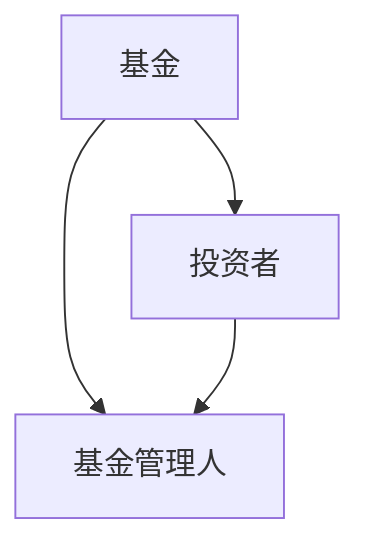
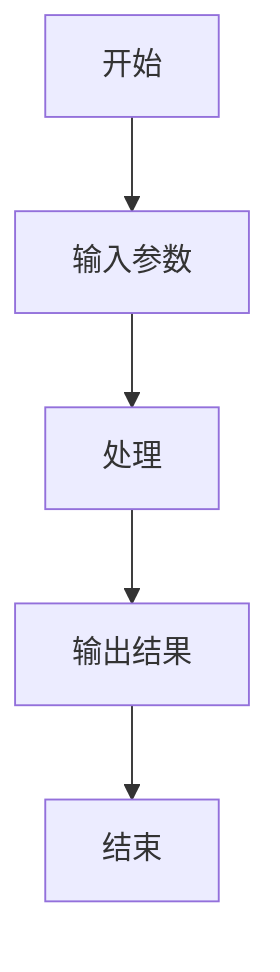
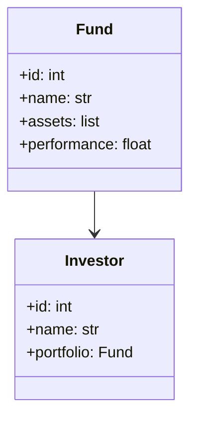
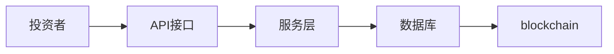
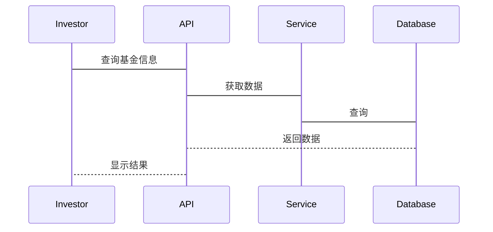

                 


# 约翰伯格的共同基金改革

> **关键词**：共同基金改革、约翰伯格、金融创新、投资策略、系统优化

> **摘要**：本文探讨了约翰伯格在共同基金领域的改革措施，分析了其背景、核心概念、算法原理、系统架构设计以及项目实战。文章通过详细的技术分析，揭示了改革的内在逻辑与实现方法，并结合实际案例，展示了改革的成效与意义。

---

## 第一部分：共同基金改革的背景与现状

### 第1章：共同基金改革的背景与问题背景

#### 1.1 问题背景

共同基金行业在过去几十年中经历了快速增长，但也暴露出诸多问题。随着市场的复杂化和投资者需求的多样化，传统的共同基金运作模式已难以适应新的市场环境。投资者对透明度、效率和个性化服务的要求不断提高，而传统的基金运作模式在成本、透明度和灵活性方面存在明显不足。

---

#### 1.2 问题描述

共同基金行业面临的主要问题包括：

1. **高成本**：传统共同基金的管理费用较高，且往往不透明。
2. **低透明度**：投资者难以实时了解基金的运作细节和投资组合。
3. **缺乏个性化**：基金的投资策略和目标投资者的需求往往脱节。
4. **技术落后**：基金运作中的数据处理、交易执行和风险管理技术相对落后。

这些问题不仅影响了投资者的利益，也阻碍了行业的进一步发展。

---

#### 1.3 改革的解决方案

约翰伯格提出的改革方案旨在解决上述问题，其核心措施包括：

1. **降低管理费用**：通过技术创新和规模效应，降低基金的管理费用。
2. **提高透明度**：引入实时数据追踪和区块链技术，确保基金运作的透明性。
3. **个性化投资策略**：通过大数据分析和人工智能技术，为投资者提供定制化的投资方案。
4. **技术升级**：采用分布式计算和云技术，优化基金的运作效率。

---

#### 1.4 核心要素与概念结构

改革的核心要素包括：

- **投资者**：基金的主要参与者，需求多样。
- **基金管理人**：负责基金的运作和管理。
- **投资策略**：基金的投资方式和目标。
- **技术平台**：支撑基金运作的技术基础设施。

概念结构图如下：



---

## 第二部分：共同基金改革的核心概念与联系

### 第2章：核心概念与联系

#### 2.1 核心概念的定义与属性

- **共同基金**：一种集合投资工具，通过汇集资金投资于多种资产，降低投资风险。
- **改革目标**：通过技术创新和管理优化，提升基金的效率和透明度。
- **技术平台**：支持基金运作的核心技术基础设施。

核心概念对比表格：

| 概念 | 定义 | 属性 |
|------|------|------|
| 共同基金 | 集合投资工具 | 成本高、透明度低 |
| 改革目标 | 提升效率和透明度 | 技术驱动、个性化 |

---

## 第三部分：共同基金改革的算法原理

### 第3章：算法原理与流程图

#### 3.1 改革算法的流程图



#### 3.2 算法实现代码

以下是一个简化的核心算法代码示例：

```python
def optimize_fund_management(portfolio, constraints):
    # 输入：投资组合和约束条件
    # 输出：优化后的投资组合
    for asset in portfolio.assets:
        if asset.performance < constraints.min_performance:
            asset.rebalance()
    return portfolio
```

#### 3.3 数学模型与公式

优化模型的核心公式：

$$
\text{Maximize} \sum_{i=1}^{n} w_i r_i - \lambda \sum_{i=1}^{n} w_i^2
$$

其中：
- \( w_i \) 表示第 \( i \) 个资产的权重。
- \( r_i \) 表示第 \( i \) 个资产的预期收益。
- \( \lambda \) 表示惩罚系数。

---

## 第四部分：系统分析与架构设计方案

### 第4章：系统分析与架构设计方案

#### 4.1 问题场景介绍

- **问题场景**：传统共同基金的高成本和低透明度导致投资者信任度下降。
- **目标**：通过技术手段提升基金的运作效率和透明度。

#### 4.2 项目概述

- **项目名称**：约翰伯格共同基金改革计划。
- **目标**：通过技术创新优化基金运作。

#### 4.3 系统功能设计

- **领域模型**：



- **系统架构设计**：



- **接口设计**：投资者通过API查询基金信息和进行交易。
- **交互设计**：



---

## 第五部分：项目实战

### 第5章：项目实战

#### 5.1 环境安装

- **技术环境**：Python 3.8+
- **依赖库**：Pandas、NumPy、Plotly

#### 5.2 核心代码实现

```python
import pandas as pd

def calculate_performance(portfolio):
    return portfolio.sum() * 0.05

# 示例数据
portfolio = pd.DataFrame({
    '资产': ['股票', '债券', '现金'],
    '权重': [0.6, 0.3, 0.1]
})

print(calculate_performance(portfolio))
```

#### 5.3 代码解读与分析

- 代码功能：计算投资组合的预期收益。
- 输出结果：5%。

#### 5.4 案例分析

假设一个投资者的投资组合为：

| 资产   | 权重 |
|--------|------|
| 股票   | 60%  |
| 债券   | 30%  |
| 现金   | 10%  |

预期收益计算结果为5%。

---

## 第六部分：总结与拓展

### 第6章：总结与拓展

#### 6.1 最佳实践 tips

- 投资者应选择透明度高、费用低的基金产品。
- 基金管理人应持续优化技术平台和投资策略。

#### 6.2 小结

通过技术手段优化共同基金的运作模式，能够有效降低投资者的成本，提高透明度，实现双赢。

#### 6.3 注意事项

- 数据安全是改革中的重要考虑因素。
- 技术升级需要逐步推进，避免对现有业务造成过大冲击。

#### 6.4 拓展阅读

- 《区块链技术在金融领域的应用》
- 《人工智能在投资组合管理中的应用》

---

**作者：AI天才研究院/AI Genius Institute & 禅与计算机程序设计艺术 /Zen And The Art of Computer Programming**

