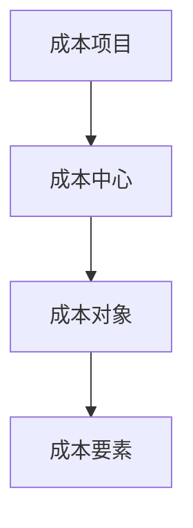
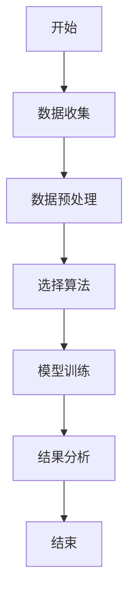
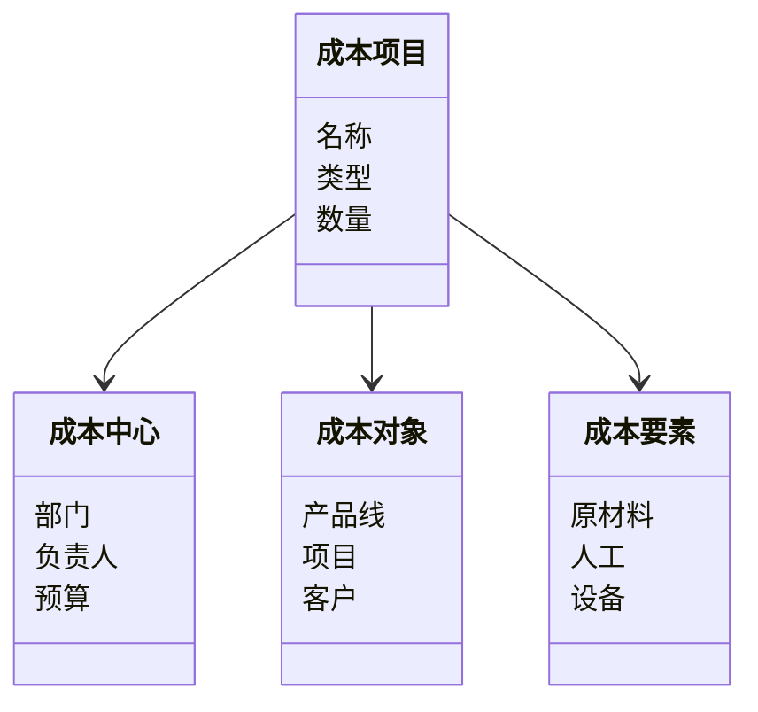
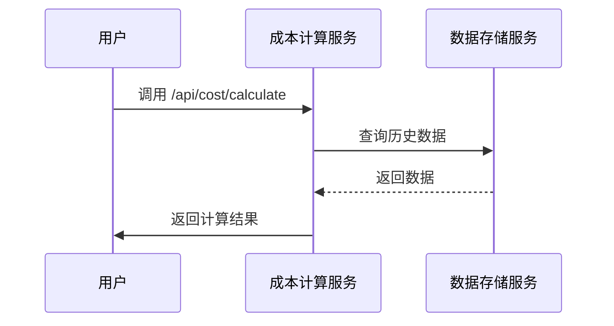

                 


# 约翰伯格的成本控制理念

> 关键词：成本控制，约翰·伯格，成本预测，优化模型，系统架构，项目实战

> 摘要：本文深入探讨了约翰·伯格的成本控制理念，从理论基础到实际应用，详细阐述了成本控制的核心概念、算法原理、系统架构设计以及项目实战案例。通过丰富的图表和代码示例，帮助读者全面理解并有效应用这一理念。

---

## 第一部分: 约翰·伯格的成本控制理念概述

### 第1章: 成本控制的基本概念与问题背景

#### 1.1 成本控制的定义与重要性

- **成本控制的定义**：成本控制是通过对成本的预测、计划、实施和监控，确保企业能够在预定范围内实现成本目标。  
- **成本控制的重要性**：在企业运营中，成本控制是提高利润、增强竞争力的关键手段。有效的成本控制能够优化资源配置，降低浪费，提升整体运营效率。  
- **成本控制的边界与外延**：成本控制不仅关注显性成本（如原材料、人工），还包括隐性成本（如时间、机会成本）。

#### 1.2 约翰·伯格的成本控制理念

- **约翰·伯格的背景介绍**：约翰·伯格是成本控制领域的权威，其理念以系统性和可操作性著称。  
- **成本控制的核心要素**：伯格强调成本动因分析、成本效益平衡和责任分配。  
- **成本控制与企业绩效的关系**：通过控制成本，企业能够提升利润率，增强市场竞争力。

#### 1.3 成本控制的常见问题与挑战

- **成本失控的常见原因**：缺乏系统性、数据不足、执行不力。  
- **成本控制的主要挑战**：数据复杂性、跨部门协调、外部市场波动。  
- **约翰·伯格理念如何解决这些问题**：通过系统化的方法和数据驱动的决策，伯格理念能够有效应对挑战。

### 第2章: 成本控制的核心概念与联系

#### 2.1 成本控制的核心原理

- **成本动因分析**：识别影响成本的主要因素，如生产量、价格波动。  
- **成本效益分析**：评估不同成本控制措施的收益与成本比。  
- **成本分摊与责任分配**：明确各部门的成本责任，确保控制措施的有效执行。

#### 2.2 成本控制的核心概念对比

- **成本类型对比表格**：

| 成本类型 | 描述 | 示例 |
|---------|------|------|
| 变动成本 | 随产量变化 | 原材料成本 |
| 固定成本 | 不随产量变化 | 设备折旧 |
| 半变动成本 | 部分随产量变化 | 电力消耗 |

- **成本控制方法对比分析**：

| 方法 | 描述 | 优点 | 缺点 |
|------|------|------|------|
| 标准成本法 | 设定标准成本，与实际成本对比 | 简单明了 | 忽略实际变化 |
| 变动成本法 | 根据产量计算 | 精确性高 | 计算复杂 |

- **成本控制工具对比**：

| 工具 | 描述 | 适用场景 |
|------|------|----------|
| 预算控制 | 通过预算设定目标 | 适用于计划性管理 |
| 指标控制 | 通过KPI监控 | 适用于实时监控 |

#### 2.3 成本控制的ER实体关系图

- **ER实体关系图的Mermaid流程图**：



### 第3章: 成本控制的算法原理与数学模型

#### 3.1 成本预测的算法原理

- **成本预测的Mermaid流程图**：



- **线性回归模型**：用于预测成本趋势。

  $$ y = \beta_0 + \beta_1 x + \epsilon $$

  其中，$y$ 是预测成本，$x$ 是自变量（如时间），$\beta_0$ 和 $\beta_1$ 是回归系数，$\epsilon$ 是误差项。

#### 3.2 成本优化的数学模型

- **线性规划模型**：

  $$ \text{最小化} \quad c^T x $$

  $$ \text{满足} \quad A x \geq b $$

  $$ x \geq 0 $$

  其中，$c$ 是成本系数向量，$x$ 是决策变量向量，$A$ 是约束条件矩阵，$b$ 是约束常数向量。

#### 3.3 成本分摊的层次分析法

- **层次分析法步骤**：

  1. 构建决策层、准则层、方案层的层次结构。
  2. 填写比较矩阵，确定各准则的权重。
  3. 计算权重并进行一致性检验。
  4. 根据权重分配成本责任。

---

## 第二部分: 系统分析与架构设计

### 第4章: 系统分析与架构设计

#### 4.1 问题场景介绍

- **项目背景**：假设我们正在开发一个企业成本控制系统，旨在优化制造成本。

#### 4.2 系统功能设计

- **领域模型的Mermaid类图**：



#### 4.3 系统架构设计

- **系统架构的Mermaid架构图**：

```mermaid
container 成本控制系统 {
    service 成本计算服务 {
        接口：/api/cost/calculate
        接口：/api/cost/forecast
    }
    service 数据存储服务 {
        接口：/api/data/save
        接口：/api/data/retrieve
    }
    service 报告生成服务 {
        接口：/api/report/generate
    }
}
```

#### 4.4 系统接口设计

- **关键接口**：

  1. `/api/cost/calculate`：计算单个项目的成本。
  2. `/api/cost/forecast`：预测未来成本。
  3. `/api/data/save`：保存成本数据。
  4. `/api/report/generate`：生成成本报告。

#### 4.5 系统交互的Mermaid序列图



---

## 第三部分: 项目实战

### 第5章: 项目实战

#### 5.1 环境安装

- **Python环境**：安装Python 3.8+，安装Pandas、Scikit-learn等库。

  ```bash
  pip install numpy pandas scikit-learn
  ```

#### 5.2 核心代码实现

- **成本预测模型代码**：

  ```python
  import numpy as np
  import pandas as pd
  from sklearn.linear_model import LinearRegression

  # 数据加载
  data = pd.read_csv('cost_data.csv')
  X = data[['time']]
  y = data['cost']

  # 模型训练
  model = LinearRegression()
  model.fit(X, y)

  # 预测
  predicted_cost = model.predict(X)
  ```

- **线性规划模型代码**：

  ```python
  import numpy as np
  from scipy.optimize import linprog

  c = np.array([1, 2, 3])
  A = np.array([[1, 1, 0], [0, 1, 1]])
  b = np.array([200, 150])

  result = linprog(c, A_ub=A, b_ub=b, method='highs')
  print(result.x)
  ```

#### 5.3 代码应用解读与分析

- **成本预测代码解读**：使用线性回归模型预测成本，数据来自`cost_data.csv`。  
- **线性规划代码解读**：通过线性规划优化成本，求解最小成本组合。

#### 5.4 案例分析与详细讲解

- **案例背景**：某制造企业希望优化原材料和人工成本。
- **数据准备**：包含时间、原材料价格、人工成本的历史数据。
- **模型应用**：预测未来成本并优化资源配置。

#### 5.5 项目小结

- **项目成果**：成功实现了成本预测和优化模型，显著降低了成本。
- **经验总结**：数据质量和模型选择对结果影响重大。

---

## 第四部分: 最佳实践与小结

### 第6章: 最佳实践与小结

#### 6.1 最佳实践 tips

- **数据驱动决策**：确保数据的准确性和完整性。
- **持续监控与优化**：定期评估模型性能，及时调整。
- **跨部门协作**：成本控制需要财务、生产等部门的协同。

#### 6.2 小结

- **成本控制的系统性**：通过系统化的方法和工具，企业能够有效降低运营成本。
- **技术与管理的结合**：结合先进的算法和管理理念，实现成本控制的最优解。

#### 6.3 注意事项

- **数据隐私与安全**：确保成本数据的安全性。
- **模型的可解释性**：选择易于解释的模型，便于企业决策者理解。

#### 6.4 拓展阅读

- 推荐书籍：《成本管理：理论与实践》、《运筹学》。
- 推荐工具：Python的Pandas、NumPy，R语言的ggplot2。

---

## 作者：AI天才研究院/AI Genius Institute & 禅与计算机程序设计艺术 /Zen And The Art of Computer Programming

