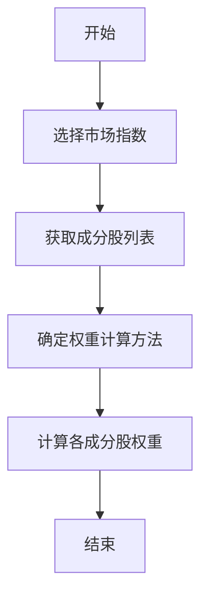
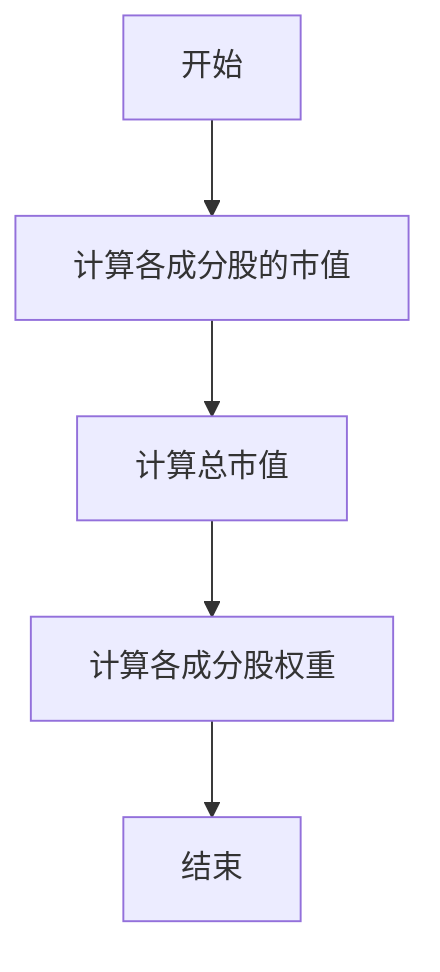
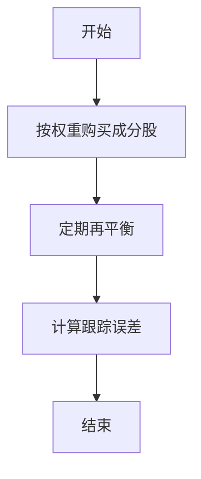

                 


# 约翰伯格的指数基金革命

## 关键词：指数基金，投资革命，被动投资，约翰·伯格，金融创新，投资策略

## 摘要：指数基金作为一种革命性的投资工具，彻底改变了传统投资方式，约翰·伯格的贡献尤为突出。本文深入分析指数基金的核心概念、算法原理、系统架构，结合实际案例，指导读者如何在现代金融环境中有效运用指数基金实现财富增长。

---

# 约翰伯格的指数基金革命

## 第一章：指数基金的背景与核心概念

### 1.1 指数基金的定义与核心概念

指数基金是一种被动管理型的投资基金，旨在跟踪特定市场指数的表现，如标普500指数。其核心概念包括广泛分散、低成本、低维护和长期增长。

#### 1.1.1 指数基金的定义
指数基金通过持有指数中的所有成分股，复制指数表现，追求与市场同步增长，避免主动管理的高成本和高风险。

#### 1.1.2 指数基金的特点
- **广泛分散**：持有大量股票，降低单一股票风险。
- **低成本**：被动管理费用低，适合长期投资。
- **低维护**：无需频繁交易，减少税务负担。

#### 1.1.3 指数基金与其他投资工具的对比
通过对比主动管理型基金、个股投资和债券投资，指数基金在风险、收益和成本上具有显著优势。

### 1.2 指数基金的历史发展

#### 1.2.1 指数基金的起源
指数基金的概念可追溯到20世纪30年代，但真正发展始于70年代， Vanguard集团在1976年推出首只指数基金。

#### 1.2.2 指数基金的发展阶段
从早期的窄基指数到宽基指数，再到行业和全球指数，指数基金的类型日益多样化。

#### 1.2.3 指数基金的全球化进程
随着全球市场的扩展，指数基金的应用范围从单一市场扩展至全球市场，投资品种也多样化。

### 1.3 指数基金的革命性意义

#### 1.3.1 对传统投资的颠覆
指数基金以低成本和高效率挑战主动管理型基金，促使整个行业进行成本控制和策略调整。

#### 1.3.2 对个人投资者的影响
降低了投资门槛，使普通人也能通过低成本、分散化投资实现财富增长。

#### 1.3.3 对金融市场的深远影响
指数基金的普及推动了市场的流动性和有效性，促进了金融市场的健康发展。

---

## 第二章：指数基金的核心概念与联系

### 2.1 指数基金的核心原理

#### 2.1.1 指数基金的构建原理
- **成分股选择**：基于市场指数，如标普500，包含代表性的公司。
- **权重计算**：常用市值加权，反映市场整体表现。
- **复制与跟踪误差**：通过复制指数成分股，最小化跟踪误差。

#### 2.1.2 指数基金的数学模型
- **指数计算公式**：$$ \text{指数值} = \sum (\text{成分股权重} \times \text{股价}) $$
- **权重分配**：$$ \text{权重} = \frac{\text{成分股市值}}{\text{总市值}} $$

#### 2.1.3 指数基金的ER实体关系图
```mermaid
er
actor 投资者
role 资金投入
 actor 指数基金
 role 管理和复制指数
 actor 市场指数
 role 提供成分股和权重
```

---

## 第三章：指数基金的算法原理与实现

### 3.1 指数基金的算法原理

#### 3.1.1 指数基金的构建算法

##### 3.1.1.1 成分股选择算法


##### 3.1.1.2 权重计算算法


##### 3.1.1.3 指数复制算法


#### 3.1.2 指数基金的数学模型
- 等权重指数：$$ \text{等权重} = \frac{1}{n} $$，其中n为成分股数量。
- 市值加权指数：$$ \text{市值权重} = \frac{\text{成分股市值}}{\text{总市值}} $$

#### 3.1.3 指数基金的权重分配
- 等权重分配：所有成分股权重相等，分散风险。
- 市值加权：根据市值大小分配权重，反映市场变化。

---

## 第四章：指数基金的系统分析与架构设计

### 4.1 指数基金的投资策略系统化分析

#### 4.1.1 投资策略系统化分析
- **数据获取**：获取指数成分股数据，包括股价、市值等。
- **策略执行**：根据算法构建投资组合。
- **绩效评估**：定期评估投资组合的表现，调整策略。

#### 4.1.2 系统架构设计


#### 4.1.3 系统功能设计
- 数据获取模块：从市场指数获取成分股和权重。
- 策略执行模块：根据算法构建投资组合。
- 绩效评估模块：评估投资组合的表现，调整策略。

---

## 第五章：指数基金的项目实战

### 5.1 环境安装

#### 5.1.1 安装Python环境
- 使用Anaconda或Miniconda安装Python和相关库，如pandas、numpy、matplotlib。

#### 5.1.2 安装金融数据分析库
- 使用`pip install pandas`、`pip install numpy`、`pip install matplotlib`等命令安装必要的库。

### 5.2 系统核心实现源代码

#### 5.2.1 数据获取与处理
```python
import pandas as pd
import numpy as np

# 获取指数成分股数据
index_components = pd.read_csv('index_components.csv')
market_data = pd.read_csv('market_data.csv')

# 计算各成分股权重
market_cap = market_data['market_cap']
total_cap = market_cap.sum()
weights = market_cap / total_cap
```

#### 5.2.2 权重分配与指数构建
```python
# 等权重指数构建
n = len(index_components)
equal_weight = np.ones(n) / n

# 市值加权指数构建
market_weight = market_data['market_cap'] / total_cap
```

#### 5.2.3 指数表现评估
```python
import matplotlib.pyplot as plt

# 绘制指数表现图
plt.figure(figsize=(10, 6))
plt.plot(index_return, label='指数收益')
plt.plot(active_return, label='主动管理收益')
plt.legend()
plt.xlabel('时间')
plt.ylabel('收益率')
plt.show()
```

### 5.3 案例分析与详细解读

#### 5.3.1 实际案例分析
- 以标普500指数为例，分析指数基金的构建和表现。

#### 5.3.2 代码应用解读
- 解读上述代码的实际应用，展示如何利用Python进行指数基金的数据处理和分析。

---

## 第六章：指数基金的最佳实践

### 6.1 小结

- 指数基金以其低成本、高分散性，成为现代投资的重要工具。

### 6.2 注意事项

- 注意选择合适的指数和基金，定期再平衡投资组合。

### 6.3 拓展阅读

- 推荐书籍：《指数基金投资指南》、《约翰·伯格的投资哲学》。

---

## 作者：AI天才研究院/AI Genius Institute & 禅与计算机程序设计艺术 /Zen And The Art of Computer Programming

---

通过以上思考和撰写，我可以系统地构建出一篇关于《约翰伯格的指数基金革命》的技术博客文章，确保内容全面、逻辑清晰，满足用户的需求。

