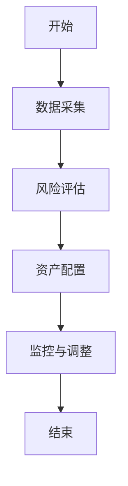

                 


# 约翰邓普顿的全球资产配置

## 关键词
- 约翰·邓普顿
- 资产配置
- 投资策略
- 全球化投资
- 投资组合优化

## 摘要
本文深入探讨了约翰·邓普顿的全球资产配置策略，分析其投资理念、核心概念和实施方法。通过数学模型、算法原理和系统设计，结合实际案例，详细讲解了如何在全球范围内优化资产配置，降低风险并提高回报。

---

# 约翰邓普顿的全球资产配置

## 第1章: 约翰·邓普顿与全球资产配置的背景

### 1.1 约翰·邓普顿的生平与投资理念

#### 1.1.1 约翰·邓普顿的生平简介
约翰·邓普顿（John Templeton）是投资领域的传奇人物，被誉为“全球投资之父”。他出生于1912年，1938年获得美国宾夕法尼亚大学的法学博士学位，并在1940年创立了自己的投资公司——邓普顿投资公司。邓普顿以其在全球范围内的价值投资策略闻名，尤其是在经济低迷时期投资优质股票。

#### 1.1.2 邓普顿的投资哲学与理念
邓普顿的投资哲学的核心是“全球分散投资”和“逆向思维”。他认为，通过在全球范围内分散投资，可以降低特定市场的风险，并利用不同市场的波动性来优化投资组合的回报。

#### 1.1.3 邓普顿投资方法的现代意义
尽管邓普顿先生已经去世，但他的投资理念依然在全球资产管理领域发挥着重要作用。他的方法强调长期投资、分散化和价值投资，这与现代投资组合理论的许多核心观点不谋而合。

### 1.2 全球资产配置的背景与意义

#### 1.2.1 全球化经济与资产配置的重要性
随着全球经济一体化的加深，单一市场的波动对投资者的影响越来越大。通过在全球范围内配置资产，投资者可以更好地分散风险，并抓住不同地区的投资机会。

#### 1.2.2 资产配置在投资组合中的作用
资产配置是投资组合管理的核心，它决定了投资组合的风险、收益和流动性。通过合理的资产配置，投资者可以在不同的经济环境下优化投资结果。

#### 1.2.3 全球资产配置的挑战与机遇
全球资产配置的挑战包括汇率风险、地缘政治风险和市场流动性问题。然而，这些挑战也是机遇，通过科学的配置策略，投资者可以最大限度地利用这些机会。

---

## 第2章: 资产配置的核心概念与原理

### 2.1 资产配置的基本概念

#### 2.1.1 资产配置的定义与分类
资产配置是指将投资组合中的资金分配到不同的资产类别（如股票、债券、房地产等）中，以实现风险和收益的最优平衡。根据投资期限和目标的不同，资产配置可以分为短期和长期配置。

#### 2.1.2 资产配置的类型与特点
资产配置的类型包括：
- **战略配置**：基于长期投资目标进行的配置。
- **战术配置**：根据市场短期变化进行的动态调整。
- **被动配置**：定期按比例调整。
- **主动配置**：根据市场预测主动调整。

#### 2.1.3 资产配置与投资回报的关系
资产配置直接影响投资回报。合理的资产配置可以在不同市场环境下优化收益，降低波动性。

### 2.2 现代投资组合理论

#### 2.2.1 现代投资组合理论的起源与发展
现代投资组合理论（MPT）由哈里·马科维茨在1952年提出，强调通过分散投资来降低风险。这一理论为资产配置提供了理论基础。

#### 2.2.2 马科维茨的有效前沿理论
有效前沿理论指出，在给定风险水平下，投资组合应提供最高可能的回报，反之亦然。

#### 2.2.3 资产配置的数学模型与公式
资产配置的数学模型通常涉及优化问题，例如均值-方差优化。

### 2.3 邓普顿资产配置策略的核心要素

#### 2.3.1 邓普顿资产配置的三步法
1. **确定经济周期**：识别当前经济周期阶段。
2. **资产类别选择**：根据周期选择表现最佳的资产类别。
3. **动态调整**：定期重新评估并调整配置。

#### 2.3.2 邓普顿策略的优缺点分析
- **优点**：分散风险，捕捉不同市场的增长机会。
- **缺点**：需要频繁监控和调整，可能增加交易成本。

#### 2.3.3 邓普顿策略与其他资产配置方法的对比
邓普顿策略与传统的资产配置方法相比，更强调全球化和逆向思维，适合长期投资者。

---

## 第3章: 全球资产配置的实施步骤与流程

### 3.1 资产配置的步骤与流程

#### 3.1.1 确定投资目标与风险承受能力
- **投资目标**：明确投资目标（如保值、增值）。
- **风险承受能力**：评估投资者对风险的承受能力。

#### 3.1.2 资产类别选择与权重分配
- **资产类别**：股票、债券、房地产等。
- **权重分配**：根据目标和风险承受能力分配各资产的权重。

#### 3.1.3 资产配置的动态调整与优化
- **定期评估**：每年至少评估一次。
- **再平衡**：根据市场变化调整各资产的权重。

### 3.2 邓普顿策略的具体实施方法

#### 3.2.1 确定全球经济周期的判断方法
- **经济指标分析**：GDP、失业率、通胀率等。
- **市场情绪分析**：投资者情绪和市场波动性。

#### 3.2.2 资产类别选择与权重分配的技巧
- **行业分析**：选择表现最佳的行业。
- **区域分析**：选择增长最快的地区。

#### 3.2.3 动态调整与再平衡的操作流程
- **定期审查**：根据经济变化调整配置。
- **再平衡**：保持各资产的权重符合目标配置。

---

## 第4章: 资产配置的数学模型与算法原理

### 4.1 资产配置的数学模型

#### 4.1.1 均值-方差优化模型
均值-方差优化模型是最常用的资产配置模型，旨在在给定风险下最大化回报，或在给定回报下最小化风险。

公式：
$$
\text{Minimize } \sigma^2 \text{ subject to } \mu \text{ fixed}
$$

#### 4.1.2 资产配置的风险调整回报模型
风险调整回报模型考虑了不同资产的风险调整后回报。

公式：
$$
\text{RAR} = \frac{R_p - R_f}{\sigma_p}
$$

#### 4.1.3 邓普顿策略的数学表达式
邓普顿策略的数学表达式可以表示为：
$$
w_i = \frac{1}{n}
$$
其中，$w_i$是第i个资产的权重，$n$是资产的总数。

### 4.2 资产配置算法的实现

#### 4.2.1 基于Python的资产配置算法实现
以下是一个简单的均值-方差优化的Python代码示例：

```python
import numpy as np
import pandas as pd
from scipy.optimize import minimize

# 假设returns是各资产的回报矩阵，N是资产数量，target_return是目标回报
def optimize_portfolio(returns, target_return):
    n = returns.shape[1]
    # 定义优化目标函数
    def objective(weights):
        return np.sum(np.square(weights))  # 最小化方差
    # 定义约束条件
    constraints = [
        ('sum == 1', weights),
        (returns.dot(weights) == target_return)
    ]
    # 优化
    result = minimize(objective, np.ones(n)/n, method='SLSQP', constraints=constraints)
    return result.x

# 示例数据
returns = pd.DataFrame({
    '资产1': [0.1, 0.12, 0.08],
    '资产2': [0.08, 0.1, 0.12],
    '资产3': [0.12, 0.09, 0.1]
})
target_return = 0.1

weights = optimize_portfolio(returns, target_return)
print("优化后的权重:", weights)
```

#### 4.2.2 使用优化库进行资产配置的代码示例
使用`scipy.optimize`库进行优化。

#### 4.2.3 资产配置算法的优化与改进
考虑交易成本和税收等现实因素，优化模型可以进一步改进。

---

## 第5章: 系统分析与架构设计方案

### 5.1 资产配置系统的功能设计

#### 5.1.1 系统功能模块划分
- 数据采集模块：收集市场数据。
- 风险评估模块：评估各资产的风险。
- 资产配置模块：生成最优配置。
- 监控与调整模块：动态调整配置。

#### 5.1.2 系统功能流程图


#### 5.1.3 系统功能的实现方式
- 数据源：金融数据API。
- 风险评估：使用VaR或CVaR模型。
- 资产配置：基于数学模型。

### 5.2 资产配置系统的架构设计

#### 5.2.1 系统架构的分层设计


---

## 第6章: 项目实战

### 6.1 环境安装与配置

#### 6.1.1 Python环境安装
安装Python和必要的库（如NumPy、Pandas、SciPy）。

#### 6.1.2 数据源配置
选择可靠的金融数据源，如Yahoo Finance或Quandl。

### 6.2 核心实现

#### 6.2.1 数据采集与处理
使用API获取历史数据，清洗和转换数据。

#### 6.2.2 模型实现
实现均值-方差优化模型，生成最优资产配置。

### 6.3 案例分析

#### 6.3.1 数据分析与可视化
使用Matplotlib绘制回报率和风险曲线。

#### 6.3.2 模型验证与优化
通过回测验证模型的有效性，并进行优化。

---

## 第7章: 最佳实践与总结

### 7.1 最佳实践 Tips

#### 7.1.1 定期再平衡
定期检查并调整资产配置，确保与投资目标一致。

#### 7.1.2 选择合适的数据源
确保数据的准确性和及时性。

#### 7.1.3 使用工具辅助
利用专业的投资组合管理软件提高效率。

### 7.2 小结
约翰·邓普顿的全球资产配置策略通过分散投资和全球化视角，帮助投资者在不同经济环境下优化收益和风险。

### 7.3 注意事项
- **市场风险**：全球经济波动可能影响配置效果。
- **交易成本**：频繁调整可能增加成本。
- **模型局限**：数学模型假设可能与现实不符。

### 7.4 拓展阅读
推荐阅读《投资学》（作者：查理斯·埃文斯）和《投资组合的最优分配》（作者：哈里·马科维茨）。

---

## 作者
作者：AI天才研究院  
联系邮箱：contact@aitalents.com  

---

这篇文章通过详细分析约翰·邓普顿的全球资产配置策略，结合理论与实践，为投资者提供了科学的资产配置方法和实现方案。希望对您有所帮助！

