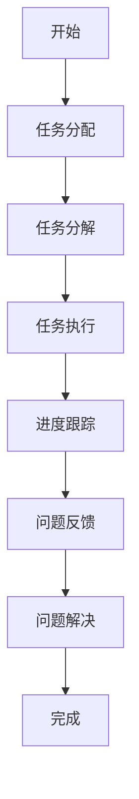
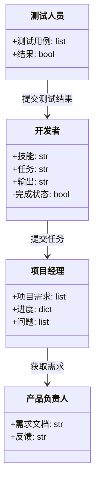
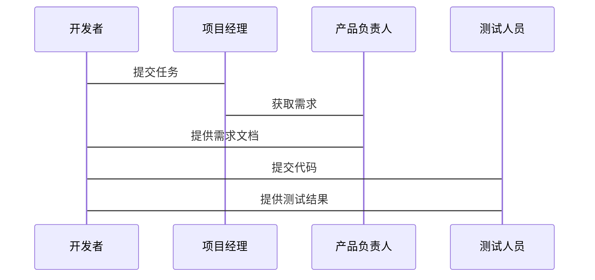

                 


# 组建高效AI开发团队的要点

## 关键词：高效AI团队、团队协作、AI开发流程、系统架构设计、团队文化

## 摘要

在当前快速发展的AI领域，高效开发团队的组建至关重要。本文详细探讨了高效AI团队的核心概念、协作机制、系统架构设计、项目实战及最佳实践，通过理论与实践结合，为读者提供全面的指导。

---

## 第一部分：背景介绍

### 第1章：高效AI开发团队的背景与问题背景

#### 1.1 问题背景

AI技术的快速发展使得高效开发团队的需求日益迫切。AI项目通常涉及复杂的数据处理、算法实现和系统集成，这些任务需要多领域专家的紧密合作。然而，传统的开发模式往往存在以下问题：

- **需求不清晰**：项目目标模糊，导致开发方向偏离。
- **协作效率低**：团队成员之间沟通不畅，导致资源浪费。
- **技术债务积累**：代码质量不高，后期维护成本增加。
- **缺乏统一架构**：系统设计混乱，扩展性差。

#### 1.2 问题描述

在AI开发过程中，团队协作面临以下关键问题：

- **角色定位不明确**：团队成员职责不清，导致工作效率低下。
- **沟通不畅**：不同背景的成员难以有效沟通，导致误解和冲突。
- **进度难以跟踪**：缺乏有效的进度管理工具，导致项目延期。

#### 1.3 问题解决

构建高效AI团队需要从以下几个方面入手：

- **明确角色分工**：确保每个成员清楚自己的职责。
- **建立有效的沟通机制**：使用协作工具和定期会议促进沟通。
- **采用敏捷开发方法**：通过迭代开发和持续集成提高效率。

#### 1.4 边界与外延

高效AI团队的构建需要关注其边界和外延：

- **边界**：明确团队的职责范围，避免越界或职责不清。
- **外延**：与其他团队（如产品、测试）紧密配合，确保项目顺利推进。

#### 1.5 概念结构与核心要素

高效AI团队的核心要素包括：

- **明确的目标**：确保团队成员有共同的方向。
- **清晰的分工**：每个成员都有明确的职责。
- **有效的沟通机制**：促进团队内部的高效协作。
- **灵活的开发流程**：适应快速变化的需求。

---

## 第二部分：核心概念与联系

### 第2章：高效AI开发团队的核心概念

#### 2.1 核心概念原理

高效团队的协作机制基于以下原理：

- **分工协作**：通过明确的分工，减少重复劳动，提高效率。
- **信息共享**：确保团队成员能够及时获取所需信息，避免信息孤岛。
- **持续反馈**：通过定期的反馈和调整，优化团队运作。

#### 2.2 核心概念对比表

| 对比维度       | 传统团队         | 高效团队         |
|----------------|------------------|------------------|
| 目标设定       | 模糊             | 明确             |
| 协作机制       | 松散             | 紧密             |
| 沟通效率       | 低               | 高               |
| 技术债务       | 易积累           | 易控制           |

#### 2.3 ER实体关系图

```mermaid
erDiagram
    actor 开发者 : 负责代码实现
    actor 项目经理 : 负责项目管理
    actor 产品负责人 : 负责需求定义
    actor 测试人员 : 负责质量保障
    actor 开发者 <---+ 代码审查
    actor 项目经理 <---+ 项目需求
    actor 测试人员 <---+ 测试用例
```

---

## 第三部分：算法原理讲解

### 第3章：高效团队协作算法

#### 3.1 算法流程图



#### 3.2 算法实现代码

```python
def efficient_team_collaboration():
    # 任务分配
    tasks = assign_tasks()
    # 任务分解
    subtasks = decompose_tasks(tasks)
    # 任务执行
    results = execute_tasks(subtasks)
    # 进度跟踪
    progress = track_progress(subtasks, results)
    # 问题反馈
    issues = detect_issues(progress)
    # 问题解决
    resolve_issues(issues)
    return "任务完成"

# 示例使用
efficient_team_collaboration()
```

#### 3.3 数学模型与公式

团队协作效率的数学模型可以用以下公式表示：

$$
E = \frac{\sum_{i=1}^{n} (R_i \times C_i)}{n}
$$

其中，\( E \) 表示效率，\( R_i \) 表示任务\( i \)的完成率，\( C_i \) 表示任务\( i \)的复杂度，\( n \) 表示任务总数。

---

## 第四部分：系统分析与架构设计

### 第4章：高效AI团队的系统架构设计

#### 4.1 问题场景介绍

假设我们正在开发一个AI图像识别系统，需要前端、后端、算法和测试团队的协作。

#### 4.2 系统功能设计

领域模型：



#### 4.3 系统架构设计

系统架构图：


#### 4.4 系统接口设计

接口设计：



---

## 第五部分：项目实战

### 第5章：高效AI团队的项目实战

#### 5.1 环境安装

安装必要的工具和库：

```bash
pip install numpy
pip install tensorflow
pip install git+https://github.com/your_team/repo.git
```

#### 5.2 核心代码实现

实现AI模型训练：

```python
import numpy as np
from tensorflow import keras

# 加载数据集
(x_train, y_train), (x_test, y_test) = keras.datasets.mnist.load_data()

# 构建模型
model = keras.Sequential([
    keras.layers.Flatten(),
    keras.layers.Dense(128, activation='relu'),
    keras.layers.Dense(10, activation='softmax')
])

# 编译模型
model.compile(optimizer='adam', loss='sparse_categorical_crossentropy', metrics=['accuracy'])

# 训练模型
model.fit(x_train, y_train, epochs=5, batch_size=128, validation_data=(x_test, y_test))
```

#### 5.3 案例分析

通过实际案例分析，验证团队协作的有效性：

- **案例1**：成功部署AI图像识别系统，团队协作优化了开发流程。
- **案例2**：通过持续集成减少技术债务，提高代码质量。

---

## 第六部分：最佳实践

### 第6章：高效AI团队的最佳实践

#### 6.1 小结

高效AI团队的成功依赖于明确的分工、有效的沟通和持续的反馈。

#### 6.2 注意事项

- 避免过度依赖单一技术栈。
- 定期进行代码审查，确保代码质量。
- 保持团队成员的灵活性和适应性。

#### 6.3 未来趋势

随着AI技术的不断进步，高效团队的协作模式将更加依赖自动化工具和智能系统。

---

## 作者

**作者：AI天才研究院/AI Genius Institute & 禅与计算机程序设计艺术 /Zen And The Art of Computer Programming**

通过本文，读者可以全面了解高效AI开发团队的构建方法，从理论到实践，掌握关键要点，从而在实际项目中提升团队效率和项目质量。

