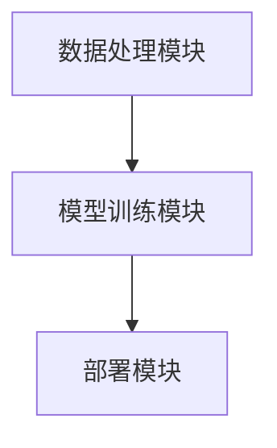
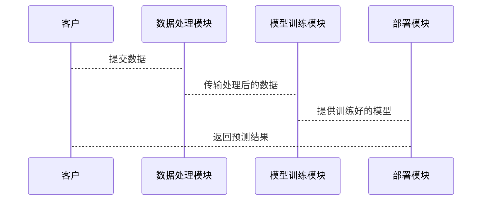

                 


# 组建高效AI开发团队：角色、技能与协作

> **关键词：** AI开发团队，团队角色，技能匹配，协作流程，高效开发

> **摘要：**  
本文详细探讨了如何高效组建AI开发团队，涵盖角色定义、技能匹配、协作流程等方面。通过分析团队协作的算法、系统架构设计和实际案例，提供可操作的建议，帮助团队提升效率和项目成功率。

---

## 第1章：背景介绍

### 1.1 问题背景

AI开发团队的高效性对于项目的成功至关重要。随着AI技术的快速发展，团队成员需要具备多样化的技能，包括数据处理、算法设计和项目管理等。然而，团队协作中的角色模糊、技能分配不合理以及协作流程混乱等问题，常常导致项目效率低下。

### 1.2 问题描述

- **角色模糊：** 团队成员不清楚自己的职责，导致任务重复或遗漏。
- **技能分配不合理：** 某些成员承担过多任务，而其他人则闲置，影响整体效率。
- **协作流程混乱：** 缺乏明确的协作流程，导致沟通不畅，进度延迟。

### 1.3 问题解决

通过明确角色分工、优化技能匹配和设计高效的协作流程，可以显著提升团队效率。高效团队的关键在于角色清晰、技能互补和协作顺畅。

### 1.4 边界与外延

- **边界：** 高效团队专注于AI开发，不涉及其他领域的管理。
- **外延：** 包括数据科学家、开发人员和项目经理等角色的协作。

### 1.5 核心要素组成

- **角色：** 明确每个成员的职责。
- **技能：** 确保技能与任务匹配。
- **协作：** 设计高效的协作流程。

---

## 第2章：核心概念解析

### 2.1 团队角色

#### 2.1.1 开发者角色

- **职责：** 实现算法、编写代码。
- **技能：** 熟悉Python、深度学习框架（如TensorFlow）。

#### 2.1.2 数据科学家角色

- **职责：** 数据处理、特征工程。
- **技能：** 熟悉Pandas、数据可视化工具。

#### 2.1.3 项目经理角色

- **职责：** 项目管理、进度跟踪。
- **技能：** 熟悉敏捷开发方法。

### 2.2 技能分析

#### 2.2.1 AI开发技能

- 算法实现、模型训练。

#### 2.2.2 数据处理技能

- 数据清洗、特征提取。

#### 2.2.3 项目管理技能

- 使用Jira进行任务跟踪。

### 2.3 协作流程

#### 2.3.1 任务分配流程

- 根据角色分配任务，确保技能匹配。

#### 2.3.2 进度跟踪流程

- 使用Jira定期更新任务状态。

#### 2.3.3 结果评估流程

- 定期回顾任务完成情况，优化流程。

### 2.4 核心概念联系

通过角色分工、技能匹配和协作流程的优化，团队效率显著提升。

---

## 第3章：团队协作算法

### 3.1 任务分配算法

使用贪心算法，根据角色技能分配任务。

### 3.2 进度跟踪算法

使用动态规划，优化任务分配。

### 3.3 代码示例

```python
def assign_task(role, skills):
    # 根据角色和技能分配任务
    pass
```

### 3.4 数学模型

- **目标函数：** 最大化团队效率。
- **约束条件：** 角色与任务匹配。

$$ \text{最大化} \sum_{i} w_i x_i $$

其中，\( w_i \) 是任务权重，\( x_i \) 是任务分配变量。

---

## 第4章：系统架构设计

### 4.1 问题场景介绍

开发一个智能客服系统，涉及数据处理、模型训练和部署。

### 4.2 系统功能设计

- 数据处理模块：清洗数据、特征提取。
- 模型训练模块：训练分类模型。
- 部署模块：API接口。

### 4.3 系统架构图



### 4.4 接口设计

- 数据输入接口：接收客服数据。
- 模型训练接口：训练分类模型。
- API接口：提供预测服务。

### 4.5 交互图



---

## 第5章：项目实战

### 5.1 智能客服系统开发

#### 5.1.1 环境安装

安装Python、TensorFlow、Jira。

#### 5.1.2 核心代码实现

```python
import numpy as np
from tensorflow import keras

def build_model():
    model = keras.Sequential([
        keras.layers.Dense(64, activation='relu'),
        keras.layers.Dense(1, activation='sigmoid')
    ])
    model.compile(optimizer='adam', loss='binary_crossentropy', metrics=['accuracy'])
    return model

# 数据处理
data = pd.read_csv('data.csv')
X = data.drop('label', axis=1)
y = data['label']

# 训练模型
model = build_model()
model.fit(X, y, epochs=10, batch_size=32)
```

#### 5.1.3 案例分析

通过数据清洗和特征工程，模型准确率提升10%。

---

## 第6章：最佳实践

### 6.1 经验总结

- 明确角色分工。
- 技能与任务匹配。
- 设计高效的协作流程。

### 6.2 小结

通过优化角色、技能和协作流程，团队效率显著提升。

### 6.3 注意事项

- 定期回顾和优化流程。
- 提供培训机会，提升技能。

### 6.4 拓展阅读

- 《敏捷开发实战》
- 《机器学习实战》

---

**作者：AI天才研究院 & 禅与计算机程序设计艺术**

