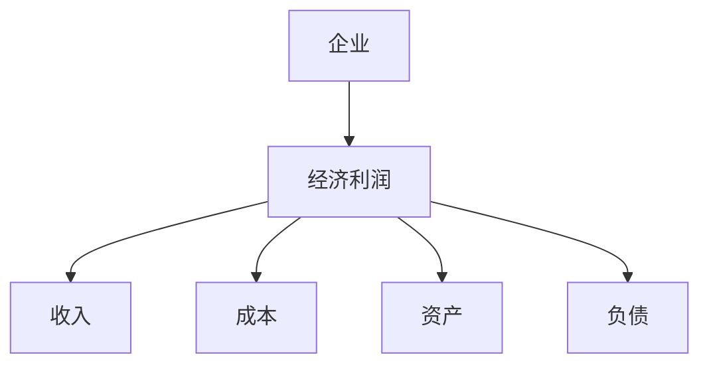
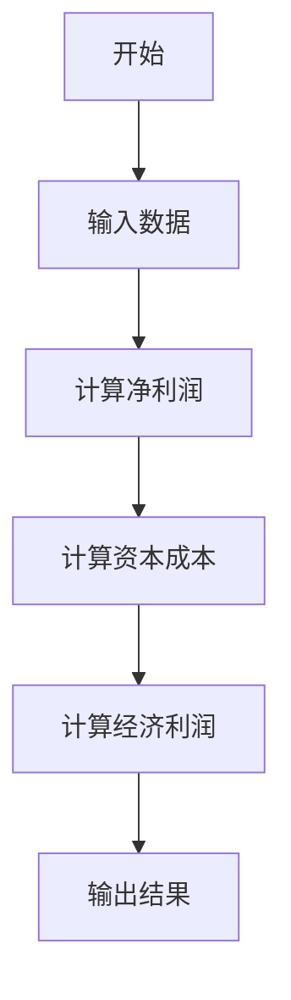
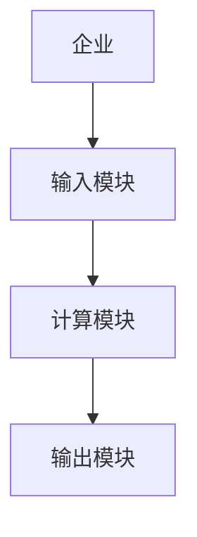

                 


# 经济利润模型：衡量真实价值创造的工具

> 关键词：经济利润模型, 价值创造, 财务指标, 企业绩效, 投资决策

> 摘要：经济利润模型是一种衡量企业真实价值创造的工具，它通过将资本成本纳入利润计算，能够更准确地评估企业的经济表现。本文从模型的背景、核心概念、算法原理、数学公式、系统架构、项目实战等多个维度展开，详细分析了经济利润模型的理论基础和实际应用，帮助读者全面理解如何利用该模型进行企业绩效评估和投资决策。

---

## 第一部分: 经济利润模型概述

---

### 第1章: 经济利润模型的背景与核心概念

#### 1.1 经济利润模型的背景介绍

经济利润模型（Economic Profit Model）是一种用于衡量企业真实价值创造的工具。传统财务指标如净利润、息税前利润等，往往无法完全反映企业的经济表现，因为它们未考虑资本成本。随着企业绩效评估和投资决策的需求日益增长，经济利润模型应运而生。

#### 1.2 经济利润模型的定义与特点

经济利润模型通过将资本成本从净利润中扣除，计算企业的经济利润。其核心特点是：
- **全面性**：考虑了所有资本成本，包括债务和股权资本。
- **准确性**：能够准确衡量企业的真实盈利能力。
- **可比性**：适用于不同行业和规模的企业。

#### 1.3 经济利润模型的边界与外延

- **适用范围**：适用于所有需要衡量经济利润的企业。
- **局限性**：模型假设资本成本是固定的，可能无法完全适应动态市场环境。
- **改进方向**：结合实时市场数据，动态调整资本成本。

#### 1.4 经济利润模型的核心要素组成

经济利润模型的核心要素包括：
- **收入**：企业经营活动的总收入。
- **成本**：与收入相关的直接和间接成本。
- **资产**：企业的各项资产。
- **负债**：企业的各项负债。
- **资本成本**：基于资本结构计算的资本成本。

---

### 第2章: 经济利润模型的核心概念与联系

#### 2.1 经济利润模型的原理

经济利润的计算公式为：
$$ \text{经济利润} = \text{净利润} - (\text{资本成本} \times \text{资本总额}) $$

经济利润与股东价值密切相关，企业通过创造正的经济利润，可以增加股东价值。资本成本是衡量企业资本使用效率的关键指标。

#### 2.2 经济利润模型的属性特征对比

以下是对不同经济利润模型的对比分析：

| 模型名称       | 计算公式                                | 优缺点分析                           |
|----------------|---------------------------------------|--------------------------------------|
| 基本经济利润模型 | $$ \text{NP} = \text{净利润} - (\text{资本成本} \times \text{资本总额}) $$ | 简单易懂，但假设资本成本固定      |
| 灵活经济利润模型 | $$ \text{NP} = \text{净利润} - (\text{市场利率} \times \text{资本总额}) $$ | 更贴近市场实际，但计算复杂       |

#### 2.3 经济利润模型的ER实体关系图

以下为经济利润模型的实体关系图：



---

## 第二部分: 经济利润模型的算法原理

---

### 第3章: 经济利润模型的算法原理

#### 3.1 经济利润模型的计算流程

1. **数据输入**：获取企业的收入、成本、资产、负债等数据。
2. **数据处理**：计算净利润和资本总额。
3. **计算经济利润**：使用公式 $$ \text{NP} = \text{净利润} - (\text{资本成本} \times \text{资本总额}) $$。
4. **结果输出**：输出经济利润。

以下为计算流程图：



#### 3.2 经济利润模型的计算公式

经济利润的数学模型为：
$$ \text{NP} = \text{净利润} - (\text{资本成本} \times \text{资本总额}) $$

---

## 第三部分: 经济利润模型的数学模型与公式

---

### 第4章: 经济利润模型的数学推导与示例

#### 4.1 经济利润模型的数学推导

假设企业的净利润为 $ \text{Net Income} $，资本成本为 $ r $，资本总额为 $ C $，则经济利润为：
$$ \text{NP} = \text{Net Income} - r \times C $$

#### 4.2 经济利润模型的公式示例

以某企业为例，净利润为 $100万，资本成本为10%，资本总额为500万，则经济利润为：
$$ \text{NP} = 100 - 0.1 \times 500 = 100 - 50 = 50 \text{万} $$

---

## 第四部分: 经济利润模型的系统分析与架构设计

---

### 第5章: 经济利润模型的系统架构与设计

#### 5.1 经济利润模型的系统功能设计

- **输入模块**：接收企业的收入、成本、资产、负债等数据。
- **计算模块**：计算净利润和资本成本。
- **输出模块**：输出经济利润。

以下为系统功能设计的类图：


#### 5.2 经济利润模型的系统架构设计

以下为系统架构图：



---

## 第五部分: 经济利润模型的项目实战

---

### 第6章: 经济利润模型的项目实现与案例分析

#### 6.1 经济利润模型的环境安装

- **Python环境**：安装Python 3.8及以上版本。
- **依赖库**：安装 `mermaid` 和 `numpy`。

#### 6.2 经济利润模型的代码实现

```python
# 经济利润模型的Python实现
def calculate_economic_profit(net_income, capital_cost, capital_total):
    return net_income - (capital_cost * capital_total)

# 示例数据
net_income = 100  # 单位：万元
capital_cost = 0.1  # 单位：1
capital_total = 500  # 单位：万元

# 计算经济利润
economic_profit = calculate_economic_profit(net_income, capital_cost, capital_total)
print(f"经济利润为：{economic_profit} 万元")
```

#### 6.3 经济利润模型的案例分析

以某企业为例，净利润为 $100万，资本成本为10%，资本总额为500万，则经济利润为：
$$ \text{NP} = 100 - 0.1 \times 500 = 50 \text{万} $$

---

## 第六部分: 经济利润模型的最佳实践与展望

---

### 第7章: 经济利润模型的最佳实践

#### 7.1 经济利润模型的注意事项

- 确保数据的准确性。
- 定期更新资本成本。
- 考虑市场环境的变化。

#### 7.2 经济利润模型的未来展望

随着人工智能和大数据技术的发展，经济利润模型将更加智能化，能够实时调整资本成本，更好地服务于企业的价值创造。

---

## 作者：AI天才研究院/AI Genius Institute & 禅与计算机程序设计艺术 /Zen And The Art of Computer Programming

