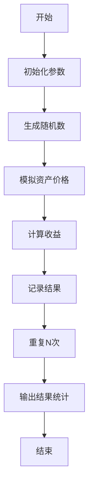
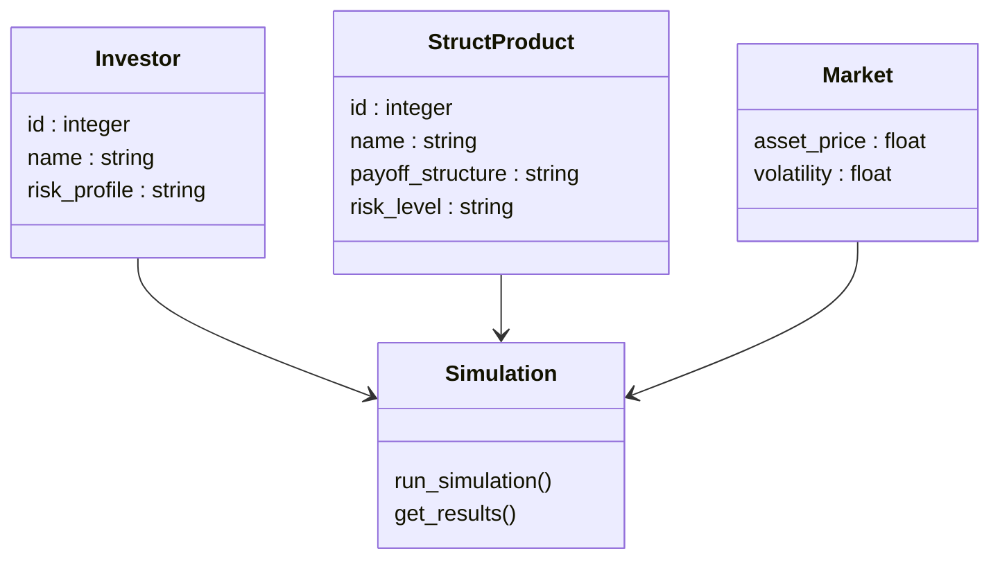

                 


# 结构性产品：定制化投资解决方案的优缺点

> 关键词：结构性产品、定制化投资、金融建模、蒙特卡洛模拟、系统架构设计

> 摘要：本文深入探讨结构性产品的定义、核心概念、算法原理及其优缺点。通过详细分析结构性产品的设计原理、数学模型和系统架构，结合实际案例和项目实战，为读者提供全面的见解。文章还总结了结构性产品的最佳实践和未来发展趋势，帮助读者更好地理解和应用结构性产品。

---

## 第一部分: 结构性产品的背景与核心概念

### 第1章: 结构性产品的定义与特点

#### 1.1 什么是结构性产品？
结构性产品是一种金融工具，其收益与一个或多个标的资产的表现挂钩。与传统投资产品不同，结构性产品通过嵌入期权或其他衍生工具，提供定制化的收益结构和风险敞口。

#### 1.2 结构性产品的核心特征
1. **定制化**：投资者可以根据风险偏好和收益目标，选择不同的产品结构。
2. **风险可控**：通过产品设计，将风险限制在特定范围内，避免极端损失。
3. **收益增强**：通过嵌入期权等工具，提高潜在收益。

#### 1.3 与传统投资产品的区别
- **传统投资**：直接投资于股票、债券等资产，收益和风险直接相关。
- **结构性产品**：通过嵌入衍生工具，收益与标的资产表现相关，但风险和收益可以被定制。

#### 1.4 结构性产品的优缺点
- **优点**：定制化、风险可控、收益增强。
- **缺点**：复杂性高、流动性差、透明度低。

---

### 第2章: 结构性产品的核心概念与联系

#### 2.1 核心概念
结构性产品的设计涉及多个核心概念，包括收益结构、风险敞口、嵌入式期权等。这些概念相互关联，共同决定了产品的最终表现。

#### 2.2 概念属性对比
以下是不同类型结构性产品的对比表格：

| 类型                | 收益结构       | 风险敞口       | 适用场景         |
|---------------------|----------------|----------------|------------------|
| 固定收益类          | 固定收益       | 低             | 风险厌恶型投资者   |
| 权益挂钩类          | 按权益表现浮动  | 中高           | 风险偏好型投资者   |
| 复合结构类          | 多重收益结构   | 高             | 多策略投资者       |

#### 2.3 ER实体关系图
以下是结构性产品的核心要素关系图：

```mermaid
erDiagram
    struct_product {
        id : integer
        product_name : string
        issuer : string
        maturity_date : date
        notional : float
        underlying_asset : string
        payoff_structure : string
        risk_level : string
        }
    investor
    [
        invest_in : struct_product
    ]
    market
    [
        impacts : struct_product
    ]
```

---

### 第3章: 结构性产品的算法原理

#### 3.1 金融建模
结构性产品的定价和风险评估需要复杂的金融建模。以下是一个蒙特卡洛模拟的流程图：



#### 3.2 数学模型
以下是一个几何布朗运动的公式：

$$
\frac{dS}{dt} = \mu S dt + \sigma S dW
$$

其中，$\mu$ 是均值回报率，$\sigma$ 是波动率，$dW$ 是标准布朗运动。

#### 3.3 蒙特卡洛模拟代码
以下是一个蒙特卡洛模拟的Python代码示例：

```python
import numpy as np

def monte_carlo_simulation(S0, mu, sigma, T, N, paths):
    np.random.seed(42)
    W = np.random.randn(N, 1)
    S = S0 * np.exp((mu - 0.5*sigma**2)*T + sigma*np.sqrt(T)*W)
    return S

# 示例参数
S0 = 100
mu = 0.05
sigma = 0.2
T = 1.0
N = 1000
paths = 10000

# 运行模拟
simulated_prices = monte_carlo_simulation(S0, mu, sigma, T, N, paths)
```

---

### 第4章: 系统分析与架构设计

#### 4.1 问题场景
投资者需要根据自身的风险偏好和收益目标，选择合适的结构性产品。系统需要提供产品设计、模拟和评估功能。

#### 4.2 系统功能设计
以下是系统功能模块图：



#### 4.3 系统架构设计
以下是系统架构图：

```mermaid
containerDiagram
    Container Frontend {
        Investor Interface
    }
    Container Backend {
        StructProduct Database
        Market Data
        Simulation Engine
    }
    Frontend --> Backend
```

---

### 第5章: 项目实战

#### 5.1 环境安装
需要安装以下库：
- Python 3.8+
- NumPy
- Matplotlib
- Scipy

#### 5.2 核心代码实现
以下是模拟结构性产品收益的代码：

```python
import numpy as np
import matplotlib.pyplot as plt

def simulate_struct_product(S0, mu, sigma, T, N, paths):
    np.random.seed(42)
    W = np.random.randn(N, paths)
    S = S0 * np.exp((mu - 0.5*sigma**2)*T + sigma*np.sqrt(T)*W)
    return S

# 示例参数
S0 = 100
mu = 0.05
sigma = 0.2
T = 1.0
N = 1000
paths = 10000

# 运行模拟
simulated_prices = simulate_struct_product(S0, mu, sigma, T, N, paths)

# 绘制结果
plt.hist(simulated_prices.flatten(), bins=50)
plt.xlabel('Price')
plt.ylabel('Frequency')
plt.show()
```

#### 5.3 案例分析
假设一位投资者选择一个固定收益类结构性产品，期限为1年，本金为100万。通过蒙特卡洛模拟，我们可以评估其可能的收益范围。

---

### 第6章: 最佳实践与小结

#### 6.1 最佳实践
- **风险评估**：在选择结构性产品前，充分评估自身的风险承受能力。
- **产品透明度**：选择透明度高的产品，确保理解产品结构和潜在风险。
- **持续监控**：定期监控市场环境和产品表现，及时调整投资策略。

#### 6.2 小结
结构性产品为投资者提供了定制化的投资解决方案，但其复杂性和风险需要投资者谨慎对待。通过深入理解结构性产品的设计原理和系统架构，投资者可以更好地利用这些工具实现投资目标。

---

作者：AI天才研究院 & 禅与计算机程序设计艺术

