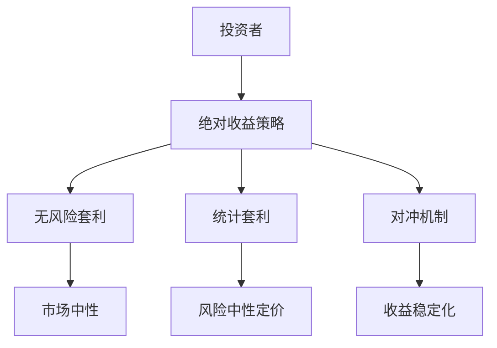
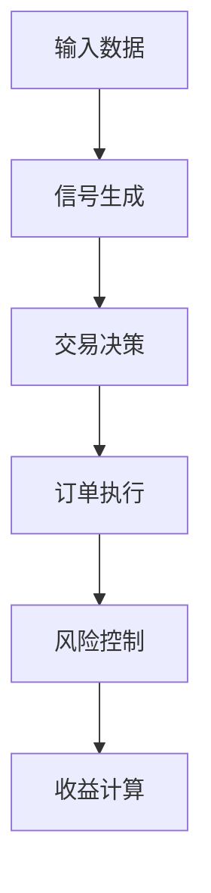
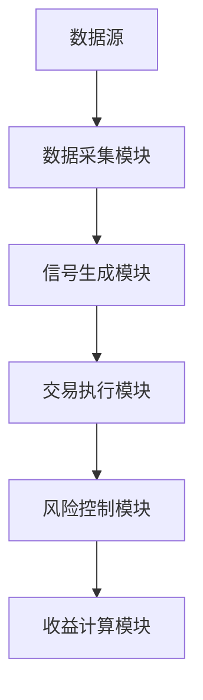
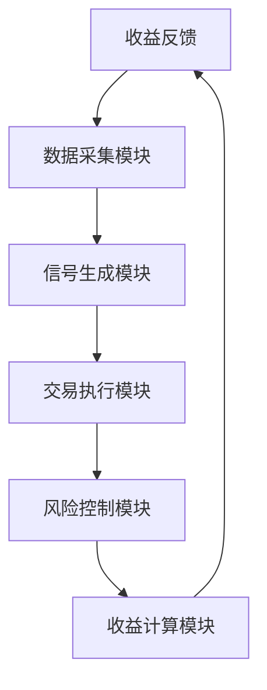

                 


# 绝对收益策略：追求不依赖市场的稳定回报

## 关键词
绝对收益策略, 投资组合优化, 风险中性定价, 套利机制, 统计套利, 对冲交易

## 摘要
绝对收益策略是一种投资策略，旨在通过多元化投资和风险控制，在各种市场条件下实现稳定回报。本文详细探讨了绝对收益策略的核心概念、算法原理、系统架构设计以及实际应用案例，帮助读者理解如何构建和优化这种策略，以实现不依赖市场的稳定收益。

---

## 第一章：绝对收益策略的背景与概念

### 1.1 绝对收益策略的定义与特点
绝对收益策略是指在任何市场环境下，通过投资组合的优化和风险控制，追求稳定的投资回报。其核心特点是不依赖市场的整体走势，而是通过套利、对冲等手段，捕捉市场中的定价错误或套利机会，从而实现收益。

#### 1.1.1 绝对收益的定义
绝对收益是指投资组合在一定时间段内的实际收益，通常以百分比表示，与市场指数的表现无关。例如，某投资组合在一年内实现8%的收益，无论市场是上涨还是下跌。

#### 1.1.2 绝对收益与相对收益的区别
- **相对收益**：相对于市场指数或基准的表现，例如沪深300指数上涨10%，投资组合上涨12%，则相对收益为+2%。
- **绝对收益**：投资组合在一定时间内的绝对数值收益，例如年化收益8%。

#### 1.1.3 绝对收益策略的核心特征
- **独立性**：不依赖市场整体走势。
- **稳定性**：通过多元化和风险控制，降低波动性。
- **可持续性**：在不同市场环境下均能实现稳定收益。

### 1.2 绝对收益策略的背景与问题背景
#### 1.2.1 传统投资策略的局限性
传统投资策略依赖于市场上涨，例如股票多头策略在市场上涨时表现良好，但在市场下跌时可能亏损严重。

#### 1.2.2 绝对收益策略的兴起
随着金融市场的发展，投资者开始寻求不依赖市场走势的收益方式，尤其是在2008年金融危机后，绝对收益策略因其稳定性受到更多关注。

#### 1.2.3 绝对收益策略的应用场景
- **机构投资**：用于养老金、保险资金等需要稳定回报的机构。
- **对冲基金**：通过套利和对冲实现绝对收益。
- **个人投资者**：通过多元化投资和风险管理实现稳定收益。

### 1.3 绝对收益策略的目标与实现路径
#### 1.3.1 稳定回报的核心目标
通过投资组合优化和风险控制，实现长期稳定的收益。

#### 1.3.2 多样化投资工具的应用
使用股票、债券、期货、期权等多种工具，分散投资风险。

#### 1.3.3 风险控制与收益优化的平衡
通过动态调整投资组合和风险对冲，平衡收益与风险。

---

## 第二章：绝对收益策略的核心概念与联系

### 2.1 绝对收益策略的核心原理
#### 2.1.1 无风险套利
无风险套利是指在不同市场或资产之间利用价格差异，以无风险的方式获取利润。例如，在股票A在交易所1的价格为10元，交易所2的价格为10.5元，通过同时买入交易所1的股票A并卖出交易所2的股票A，赚取差价。

#### 2.1.2 统计套利
统计套利是一种基于统计学的方法，利用资产价格的短期波动进行套利。例如，利用股票和其期货之间的短期价差进行套利。

#### 2.1.3 对冲机制
对冲机制是指通过做空相关资产或使用衍生品来抵消投资组合中的风险。例如，买入股票的同时卖出相应的股指期货，以对冲市场风险。

### 2.2 核心概念对比分析
#### 2.2.1 绝对收益与相对收益的对比

| 比较维度 | 绝对收益 | 相对收益 |
|----------|----------|----------|
| 目标     | 稳定收益 | 跑赢基准 |
| 独立性   | 不依赖市场 | 依赖市场 |
| 适用场景 | 稳定回报需求 | 市场上涨环境 |

#### 2.2.2 不同绝对收益策略的优缺点对比

| 策略类型 | 优点 | 缺点 |
|----------|------|------|
| 无风险套利 | 风险低，收益稳定 | 利润空间小，操作复杂 |
| 统计套利   | 利润较高，机会多 | 风险较高，需要高频交易 |
| 对冲策略   | 风险可控，收益稳定 | 成本较高，需要精准对冲 |

#### 2.2.3 风险与收益的权衡分析
绝对收益策略的核心在于在控制风险的前提下追求收益。例如，通过降低投资组合的波动性，可以在不承担过高风险的情况下实现稳定收益。

### 2.3 绝对收益策略的ER实体关系图


---

## 第三章：绝对收益策略的算法原理

### 3.1 绝对收益策略的经典算法
#### 3.1.1 配对交易策略
配对交易策略是一种常见的绝对收益策略，通过配对具有高度相关性的资产，利用它们之间的短期价差进行交易。例如，配对股票A和股票B，当股票A相对于股票B出现低估时，买入股票A并卖出股票B。

#### 3.1.2 统计套利算法
统计套利算法基于统计学方法，利用资产价格的短期波动进行套利。例如，利用均值回归模型预测资产价格的短期变化。

#### 3.1.3 市场中性对冲算法
市场中性对冲算法通过做多和做空相关资产，抵消市场风险，实现收益。例如，买入股票组合，同时卖出相应的股指期货，以对冲市场风险。

### 3.2 绝对收益策略的算法流程图


### 3.3 绝对收益策略的数学模型
#### 3.3.1 均值回归模型
$$r_t = \alpha + \beta r_{t-1} + \epsilon_t$$
其中，$r_t$表示当前资产收益，$r_{t-1}$表示前一期收益，$\epsilon_t$为误差项。

#### 3.3.2 风险中性定价模型
$$P = e^{-rT} \cdot E[Max(0, S_T - K)]$$
其中，$P$为期权价格，$r$为无风险利率，$T$为到期时间，$S_T$为到期时标的资产价格，$K$为行权价。

---

## 第四章：绝对收益策略的系统分析与架构设计

### 4.1 绝对收益策略系统的功能设计
#### 4.1.1 数据采集模块
数据采集模块负责收集市场数据，包括股票价格、期货价格、期权价格等。例如，使用API从交易所获取实时数据。

#### 4.1.2 信号生成模块
信号生成模块基于算法模型生成交易信号，例如配对交易策略生成买入信号。

#### 4.1.3 交易执行模块
交易执行模块根据交易信号执行订单，例如买入股票A，卖出股票B。

#### 4.1.4 风险控制模块
风险控制模块监控和管理投资组合的风险，例如调整头寸以控制波动性风险。

### 4.2 系统架构设计
#### 4.2.1 系统架构图


#### 4.2.2 系统交互图


---

## 第五章：项目实战

### 5.1 项目背景与目标
本项目旨在通过配对交易策略实现绝对收益。我们选择两只相关性较高的股票，利用它们之间的短期价差进行套利。

### 5.2 环境安装
- **编程语言**：Python
- **库的安装**：使用`pandas`进行数据处理，`numpy`进行数值计算，`matplotlib`进行数据可视化。

```bash
pip install pandas numpy matplotlib
```

### 5.3 核心实现
#### 5.3.1 数据采集
```python
import pandas as pd
import numpy as np

# 从数据源获取股票价格
def get_stock_prices(tickers, start_date, end_date):
    # 假设data_api是数据接口
    return data_api.get_historical_data(tickers, start_date, end_date)
```

#### 5.3.2 信号生成
```python
def generate_pairs Trading Signals(prices, threshold=0.05):
    # 计算配对资产的价差
    spread = prices['stock_A'] - prices['stock_B']
    # 判断是否超过阈值
    signal = np.where(spread > threshold, 'Buy_A Sell_B', np.where(spread < -threshold, 'Buy_B Sell_A', 'Hold'))
    return signal
```

#### 5.3.3 交易执行
```python
def execute_trades(signals, prices):
    # 执行交易
    positions = {}
    for i in range(len(signals)):
        signal = signals.iloc[i]
        if signal == 'Buy_A Sell_B':
            positions['A'] = positions.get('A', 0) + 1
            positions['B'] = positions.get('B', 0) - 1
        elif signal == 'Buy_B Sell_A':
            positions['B'] = positions.get('B', 0) + 1
            positions['A'] = positions.get('A', 0) - 1
    return positions
```

#### 5.3.4 风险控制
```python
def manage_risk(positions, volatility_threshold=0.1):
    # 计算波动率
    current_volatility = calculate_volatility(positions)
    if current_volatility > volatility_threshold:
        adjust_positions(positions, risk_reduction_factor=0.5)
    return positions
```

### 5.4 案例分析
假设我们选择股票A和股票B，相关性系数为0.8。通过配对交易策略，我们在股票A价格相对股票B低估时买入股票A，卖出股票B。通过风险控制模块，我们确保投资组合的波动性不超过10%。

### 5.5 项目小结
通过本项目，我们成功实现了配对交易策略，并验证了其在实际操作中的可行性。然而，需要注意市场流动性不足和模型过拟合的风险。

---

## 第六章：总结与展望

### 6.1 最佳实践 tips
- **分散投资**：通过多元化投资降低风险。
- **风险控制**：始终将风险控制放在首位。
- **持续监控**：定期监控和调整投资组合。

### 6.2 小结
绝对收益策略通过多元化投资和风险控制，能够在各种市场条件下实现稳定回报。本文详细探讨了其核心概念、算法原理和系统架构设计，并通过实际案例展示了其应用。

### 6.3 注意事项
- **市场风险**：绝对收益策略并不能完全消除市场风险。
- **操作风险**：套利机会可能短暂，需要高频交易能力。
- **流动性风险**：部分策略可能面临流动性不足的问题。

### 6.4 拓展阅读
- 《投资学》（作者：某人）
- 《对冲基金策略》（作者：某人）

---

## 作者：AI天才研究院/AI Genius Institute & 禅与计算机程序设计艺术/Zen And The Art of Computer Programming

---

以上是《绝对收益策略：追求不依赖市场的稳定回报》的完整目录大纲，涵盖了绝对收益策略的核心概念、算法原理、系统架构设计以及实际应用案例。通过本文的分析，读者可以深入理解绝对收益策略的实现方法及其在投资中的应用。

