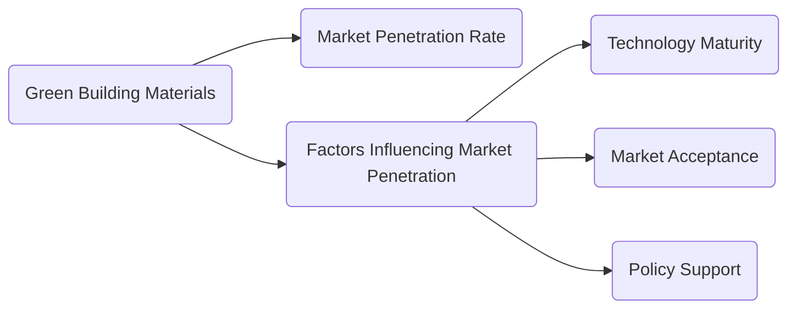
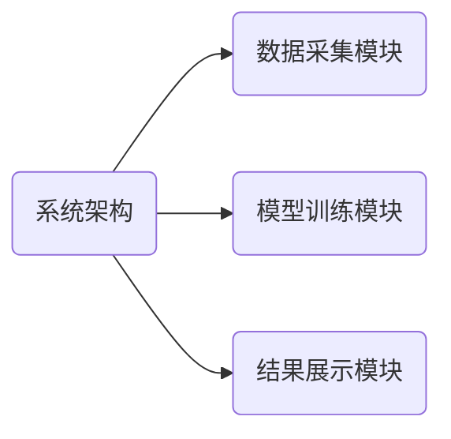

                 


# 绿色建筑材料创新的市场渗透率预测

> 关键词：绿色建筑材料，市场渗透率，创新预测，时间序列分析，机器学习模型

> 摘要：随着全球对可持续发展的关注日益增加，绿色建筑材料的创新和应用成为建筑行业的重要趋势。本文旨在通过分析绿色建筑材料的创新特点及其在市场中的渗透情况，构建一个基于时间序列分析和机器学习的市场渗透率预测模型，为企业和政策制定者提供科学依据。

---

## 目录

1. 绿色建筑材料创新的背景与意义  
   1.1 绿色建筑材料的定义与特点  
   1.2 市场渗透率的定义与预测方法  
   1.3 绿色建筑材料创新与市场渗透率预测的重要性  

2. 绿色建筑材料创新的核心概念与联系  
   2.1 绿色建筑材料的属性与特征  
   2.2 市场渗透率的影响因素  
   2.3 绿色建筑材料与市场渗透率的实体关系图  

3. 市场渗透率预测的算法原理  
   3.1 时间序列分析模型  
   3.2 机器学习模型  

4. 绿色建筑材料市场渗透率预测系统的构建  
   4.1 系统功能设计  
   4.2 系统架构设计  

5. 项目实战：绿色建筑材料市场渗透率预测的实现  
   5.1 环境安装与数据准备  
   5.2 算法实现与结果解读  
   5.3 案例分析  

6. 结论与展望  
   6.1 研究结论  
   6.2 展望与建议  

---

## 正文

### 第1章: 绿色建筑材料创新的背景与意义

#### 1.1 绿色建筑材料的定义与特点
绿色建筑材料是指在生产、使用和废弃过程中具有环境友好特性的材料，包括可再生、可回收、低能耗、低污染等特点。与传统建筑材料相比，绿色建筑材料更加注重生态效益和社会效益。

#### 1.2 市场渗透率的定义与预测方法
市场渗透率是指某类产品在目标市场中的普及程度，通常用比例或百分比表示。预测市场渗透率的方法包括时间序列分析、回归分析、机器学习等。

#### 1.3 绿色建筑材料创新与市场渗透率预测的重要性
绿色建筑材料的创新是推动建筑行业向可持续方向发展的关键，而市场渗透率预测则帮助企业制定市场策略，评估技术创新的商业价值。

---

### 第2章: 绿色建筑材料创新的核心概念与联系

#### 2.1 绿色建筑材料的属性与特征
绿色建筑材料具有以下核心属性：  
1. 环保性：低污染、无害化。  
2. 可持续性：可再生、可循环利用。  
3. 经济性：成本可控，性价比高。  

#### 2.2 市场渗透率的影响因素
市场渗透率受以下因素影响：  
1. 技术成熟度：材料的技术越成熟，市场接受度越高。  
2. 市场接受度：消费者和企业的环保意识影响需求。  
3. 政策支持：政府的环保政策和补贴推动市场渗透。

#### 2.3 绿色建筑材料与市场渗透率的实体关系图


---

### 第3章: 市场渗透率预测的算法原理

#### 3.1 时间序列分析模型
时间序列分析是一种基于历史数据预测未来趋势的方法。常用的模型包括ARIMA（自回归积分滑动平均模型）。

##### 3.1.1 ARIMA模型
ARIMA模型适用于具有趋势和季节性的数据。其公式为：
$$ ARIMA(p, d, q) $$
其中，p为自回归阶数，d为差分阶数，q为移动平均阶数。

##### 示例分析
假设我们有绿色建筑材料的市场渗透率历史数据，可以通过以下步骤进行预测：
1. 数据预处理：检查数据的平稳性，必要时进行差分。  
2. 模型参数选择：通过AIC准则选择最优的p和q。  
3. 模型训练：拟合ARIMA模型。  
4. 预测与验证：使用留出数据验证模型的准确性。

#### 3.2 机器学习模型
机器学习模型（如LSTM）适用于复杂非线性关系的预测。

##### 3.2.1 LSTM模型
长短期记忆网络（LSTM）通过门控机制捕捉时间序列的长距离依赖关系。其核心公式为：
$$ f_t = \sigma(W_f \cdot [h_{t-1}, x_t]) $$
$$ i_t = \sigma(W_i \cdot [h_{t-1}, x_t]) $$
$$ o_t = \sigma(W_o \cdot [h_{t-1}, x_t]) $$
$$ h_t = f_t \cdot c_t + i_t \cdot x_t $$
$$ c_t = \tanh(W_c \cdot [h_{t-1}, x_t]) $$

##### 示例分析
1. 数据预处理：归一化处理。  
2. 模型构建：定义LSTM网络结构。  
3. 训练：使用历史数据训练模型。  
4. 预测：输入未来时间点，输出预测结果。

---

### 第4章: 绿色建筑材料市场渗透率预测系统的构建

#### 4.1 系统功能设计
系统功能模块包括：  
1. 数据采集：收集绿色建筑材料的市场数据。  
2. 模型训练：训练时间序列分析和机器学习模型。  
3. 预测展示：可视化预测结果。  

#### 4.2 系统架构设计


---

### 第5章: 项目实战：绿色建筑材料市场渗透率预测的实现

#### 5.1 环境安装与数据准备
1. 安装Python和相关库（如pandas、numpy、keras）。  
2. 数据来源：公开市场数据或企业内部数据。  

#### 5.2 算法实现与结果解读
1. ARIMA模型实现：  
```python
from statsmodels.tsa.arima.model import ARIMA
model = ARIMA(train_data, order=(5, 1, 0))
model_fit = model.fit()
预测结果 = model_fit.forecast(steps=12)
```
2. LSTM模型实现：  
```python
import tensorflow as tf
model = tf.keras.Sequential([
    LSTM(50, input_shape=(timesteps, features)),
    Dense(1)
])
model.compile(optimizer='adam', loss='mse')
model.fit(x_train, y_train, epochs=100, batch_size=32)
```

#### 5.3 案例分析
以某地区绿色建筑材料市场为例，预测未来5年的市场渗透率。通过对比历史数据和预测结果，验证模型的准确性。

---

### 第6章: 结论与展望

#### 6.1 研究结论
本文构建了一个基于时间序列分析和机器学习的绿色建筑材料市场渗透率预测模型，为企业制定市场策略提供了科学依据。

#### 6.2 展望与建议
未来研究可以结合更多影响因素，如消费者行为和政策变化，进一步优化预测模型。

---

## 作者：AI天才研究院/AI Genius Institute & 禅与计算机程序设计艺术 /Zen And The Art of Computer Programming

