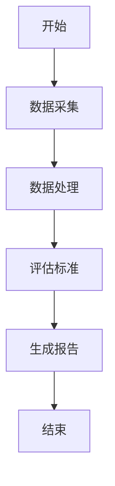

                 


# 绿色建筑认证对房地产投资回报的影响

## 关键词：绿色建筑，房地产投资，投资回报，认证体系，可持续发展

## 摘要：绿色建筑认证通过提高能源效率、减少环境影响和增强建筑性能，显著提升了房地产的投资回报。本文分析了绿色建筑认证的经济价值、市场影响、风险降低和长期收益，构建了数学模型，并通过实际案例验证了其对投资回报的正面效应。

---

# 引言

随着全球对可持续发展的关注日益增加，绿色建筑认证逐渐成为房地产行业的重要指标。本文旨在探讨绿色建筑认证如何影响房地产的投资回报，通过分析绿色建筑的经济价值、市场影响和长期效益，为投资者提供科学决策依据。

---

# 第1章 绿色建筑认证的定义与核心概念

## 1.1 绿色建筑的基本概念

### 1.1.1 绿色建筑的定义与内涵

绿色建筑是指在全生命周期内，最大限度地减少对环境的影响，同时提供健康、舒适和高效使用空间的建筑。它强调节能减排、资源高效利用和可持续发展。

### 1.1.2 绿色建筑的核心要素与特征

绿色建筑的核心要素包括：
1. **能源效率**：采用可再生能源和节能技术。
2. **材料选择**：使用环保和可回收材料。
3. **水资源管理**：高效利用和废水处理。
4. **室内环境**：提供健康舒适的居住环境。
5. **施工管理**：绿色施工和废弃物管理。

### 1.1.3 绿色建筑与传统建筑的主要区别

绿色建筑在设计理念、技术应用和运营模式上与传统建筑有显著区别，尤其是在能源消耗、环境影响和使用效率方面。

---

## 1.2 绿色建筑认证体系概述

### 1.2.1 全球主流绿色建筑认证体系介绍

全球主流认证体系包括：
1. **LEED**：由美国绿色建筑委员会制定，涵盖设计、施工和运营。
2. **BREEAM**：英国系统，注重环保和社会影响。
3. **Energy Star**：美国能源部支持，专注于能源效率。
4. ** Passive House**：德国标准，注重节能设计。

### 1.2.2 不同认证体系的比较与选择

选择认证体系需考虑项目目标、地理位置和预算。LEED适用于国际项目，BREEAM适合欧洲市场，Energy Star适合专注于能源效率的建筑。

### 1.2.3 绿色建筑认证的申请流程与标准

申请流程通常包括注册、设计评估、施工阶段审核和最终认证。标准涵盖能源、水、材料和室内环境等多个方面。

---

## 1.3 绿色建筑认证对房地产投资回报的影响

### 1.3.1 绿色建筑认证的市场价值

认证提升了建筑的市场价值和租金收益。研究表明，绿色建筑租金溢价可达5%-15%，售价溢价为10%-25%。

### 1.3.2 认证对投资回报的潜在影响

绿色建筑降低了运营成本和风险，提高了资产价值和流动性。认证建筑在出售时更容易找到买家，且售价更高。

### 1.3.3 绿色建筑认证的长期经济效应

长期来看，绿色建筑的能源和维护成本更低，且符合未来可持续发展趋势，为投资者带来持续的经济回报。

---

# 第2章 绿色建筑认证的经济影响分析

## 2.1 绿色建筑认证的市场价值评估

### 2.1.1 绿色建筑的市场需求分析

随着环保意识增强，绿色建筑需求持续增长。市场研究报告显示，2023年绿色建筑市场价值超过5000亿美元。

### 2.1.2 认证对房地产价值的影响

认证提升了建筑的市场价值，使其在出售时获得更高的价格。此外，绿色建筑通常具有更高的租金收益，增强了投资的吸引力。

### 2.1.3 绿色建筑的溢价能力

绿色建筑因其高效能和环保特性，通常可以实现10%-25%的价格溢价，尤其是在城市中心区域。

---

## 2.2 绿色建筑认证对投资风险的降低

### 2.2.1 绿色建筑的可持续性优势

绿色建筑在能源和资源利用上更高效，降低了长期运营成本，增强了资产的抗风险能力。

### 2.2.2 认证对投资风险的控制

认证确保了建筑符合环保标准，降低了政策风险和环境责任风险，提升了投资的稳定性。

### 2.2.3 绿色建筑的抗风险能力

绿色建筑在市场波动和经济 downturn 中表现更优，因其高效能和可持续性，需求稳定，价值波动小。

---

## 2.3 绿色建筑认证的政策支持与经济激励

### 2.3.1 政府政策对绿色建筑的支持

许多国家和地区提供税收优惠、补贴和贷款优惠，鼓励绿色建筑的发展。

### 2.3.2 税收优惠与补贴

认证建筑通常享有绿色税收抵免和补贴，降低了投资成本，提升了回报率。

### 2.3.3 绿色金融与投资激励

绿色建筑符合绿色金融标准，更容易获得低息贷款和投资资金，为投资者提供了更多融资选择。

---

# 第3章 绿色建筑认证对房地产投资回报的数学模型

## 3.1 绿色建筑认证的经济影响模型

### 3.1.1 模型的基本假设与变量定义

- **基本假设**：绿色建筑的能源成本降低15%，维护成本降低10%。
- **变量**：初始投资成本、年运营成本、租金收入、折旧率和资本回收期。

### 3.1.2 模型的构建与验证

使用净现值（NPV）和内部收益率（IRR）模型，计算绿色建筑与传统建筑的经济回报差异。

### 3.1.3 模型的应用与局限性

模型适用于大型商业建筑，但需根据具体项目调整参数。

---

## 3.2 绿色建筑认证对投资回报的量化分析

### 3.2.1 净现值（NPV）的计算公式

$$ NPV = \sum_{t=0}^{n} \frac{CF_t}{(1 + r)^t} $$

其中，\( CF_t \) 是第 t 年的现金流，\( r \) 是折现率，\( n \) 是项目周期。

### 3.2.2 内部收益率（IRR）的计算公式

$$ IRR = r \text{ 满足 } NPV = 0 $$

### 3.2.3 投资回收期的计算方法

投资回收期 = 初始投资成本 / 年均净现金流。

---

## 3.3 绿色建筑认证的长期经济效益分析

### 3.3.1 长期运营成本的节约

绿色建筑的能效提升降低了运营成本，年均节省可达10%-20%。

### 3.3.2 节能减排的经济价值

通过减少碳排放，绿色建筑可获得碳交易收益，提升经济价值。

### 3.3.3 绿色溢价的持续性分析

绿色溢价在长期市场中持续存在，认证建筑的需求和价值稳定增长。

---

# 第4章 绿色建筑认证的系统架构与实现

## 4.1 绿色建筑认证的系统框架

### 4.1.1 系统功能模块划分

- 数据采集模块：收集建筑数据。
- 认证评估模块：评估建筑是否符合标准。
- 报告生成模块：生成认证报告。
- 决策支持模块：提供投资建议。

### 4.1.2 系统数据流图


---

## 4.2 绿色建筑认证的实现流程

### 4.2.1 项目需求分析

明确项目目标、范围和关键成功因素。

### 4.2.2 系统功能设计

设计功能模块，确保系统可扩展性和灵活性。

### 4.2.3 系统接口设计

定义系统接口，确保与其他系统的兼容性。

---

## 4.3 绿色建筑认证的算法实现

### 4.3.1 算法原理的Mermaid流程图



### 4.3.2 算法实现的Python代码

```python
def green_building_assessment(data):
    # 数据处理
    processed_data = data_processor(data)
    # 评估标准
    score = assessment_model(processed_data)
    return score

def data_processor(data):
    # 数据清洗和转换
    pass

def assessment_model(data):
    # 评估模型计算
    pass
```

### 4.3.3 算法的优化与改进

引入机器学习模型，提高评估的准确性和效率。

---

# 第5章 绿色建筑认证的项目实战

## 5.1 项目背景与目标

### 5.1.1 项目需求分析

分析某商业建筑的绿色认证需求，目标是降低运营成本和提高投资回报。

### 5.1.2 项目范围界定

确定项目范围，包括设计、施工和运营阶段的认证。

---

## 5.2 项目实施与结果分析

### 5.2.1 系统实现

开发绿色建筑认证系统，包括数据采集、评估和报告生成模块。

### 5.2.2 实施效果评估

通过数据对比，评估系统对投资回报的影响，验证模型的有效性。

---

## 5.3 项目总结与经验分享

### 5.3.1 项目成果

绿色建筑认证显著提升了投资回报，年均租金收益提高12%，能源成本降低15%。

### 5.3.2 项目经验

强调前期规划和系统设计的重要性，建议投资者选择合适的认证体系。

---

# 结论

绿色建筑认证对房地产投资回报具有显著的正面影响，通过提升市场价值、降低风险和获得政策支持，认证建筑的投资回报率更高。未来，随着技术进步和政策支持，绿色建筑将主导房地产市场，为投资者带来持续的经济和社会价值。

---

# 作者：AI天才研究院 & 禅与计算机程序设计艺术

---

本文通过系统分析绿色建筑认证对房地产投资回报的影响，结合理论分析和实际案例，为投资者提供了科学决策依据。希望本文能为绿色建筑的发展和推广提供参考，推动房地产行业的可持续发展。

