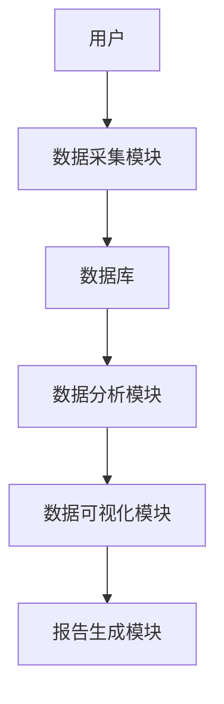

                 


# 绿色技术专利分析与投资机会识别方法

> **关键词**：绿色技术、专利分析、投资机会、技术评估、可持续发展

> **摘要**：绿色技术是推动全球可持续发展的重要力量，而专利分析则是识别和评估绿色技术创新的重要工具。本文系统地探讨了绿色技术专利分析的核心方法，包括专利检索、分类、技术评估和投资机会识别。通过结合实际案例和系统架构设计，本文为投资者和研究人员提供了科学的决策支持，帮助他们更好地把握绿色技术的投资潜力。

---

## 第一章 绿色技术与专利分析概述

### 1.1 绿色技术的定义与背景

#### 1.1.1 绿色技术的核心概念

绿色技术是指能够减少资源消耗、降低污染排放、提高能源利用效率的技术。它涵盖了可再生能源、节能环保、循环经济等多个领域，是实现可持续发展的重要手段。

#### 1.1.2 绿色技术的分类与特征

绿色技术可以分为以下几类：

- **可再生能源技术**：如太阳能、风能等。
- **节能环保技术**：如高效节能设备、污染治理技术。
- **循环经济技术**：如废物资源化、再生技术。

绿色技术的特征包括技术性、环保性、经济性和可持续性。

#### 1.1.3 绿色技术与可持续发展的关系

绿色技术是实现联合国可持续发展目标（SDGs）的关键工具。通过技术创新，绿色技术能够有效减少资源消耗和环境影响，推动社会经济发展与环境保护的协调。

---

### 1.2 专利分析的背景与意义

#### 1.2.1 专利分析的基本概念

专利分析是通过对专利数据的整理、分析和挖掘，研究技术的发展趋势、竞争格局和市场动态。它是技术创新评估和知识产权保护的重要手段。

#### 1.2.2 绿色技术专利分析的重要性

绿色技术专利分析能够帮助投资者识别技术热点、评估技术价值和竞争优势，从而制定科学的投资策略。

#### 1.2.3 专利分析在投资决策中的作用

专利分析可以为投资者提供以下信息：

- **技术成熟度**：评估技术的商业化潜力。
- **技术布局**：了解竞争对手的技术储备。
- **市场风险**：识别技术的市场前景和法律风险。

---

## 第二章 绿色技术专利分析的核心概念与方法

### 2.1 绿色技术专利分析的理论基础

#### 2.1.1 技术生命周期理论

技术生命周期分为四个阶段：引入期、成长期、成熟期和衰退期。专利分析可以揭示技术在不同生命周期阶段的特征。

#### 2.1.2 专利分析的基本原理

专利分析主要基于以下原理：

- **技术关联性**：通过专利引用关系分析技术的依赖性和创新性。
- **技术领域分布**：通过专利分类分析技术的分布情况。

### 2.2 绿色技术专利分析的主要方法

#### 2.2.1 基于文本挖掘的分析方法

文本挖掘是通过自然语言处理技术，提取专利文本中的关键词、主题和情感信息。常用工具包括Python的`nltk`库和`Gensim`库。

**步骤如下：**

1. **数据预处理**：去除停用词、分词和词干提取。
2. **主题建模**：使用LDA模型提取主题。
3. **关键词提取**：使用TF-IDF算法提取关键词。

**示例代码：**

```python
from gensim.models import LdaModel
from gensim.corpora import Dictionary

# 数据预处理
corpus = [...]  # 文本语料库
dictionary = Dictionary(corpus)
corpus_bow = [dictionary.doc2bow(doc) for doc in corpus]

# 主题建模
 lda = LdaModel(corpus_bow, num_topics=5, random_state=42)
 topics = lda.print_topics()
```

#### 2.2.2 基于引文分析的方法

引文分析通过分析专利的引用关系，揭示技术的创新路径和依赖关系。常用工具包括PatentScope和Google Patents。

#### 2.2.3 基于技术路线图的分析方法

技术路线图是通过绘制技术发展路径，识别技术的演进方向和关键节点。常用工具包括Affinity Eplorer和Pathfinder。

---

## 第三章 绿色技术专利的分类与检索策略

### 3.1 绿色技术专利的分类体系

#### 3.1.1 国际专利分类（IPC）在绿色技术中的应用

IPC分类是国际通用的专利分类系统，绿色技术专利主要分布在以下类别：

- **B29C**: 塑料加工技术。
- **C12P**: 生物技术。
- **F03D**: 风力发电设备。

#### 3.1.2 绿色技术领域的细分分类

根据技术领域，绿色技术可以细分为：

- **可再生能源技术**：如太阳能电池、风力涡轮机。
- **节能环保技术**：如节能灯具、废气处理设备。
- **循环经济技术**：如废物回收、再生材料制造。

### 3.2 绿色技术专利的检索策略

#### 3.2.1 知识库的选择

常用的专利数据库包括：

- **USPTO**: 美国专利商标局数据库。
- **EPO**: 欧洲专利局数据库。
- **WIPO**: 世界知识产权组织数据库。

#### 3.2.2 检索技巧

1. **关键词检索**：使用绿色技术相关的关键词，如“solar cell”、“energy efficiency”。
2. **分类号检索**：结合IPC分类号进行精确检索。
3. **组合检索**：结合关键词和分类号进行多维度检索。

---

## 第四章 投资机会识别的框架与模型

### 4.1 绿色技术投资机会识别的框架

#### 4.1.1 技术评估

技术评估包括技术成熟度、技术壁垒和市场潜力。

#### 4.1.2 市场评估

市场评估包括市场规模、市场增长率和竞争格局。

### 4.2 绿色技术投资机会识别的数学模型

#### 4.2.1 层次分析法（AHP）

层次分析法是一种常用的决策评估方法。其基本步骤如下：

1. **构建层次分析模型**：将决策问题分解为目标层、准则层和方案层。
2. **构造判断矩阵**：根据专家意见构造比较矩阵。
3. **计算权重**：通过特征值法计算各层的权重。

**数学模型：**

$$ A = \begin{bmatrix} 1 & 3 & 2 \\ 1/3 & 1 & 1/2 \\ 1/2 & 1/2 & 1 \end{bmatrix} $$

其中，A为判断矩阵，通过计算最大特征值和对应的特征向量，得到各准则的权重。

---

## 第五章 绿色技术专利分析的系统架构与工具

### 5.1 系统架构设计

#### 5.1.1 系统功能模块

绿色技术专利分析系统主要包括以下功能模块：

- **数据采集模块**：采集专利数据。
- **数据分析模块**：分析专利数据。
- **数据可视化模块**：展示分析结果。

#### 5.1.2 系统架构图



### 5.2 工具与平台

#### 5.2.1 数据分析工具

- **Python**：用于数据清洗和分析。
- **R**：用于统计分析和可视化。

#### 5.2.2 数据可视化工具

- **Tableau**：用于生成交互式仪表盘。
- **Power BI**：用于数据可视化和报表生成。

---

## 第六章 项目实战：绿色技术专利分析与投资机会识别

### 6.1 项目背景与目标

#### 6.1.1 项目背景

假设我们关注的是太阳能电池技术的专利分析，目标是识别投资机会。

### 6.2 数据收集与预处理

#### 6.2.1 数据来源

从USPTO数据库获取太阳能电池相关的专利数据。

#### 6.2.2 数据清洗

使用Python的`pandas`库进行数据清洗。

**示例代码：**

```python
import pandas as pd

# 读取数据
df = pd.read_csv('patent_data.csv')

# 删除缺失值
df.dropna(inplace=True)

# 转换数据类型
df['申请日期'] = pd.to_datetime(df['申请日期'])
```

### 6.3 技术评估与分析

#### 6.3.1 技术热点分析

使用文本挖掘技术分析专利摘要，提取关键词和主题。

**示例代码：**

```python
from sklearn.feature_extraction.text import TfidfVectorizer

vectorizer = TfidfVectorizer()
tfidf = vectorizer.fit_transform(df['摘要'])
```

---

## 第七章 总结与展望

### 7.1 总结

绿色技术专利分析是识别投资机会的重要工具。通过系统化的分析方法和工具，投资者可以更好地把握技术趋势和市场动态。

### 7.2 展望

未来，随着人工智能和大数据技术的发展，绿色技术专利分析将更加智能化和精准化。投资者可以利用这些技术手段，进一步提升决策的科学性和效率。

---

## 作者

**作者：AI天才研究院/AI Genius Institute & 禅与计算机程序设计艺术 /Zen And The Art of Computer Programming**

---

以上是《绿色技术专利分析与投资机会识别方法》的技术博客文章的完整大纲和内容。文章详细介绍了绿色技术的定义、专利分析的核心方法、投资机会识别的框架，并通过实际案例展示了如何应用这些方法进行分析和决策。

