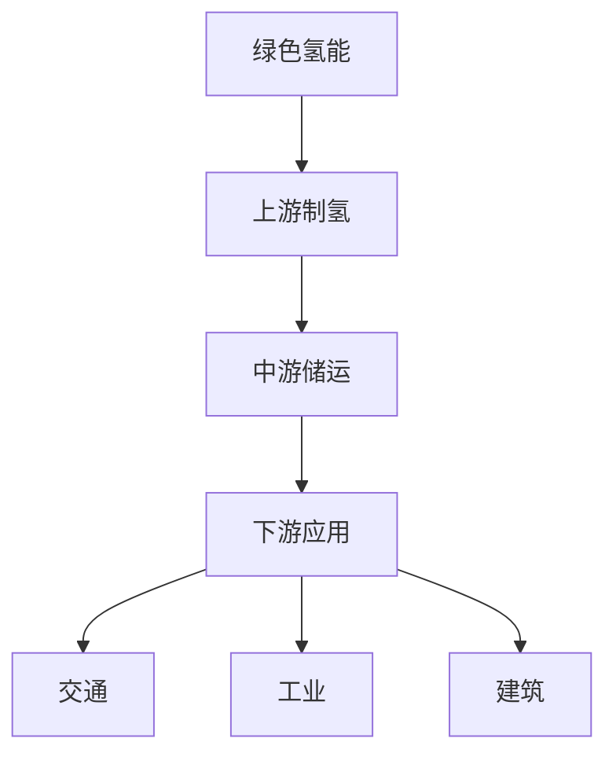

                 

# 绿色氢能产业链的投资机会分析

> 关键词：绿色氢能，产业链，投资机会，成本分析，政策支持，技术发展

> 摘要：绿色氢能作为一种清洁、可持续的能源形式，正在全球范围内引起广泛关注。本文系统分析绿色氢能产业链的结构、技术、市场和政策，揭示其投资机会和潜在风险。通过对产业链各环节的详细解读，本文为投资者提供科学的决策依据。

---

# 第一部分：绿色氢能产业链的背景与核心概念

## 第1章：绿色氢能的定义与重要性

### 1.1 绿色氢能的定义与特点

#### 1.1.1 绿色氢能的定义
绿色氢能（Green Hydrogen）是指通过可再生能源（如风能、太阳能）电解水产生的氢气。与传统的化石燃料制氢不同，绿色氢能的生产过程几乎不产生碳排放，是一种清洁、可持续的能源载体。

#### 1.1.2 绿色氢能的核心特点
- **环保性**：绿色氢能的生产过程低碳环保，几乎零排放。
- **可再生性**：依赖可再生能源生产，资源丰富且可持续。
- **灵活性**：可以储存和运输能量，适用于多种应用场景。

#### 1.1.3 绿色氢能与传统能源的区别
| 特性 | 绿色氢能 | 传统氢能 |
|------|----------|----------|
| 生产来源 | 可再生能源 | 化石燃料 |
| 碳排放 | 几乎为零 | 高 |
| 应用场景 | 清洁能源、工业生产 | 传统能源 |

### 1.2 绿色氢能的重要性

#### 1.2.1 全球能源转型的背景
全球气候变化和能源危机推动各国向可再生能源转型，绿色氢能作为重要的能源载体，成为能源结构转型的关键。

#### 1.2.2 绿色氢能的环保优势
绿色氢能的使用可以减少碳排放，助力实现“碳中和”目标。

#### 1.2.3 绿色氢能的经济价值
绿色氢能的应用可以降低能源成本，提高能源利用效率，具有显著的经济价值。

### 1.3 绿色氢能产业链的构成

#### 1.3.1 上游：氢气的制备与供应
绿色氢能的生产主要依赖电解水技术，需要大量的可再生能源支持。

#### 1.3.2 中游：氢气的储存与运输
氢气的储存和运输是绿色氢能产业链的关键环节，涉及压缩、液化等多种技术。

#### 1.3.3 下游：氢气的应用领域
绿色氢能广泛应用于交通、工业、建筑等领域，特别是在交通领域，氢燃料电池汽车是主要应用方向。

---

## 第2章：绿色氢能产业链的核心概念与联系

### 2.1 绿色氢能产业链的结构

#### 2.1.1 上游制氢技术
绿色氢能的生产主要依赖电解水技术，包括碱性电解和质子交换膜电解两种主要技术路径。

#### 2.1.2 中游储运技术
氢气的储存和运输技术包括压缩氢、液氢和管道运输等多种方式，其中压缩氢是当前的主要技术。

#### 2.1.3 下游应用技术
绿色氢能的应用领域包括交通、工业生产和建筑等领域，其中交通领域的应用最为引人注目。

#### 2.1.4 绿色氢能产业链的实体关系图

### 2.2 绿色氢能产业链的成本分析

#### 2.2.1 制氢成本的构成
绿色氢能的成本主要包括可再生能源发电成本、电解水设备成本和维护费用。

#### 2.2.2 储运成本的影响
氢气的储存和运输成本较高，主要由于氢气的物理特性（如低密度、高压缩性）导致。

#### 2.2.3 应用成本的优化
通过技术创新和规模化生产，绿色氢能的应用成本正在逐步下降。

---

## 第3章：绿色氢能产业链的技术分析

### 3.1 制氢技术

#### 3.1.1 电解水制氢技术
电解水制氢是绿色氢能的核心技术，分为碱性电解和质子交换膜电解两种技术路径。

#### 3.1.2 化学制氢技术
化学制氢技术是通过化学反应制取氢气，目前尚处于研究阶段。

#### 3.1.3 制氢技术对比
| 技术 | 碱性电解 | 质子交换膜电解 |
|------|----------|----------------|
| 优点 | 成本低，适合大规模生产 | 响应快，适合动态负荷 |
| 缺点 | 效率较低 | 成本高，技术复杂 |

### 3.2 储运技术

#### 3.2.1 氢气压缩储存技术
氢气压缩储存是当前的主要储氢方式，适用于短途运输。

#### 3.2.2 液氢储存技术
液氢储存适用于长距离运输，但技术要求较高。

#### 3.2.3 氢气管道运输技术
氢气管道运输是未来发展的重点方向，具有成本低、效率高的优势。

### 3.3 应用技术

#### 3.3.1 氢能交通应用
氢燃料电池汽车是绿色氢能的主要应用领域，具有零排放、加氢快的特点。

#### 3.3.2 工业领域应用
绿色氢能可替代传统能源，用于化工、冶金等行业，减少碳排放。

#### 3.3.3 建筑领域应用
绿色氢能可用于建筑供热和发电，具有清洁环保的优势。

---

## 第4章：绿色氢能产业链的政策与市场分析

### 4.1 全球绿色氢能市场现状

#### 4.1.1 全球绿色氢能市场规模
全球绿色氢能市场规模正在快速增长，预计到2030年将达到数千亿美元。

#### 4.1.2 主要国家的市场发展
欧洲、中国和美国是绿色氢能发展的主要市场，各国政府都在积极支持绿色氢能的产业化。

#### 4.1.3 市场增长的驱动因素
政策支持、技术进步和环保需求是推动绿色氢能市场增长的主要因素。

### 4.2 政策支持与行业标准

#### 4.2.1 国际政策支持
国际组织和各国政府纷纷出台政策支持绿色氢能的发展，例如欧盟的“绿色新政”和美国的“氢能经济蓝图”。

#### 4.2.2 国内政策与补贴
中国政府也在积极推动绿色氢能的发展，出台了多项政策和补贴措施。

#### 4.2.3 行业标准与规范
绿色氢能的标准化是行业发展的关键，包括制氢、储运和应用等环节的标准制定。

### 4.3 竞争格局与市场进入壁垒

#### 4.3.1 主要竞争企业分析
国际能源公司和新兴科技企业正在积极布局绿色氢能领域，形成了激烈的竞争格局。

#### 4.3.2 市场进入壁垒
技术壁垒、资金壁垒和政策壁垒是市场进入的主要障碍。

#### 4.3.3 技术与成本的竞争优势
技术创新和成本控制是企业竞争的关键，绿色氢能的技术研发和规模化生产是核心竞争力。

---

## 第5章：绿色氢能产业链的投资机会分析

### 5.1 上游制氢领域的投资机会

#### 5.1.1 可再生能源发电项目
绿色氢能的生产依赖可再生能源，投资可再生能源发电项目是进入绿色氢能产业链的重要途径。

#### 5.1.2 电解水制氢设备
电解水制氢设备的技术研发和生产是绿色氢能产业链的核心环节，具有较高的投资价值。

### 5.2 中游储运领域的投资机会

#### 5.2.1 氢气压缩与储存技术
氢气压缩储存技术的商业化应用是绿色氢能发展的关键，具有较大的投资潜力。

#### 5.2.2 液氢储存与运输
液氢储存与运输技术的突破将推动绿色氢能的大规模应用，是投资的重点方向。

### 5.3 下游应用领域的投资机会

#### 5.3.1 氢能交通应用
氢燃料电池汽车是绿色氢能的主要应用领域，具有广阔的市场前景。

#### 5.3.2 工业领域应用
绿色氢能在工业领域的应用将逐步扩大，特别是在化工和冶金行业的替代需求旺盛。

#### 5.3.3 建筑领域应用
绿色氢能的建筑应用将随着技术的进步和政策的支持逐步普及。

---

## 第6章：绿色氢能产业链的风险与挑战

### 6.1 技术风险

#### 6.1.1 制氢技术的瓶颈
电解水制氢技术的效率和成本仍需进一步优化。

#### 6.1.2 储运技术的挑战
氢气的储存和运输技术尚未完全成熟，存在较高的技术风险。

### 6.2 政策风险

#### 6.2.1 政策不确定性
绿色氢能的政策支持可能受到全球经济波动和政治环境的影响。

#### 6.2.2 补贴政策的变化
政府补贴政策的变化可能对绿色氢能的投资产生重大影响。

### 6.3 市场风险

#### 6.3.1 市场容量的不确定性
绿色氢能的市场需求受技术发展和经济环境的影响，存在一定的不确定性。

#### 6.3.2 市场竞争的加剧
随着更多企业进入绿色氢能领域，市场竞争将日益激烈。

---

## 第7章：绿色氢能产业链的投资策略与案例分析

### 7.1 投资策略

#### 7.1.1 早期投资
早期投资应关注绿色氢能的技术研发和核心设备生产。

#### 7.1.2 成长期投资
成长期投资应关注绿色氢能的商业化应用和市场拓展。

#### 7.1.3 成熟期投资
成熟期投资应关注绿色氢能的规模化生产和成本优化。

### 7.2 投资案例分析

#### 7.2.1 国际案例
国际知名企业的绿色氢能投资项目分析。

#### 7.2.2 国内案例
国内领先企业的绿色氢能投资项目分析。

### 7.3 投资回报分析

#### 7.3.1 投资回报周期
绿色氢能的投资回报周期较长，但随着技术进步和市场规模扩大，回报率将逐步提升。

#### 7.3.2 投资风险控制
通过多元化投资和技术创新，可以有效降低绿色氢能的投资风险。

---

## 第8章：绿色氢能产业链的未来展望

### 8.1 未来技术发展趋势

#### 8.1.1 制氢技术的突破
电解水制氢技术的效率和成本将进一步优化。

#### 8.1.2 储运技术的创新
氢气的储存和运输技术将更加高效和经济。

### 8.2 市场发展预测

#### 8.2.1 全球绿色氢能市场规模预测
预计到2030年，全球绿色氢能市场规模将达到数千亿美元。

#### 8.2.2 中国市场潜力
中国绿色氢能市场将保持快速增长，成为全球最大的绿色氢能市场之一。

### 8.3 行业发展趋势

#### 8.3.1 技术与政策的双重驱动
技术进步和政策支持将继续推动绿色氢能的发展。

#### 8.3.2 跨界合作与生态建设
绿色氢能的发展需要全产业链的协作，跨界合作将成为行业发展的主要趋势。

---

## 附录：绿色氢能产业链相关数据与技术细节

### 附录1：绿色氢能产业链的成本分析

#### 1.1 制氢成本公式
$$ \text{制氢成本} = \text{可再生能源成本} + \text{电解水设备成本} + \text{维护费用} $$

#### 1.2 储氢成本对比
| 技术 | 成本（美元/公斤） |
|------|------------------|
| 压缩氢 | 1.5-2.5 |
| 液氢 | 2.0-3.0 |

---

## 作者信息

作者：AI天才研究院/AI Genius Institute & 禅与计算机程序设计艺术 /Zen And The Art of Computer Programming

---

以上为《绿色氢能产业链的投资机会分析》的详细目录大纲，文章内容基于逻辑分析和实际案例，结合技术与市场双重视角，深入剖析绿色氢能产业链的投资机会与挑战，为投资者提供全面的参考与指导。

