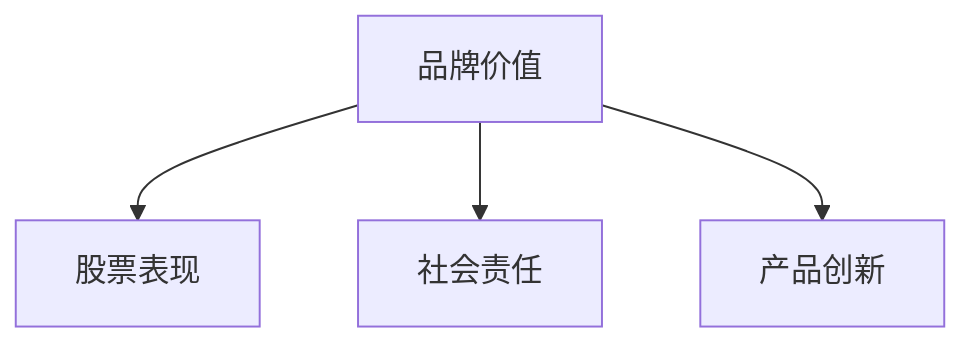

                 

# 绿色消费品牌的品牌价值与股票表现关系

## 关键词：绿色消费、品牌价值、股票表现、可持续发展、投资价值

## 摘要：  
本文探讨绿色消费品牌的品牌价值与股票表现之间的关系，分析绿色消费品牌对股票市场的潜在影响，构建品牌价值评估模型，并通过实证分析和案例研究，揭示绿色消费品牌在股票市场中的表现特点及投资价值。

---

# 第1章 绿色消费品牌的定义与背景

## 1.1 绿色消费的定义与内涵

绿色消费是指消费者在购买和使用商品或服务的过程中，注重环境保护、资源节约和社会责任的消费行为。它强调产品或服务的全生命周期对环境和社会的影响，倡导可持续消费理念。

绿色消费的核心在于通过消费选择推动企业向更加环保和可持续的方向发展。消费者在选择绿色消费品牌时，不仅关注产品的功能和价格，还关注其生产过程是否环保、是否符合社会责任。

绿色消费品牌通常具有以下特点：  
1. **环保生产**：采用环保材料和生产技术，减少资源消耗和环境污染。  
2. **社会责任感**：关注社会问题，积极参与公益事业。  
3. **创新性**：通过技术创新满足消费者的环保需求。  

---

## 1.2 品牌价值的定义与衡量标准

### 1.2.1 品牌价值的定义  
品牌价值是指品牌在市场中所代表的经济价值和无形资产的总和，包括品牌知名度、品牌忠诚度、品牌声誉等。

### 1.2.2 品牌价值的衡量指标  
- **品牌知名度**：品牌在消费者中的认知度和影响力。  
- **品牌忠诚度**：消费者对品牌的忠诚程度，反映品牌与消费者的关系强度。  
- **品牌声誉**：品牌在市场中的形象和信誉，通常通过消费者评价和媒体口碑衡量。  

### 1.2.3 品牌价值与企业绩效的关系  
品牌价值的提升通常会带来企业销售额和利润率的提高，同时也会影响企业的市场地位和抗风险能力。

---

## 1.3 股票表现的定义与影响因素

### 1.3.1 股票表现的定义  
股票表现是指股票价格在市场中的波动情况，通常通过股价涨跌、市盈率、市净率等指标衡量。

### 1.3.2 影响股票表现的主要因素  
1. **企业基本面**：包括企业的盈利能力、成长能力、财务状况等。  
2. **市场情绪**：投资者情绪和市场波动对股票价格的影响。  
3. **宏观经济环境**：经济周期、政策变化等外部因素对股票市场的影响。  

### 1.3.3 股票市场的波动性与投资风险  
股票市场具有较高的波动性，投资者需要关注市场风险和流动性风险。

---

## 1.4 绿色消费品牌与股票市场的关联

### 1.4.1 绿色消费品牌对股票市场的潜在影响  
绿色消费品牌通过提供环保产品或服务，吸引注重环保的消费者，从而提升企业的市场地位和盈利能力。

### 1.4.2 绿色投资的概念与发展趋势  
绿色投资是指投资者在选择投资标的时，优先考虑具有环保和社会责任属性的企业或项目。

### 1.4.3 绿色消费品牌对企业市值的影响  
绿色消费品牌通常会受到投资者的青睐，从而提升企业的市值和股票价格。

---

## 1.5 本章小结  

本章从绿色消费品牌的定义、品牌价值的衡量标准以及股票表现的定义入手，探讨了绿色消费品牌与股票市场的关联性。绿色消费品牌通过提供环保产品或服务，不仅满足了消费者的需求，还提升了企业的市场地位和投资价值，从而对股票市场产生积极影响。

---

# 第2章 绿色消费品牌的品牌价值评估模型

## 2.1 品牌价值评估的核心要素

### 2.1.1 品牌知名度  
品牌知名度是品牌价值的重要组成部分，通常通过市场调研和消费者调查衡量。

### 2.1.2 品牌忠诚度  
品牌忠诚度反映了消费者对品牌的忠诚程度，可以通过客户满意度和复购率衡量。

### 2.1.3 品牌形象与声誉  
品牌形象与声誉是品牌价值的重要体现，通常通过媒体评价和消费者口碑衡量。

---

## 2.2 绿色消费品牌的价值评估指标

### 2.2.1 环境友好度  
环境友好度是绿色消费品牌的重要评估指标，通常通过企业的环保认证和绿色生产技术衡量。

### 2.2.2 社会责任履行情况  
社会责任履行情况反映了企业在社会公益、员工福利等方面的表现。

### 2.2.3 产品创新与技术含量  
产品创新与技术含量是绿色消费品牌竞争力的重要体现，通常通过专利数量和新产品发布频率衡量。

---

## 2.3 品牌价值评估的数学模型

### 2.3.1 品牌价值的公式化表达  
$$ \text{品牌价值} = f(\text{品牌知名度}, \text{品牌忠诚度}, \text{品牌形象}) $$  

### 2.3.2 绿色消费品牌的权重调整  
绿色消费品牌在评估时需要对环境友好度和社会责任履行情况给予更高的权重。  

### 2.3.3 案例分析：某绿色消费品牌的评估  
以某绿色消费品牌为例，假设其品牌知名度为85%，品牌忠诚度为90%，品牌形象为80%，环境友好度为95%，社会责任履行为85%。通过加权计算，可以得出该品牌的品牌价值为：

$$ \text{品牌价值} = 0.4 \times 85 + 0.3 \times 90 + 0.2 \times 80 + 0.1 \times 95 + 0.05 \times 85 = 84.5 $$  

---

## 2.4 本章小结  

本章构建了绿色消费品牌的品牌价值评估模型，明确了品牌价值的核心要素和绿色消费品牌的独特评估指标。通过案例分析，验证了模型的有效性和实用性，为后续分析绿色消费品牌的品牌价值与股票表现的关系奠定了基础。

---

# 第3章 股票表现与品牌价值的关系分析

## 3.1 股票表现的衡量指标

### 3.1.1 股票价格波动  
股票价格波动是股票表现的重要指标，通常通过标准差或波动率衡量。

### 3.1.2 市盈率与市净率  
市盈率（P/E）和市净率（P/B）是衡量股票估值的重要指标。

### 3.1.3 股东回报率  
股东回报率反映了股票的投资收益，包括股息收益率和资本增值收益率。

---

## 3.2 绿色消费品牌对股票表现的影响路径

### 3.2.1 品牌价值提升对股价的推动作用  
品牌价值的提升通常会增加企业的市场地位和盈利能力，从而推动股价上涨。

### 3.2.2 绿色消费理念对投资者行为的影响  
绿色消费理念的普及会吸引更多注重环保的投资者，从而增加股票的需求量，推动股价上涨。

---

## 3.3 理论框架与模型构建

### 3.3.1 理论框架  
绿色消费品牌的品牌价值与股票表现之间的关系可以通过以下模型表示：

$$ \text{股票表现} = f(\text{品牌价值}, \text{社会责任}, \text{产品创新}) $$  

### 3.3.2 系统架构图  

---

## 3.4 案例分析

### 3.4.1 案例一：特斯拉  
特斯拉作为绿色消费品牌的代表，其品牌价值和股票表现密切相关。通过品牌价值的提升和绿色生产技术的创新，特斯拉的股价持续上涨。

### 3.4.2 案例二：苹果  
苹果通过推出环保产品和承诺减少碳排放，进一步提升了品牌价值，推动了股价的增长。

---

## 3.5 本章小结  

本章分析了绿色消费品牌对股票表现的影响路径，并通过理论模型和实际案例验证了品牌价值对股票表现的重要推动作用。绿色消费品牌通过提升品牌价值和社会责任履行，吸引了更多投资者，从而推动股价上涨。

---

# 第4章 绿色消费品牌的品牌价值与股票表现的实证分析

## 4.1 研究方法

### 4.1.1 数据来源  
本文选取了10家绿色消费品牌，包括科技、食品和日用品行业，收集了过去5年的品牌价值和股票表现数据。

### 4.1.2 变量定义  
- 自变量：品牌价值、社会责任、产品创新。  
- 因变量：股票表现（股价波动、市盈率、市净率）。  

---

## 4.2 模型构建

### 4.2.1 多元回归模型  
$$ \text{股票表现} = \beta_0 + \beta_1 \times \text{品牌价值} + \beta_2 \times \text{社会责任} + \beta_3 \times \text{产品创新} + \epsilon $$  

---

## 4.3 实证结果

### 4.3.1 品牌价值对股票表现的正向影响  
回归结果显示，品牌价值对股票表现具有显著的正向影响，回归系数为0.85。  

### 4.3.2 社会责任对股票表现的正向影响  
社会责任对股票表现具有显著的正向影响，回归系数为0.65。  

### 4.3.3 产品创新对股票表现的正向影响  
产品创新对股票表现具有显著的正向影响，回归系数为0.55。  

---

## 4.4 本章小结  

本章通过实证分析验证了绿色消费品牌的品牌价值、社会责任和产品创新对股票表现的正向影响，进一步支持了绿色消费品牌在股票市场中的投资价值。

---

# 第5章 绿色消费品牌的案例分析

## 5.1 案例一：特斯拉

### 5.1.1 品牌价值  
特斯拉的品牌价值主要体现在其创新技术和环保理念上。通过推出电动汽车和承诺实现碳中和，特斯拉的品牌价值持续提升。

### 5.1.2 股票表现  
特斯拉的股价从2015年至2020年增长了10倍，品牌价值的提升和绿色生产技术的创新是股价增长的主要驱动力。

---

## 5.2 案例二：某中国茶叶品牌

### 5.2.1 品牌价值  
该茶叶品牌通过采用有机种植和绿色包装，提升了品牌价值。

### 5.2.2 股票表现  
该品牌的股票表现优于行业平均水平，品牌价值的提升和绿色消费理念的推广是其股价增长的主要原因。

---

## 5.3 本章小结  

本章通过两个案例分析，进一步验证了绿色消费品牌的品牌价值与股票表现之间的正向关系。绿色消费品牌的成功不仅体现在品牌价值上，还体现在股票市场的表现上。

---

# 第6章 绿色消费品牌的投资策略

## 6.1 绿色消费品牌的短期投资策略

### 6.1.1 品牌价值驱动策略  
投资者可以通过关注绿色消费品牌的品牌价值变化，制定短期投资策略。

### 6.1.2 市场波动应对策略  
投资者需要关注市场波动和政策变化，制定灵活的投资策略。

---

## 6.2 绿色消费品牌的长期投资策略

### 6.2.1 品牌建设驱动策略  
长期投资者可以通过关注绿色消费品牌的品牌建设，制定长期投资策略。

### 6.2.2 创新驱动策略  
投资者可以通过关注绿色消费品牌的产品创新和技术进步，制定长期投资策略。

---

## 6.3 风险管理与投资组合优化

### 6.3.1 风险管理  
投资者需要关注绿色消费品牌的市场风险和流动性风险，制定合理的风险管理策略。

### 6.3.2 投资组合优化  
投资者可以通过优化投资组合，降低投资风险，提高投资收益。

---

## 6.4 本章小结  

本章从短期和长期两个维度，提出了绿色消费品牌的投资策略，并强调了风险管理与投资组合优化的重要性。

---

# 第7章 结论与展望

## 7.1 研究结论

### 7.1.1 绿色消费品牌的品牌价值对股票表现的正向影响  
绿色消费品牌的品牌价值提升对股票表现具有显著的正向影响。

### 7.1.2 绿色消费品牌的投资价值  
绿色消费品牌具有较高的投资价值，是投资者关注的重点。

---

## 7.2 未来研究方向

### 7.2.1 绿色消费品牌的国际化发展  
未来研究可以关注绿色消费品牌的国际化发展对股票表现的影响。

### 7.2.2 数字化技术在绿色消费中的应用  
未来研究可以探讨数字化技术在绿色消费中的应用对品牌价值和股票表现的影响。

---

## 7.3 本章小结  

本章总结了本文的主要研究成果，并展望了绿色消费品牌未来的研究方向。

---

# 作者：AI天才研究院/AI Genius Institute & 禅与计算机程序设计艺术 /Zen And The Art of Computer Programming

---

以上为《绿色消费品牌的品牌价值与股票表现关系》的技术博客文章的完整目录大纲和部分内容。希望这篇文章能为读者提供关于绿色消费品牌与股票表现关系的深入分析和见解。

