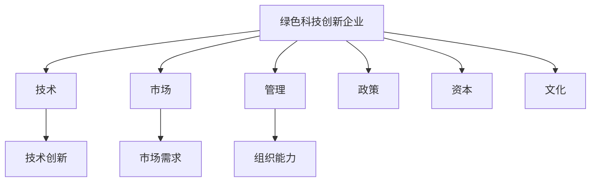

                 

# 绿色科技创新企业的估值挑战与机遇

> 关键词：绿色科技、企业估值、技术创新、可持续发展、ESG投资

> 摘要：绿色科技创新企业在当前全球可持续发展的背景下，以其独特的技术优势和商业模式，成为投资市场的焦点。然而，其估值过程面临诸多挑战，包括技术风险、政策依赖和数据不透明等问题。本文系统分析了绿色科技创新企业的核心概念、估值方法及面临的挑战，并探讨了其中的机遇，为投资者和企业管理者提供深度见解。

---

## 第一部分: 绿色科技创新企业的背景与核心概念

### 第1章: 绿色科技创新企业的定义与特点

#### 1.1 绿色科技的定义与内涵

绿色科技（Green Technology）是指能够减少对环境负面影响的技术和产品，其核心在于通过创新手段解决环境问题，同时促进经济的可持续发展。绿色科技不仅包括清洁能源、节能环保等技术，还包括循环经济、生态修复等领域。

绿色科技的内涵可以分解为以下几点：

- **环保性**：减少资源消耗和污染排放。
- **可持续性**：确保技术的长期可行性和环境友好性。
- **创新性**：通过技术突破解决传统方法难以解决的问题。

#### 1.2 创新企业的定义与模式

创新企业（Innovation-driven Enterprise）是指以技术创新为核心驱动力，通过不断研发新产品、服务或商业模式来实现增长的企业。绿色科技创新企业将绿色科技与创新模式相结合，形成独特的竞争优势。

绿色科技创新企业的模式包括：

- **技术驱动**：依赖核心技术的突破和应用。
- **市场导向**：针对特定市场需求开发产品或服务。
- **生态系统整合**：通过产业链协同实现资源优化配置。

#### 1.3 绿色科技创新企业的核心竞争力

绿色科技创新企业的核心竞争力来源于其技术创新和可持续发展模式。以下是其核心竞争力的具体体现：

- **技术创新**：掌握核心技术，具备快速迭代能力。
- **成本优势**：通过技术创新降低生产成本，提高效率。
- **市场认可度**：绿色产品和服务符合市场需求，具有品牌溢价能力。

#### 1.4 绿色科技创新企业的边界与外延

绿色科技创新企业的边界在于其技术应用的范围和市场的接受程度。其外延则包括绿色供应链管理、绿色金融、绿色教育等领域，形成一个完整的绿色经济生态系统。

### 1.5 绿色科技创新企业的概念结构

绿色科技创新企业的概念结构可以分为核心要素和辅助要素两部分。核心要素包括技术、市场和管理，辅助要素包括政策、资本和文化。

以下是一个概念结构图：

---

## 第二部分: 绿色科技创新企业的估值挑战

### 第2章: 估值的基本理论与方法

#### 2.1 传统企业估值方法

传统企业估值方法主要包括以下几种：

- **现金流折现法（DCF）**：通过预测企业未来现金流，将其折现为当前价值。
- **相对估值法（Relative Valuation）**：通过比较类似企业的估值倍数（如PE、PB等）进行估算。
- **股权自由现金流模型**：将股权视为独立的实体，预测其自由现金流并进行折现。

#### 2.2 绿色科技创新企业的特殊性

绿色科技创新企业的特殊性主要体现在以下几个方面：

- **技术风险**：技术创新的不确定性和失败风险较高。
- **政策依赖**：依赖政府政策支持，政策变化可能对其估值产生重大影响。
- **数据不透明**：由于技术的复杂性和市场的新兴性，企业数据可能不够透明。

### 第3章: 绿色科技创新企业的估值挑战

#### 3.1 技术风险与不确定性

技术风险是绿色科技创新企业估值的核心挑战之一。以下是技术风险的主要表现：

- **技术失败的可能性**：技术创新失败可能导致企业估值大幅下降。
- **技术更新的速度**：技术快速迭代可能导致现有技术迅速过时。
- **技术路线的选择**：不同的技术路线可能导致不同的市场表现。

#### 3.2 政策依赖与合规风险

绿色科技创新企业往往依赖政府政策支持，政策变化可能对其估值产生重大影响。

- **政策变化的影响**：环保政策的变化可能影响企业的收入和成本。
- **法律法规的不确定性**：新兴领域的法律法规尚未完善，可能导致合规风险。
- **政策支持的可持续性**：政策支持可能不稳定，影响企业的长期规划。

#### 3.3 数据不透明与信息不对称

绿色科技创新企业的技术复杂性和新兴市场特性可能导致数据不透明和信息不对称。

- **数据收集**：由于技术的复杂性，数据收集和处理成本较高。
- **信息不对称**：投资者和企业之间的信息不对称可能导致估值偏差。

---

## 第三部分: 绿色科技创新企业的估值机遇

### 第4章: 绿色科技创新企业的估值机遇

#### 4.1 技术创新带来的投资机会

技术创新是绿色科技创新企业估值的核心驱动力。以下是技术创新带来的投资机会：

- **新能源技术**：如太阳能、风能等可再生能源技术的突破。
- **节能环保技术**：如高效节能设备、污染治理技术的应用。
- **循环经济模式**：通过资源循环利用降低企业成本。

#### 4.2 市场需求与商业模式创新

绿色科技创新企业的商业模式创新为其估值提供了新的机会。

- **市场需求的增长**：随着环保意识的增强，绿色产品和服务需求持续增长。
- **新兴市场的发展**：新兴市场对绿色技术的需求旺盛，为企业提供了广阔的发展空间。

#### 4.3 估值方法的创新与优化

针对绿色科技创新企业的特殊性，可以开发专门的估值方法。

- **动态调整模型**：根据技术和政策变化动态调整估值参数。
- **情景分析法**：通过不同情景下的估值结果，评估企业风险和收益。

---

## 第四部分: 绿色科技创新企业的估值方法与实践

### 第5章: 绿色科技创新企业的估值方法

#### 5.1 现金流折现法的改进

针对绿色科技创新企业的特点，可以对现金流折现法进行改进。

- **技术生命周期考虑**：根据技术生命周期调整现金流预测。
- **政策因素纳入**：将政策变化的影响纳入折现率的计算。

#### 5.2 相对估值法的优化

相对估值法可以结合绿色科技企业的特点进行优化。

- **可比公司选择**：选择具有相似商业模式和技术特点的公司作为可比公司。
- **估值倍数调整**：根据绿色科技企业的特殊性调整估值倍数。

### 第6章: 绿色科技创新企业的实际估值案例

#### 6.1 案例分析：某新能源企业的估值

##### 6.1.1 企业简介

某新能源企业专注于太阳能电池技术的研发和生产，拥有多项专利技术，市场占有率较高。

##### 6.1.2 数据收集

- **财务数据**：过去三年的收入、成本、利润等。
- **技术数据**：专利数量、技术领先性等。
- **市场数据**：市场规模、竞争对手分析等。

##### 6.1.3 估值模型构建

使用现金流折现法进行估值，具体步骤如下：

1. 预测未来五年的现金流。
2. 考虑技术更新和技术失败风险，调整折现率。
3. 计算企业整体价值。
4. 分析敏感性，评估模型的稳健性。

##### 6.1.4 估值结果

通过模型计算，该企业的估值为合理区间，考虑技术优势和市场需求，投资价值较高。

---

## 第五部分: 结论与展望

### 第7章: 结论与展望

#### 7.1 研究总结

绿色科技创新企业的估值是一个复杂的过程，需要考虑技术、政策、市场等多重因素。尽管存在诸多挑战，但技术创新和市场需求为企业提供了广阔的发展空间。

#### 7.2 未来展望

未来，随着技术的进步和政策的支持，绿色科技创新企业将继续发挥重要作用。投资者需要更加关注企业的技术创新能力和可持续发展能力，制定科学的估值策略。

---

## 附录

### 附录A: 术语表

- **绿色科技**：指能够减少对环境负面影响的技术和产品。
- **DCF模型**：现金流折现法，用于估算企业价值。
- **ESG投资**：基于环境、社会和治理因素的投资策略。

### 附录B: 数据来源与工具推荐

- **数据来源**：企业财务报表、行业报告、政策文件等。
- **工具推荐**：Excel、Python（Pandas、NumPy）、Tableau等。

---

## 作者

作者：AI天才研究院/AI Genius Institute & 禅与计算机程序设计艺术 /Zen And The Art of Computer Programming

---

这篇文章系统地分析了绿色科技创新企业的估值挑战与机遇，结合理论与实践，为投资者和企业管理者提供了深度的见解和实用的估值方法。

