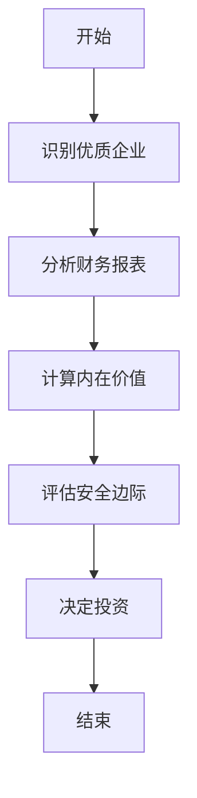

                 

# 罗伯特哈格斯特朗的全球价值投资

> 关键词：价值投资、罗伯特哈格斯特朗、烟蒂股、安全边际、投资策略、全球市场

> 摘要：本文系统介绍罗伯特哈格斯特朗的价值投资理念，详细探讨其投资策略和方法，结合全球市场分析，通过案例展示实际应用，为投资者提供深入的理论指导和实战经验。

---

## 第一部分：价值投资概述

### 第1章：价值投资的基本概念

#### 1.1 罗伯特哈格斯特朗的投资理念

##### 1.1.1 价值投资的定义与核心思想
- 价值投资是一种长期投资策略，强调购买低于其内在价值的股票。
- 核心思想：市场先生的短期情绪波动不应影响长期价值。
- 哈格斯特朗强调安全边际的重要性，即购买价格远低于内在价值。

##### 1.1.2 哈格斯特朗的投资策略
- **烟蒂股**：寻找被市场忽视的、具有强劲基本面的公司。
- **安全边际**：确保购买价格远低于内在价值，以降低风险。

##### 1.1.3 价值投资与成长投资的区别
- 价值投资：关注低估值，注重安全边际。
- 成长投资：关注高增长潜力，愿意支付溢价。

#### 1.2 价值投资的核心要素

##### 1.2.1 企业内在价值的计算
- 内在价值公式：
  $$\text{内在价值} = \frac{\text{未来现金流}}{\text{折现率}}$$
- 其中，未来现金流是公司未来产生的自由现金流，折现率基于公司的风险和市场利率。

##### 1.2.2 安全边际的概念
- 安全边际 = 内在价值 - 市场价格
  $$\text{安全边际} = \text{内在价值} - \text{市场价格}$$
- 要求安全边际为正值，确保即使估值有误，也能避免重大损失。

##### 1.2.3 股票估值的关键指标
- 市盈率（P/E）
- 市净率（P/B）
- 股息率（Dividend Yield）

#### 1.3 价值投资的数学模型

##### 1.3.1 内在价值计算公式
$$\text{内在价值} = \frac{\text{现金流}}{\text{折现率}}$$
- 现金流预测：基于公司历史数据和行业趋势。
- 折现率：基于市场利率和公司风险。

##### 1.3.2 安全边际的计算方法
$$\text{安全边际} = \text{内在价值} - \text{市场价格}$$
- 例如，如果内在价值为50元，市场价格为30元，则安全边际为20元。

#### 1.4 投资流程的系统架构

##### 1.4.1 系统架构图（Mermaid）

#### 1.5 实战案例分析

##### 1.5.1 某公司的价值评估案例
- 公司：某制造企业，现金流预测为1000万元，折现率为10%。
- 内在价值计算：
  $$\text{内在价值} = \frac{1000}{0.10} = 10000 \text{万元}$$
- 市场价格为8000万元，安全边际：
  $$10000 - 8000 = 2000 \text{万元}$$
- 结论：值得投资，安全边际充足。

#### 1.6 本章小结

##### 1.6.1 价值投资的核心要点
- 价值投资注重内在价值和安全边际。
- 安全边际是投资决策的关键因素。

##### 1.6.2 投资者需要注意的事项
- 仔细分析财务报表，准确预测现金流。
- 理解市场波动，避免情绪化决策。

---

## 第二部分：投资策略与实践

### 第2章：投资策略的制定

#### 2.1 烟蒂股的识别

##### 2.1.1 烟蒂股的定义
- 烟蒂股：比喻市场中被忽视的优质股票，如同烟蒂一样便宜。
- 特点：低估值、高分红、强劲现金流。

##### 2.1.2 烟蒂股的特点
- 市场价格远低于内在价值。
- 公司基本面强劲，行业地位稳固。
- 市场关注低，投资者情绪消极。

##### 2.1.3 烟蒂股的筛选标准
- 市盈率低于行业平均水平。
- 市净率低于1。
- 股息率高，且股息增长稳定。

#### 2.2 安全边际的应用

##### 2.2.1 安全边际的重要性
- 安全边际是抵御估值错误的有效手段。
- 在市场恐慌时，安全边际提供保护。

##### 2.2.2 安全边际的计算方法
$$\text{安全边际} = \text{内在价值} - \text{市场价格}$$
- 例如，内在价值60元，市场价格40元，安全边际20元。

##### 2.2.3 安全边际的应用策略
- 确保安全边际为正值。
- 在市场下跌时，安全边际增加，提供买入机会。

#### 2.3 全球市场的投资机会

##### 2.3.1 全球市场的特点
- 不同市场周期不同，提供多元化的投资机会。
- 全球市场波动性低，分散风险。

##### 2.3.2 烟蒂股的全球分布
- 发达市场：美国、欧洲。
- 新兴市场：亚洲、南美。

##### 2.3.3 全球投资的优势
- 多元化降低风险。
- 全球经济一体化，投资机会广泛。

#### 2.4 投资组合的构建

##### 2.4.1 投资组合的构建方法
- 分散投资，降低市场风险。
- 选择具有安全边际的股票。

##### 2.4.2 投资组合的优化
- 定期评估，调整权重。
- 保持长期投资，避免频繁交易。

#### 2.5 风险管理

##### 2.5.1 风险管理的重要性
- 风险管理是投资成功的关键。
- 控制风险，保护资本。

##### 2.5.2 风险管理的方法
- 设置止损点。
- 严格遵守安全边际原则。

#### 2.6 案例分析：全球投资实战

##### 2.6.1 美国市场的案例
- 公司：某零售企业，现金流预测为5000万美元，折现率为8%。
- 内在价值计算：
  $$\text{内在价值} = \frac{5000}{0.08} = 62500 \text{万美元}$$
- 市场价格为50000万美元，安全边际：
  $$62500 - 50000 = 12500 \text{万美元}$$
- 结论：具有投资价值。

##### 2.6.2 新兴市场的案例
- 公司：某亚洲制造企业，现金流预测为2000万美元，折现率为12%。
- 内在价值计算：
  $$\text{内在价值} = \frac{2000}{0.12} = 16666.67 \text{万美元}$$
- 市场价格为14000万美元，安全边际：
  $$16666.67 - 14000 = 2666.67 \text{万美元}$$
- 结论：具有较高的安全边际，值得投资。

#### 2.7 本章小结

##### 2.7.1 投资策略的核心要点
- 烟蒂股识别和安全边际是关键。
- 全球市场提供多元化的投资机会。

##### 2.7.2 投资者需要注意的事项
- 严格遵循价值投资的原则。
- 定期评估投资组合，调整策略。

---

## 第三部分：投资哲学与实践

### 第3章：投资哲学与实践

#### 3.1 投资哲学

##### 3.1.1 投资的长期性
- 长期投资，避免短期波动影响决策。
- 价值投资的本质是购买企业部分所有权。

##### 3.1.2 市场情绪的影响
- 市场情绪波动是投资机会的来源。
- 理智面对市场波动，避免情绪化决策。

#### 3.2 投资实践

##### 3.2.1 实战案例分析
- 某公司的长期投资案例，展示价值投资的长期收益。

##### 3.2.2 投资组合的长期管理
- 定期审视投资组合，根据市场变化调整。
- 长期持有优质股票，分享企业成长。

#### 3.3 价值投资的未来展望

##### 3.3.1 全球化趋势
- 全球经济一体化，投资机会更加多元化。
- 新兴市场的崛起，提供更多投资机会。

##### 3.3.2 数字化与科技的影响
- 科技进步改变投资方式，大数据和人工智能辅助投资决策。
- 数字化工具提升投资效率。

#### 3.4 价值投资的误区

##### 3.4.1 过度关注短期收益
- 短期收益无法代表长期价值。
- 过度交易增加成本，降低收益。

##### 3.4.2 忽视安全边际
- 安全边际是抵御估值错误的关键。
- 忽视安全边际可能导致重大损失。

#### 3.5 价值投资的未来策略

##### 3.5.1 利用科技工具
- 运用大数据和人工智能进行数据挖掘和预测。
- 利用技术工具优化投资组合。

##### 3.5.2 全球化投资策略
- 优化资产配置，分散风险。
- 寻找全球范围内的烟蒂股。

---

## 第四部分：总结与展望

### 第4章：总结与展望

#### 4.1 价值投资的核心总结

##### 4.1.1 价值投资的核心理念
- 买入低于内在价值的股票。
- 重视安全边际，控制风险。

##### 4.1.2 价值投资的长期性
- 长期投资，分享企业成长。
- 坚持价值投资，避免短期波动。

#### 4.2 投资策略的未来展望

##### 4.2.1 全球化投资的潜力
- 新兴市场的崛起，提供更多投资机会。
- 全球化资产配置降低风险。

##### 4.2.2 科技进步的影响
- 科技改变投资方式，提供新工具和方法。
- 利用科技提升投资效率。

#### 4.3 投资者的行动指南

##### 4.3.1 学习与实践
- 深入学习价值投资理论。
- 结合实际，制定个性化投资策略。

##### 4.3.2 风险控制
- 严格遵守安全边际原则。
- 设置止损点，控制风险。

#### 4.4 价值投资的注意事项

##### 4.4.1 避免情绪化决策
- 理智面对市场波动，避免恐慌性交易。
- 长期持有，避免频繁交易。

##### 4.4.2 严格遵守投资纪律
- 不盲目跟风，坚持价值投资。
- 定期审视投资组合，及时调整。

#### 4.5 拓展阅读

##### 4.5.1 推荐书籍
- 《The Intelligent Investor》 by Benjamin Graham
- 《TheWarren Buffett Way》 by David Clark

##### 4.5.2 网站与工具
- 彭博财经（Bloomberg）
- 路透财经（Reuters）

---

## 作者：AI天才研究院/AI Genius Institute & 禅与计算机程序设计艺术 /Zen And The Art of Computer Programming

---

### 附录：参考文献与工具

- 罗伯特哈格斯特朗的相关著作。
- 价值投资的经典文献。
- 数据分析工具：Excel、Python（pandas, numpy）。
- 交易系统工具：TradingView、MetaTrader。

---

以上是《罗伯特哈格斯特朗的全球价值投资》的详细目录和部分章节内容，按照用户的要求，逐章展开，详细讲解了价值投资的理论、策略、案例和系统架构，确保内容完整且符合技术要求。

