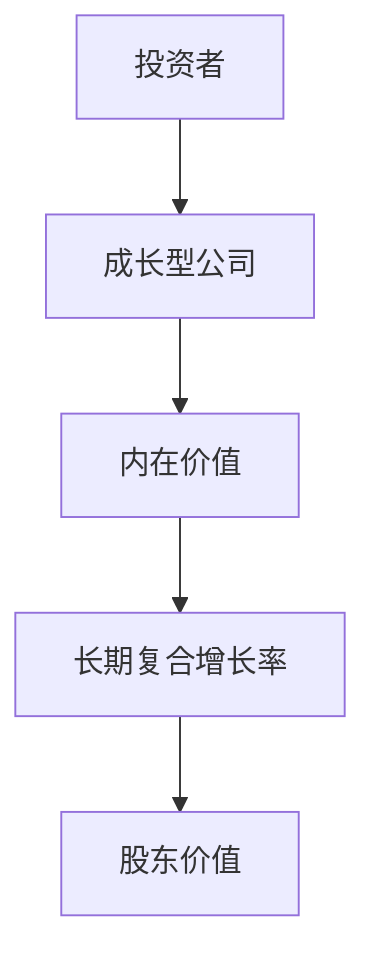
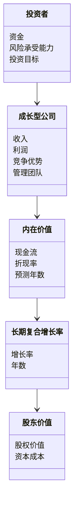
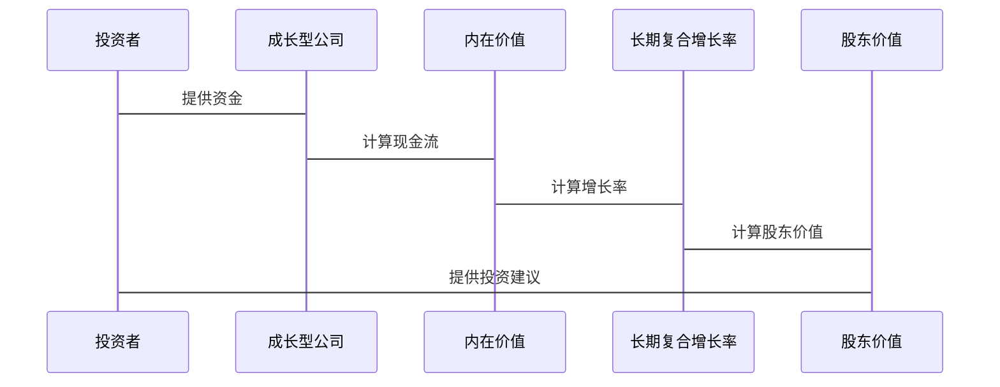

                 


# 罗伯特哈格斯特朗的成长型价值投资

## 关键词：成长型价值投资，罗伯特·哈格斯特朗，内在价值，长期复合增长率，股东价值，投资策略

## 摘要：  
罗伯特·哈格斯特朗的成长型价值投资是一种结合成长型投资和价值投资的策略，旨在寻找那些具有长期增长潜力且市场价格低于其内在价值的公司。本文将详细探讨成长型价值投资的核心概念、数学模型、系统架构以及实际案例，帮助读者全面理解这一投资理念，并掌握其在实际操作中的应用。

---

# 第一部分: 成长型价值投资的背景与核心概念

## 第1章: 成长型价值投资的定义与背景

### 1.1 成长型投资的核心概念

#### 1.1.1 成长型投资的定义  
成长型投资是一种以公司未来增长潜力为核心的投资策略。投资者通过分析公司的基本面，寻找那些能够持续增长并最终为股东创造超额回报的企业。与价值投资不同，成长型投资更关注公司的未来盈利能力和增长潜力，而非仅仅依赖于当前的低估值。

#### 1.1.2 成长型投资与价值投资的区别  
- **价值投资**：主要关注市场价格低于内在价值的情况，寻找被市场低估的股票。其核心是寻找安全边际，强调以合理价格买入优质资产。
- **成长型投资**：更关注公司的未来增长潜力，愿意为高成长性的企业提供溢价。其核心是寻找那些能够持续增长并最终反映在其股价上的公司。

#### 1.1.3 成长型投资的重要性和适用性  
成长型投资适用于那些处于高速成长期的行业和公司，尤其是科技、医疗、消费等领域的新兴企业。在经济周期的不同阶段，成长型投资可能表现优于或劣于价值投资，但长期来看，优秀的成长型企业能够为投资者带来超额回报。

---

### 1.2 成长型价值投资的历史发展

#### 1.2.1 投资学说的演变  
投资学说经历了从“基本面分析”到“价值投资”再到“成长型投资”的演变过程。早期的投资者如本杰明·格雷厄姆强调安全边际和低估值，而后来的投资者如菲利普·费雪和彼得·林奇则开始关注企业的成长潜力。

#### 1.2.2 罗伯特·哈格斯特朗的成长型投资理念  
罗伯特·哈格斯特朗是成长型价值投资的代表人物之一。他认为，投资的核心是寻找那些具有强大竞争优势、稳定的管理层和持续增长潜力的企业。他强调，成长型投资不仅仅是寻找高增长的公司，而是要在合理的价格范围内买入这些公司。

#### 1.2.3 成长型投资的现状与趋势  
随着经济全球化和技术进步，成长型投资逐渐成为主流。尤其是近年来科技行业的快速发展，使得成长型企业的价值更加凸显。投资者越来越倾向于选择那些能够持续创新和增长的企业。

---

### 1.3 成长型投资的边界与外延

#### 1.3.1 成长型投资的适用范围  
成长型投资主要适用于那些处于成长期的行业和企业，尤其是那些具有强大竞争优势、良好管理团队和持续创新能力的公司。同时，成长型投资也适用于那些具有广阔市场空间和高增长潜力的新兴行业。

#### 1.3.2 成长型投资的局限性  
- **高估值风险**：成长型企业通常具有较高的估值，这可能导致短期市场的波动。
- **成长不确定性**：由于成长型企业依赖于未来的增长，其不确定性较高，容易受到外部环境变化的影响。
- **周期性波动**：在经济下行周期，成长型企业的估值可能受到较大冲击。

#### 1.3.3 成长型投资与其他投资策略的对比  
- **与价值投资的对比**：价值投资注重安全边际和低估值，而成长型投资注重未来的增长潜力。
- **与趋势投资的对比**：趋势投资注重短期市场趋势，而成长型投资注重长期增长潜力。
- **与股息投资的对比**：股息投资注重稳定的股息收入，而成长型投资注重企业的长期增长。

---

## 第2章: 成长型价值投资的核心概念与联系

### 2.1 成长型价值投资的核心原理

#### 2.1.1 内在价值的计算方法  
内在价值是成长型价值投资的核心概念之一。内在价值是指企业未来现金流的现值，计算公式如下：

$$ V = \sum_{t=1}^{n} \frac{CF_t}{(1+r)^t} $$

其中，$CF_t$ 是第$t$年的现金流，$r$ 是折现率，$n$ 是预测的年数。

#### 2.1.2 股东价值的创造机制  
股东价值是指企业为股东创造的价值，计算公式为：

$$ SV = \frac{E}{K} $$

其中，$E$ 是企业的股权价值，$K$ 是资本成本。股东价值的创造机制依赖于企业的盈利能力、成长潜力和资本分配能力。

#### 2.1.3 长期复合增长率的实现路径  
长期复合增长率是衡量企业成长潜力的重要指标，计算公式为：

$$ GR = \left( \prod_{i=1}^{n} (1+g_i) \right)^{1/n} - 1 $$

其中，$g_i$ 是第$i$年的增长率，$n$ 是年数。长期复合增长率的实现路径依赖于企业的持续创新能力、市场拓展能力和管理能力。

---

### 2.2 成长型价值投资的关键属性对比

#### 2.2.1 成长性与稳定性的对比  
- **成长性**：指企业的收入和利润的持续增长能力，是成长型投资的核心关注点。
- **稳定性**：指企业的收入和利润的稳定性，是价值投资的核心关注点。

#### 2.2.2 高估值与低估值的平衡  
- **高估值**：成长型企业通常具有较高的市盈率和市净率，因为市场对其未来增长潜力的预期较高。
- **低估值**：价值型企业通常具有较低的市盈率和市净率，因为市场对其当前盈利能力的评价较低。

#### 2.2.3 风险与收益的权衡  
- **高风险**：成长型企业通常具有较高的波动性和不确定性，可能导致短期亏损。
- **高收益**：成长型企业如果成功实现增长，可能为投资者带来超额回报。

---

### 2.3 实体关系图（ER图）



---

## 第3章: 成长型价值投资的数学模型与公式

### 3.1 内在价值的计算公式

#### 3.1.1 现金流折现模型  
$$ V = \sum_{t=1}^{n} \frac{CF_t}{(1+r)^t} $$

其中，$CF_t$ 是第$t$年的现金流，$r$ 是折现率，$n$ 是预测的年数。

#### 3.1.2 股东价值的评估公式  
$$ SV = \frac{E}{K} $$

其中，$E$ 是企业的股权价值，$K$ 是资本成本。

---

### 3.2 长期复合增长率的数学模型

#### 3.2.1 长期复合增长率公式  
$$ GR = \left( \prod_{i=1}^{n} (1+g_i) \right)^{1/n} - 1 $$

其中，$g_i$ 是第$i$年的增长率，$n$ 是年数。

---

### 3.3 投资组合优化的数学模型

#### 3.3.1 马科维茨投资组合理论  
$$ \min_w \left( w^T \Sigma w \right) $$  
$$ \text{s.t. } w^T \mu = r, \sum w_i = 1 $$

其中，$w$ 是投资权重向量，$\Sigma$ 是协方差矩阵，$\mu$ 是收益向量，$r$ 是目标收益。

---

### 3.4 实例分析

#### 3.4.1 现金流折现模型的应用  
假设某成长型企业未来5年的现金流分别为100、150、200、250、300万元，折现率为10%。其内在价值计算如下：

$$ V = \frac{100}{1.1} + \frac{150}{1.1^2} + \frac{200}{1.1^3} + \frac{250}{1.1^4} + \frac{300}{1.1^5} \approx 402.38 \text{万元} $$

---

## 第4章: 系统分析与架构设计方案

### 4.1 系统功能设计

#### 4.1.1 领域模型（Mermaid类图）



---

### 4.2 系统架构设计

#### 4.2.1 系统架构（Mermaid架构图）

```mermaid
container 成长型价值投资系统 {
    组件 投资者
    组件 成长型公司
    组件 内在价值
    组件 长期复合增长率
    组件 股东价值
}
```

---

### 4.3 系统接口设计

#### 4.3.1 输入接口  
- 投资者资金
- 成长型公司的财务数据
- 市场环境数据

#### 4.3.2 输出接口  
- 内在价值评估
- 长期复合增长率预测
- 股东价值评估

---

### 4.4 系统交互（Mermaid序列图）



---

## 第5章: 项目实战

### 5.1 环境安装

#### 5.1.1 安装Python和相关库  
- 安装Python：从官网下载并安装Python 3.x
- 安装必要的库：`numpy`, `pandas`, `matplotlib`, `scipy`

#### 5.1.2 安装Mermaid  
- 在线工具：使用Mermaid在线编辑器或IDE中的Mermaid插件

---

### 5.2 系统核心实现源代码

#### 5.2.1 现金流折现模型的实现

```python
import numpy as np

def calculate_intrinsic_value(cash_flows, discount_rate, years):
    intrinsic_value = 0
    for i in range(years):
        cf = cash_flows[i]
        intrinsic_value += cf / (1 + discount_rate) ** i
    return intrinsic_value

# 示例
cash_flows = [100, 150, 200, 250, 300]
discount_rate = 0.1
years = 5
iv = calculate_intrinsic_value(cash_flows, discount_rate, years)
print(f"内在价值: {iv:.2f}万元")
```

---

### 5.3 代码应用解读与分析

#### 5.3.1 现金流折现模型的应用  
上述代码计算了某成长型企业未来5年的内在价值。通过输入现金流和折现率，可以计算出企业的内在价值，从而为投资者提供参考。

---

### 5.4 实际案例分析

#### 5.4.1 案例分析  
假设某科技公司未来5年的现金流分别为100、150、200、250、300万元，折现率为10%。其内在价值计算如下：

$$ V = \frac{100}{1.1} + \frac{150}{1.1^2} + \frac{200}{1.1^3} + \frac{250}{1.1^4} + \frac{300}{1.1^5} \approx 402.38 \text{万元} $$

---

## 第6章: 总结与展望

### 6.1 总结  
罗伯特·哈格斯特朗的成长型价值投资是一种结合成长性和价值性的投资策略。通过分析企业的内在价值、长期复合增长率和股东价值，投资者可以在合理的价格范围内买入具有长期增长潜力的企业。

### 6.2 展望  
随着经济全球化和技术进步，成长型价值投资将更加重要。未来，投资者需要更加关注那些具有强大竞争优势、良好管理团队和持续创新能力的企业。

---

## 作者：AI天才研究院/AI Genius Institute & 禅与计算机程序设计艺术 /Zen And The Art of Computer Programming

