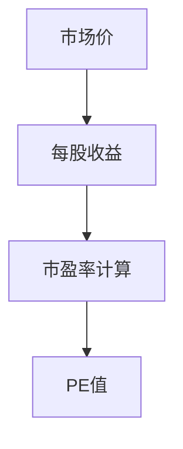
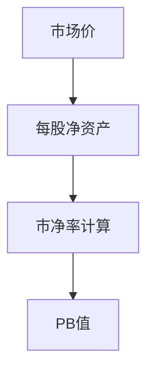
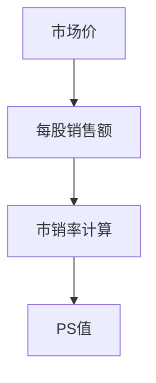
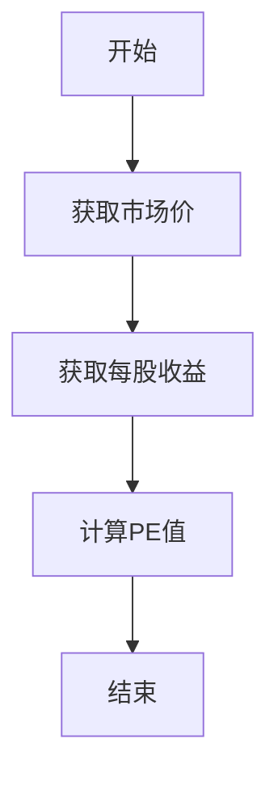
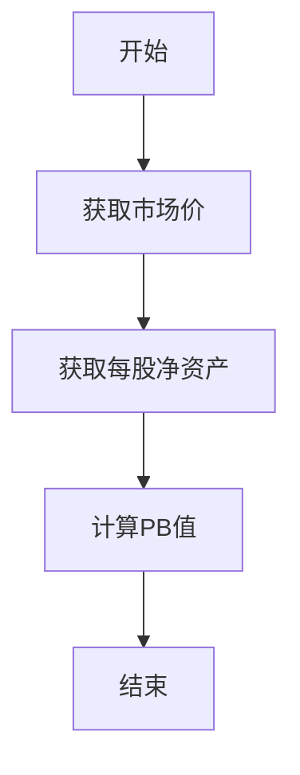
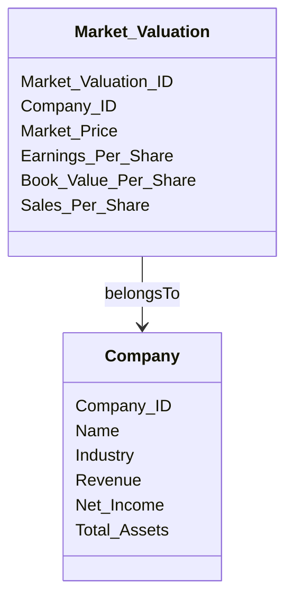
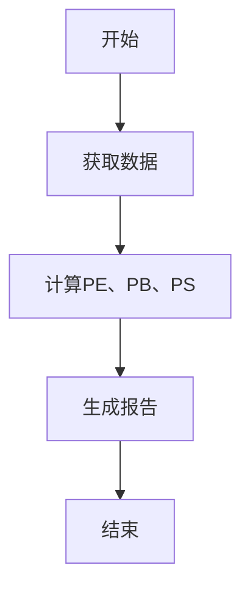

                 


# 美国作为全球最大经济体的市场估值特点

## 关键词：美国经济，市场估值，PE，PB，PS，全球经济，市场分析

## 摘要

本文将深入探讨美国作为全球最大经济体的市场估值特点。通过分析美国经济的规模、结构和影响力，结合市场估值的核心概念和方法，揭示其在全球经济中的独特地位。本文将从概述、核心概念、算法原理、系统分析、项目实战、系统架构设计以及最佳实践等多个方面展开，详细阐述美国市场估值的关键点，帮助读者更好地理解和应用这些方法。

---

## 第1章：美国经济的全球地位

### 1.1 美国经济的基本概述

#### 1.1.1 美国经济的规模与结构

美国经济是全球最大的经济体，其GDP占全球总量的约25%。美国经济以多元化和高度发达的市场体系为特点，涵盖科技、金融、制造业、服务业等多个领域。美国的经济结构以私有制为基础，市场机制主导资源配置。

#### 1.1.2 美国在全球经济中的地位

作为全球最大的经济体，美国不仅是全球贸易和金融的中心，还通过美元的国际地位影响全球市场。美国的经济政策、货币政策和贸易政策对全球市场具有深远影响。

#### 1.1.3 美国经济对全球市场的影响

美国经济的增长或衰退直接影响全球市场。例如，美联储的货币政策调整会引发全球资本流动的变化，美国股市的波动也会对全球投资者情绪产生影响。

---

### 1.2 美国市场的估值特点

#### 1.2.1 市场估值的基本概念

市场估值是通过对企业的财务数据和市场指标进行分析，评估企业或资产的市场价值。常见的估值方法包括市盈率（PE）、市净率（PB）和市销率（PS）等。

#### 1.2.2 美国市场的独特性

美国市场以其高度流动性和透明性著称。作为全球最大的股票市场，纽约证券交易所（NYSE）和纳斯达克（NASDAQ）吸引了全球投资者。美国市场的估值方法和指标在全球范围内被广泛采用。

#### 1.2.3 美国市场与其他经济体的对比

与新兴市场相比，美国市场的估值更为成熟和稳定。然而，与其他发达经济体（如欧盟）相比，美国市场的规模和创新能力使其更具竞争力。

---

## 第2章：市场估值的核心概念

### 2.1 市场估值的定义与属性

#### 2.1.1 市场估值的定义

市场估值是指通过对企业的财务数据和市场指标的分析，评估企业或资产的市场价值。市场估值的核心在于将企业的基本面与市场指标相结合，判断其合理的市场价格。

#### 2.1.2 市场估值的核心属性对比

| 属性       | 描述                                                                 |
|------------|----------------------------------------------------------------------|
| 客观性     | 市场估值基于公开的财务数据和市场指标，具有较高的客观性。           |
| 可比性     | 不同企业的估值指标可以进行横向对比，便于分析和判断。             |
| 动态性     | 市场估值会随着市场环境和企业基本面的变化而实时调整。               |

#### 2.1.3 市场估值的边界与外延

市场估值的边界在于企业的财务数据和市场环境的变化。其外延包括对行业趋势、宏观经济环境和政策变化的分析。

---

### 2.2 市场估值的实体关系图

#### 2.2.1 ER实体关系图

```mermaid
er
  table Market_Valuation {
    Market_Valuation_ID (PK)
    Company_ID (FK)
    Market_Price ( Monetary )
    Earnings_Per_Share
    Book_Value_Per_Share
    Sales_Per_Share
  }
```

---

## 第3章：市场估值的算法原理

### 3.1 市场估值的主要方法

#### 3.1.1 市盈率（PE）法

市盈率（PE）= 市场价 / 每股收益（EPS）



#### 3.1.2 市净率（PB）法

市净率（PB）= 市场价 / 每股净资产（BVPS）



#### 3.1.3 市销率（PS）法

市销率（PS）= 市场价 / 每股销售额（Revenue Per Share）



---

### 3.2 算法流程图

#### 3.2.1 PE指标计算流程图



#### 3.2.2 PB指标计算流程图



---

## 第4章：市场估值的数学模型与公式

### 4.1 PE指标的数学模型

$$ PE = \frac{\text{市场价}}{\text{每股收益}} $$

### 4.2 PB指标的数学模型

$$ PB = \frac{\text{市场价}}{\text{每股净资产}} $$

### 4.3 PS指标的数学模型

$$ PS = \frac{\text{市场价}}{\text{每股销售额}} $$

---

## 第5章：系统分析与架构设计方案

### 5.1 问题场景介绍

假设我们需要对美国某上市公司的市场估值进行分析。目标是通过PE、PB和PS指标，评估该公司的市场价值是否合理。

### 5.2 系统功能设计

#### 5.2.1 领域模型



---

## 第6章：项目实战

### 6.1 环境安装

安装Python和必要的库（如pandas、numpy、matplotlib）。

### 6.2 核心实现源代码

```python
import pandas as pd

# 假设我们有以下数据
data = {
    'Company': ['Apple', 'Microsoft', 'Google'],
    'Market_Price': [150, 300, 2500],
    'Earnings_Per_Share': [4.67, 16.28, 24.59],
    'Book_Value_Per_Share': [3.89, 6.24, 11.07],
    'Sales_Per_Share': [6.58, 17.30, 12.38]
}

df = pd.DataFrame(data)

# 计算PE、PB、PS
df['PE'] = df['Market_Price'] / df['Earnings_Per_Share']
df['PB'] = df['Market_Price'] / df['Book_Value_Per_Share']
df['PS'] = df['Market_Price'] / df['Sales_Per_Share']

print(df)
```

---

## 第7章：系统架构设计

### 7.1 系统架构图



---

## 第8章：最佳实践

### 8.1 小结

通过本文的分析，我们可以看到美国作为全球最大经济体的市场估值特点，以及如何通过PE、PB和PS等指标进行市场分析。

### 8.2 注意事项

在进行市场估值时，需注意数据的准确性和市场环境的变化。同时，结合行业趋势和宏观经济因素，能够更全面地评估企业的市场价值。

### 8.3 拓展阅读

建议读者进一步学习《投资学》和《金融市场分析》等书籍，以深入理解市场估值的更多方法和应用。

---

## 作者

作者：AI天才研究院/AI Genius Institute & 禅与计算机程序设计艺术 /Zen And The Art of Computer Programming

---

通过以上步骤，我们详细分析了美国作为全球最大经济体的市场估值特点，从概述、核心概念、算法原理到系统设计和项目实战，帮助读者全面理解市场估值的方法和应用。

