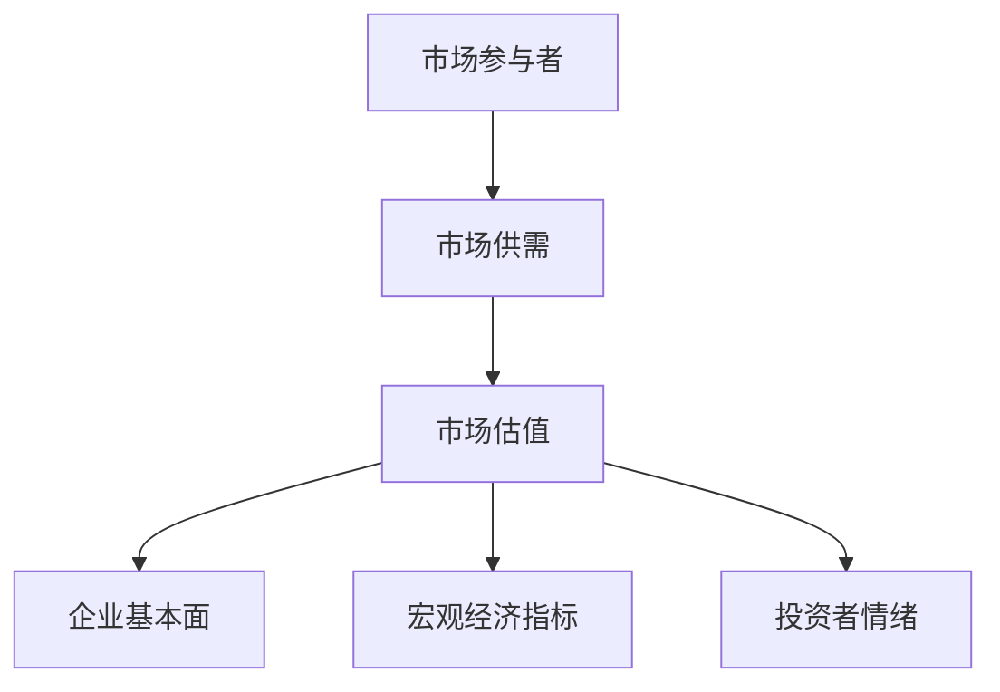
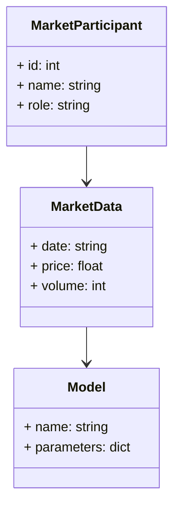
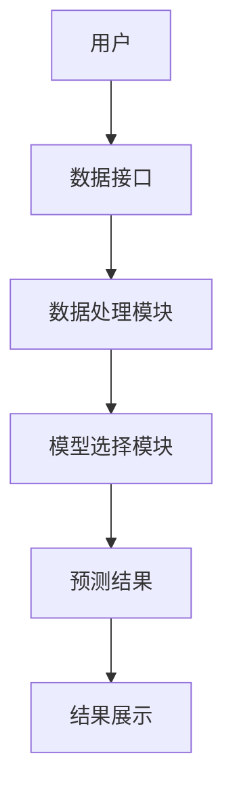
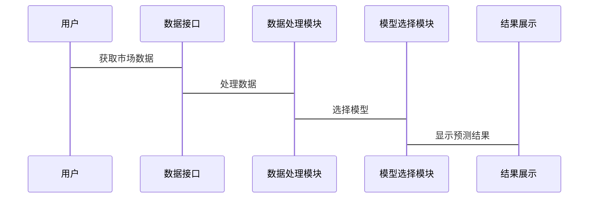

                 


# 美国市场估值预测的成功经验及其启示

## 关键词：
- 美国市场
- 市场估值预测
- 投资决策
- 成功经验
- 启示

## 摘要：
本文系统地探讨了美国市场估值预测的成功经验及其对投资决策的启示。文章从市场估值预测的背景、核心概念、算法原理、系统架构到项目实战，逐步分析了这一过程。通过详细阐述线性回归和时间序列分析等算法，结合实际案例和系统设计，本文为读者提供了从理论到实践的全面指导。最后，本文总结了经验教训，并提出了最佳实践建议。

---

## 第1章: 美国市场估值预测的概述

### 1.1 估值预测的定义与重要性

#### 1.1.1 估值预测的基本概念
市场估值预测是通过对市场数据和相关因素的分析，预测市场未来价值的过程。它在投资决策中起着关键作用，帮助投资者评估资产的合理价格。

#### 1.1.2 估值预测在投资决策中的作用
准确的估值预测可以帮助投资者做出明智的投资决策，优化资产配置，规避市场风险。

#### 1.1.3 美国市场的独特性与复杂性
美国市场作为全球最大的市场之一，其复杂性体现在其庞大的市场规模、多样化的行业结构和高度的市场流动性。

### 1.2 美国市场估值预测的核心要素

#### 1.2.1 市场参与者的角色
市场参与者包括机构投资者、个人投资者和企业，他们的行为直接影响市场估值。

#### 1.2.2 市场波动性与周期性
市场波动性和周期性是影响估值预测的重要因素，需要通过模型和数据进行分析。

#### 1.2.3 估值预测的关键驱动因素
包括宏观经济指标、企业基本面、行业动态和投资者情绪等因素。

### 1.3 美国市场估值预测的成功经验

#### 1.3.1 历史案例分析
通过历史案例分析，总结出成功的预测方法和策略。

#### 1.3.2 成功经验的总结
成功的经验包括科学的模型选择、数据的准确收集和合理的假设设定。

#### 1.3.3 经验对其他市场的启示
成功的经验可以为其他市场提供借鉴，帮助它们建立有效的估值预测体系。

### 1.4 本章小结
本章介绍了美国市场估值预测的基本概念、核心要素和成功经验，为后续章节的分析奠定了基础。

---

## 第2章: 美国市场估值预测的核心概念与联系

### 2.1 核心概念的原理

#### 2.1.1 市场供需关系
市场供需关系是影响市场估值的核心因素之一，需通过供需平衡分析来预测估值变化。

#### 2.1.2 经济指标与市场估值的关系
宏观经济指标如GDP、利率等对市场估值有直接影响，需通过模型进行分析。

#### 2.1.3 企业基本面与股价的关系
企业的盈利能力、财务状况等基本面因素直接影响其股价和市场估值。

### 2.2 核心概念的属性特征对比

#### 2.2.1 市场估值与企业盈利的关系
通过对比分析，市场估值与企业盈利呈正相关关系。

#### 2.2.2 市场估值与宏观经济指标的关系
市场估值与宏观经济指标如利率、通胀率等密切相关。

#### 2.2.3 市场估值与投资者情绪的关系
投资者情绪波动会影响市场估值，需通过情绪指标进行分析。

### 2.3 实体关系图


### 2.4 本章小结
本章通过核心概念的原理和属性特征对比，构建了市场估值预测的理论框架。

---

## 第3章: 美国市场估值预测的算法原理

### 3.1 估值预测的常用算法

#### 3.1.1 线性回归模型
线性回归模型通过建立自变量和因变量之间的线性关系，预测市场估值。

#### 3.1.2 时间序列分析
时间序列分析通过分析数据的时间依赖性，预测未来的市场估值。

#### 3.1.3 机器学习算法
机器学习算法如随机森林和神经网络等，能够处理复杂的市场数据，提供高精度的预测。

### 3.2 算法原理的数学模型

#### 3.2.1 线性回归模型
$$ y = \beta_0 + \beta_1x + \epsilon $$

#### 3.2.2 时间序列分析模型
$$ ARIMA(p, d, q) $$

### 3.3 算法实现的代码示例

#### 3.3.1 线性回归模型
```python
import pandas as pd
import numpy as np
from sklearn.linear_model import LinearRegression

# 示例数据
data = pd.DataFrame({
    'x': [1, 2, 3, 4, 5],
    'y': [2, 4, 5, 4, 6]
})

# 线性回归模型
model = LinearRegression()
model.fit(data[['x']], data['y'])

# 预测结果
print(model.predict([[6]]))
```

#### 3.3.2 时间序列分析
```python
from statsmodels.tsa.arima_model import ARIMA

# 示例数据
data = [1, 2, 3, 4, 5, 6, 7, 8, 9, 10]

# 建立ARIMA模型
model = ARIMA(data, order=(1, 1, 1))
model_fit = model.fit()

# 预测未来值
forecast = model_fit.forecast(steps=5)
print(forecast)
```

### 3.4 本章小结
本章详细介绍了常用的估值预测算法及其数学模型，通过代码示例展示了算法的实现过程。

---

## 第4章: 美国市场估值预测的系统分析与架构设计

### 4.1 系统功能设计

#### 4.1.1 领域模型


#### 4.1.2 系统架构设计


### 4.2 系统接口设计

#### 4.2.1 数据接口
提供API接口，用于获取市场数据和模型参数。

#### 4.2.2 模型接口
提供模型调用接口，支持多种算法的集成。

### 4.3 系统交互设计

#### 4.3.1 交互流程


### 4.4 本章小结
本章通过系统分析和架构设计，展示了如何构建一个高效的市场估值预测系统。

---

## 第5章: 美国市场估值预测的项目实战

### 5.1 项目环境安装

#### 5.1.1 环境搭建
安装Python、Pandas、NumPy、Scikit-learn和statsmodels等库。

#### 5.1.2 数据获取
通过API获取美国市场的历史数据。

### 5.2 系统核心实现

#### 5.2.1 数据预处理
对数据进行清洗、标准化和特征工程处理。

#### 5.2.2 模型实现
实现线性回归和ARIMA模型，并进行参数调优。

### 5.3 代码实现与解读

#### 5.3.1 数据预处理代码
```python
import pandas as pd
import numpy as np

# 数据加载
data = pd.read_csv('market_data.csv')

# 数据清洗
data.dropna(inplace=True)
data['date'] = pd.to_datetime(data['date'])
data.set_index('date', inplace=True)

# 特征工程
data['moving_avg'] = data['price'].rolling(5).mean()
```

#### 5.3.2 模型实现代码
```python
from sklearn.linear_model import LinearRegression
from statsmodels.tsa.arima_model import ARIMA

# 线性回归模型
lr_model = LinearRegression()
lr_model.fit(data[['moving_avg']], data['price'])

# ARIMA模型
arima_model = ARIMA(data['price'], order=(1, 1, 1))
arima_fit = arima_model.fit()
```

### 5.4 案例分析与结果解读

#### 5.4.1 案例分析
通过具体案例分析模型的预测结果，评估模型的准确性。

#### 5.4.2 结果解读
解读模型预测结果，分析误差来源，并提出改进建议。

### 5.5 本章小结
本章通过项目实战，展示了如何将理论应用于实际，实现市场估值预测系统。

---

## 第6章: 美国市场估值预测的经验总结与启示

### 6.1 经验总结

#### 6.1.1 成功经验
科学的模型选择和高质量的数据是成功的关键。

#### 6.1.2 失败教训
忽视市场波动性和投资者情绪的影响可能导致预测失误。

### 6.2 最佳实践 tips

#### 6.2.1 数据收集与处理
确保数据的准确性和完整性，进行有效的特征工程。

#### 6.2.2 模型选择与优化
根据数据特点选择合适的模型，并进行参数调优。

#### 6.2.3 结果验证与评估
通过回测和交叉验证评估模型的性能，避免过拟合。

### 6.3 小结
本文总结了美国市场估值预测的成功经验，并提出了最佳实践建议，为读者提供了宝贵的参考。

### 6.4 注意事项

#### 6.4.1 数据质量
数据质量直接影响预测结果，需谨慎处理。

#### 6.4.2 模型选择
模型选择需结合实际问题和数据特点。

#### 6.4.3 风险管理
即使预测准确，也需要有效的风险管理策略。

### 6.5 拓展阅读
推荐相关书籍和论文，供读者进一步学习。

---

## 作者：AI天才研究院/AI Genius Institute & 禅与计算机程序设计艺术 /Zen And The Art of Computer Programming

---

通过以上结构，文章详细探讨了美国市场估值预测的各个方面，从理论到实践，为读者提供了全面的指导和启示。

