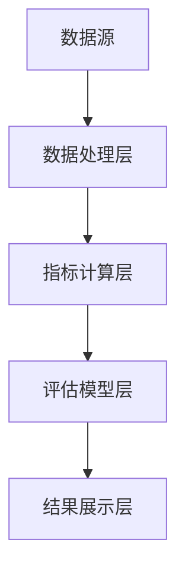

                 


# 美国股市估值:多角度评估方法

> 关键词：美国股市估值、多角度评估、市盈率、市净率、股息率、股票分析

> 摘要：本文从多角度分析美国股市的估值方法，涵盖市盈率、市净率、股息率等核心指标，并结合实际案例和系统架构设计，深入探讨如何科学、全面地评估股市价值。通过对比分析和系统化的评估流程，帮助投资者更好地理解股市估值的本质和实践方法。

---

# 第一部分: 美国股市估值的背景与核心概念

## 第1章: 美国股市估值的背景与重要性

### 1.1 什么是美国股市估值
股票估值是金融领域中的核心问题之一，通过对上市公司的财务数据和市场表现进行分析，评估其内在价值。美国股市作为全球最重要的金融市场之一，其估值方法和实践对全球投资者具有重要参考意义。

### 1.2 股票估值的重要性
- 投资者需要通过估值确定股票的买入和卖出时机。
- 估值帮助投资者识别被低估或高估的股票。
- 股票估值是投资组合管理和风险控制的基础。

### 1.3 美国股市的独特性
- 美国股市市场规模庞大，上市公司数量众多。
- 美国股市的行业分布广泛，涵盖科技、金融、能源等多个领域。
- 美国股市具有较强的流动性和信息透明性。

## 第2章: 核心概念与联系

### 2.1 股票估值的核心指标
- **市盈率（PE）**：衡量股票价格相对于每股收益的高低。
- **市净率（PB）**：衡量股票价格相对于每股净资产的高低。
- **股息率（Dividend Yield）**：衡量股票股息与股票价格的比率。

### 2.2 核心指标对比
通过对比市盈率、市净率和股息率等指标，可以更全面地评估股票的价值。下表为常见估值指标的对比：

| 指标名称 | 定义公式                   | 主要用途               | 优缺点分析               |
|----------|--------------------------|-----------------------|--------------------------|
| PE       | $PE = \frac{Price}{Earnings}$ | 评估公司盈利能力       | 适合盈利稳定的公司，但不适合亏损公司 |
| PB       | $PB = \frac{Price}{Book\ Value}$ | 评估公司资产价值       | 适合金融、地产等资产密集型行业 |
| PS       | $PS = \frac{Price}{Sales}$   | 评估公司收入能力       | 适合成长型企业，但受行业影响较大 |
| Dividend Yield | $Dividend\ Yield = \frac{Dividend}{Price}$ | 评估股票收益能力       | 适合追求稳定收益的投资者 |

### 2.3 实体关系图
以下是股票估值的核心概念关系图：

```mermaid
graph TD
    A[股票] --> B[市盈率(PE)]
    A --> C[市净率(PB)]
    A --> D[股息率]
    B --> E[每股收益(EPS)]
    C --> F[每股净资产(BPS)]
    D --> G[股息]
```

---

# 第二部分: 算法原理与数学模型

## 第3章: 市盈率（PE）的计算与分析

### 3.1 PE的定义与公式
市盈率是股票价格与每股收益的比率，公式为：
$$PE = \frac{Price}{Earnings}$$

### 3.2 PE的计算步骤
1. 收集公司过去一年的净利润数据。
2. 计算每股收益（EPS）：
$$EPS = \frac{\text{净利润}}{\text{总股本}}$$
3. 计算市盈率：
$$PE = \frac{\text{股票价格}}{EPS}$$

### 3.3 PE的优缺点
- **优点**：反映市场对公司的盈利预期，适合比较同类公司的估值。
- **缺点**：不适用于亏损公司，且受市场情绪影响较大。

## 第4章: 市净率（PB）的计算与分析

### 4.1 PB的定义与公式
市净率是股票价格与每股净资产的比率，公式为：
$$PB = \frac{Price}{Book\ Value}$$

### 4.2 PB的计算步骤
1. 收集公司资产负债表中的净资产数据。
2. 计算每股净资产（BPS）：
$$BPS = \frac{\text{净资产}}{\text{总股本}}$$
3. 计算市净率：
$$PB = \frac{\text{股票价格}}{BPS}$$

### 4.3 PB的优缺点
- **优点**：适合评估资产密集型行业，如银行、地产。
- **缺点**：净资产可能包含历史成本，无法反映市场价值。

## 第5章: 股息率的计算与分析

### 5.1 股息率的定义与公式
股息率是股票股息与股票价格的比率，公式为：
$$Dividend\ Yield = \frac{Dividend}{Price}$$

### 5.2 股息率的计算步骤
1. 收集公司过去一年的股息支付数据。
2. 计算股息率：
$$Dividend\ Yield = \frac{\text{股息}}{\text{股票价格}}$$

### 5.3 股息率的优缺点
- **优点**：适合评估收益稳定的公司，如公用事业、消费品行业。
- **缺点**：高股息率可能意味着公司缺乏增长机会。

---

# 第三部分: 系统分析与架构设计

## 第6章: 股票估值系统的架构设计

### 6.1 系统功能设计
股票估值系统需要实现以下功能：
1. 数据收集：获取股票价格、财务数据等。
2. 指标计算：计算PE、PB、股息率等指标。
3. 模型应用：结合多指标进行综合评估。
4. 结果展示：输出估值结果和投资建议。

### 6.2 系统架构图
以下是股票估值系统的架构图：



### 6.3 系统接口设计
股票估值系统需要与数据源（如Yahoo Finance）和数据库进行交互。

---

# 第四部分: 项目实战

## 第7章: 美国股市估值的实战分析

### 7.1 环境安装
安装Python和相关库：
```bash
pip install pandas numpy matplotlib
```

### 7.2 核心代码实现
计算PE、PB和股息率的代码：
```python
import pandas as pd

# 示例数据
data = {
    'Ticker': ['AAPL', 'MSFT', 'GOOGL'],
    'Price': [150, 100, 120],
    'Earnings': [10, 15, 20],
    'Book Value': [50, 60, 70],
    'Dividend': [2, 4, 3]
}

df = pd.DataFrame(data)

# 计算PE、PB、Dividend Yield
df['PE'] = df['Price'] / df['Earnings']
df['PB'] = df['Price'] / df['Book Value']
df['Dividend Yield'] = df['Dividend'] / df['Price']

print(df)
```

### 7.3 实际案例分析
以苹果公司为例，计算其PE和PB：
```python
# 假设数据
price = 150
earnings = 10
book_value = 50

pe = price / earnings
pb = price / book_value

print(f"PE: {pe}, PB: {pb}")
```

---

# 第五部分: 最佳实践与小结

## 第8章: 最佳实践与注意事项

### 8.1 数据来源的重要性
使用可靠的数据源，如Yahoo Finance、FactSet等。

### 8.2 模型适用性
不同行业的公司适合不同的估值指标，需结合行业特点选择合适的方法。

### 8.3 市场环境的影响
宏观经济环境和市场情绪会影响估值结果，需综合考虑。

### 8.4 拓展阅读
- 《投资学》——格理格曼
- 《股票作手回忆录》——埃德温·勒菲弗

---

# 结语

通过对美国股市估值的多角度分析，结合理论与实践，投资者可以更科学地评估股票价值。本文通过详细讲解核心指标、算法原理和系统设计，为读者提供了一套完整的估值方法。

---

# 作者：AI天才研究院 & 禅与计算机程序设计艺术

--- 

*本文遵循 MIT 协议，转载请注明出处。

