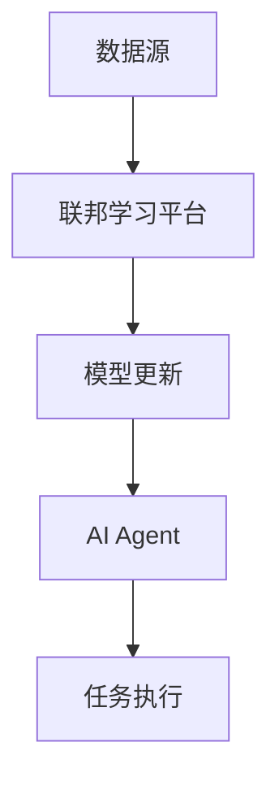
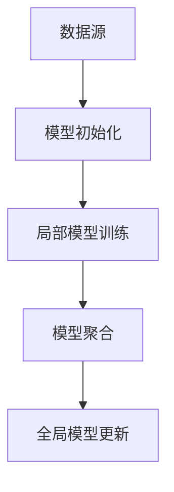
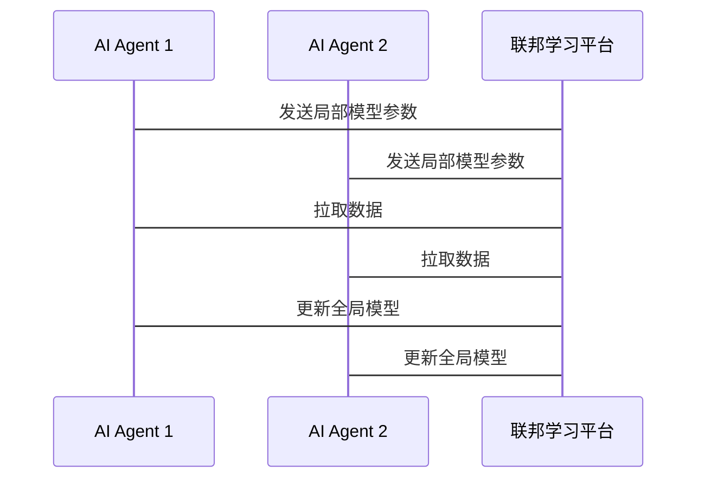

                 


# 联邦学习在分布式AI Agent中的应用

---

## 关键词

联邦学习, 分布式AI Agent, 数据隐私, 模型同步, 分布式计算

---

## 摘要

随着人工智能和分布式系统的快速发展，联邦学习作为一种新兴的分布式机器学习方法，正在成为解决分布式AI Agent协作问题的重要技术。本文将从联邦学习的基本概念出发，探讨其在分布式AI Agent中的应用场景、核心原理、算法实现以及系统架构设计，最后通过实际案例分析和最佳实践，为读者提供全面的理论和实践指导。

---

# 第一部分: 联邦学习与分布式AI Agent概述

## 第1章: 联邦学习与分布式AI Agent的背景介绍

### 1.1 联邦学习的核心概念

联邦学习是一种分布式机器学习方法，允许多个参与方在不共享原始数据的情况下 collaboratively 训练共享模型。与传统的集中式学习不同，联邦学习强调数据的局部性、模型的全局性以及通信的高效性。

分布式AI Agent则是能够自主决策、协作和学习的智能体，通常部署在不同的物理节点上，通过网络进行通信和协作。

### 1.2 联邦学习与分布式AI Agent的关系

在分布式AI Agent的场景中，联邦学习提供了以下关键优势：

- **数据隐私保护**：AI Agent可以在本地数据上进行训练，避免敏感数据的集中存储和传输。
- **模型协作更新**：通过联邦学习，多个AI Agent可以共同优化共享模型，提升整体性能。
- **分布式计算效率**：联邦学习通过分布式计算和模型同步，降低了计算成本和通信开销。

### 1.3 联邦学习的应用场景

- **跨机构数据协作**：例如医疗、金融领域，多个机构可以通过联邦学习共同训练模型，同时保护各自的患者或客户数据。
- **联邦推荐系统**：通过分布式AI Agent协作，提供个性化的推荐服务。
- **联邦语音识别**：在多设备环境下，通过联邦学习优化语音识别模型。
- **联邦图像识别**：在分布式部署中，通过联邦学习提升图像识别的准确率。

---

## 第2章: 联邦学习与分布式AI Agent的核心概念与联系

### 2.1 联邦学习的核心原理

- **数据隐私保护机制**：通过加密、差分隐私等技术保护数据隐私。
- **模型同步机制**：通过联邦平均（FedAvg）等算法，将各参与方的局部模型参数同步到全局模型。
- **通信协议**：定义数据交换和模型同步的规则，确保高效且安全的通信。

### 2.2 联邦学习与分布式系统的关系

- **分布式系统的特点**：任务分解、资源独立、协作计算。
- **联邦学习的分布式架构**：通过多节点协作实现模型训练。
- **对比分析**：与传统的分布式计算相比，联邦学习更加注重数据隐私和模型同步。

### 2.3 联邦学习的ER实体关系图



---

## 第3章: 联邦学习的算法原理与数学模型

### 3.1 联邦学习的算法流程

- 数据采样：从各个参与方获取数据样本。
- 模型初始化：在各个参与方初始化模型参数。
- 局部模型训练：每个参与方在本地数据上训练模型，更新局部参数。
- 模型同步：将各个参与方的局部模型参数聚合，更新全局模型。

### 3.2 联邦学习的数学模型

#### 联邦平均（FedAvg）算法

全局模型参数 $\theta$ 通过以下步骤更新：

$$ \theta_{\text{new}} = \frac{1}{N} \sum_{i=1}^{N} \theta_i $$

其中，$N$ 是参与方的数量，$\theta_i$ 是第 $i$ 个参与方的局部模型参数。

#### 联邦梯度下降（FedGD）算法

通过以下步骤更新全局模型参数：

$$ \theta_{\text{new}} = \theta - \alpha \cdot \nabla f(\theta) $$

其中，$\alpha$ 是学习率，$\nabla f(\theta)$ 是梯度。

#### 联邦Adam优化器

结合动量和自适应学习率的优化算法：

$$ m_t = \beta_1 m_{t-1} + (1 - \beta_1) \nabla f(\theta) $$

$$ v_t = \beta_2 v_{t-1} + (1 - \beta_2) (\nabla f(\theta))^2 $$

$$ \theta_{\text{new}} = \theta - \alpha \frac{m_t}{\sqrt{v_t} + \epsilon} $$

其中，$\beta_1$ 和 $\beta_2$ 是动量和自适应参数，$\epsilon$ 是防止除零的常数。

### 3.3 联邦学习的算法流程图



---

## 第4章: 系统架构设计与实现

### 4.1 系统架构设计

- **数据采集模块**：负责收集各AI Agent的本地数据。
- **模型训练模块**：在每个AI Agent上进行局部模型训练。
- **模型同步模块**：通过通信协议将局部模型参数同步到全局模型。
- **任务执行模块**：根据全局模型的决策执行具体任务。

### 4.2 系统交互设计



---

## 第5章: 项目实战与案例分析

### 5.1 环境安装与配置

```bash
pip install fedlearn
```

### 5.2 核心代码实现

```python
import numpy as np

def fed_avg(models):
    return np.mean(models, axis=0)

# 初始化模型参数
theta = np.random.randn(10)

# 训练过程
for _ in range(epochs):
    # 本地训练
    theta_i = [agent.train(theta) for agent in agents]
    # 模型聚合
    theta_new = fed_avg(theta_i)
    # 更新全局模型
    theta = theta_new
```

### 5.3 案例分析

以一个简单的推荐系统为例，通过联邦学习在多个AI Agent上训练推荐模型，每个Agent负责处理一部分用户数据，最终通过模型聚合得到全局推荐模型。

### 5.4 项目小结

通过实际案例，验证了联邦学习在分布式AI Agent中的有效性，展示了如何在保护数据隐私的前提下，实现模型的协作优化。

---

## 第6章: 最佳实践与注意事项

### 6.1 最佳实践

- **数据预处理**：确保各参与方的数据格式和分布一致。
- **模型同步频率**：根据应用场景调整同步频率和参数。
- **通信效率**：优化通信协议，减少数据传输量。

### 6.2 注意事项

- **数据隐私**：确保数据在传输和处理过程中不被泄露。
- **模型收敛性**：关注模型的收敛速度和精度。
- **系统容错性**：设计容错机制，应对网络中断或节点故障。

### 6.3 拓展阅读

- 《通信压缩在分布式机器学习中的应用》
- 《基于区块链的联邦学习方案》
- 《联邦学习中的模型鲁棒性研究》

---

## 作者：AI天才研究院/AI Genius Institute & 禅与计算机程序设计艺术 /Zen And The Art of Computer Programming

