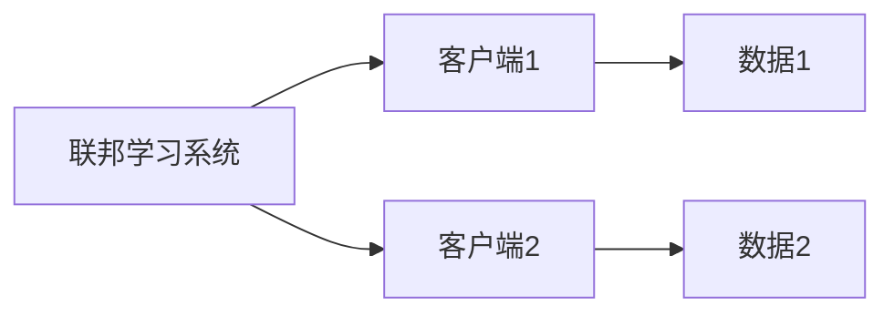
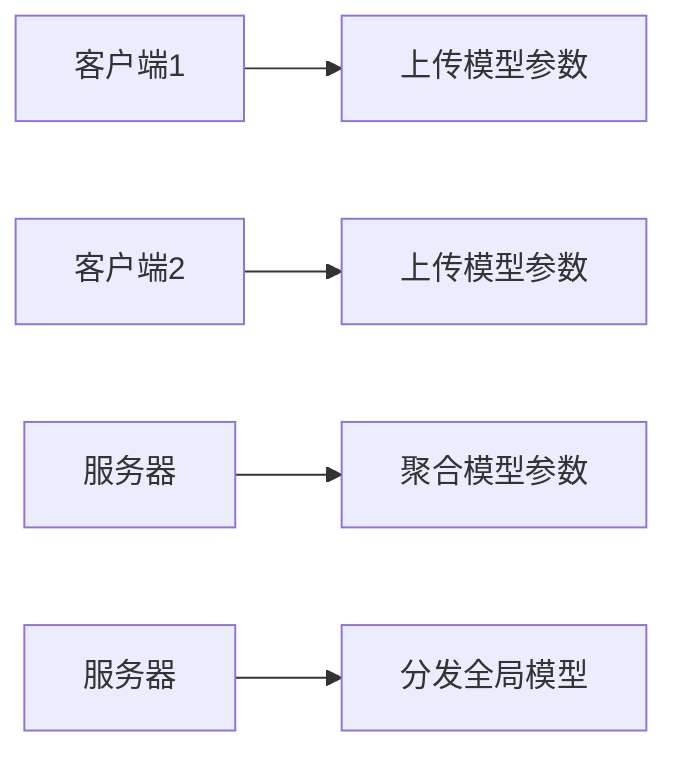
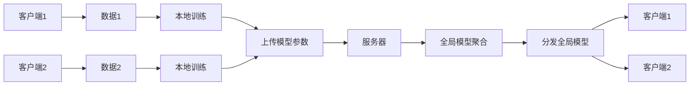

                 


```markdown
# 联邦学习：保护隐私的分布式AI Agent训练

## 关键词：联邦学习，分布式AI，数据隐私，机器学习，隐私保护

## 摘要：  
本文深入探讨了联邦学习（Federated Learning）这一新兴的分布式机器学习范式，重点介绍其如何在保护数据隐私的前提下，实现多个分布式节点协作训练高精度AI模型。文章从背景、核心概念、算法原理、系统架构到实战项目，全面解析联邦学习的技术细节和应用场景，帮助读者理解其在隐私保护与分布式计算中的独特价值和实际应用。

---

# 第一部分: 联邦学习的背景与核心概念

## 第1章: 联邦学习的背景与问题背景

### 1.1 数据隐私与分布式AI的挑战

#### 1.1.1 数据隐私的重要性  
在人工智能快速发展的今天，数据是训练模型的“燃料”。然而，数据往往涉及个人隐私、商业机密或敏感信息，如何在不泄露原始数据的前提下进行模型训练，成为亟待解决的问题。  

#### 1.1.2 分布式AI的必要性  
传统的集中式AI训练模式依赖于将所有数据集中到一个中心服务器，这种方式虽然效率高，但存在数据泄露和隐私风险。而分布式AI通过将数据分布在不同设备或机构中进行本地训练，避免了数据的集中存储和传输，符合隐私保护的需求。  

#### 1.1.3 联邦学习的提出背景  
随着《通用数据保护条例》（GDPR）等隐私保护法规的出台，数据使用的合法性、合规性成为企业和机构的重中之重。联邦学习作为一种新兴的分布式学习范式，完美解决了数据隐私与模型训练之间的矛盾。  

---

## 第2章: 联邦学习的核心概念与联系

### 2.1 联邦学习的核心概念

#### 2.1.1 联邦学习的参与方  
- **客户端（Client）**：数据所在的设备或机构，负责本地模型训练。  
- **服务器（Server）**：协调多个客户端的训练过程，聚合模型参数。  
- **数据提供者（Data Provider）**：提供数据的机构或个人，数据仅在本地使用。  

#### 2.1.2 联邦学习的数据分布  
- 数据分布在多个客户端本地，每个客户端持有部分数据，不共享原始数据，仅共享模型参数。  
- 数据分布可以是同质化的（所有客户端数据分布相似）或异质化的（数据分布差异较大）。  

#### 2.1.3 联邦学习的通信机制  
- **点对点通信**：客户端直接与服务器通信，常见于跨机构的联邦学习场景。  
- **网状通信**：客户端之间直接通信，减少对中心服务器的依赖，适用于去中心化场景。  

---

### 2.2 联邦学习的核心原理

#### 2.2.1 数据局部训练  
每个客户端在本地数据上训练模型，生成梯度或模型参数。  
- 优势：避免数据泄露，保护隐私。  
- 示例：使用本地数据训练一个简单的线性回归模型。  

#### 2.2.2 模型聚合  
将多个客户端的局部模型参数聚合，生成一个全局模型。  
- 常用方法：FedAvg（联邦平均）、FedSGD（联邦随机梯度下降）。  

#### 2.2.3 数据隐私保护  
通过加密通信、差分隐私（Differential Privacy）等技术，进一步保护数据隐私。  

---

### 2.3 联邦学习的概念属性对比表

| 属性               | 联邦学习                | 分布式学习             | 集中式学习           |
|--------------------|-------------------------|-----------------------|----------------------|
| 数据分布           | 分散在不同客户端       | 分散在不同节点或设备   | 集中在中心服务器     |
| 数据共享           | 不共享原始数据，仅共享模型参数 | 数据共享模型参数或部分数据 | 数据共享原始数据     |
| 隐私保护           | 高                     | 中                   | 低                   |
| 通信开销           | 较高                   | 较高                 | 较低                 |
| 计算效率           | 较低                   | 中                   | 高                   |

---

### 2.4 联邦学习的实体关系图



---

## 第3章: 联邦学习的算法原理

### 3.1 联邦学习的算法流程

#### 3.1.1 数据采样  
- 每个客户端从本地数据集中采样一批数据，用于训练本地模型。  

#### 3.1.2 模型训练  
- 在本地数据上进行模型训练，生成梯度或模型参数。  

#### 3.1.3 模型聚合  
- 将所有客户端的局部模型参数上传到服务器，服务器聚合这些参数，生成全局模型。  

#### 3.1.4 全局模型分发  
- 服务器将聚合后的全局模型分发给所有客户端，客户端更新本地模型。  

---

### 3.2 联邦平均算法（FedAvg）

#### 3.2.1 算法流程



#### 3.2.2 算法公式

全局模型参数更新公式：  
$$\theta_{\text{global}} = \frac{1}{N}\sum_{i=1}^{N}\theta_{\text{client}_i}$$  

其中，$N$ 是客户端数量，$\theta_{\text{client}_i}$ 是第 $i$ 个客户端的模型参数。  

---

### 3.3 实际案例分析

#### 3.3.1 示例代码

```python
import numpy as np

# 客户端1的本地数据
data_client1 = np.random.rand(100, 2)
label_client1 = np.random.randint(2, size=100)

# 客户端1的模型训练
model_client1 = LinearModel()
model_client1.train(data_client1, label_client1)

# 客户端2的本地数据
data_client2 = np.random.rand(100, 2)
label_client2 = np.random.randint(2, size=100)

# 客户端2的模型训练
model_client2 = LinearModel()
model_client2.train(data_client2, label_client2)

# 聚合模型参数
global_model = FedAvg(model_client1.model_params, model_client2.model_params)
```

---

## 第4章: 联邦学习的系统架构设计

### 4.1 系统架构组成

#### 4.1.1 问题场景介绍  
- 数据分布在多个客户端，每个客户端持有部分数据。  
- 服务器负责协调客户端的训练过程，聚合模型参数。  

#### 4.1.2 系统功能设计  
- 数据采样与本地训练  
- 模型参数上传与聚合  
- 全局模型分发与更新  

#### 4.1.3 系统架构图  



---

## 第5章: 联邦学习的项目实战

### 5.1 环境安装

#### 5.1.1 安装依赖  
- Python 3.8+  
- TensorFlow或PyTorch  
- Federated学习库（如TFF或FedML）  

#### 5.1.2 代码实现  

```python
import numpy as np
from fedlearn.client import Client
from fedlearn.server import Server

# 初始化客户端
client1 = Client(data_client1, label_client1)
client2 = Client(data_client2, label_client2)

# 初始化服务器
server = Server()

# 联邦学习过程
server.run_federated_learning([client1, client2])
```

---

## 第6章: 联邦学习的最佳实践

### 6.1 总结与小结

- 联邦学习是一种在保护数据隐私的前提下，实现分布式AI模型训练的新兴范式。  
- 通过局部训练和模型聚合，联邦学习能够在不共享原始数据的情况下，训练出高精度的全局模型。  

### 6.2 实践中的注意事项

- 数据分布的异质性会影响模型聚合的效果，需选择合适的聚合方法。  
- 加密通信和差分隐私等技术可以进一步增强数据隐私保护。  

### 6.3 拓展阅读

- 《Federated Learning: Challenges, Methods, and Future Directions》  
- 《Differential Privacy: A Survey of the State-of-the-Art》  

---

## 作者：AI天才研究院 & 禅与计算机程序设计艺术

---

**摘要结束**

