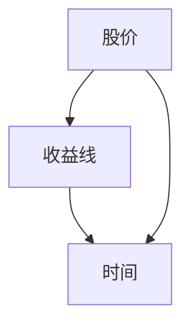

                 

# 股价与收益线的比较：彼得林奇的估值方法

> 关键词：彼得林奇、股价、收益线、估值方法、投资分析、PEG指标

> 摘要：本文深入探讨了彼得·林奇的估值方法，特别是如何通过比较股价与收益线来进行投资分析。文章详细介绍了股价与收益线的基本概念，分析了林奇的PEG指标及其应用，通过实际案例展示了这些方法的实践价值，并讨论了其局限性和改进策略。最后，通过项目实战，指导读者在Python中实现这些估值方法，帮助投资者更好地理解和应用这一投资技巧。

---

## 第1章: 彼得·林奇与投资估值概述

### 1.1 彼得·林奇及其投资理念
彼得·林奇是美国著名的投资家和对冲基金经理，以其在富达投资管理公司的长期成功而闻名。他的投资哲学强调深入研究公司基本面，寻找那些具有持续增长潜力的公司，并长期持有。林奇认为，投资者应该关注企业的盈利能力和成长性，而不是短期市场波动。

#### 1.1.1 彼得·林奇的生平简介
彼得·林奇出生于1948年，毕业于宾夕法尼亚大学和哈佛商学院。他在1971年加入富达投资，管理着多只基金，尤其是麦哲伦基金，使其规模从1977年的2200万美元增长到1990年的140亿美元，年平均回报率超过29%。林奇于1990年退休，著有多本书籍，分享他的投资理念。

#### 1.1.2 林奇的投资哲学与方法
林奇强调基本面分析，认为股价最终反映企业的内在价值。他主张通过分析财务报表，尤其是收益和利润情况，来评估公司的成长潜力。林奇的估值方法注重将股价与公司的盈利增长潜力进行比较，寻找那些被市场低估的股票。

#### 1.1.3 林奇对估值方法的贡献
林奇发展了PEG（价格/盈利增长）指标，将市盈率与盈利增长率结合起来，为投资者提供了一个更全面的估值工具。这种方法不仅考虑了当前的盈利能力，还考虑了未来的增长潜力，帮助投资者识别出具有竞争优势的公司。

### 1.2 股价与收益线的基本概念
股价是指股票在市场上的交易价格，反映了市场对公司的整体估值。收益线则指公司过去和未来的盈利情况，通常以图表形式展示。

#### 1.2.1 股价的定义与作用
股价是投资者购买某一公司股票所需支付的价格，反映了市场对公司价值的评估。股价的波动性较高，受市场情绪、宏观经济环境等多种因素影响。

#### 1.2.2 收益线的定义与作用
收益线是通过时间序列数据绘制的图表，显示公司过去和预期的盈利情况。收益线可以帮助投资者了解公司的盈利趋势，评估其增长潜力。

#### 1.2.3 股价与收益线的关系
股价与收益线密切相关，高增长的公司通常会有较高的股价，但过高或过低的股价可能导致市场对公司的过高或过低估值。

### 1.3 股价与收益线比较的意义
通过比较股价与收益线，投资者可以评估市场对公司的估值是否合理，发现潜在的投资机会。

#### 1.3.1 为什么比较股价与收益线
比较股价与收益线可以帮助投资者判断公司是否被低估或高估，从而做出更明智的投资决策。

#### 1.3.2 比较在投资决策中的作用
通过比较，投资者可以识别出那些具有成长潜力且估值合理的企业，降低投资风险。

#### 1.3.3 比较方法的局限性
比较方法的局限性在于市场波动和公司内部因素可能影响其准确性。

---

## 第2章: 股价与收益线的核心概念

### 2.1 股价与收益线的属性对比
#### 2.1.1 股价的波动性
股价受市场情绪和宏观经济因素影响，波动性较高。

#### 2.1.2 收益线的稳定性
收益线反映公司盈利情况，通常较为稳定，但也可能因行业变化而波动。

#### 2.1.3 两者的时间维度差异
股价通常反映短期市场情绪，而收益线关注长期盈利能力。

### 2.2 股价与收益线的数学模型
#### 2.2.1 股价的数学表达式
股价可以通过多种模型计算，如市盈率模型（P/E）和PEG模型。

#### 2.2.2 收益线的数学表达式
收益线可以通过时间序列分析模型，如ARIMA，进行预测。

#### 2.2.3 两者的相关性分析
通过计算股价与收益线的协方差和相关系数，可以评估它们之间的相关性。

### 2.3 股价与收益线的ER实体关系图

---

## 第3章: 彼得·林奇的估值方法

### 3.1 林奇的PEG指标
PEG指标将市盈率与盈利增长率结合，帮助投资者评估股价是否合理。

#### 3.1.1 PEG的定义
PEG = 市盈率 / 盈利增长率（年化）

#### 3.1.2 PEG的应用案例
例如，某公司市盈率为20，年利润增长率10%，则PEG=2。

#### 3.1.3 PEG的计算公式
$$PEG = \frac{P/E}{G}$$
其中，P/E为市盈率，G为年利润增长率。

### 3.2 其他相关指标
#### 3.2.1 市盈率
市盈率 = 股价 / 每股收益。

#### 3.2.2 市净率
市净率 = 股价 / 每股净资产。

#### 3.2.3 股息率
股息率 = 每股股息 / 股价。

### 3.3 指标的对比分析
通过对比分析，选择最适合当前市场环境的估值指标。

---

## 第4章: 实际案例分析

### 4.1 案例一：科技公司
分析某科技公司的股价与收益线，计算PEG指标，评估其估值是否合理。

### 4.2 案例二：传统制造业公司
同样进行分析，对比不同行业的估值差异。

### 4.3 案例三：新兴行业公司
新兴行业的公司通常增长潜力大，但风险也较高，需谨慎评估。

---

## 第5章: 估值方法的局限性与改进

### 5.1 方法的局限性
市场波动、数据假设不合理性、公司内部因素等可能影响估值结果。

### 5.2 改进策略
结合多种估值方法，定期更新数据，提高数据准确性。

---

## 第6章: 项目实战与代码实现

### 6.1 环境安装
安装Python及Pandas、NumPy等数据分析库。

### 6.2 核心代码实现
#### 6.2.1 数据获取与处理
使用Yahoo Finance API获取股票数据。

#### 6.2.2 股价与收益线的计算
计算PEG指标和相关图表。

#### 6.2.3 可视化展示
使用Matplotlib绘制股价与收益线的对比图。

### 6.3 案例分析与解读
通过具体案例展示代码运行结果，并进行详细解读。

---

## 第7章: 最佳实践

### 7.1 小结
彼得林奇的估值方法通过比较股价与收益线，帮助投资者识别低估股票。

### 7.2 注意事项
投资者需结合市场环境和其他因素，谨慎使用这些方法。

### 7.3 拓展阅读
推荐相关书籍和文章，进一步深入学习估值方法。

---

## 作者：AI天才研究院/AI Genius Institute & 禅与计算机程序设计艺术 /Zen And The Art of Computer Programming

