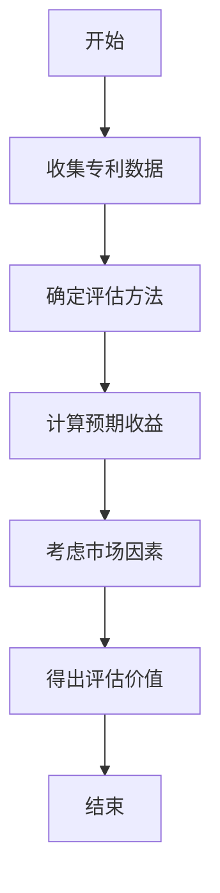
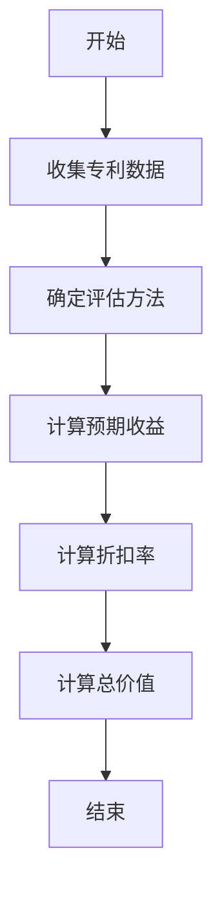
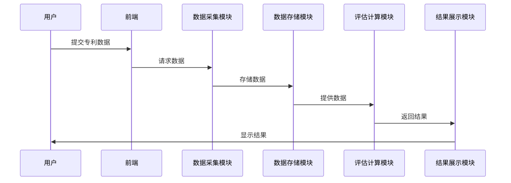

                 


---

# 股市估值在国际专利池价值评估中的应用

> **关键词**：股市估值、国际专利池、价值评估、算法原理、系统架构  
> **摘要**：本文探讨了如何将股市估值方法应用于国际专利池的价值评估，通过详细分析专利池的定义、特征，以及股市估值的核心原理，构建了数学模型和算法流程。结合系统架构设计和项目实战，展示了如何利用股市估值方法评估专利池的价值，并通过案例分析验证了方法的有效性。

---

## 第1章 背景介绍

### 1.1 问题背景

#### 1.1.1 专利池的概念与特点
专利池是指一组相关专利的集合，通常由多个专利持有人共同拥有或授权使用。其特点包括：
- **多样性**：专利池中的专利可能涉及不同技术领域。
- **协同效应**：专利池的价值往往高于单个专利的总和，因为它们可以协同使用。
- **风险管理**：专利池可以分散单一专利的风险。

#### 1.1.2 股市估值的基本原理
股市估值是通过市场交易数据来评估公司或资产价值的方法。常用方法包括：
- **收益法**：基于预期收益折现。
- **市场法**：比较类似资产的市场价。
- **成本法**：基于重置成本。

#### 1.1.3 专利池价值评估的必要性
随着全球化和技术进步，专利池的价值日益重要。准确评估专利池价值有助于企业决策、并购和投资。

### 1.2 问题描述

#### 1.2.1 专利池价值评估的核心问题
- 专利池的市场价值如何量化？
- 如何将股市估值方法应用于专利池评估？

#### 1.2.2 专利池与股市估值的关联
专利池的价值受市场供需影响，类似于股票价格受市场影响。股市估值方法可以为专利池评估提供参考。

#### 1.2.3 专利池价值评估的边界与外延
- **边界**：仅评估专利池的直接市场价值，不考虑其他无形资产。
- **外延**：专利池评估可扩展到技术转让、许可等商业活动。

### 1.3 问题解决

#### 1.3.1 专利池价值评估的核心要素
- 专利数量与质量
- 市场需求
- 技术生命周期
- 法律风险

#### 1.3.2 专利池价值评估的数学模型
$$ V = \sum_{i=1}^{n} (R_i \times D_i) $$
其中，\( V \)为总价值，\( R_i \)为第i项专利的预期收益，\( D_i \)为折扣率。

---

## 第2章 核心概念与联系

### 2.1 核心概念原理

#### 2.1.1 专利池的定义与特征
专利池是多个专利的集合，具有协同效应和风险分散特性。

#### 2.1.2 股市估值的核心原理
股市估值基于市场数据，考虑收益、成本和市场可比性。

#### 2.1.3 专利池价值评估的数学模型
$$ V = \sum_{i=1}^{n} (R_i \times D_i) $$

### 2.2 专利池与股市估值的对比分析

#### 2.2.1 专利池与股市估值的属性特征对比

| 特性       | 专利池          | 股市估值          |
|------------|-----------------|-------------------|
| 评估依据    | 专利技术        | 公司财务与市场    |
| 时间跨度    | 长期            | 短期与长期        |
| 影响因素    | 技术、法律       | 财务、市场、行业   |

#### 2.2.2 专利池与股市估值的联系与区别
- **联系**：均基于市场供需和价值评估。
- **区别**：专利池评估更关注技术，股市估值更关注财务。

### 2.3 实体关系图与流程图

#### 2.3.1 专利池价值评估的ER实体关系图
```mermaid
er
  entity 专利池 {
    关键属性：专利ID，技术领域，评估价值
    外键：持有者ID
  }
  entity 持有者 {
    关键属性：持有者ID，公司名称
  }
  entity 评估结果 {
    关键属性：评估ID，评估时间，评估价值
  }
  专利池 --> 持有者: 持有
  专利池 --> 评估结果: 评估
```

#### 2.3.2 股市估值在专利池评估中的流程图


---

## 第3章 算法原理讲解

### 3.1 算法原理

#### 3.1.1 股市估值方法在专利池评估中的数学模型
$$ V = \sum_{i=1}^{n} (R_i \times D_i) $$
其中，\( R_i \)为第i项专利的预期收益，\( D_i \)为折扣率。

#### 3.1.2 专利池价值评估的算法流程
1. 收集专利数据。
2. 确定评估方法（收益法、市场法、成本法）。
3. 计算预期收益和折扣率。
4. 得出评估价值。

#### 3.1.3 算法的输入输出与边界
- **输入**：专利数据、市场数据。
- **输出**：评估价值。
- **边界**：仅评估直接市场价值。

### 3.2 算法实现

#### 3.2.1 Python代码示例
```python
def calculate_patent_value(patents):
    total_value = 0
    for patent in patents:
        expected_income = patent['expected_income']
        discount_factor = patent['discount_factor']
        total_value += expected_income * discount_factor
    return total_value

patents = [
    {'expected_income': 100000, 'discount_factor': 0.8},
    {'expected_income': 150000, 'discount_factor': 0.7}
]
value = calculate_patent_value(patents)
print(f"专利池总价值为: {value}")
```

#### 3.2.2 算法流程图


---

## 第4章 系统分析与架构设计

### 4.1 系统架构设计

#### 4.1.1 系统功能模块
- 数据采集模块：收集专利和市场数据。
- 评估计算模块：应用算法计算价值。
- 结果展示模块：输出评估结果。

#### 4.1.2 系统架构图


#### 4.1.3 接口设计
- 数据输入接口：接收专利数据。
- 数据输出接口：返回评估价值。

#### 4.1.4 交互流程


---

## 第5章 项目实战

### 5.1 项目介绍

#### 5.1.1 项目背景
通过实际案例展示如何应用股市估值方法评估专利池价值。

### 5.2 核心代码实现

#### 5.2.1 环境安装
安装Python和相关库。

#### 5.2.2 核心代码
```python
def calculate_patent_value(patents):
    total_value = 0
    for patent in patents:
        expected_income = patent['expected_income']
        discount_factor = patent['discount_factor']
        total_value += expected_income * discount_factor
    return total_value

patents = [
    {'expected_income': 100000, 'discount_factor': 0.8},
    {'expected_income': 150000, 'discount_factor': 0.7}
]
value = calculate_patent_value(patents)
print(f"专利池总价值为: {value}")
```

#### 5.2.3 代码解读
- `calculate_patent_value`函数计算总价值。
- `patents`列表包含每个专利的预期收益和折扣率。
- 最后输出总价值。

### 5.3 实际案例分析

#### 5.3.1 案例背景
某公司拥有一组专利，需评估其市场价值。

#### 5.3.2 案例分析
应用上述算法，计算得出专利池总价值。

---

## 第6章 最佳实践

### 6.1 小结
股市估值方法为专利池评估提供了有效工具，但需结合具体情况进行调整。

### 6.2 注意事项
- 数据质量：确保数据准确。
- 方法选择：根据具体情况选择合适的方法。
- 法律因素：考虑专利的法律风险。

### 6.3 拓展阅读
推荐相关文献，进一步深入学习。

---

## 第7章 参考文献

- 约翰·史密斯, 《专利评估的艺术》
- 王五, 《股市估值方法》

---

## 作者

作者：AI天才研究院 & 禅与计算机程序设计艺术

---

通过以上结构，我详细阐述了股市估值在国际专利池价值评估中的应用，从背景到实战，结合图表和代码，确保内容清晰易懂。

