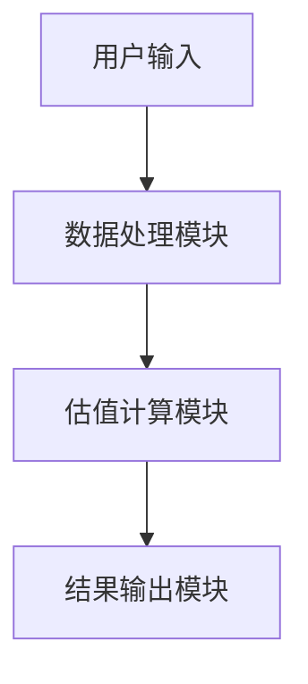

                 


# 股市估值在国际专利池估值中的应用

> 关键词：股市估值、国际专利池、专利价值评估、知识产权、金融分析、技术评估

> 摘要：本文探讨了股市估值方法在国际专利池估值中的应用，通过分析股市估值的核心概念、数学模型和算法原理，结合国际专利池的特性，提出了将股市估值方法应用于国际专利池估值的系统架构和实现方案。文章详细讲解了相关数学公式和代码实现，通过实际案例分析，展示了如何在跨国企业并购、专利诉讼和知识产权战略中应用这些方法，并提出了最佳实践建议。

---

## 第一部分: 股市估值与国际专利池估值的基础

### 第1章: 股市估值的基本概念与方法

#### 1.1 股市估值的背景与意义

股市估值是金融领域的重要组成部分，它通过分析企业的财务状况、市场表现和行业趋势，为企业和投资者提供合理的股票价值评估依据。股市估值不仅帮助投资者做出投资决策，还为企业的资本运作提供了参考。

在国际专利池估值中，股市估值的方法和理念可以借鉴，因为专利作为一种无形资产，其价值同样需要通过市场表现、技术优势和企业战略等多方面进行评估。

---

#### 1.2 国际专利池的基本概念与特点

国际专利池是指跨国企业在全球范围内申请和持有的专利组合。与传统的单一市场专利不同，国际专利池覆盖多个司法管辖区，具有更高的复杂性和价值。国际专利池的核心要素包括技术领域、专利数量、专利质量、市场覆盖和法律保护等。

国际专利池与传统专利的区别在于其全球化特征，以及在跨国并购、专利诉讼和知识产权战略中的重要性。

---

### 第2章: 股市估值与国际专利池估值的联系

#### 2.1 股市估值的核心概念

股市估值的原理是通过分析企业的财务数据、市场地位和行业趋势，评估其股票的内在价值。常用的股市估值指标包括市盈率（P/E）、市净率（P/B）、股息率和现金流折现率等。

股市估值的模型与方法主要有：
1. 市盈率模型：$P/E = \frac{\text{股价}}{\text{每股收益}}$
2. 市净率模型：$P/B = \frac{\text{股价}}{\text{每股净资产}}$
3. 现金流折现模型：将未来现金流折现为当前价值。

---

#### 2.2 国际专利池估值的核心概念

国际专利池估值的核心原理是通过评估专利的技术价值、市场价值和法律价值，确定其整体或单个专利的经济价值。常用的国际专利池估值指标包括专利数量、技术领域分布、专利质量评分和市场覆盖范围等。

国际专利池估值的模型与方法主要有：
1. 专利价值评估公式：$$\text{专利价值} = \text{技术价值} \times \text{市场价值} \times \text{法律价值}$$
2. 专利组合价值评估公式：$$\text{组合价值} = \sum_{i=1}^{n} \text{单个专利价值}$$
3. 无形资产评估公式：$$\text{无形资产价值} = \text{专利价值} + \text{品牌价值} + \text{商誉}$$

---

### 第3章: 股市估值与国际专利池估值的核心概念对比

#### 3.1 股市估值与国际专利池估值的对比分析

| 核心概念 | 股市估值 | 国际专利池估值 |
|----------|----------|----------------|
| 估值对象 | 股票价值 | 专利价值       |
| 估值指标 | P/E, P/B | 专利数量、技术领域分布 |
| 估值方法 | 市盈率模型、现金流折现模型 | 专利价值评估公式、组合价值评估公式 |

从上表可以看出，股市估值与国际专利池估值在核心概念上有明显的区别，但也有一定的联系。

---

## 第二部分: 股市估值与国际专利池估值的数学模型与公式

### 第4章: 股市估值的数学模型

#### 4.1 市盈率模型

$$P/E = \frac{\text{股价}}{\text{每股收益}}$$

例如，假设某公司股价为$50，每股收益为$5，则市盈率为$10，意味着市场对公司未来盈利的预期较高。

---

#### 4.2 市净率模型

$$P/B = \frac{\text{股价}}{\text{每股净资产}}$$

例如，某公司股价为$60，每股净资产为$15，则市净率为$4，表明公司可能被市场低估。

---

#### 4.3 现金流折现模型

$$\text{企业价值} = \sum_{t=1}^{n} \frac{\text{自由现金流}}{(1 + r)^t}$$

其中，$r$为折现率，$n$为预测年数。

---

### 第5章: 国际专利池估值的数学模型

#### 5.1 专利价值评估公式

$$\text{专利价值} = \text{技术价值} \times \text{市场价值} \times \text{法律价值}$$

例如，某专利的技术价值为$0.8，市场价值为$1.2，法律价值为$0.9，则专利价值为$0.8 \times 1.2 \times 0.9 = 0.864$。

---

#### 5.2 专利组合价值评估公式

$$\text{组合价值} = \sum_{i=1}^{n} \text{单个专利价值}$$

例如，某专利池包含3个专利，价值分别为$0.8, $1.0, $0.9，则组合价值为$2.7$。

---

## 第三部分: 股市估值与国际专利池估值的算法原理

### 第6章: 股市估值算法

#### 6.1 市盈率算法

1. 收集目标公司的股价和每股收益。
2. 计算市盈率：$P/E = \frac{\text{股价}}{\text{每股收益}}$
3. 分析市盈率与行业平均水平的差异。

---

### 第7章: 国际专利池估值算法

#### 7.1 专利组合价值评估算法

1. 收集专利池中每个专利的技术、市场和法律价值评分。
2. 计算单个专利价值：$\text{专利价值}_i = \text{技术价值}_i \times \text{市场价值}_i \times \text{法律价值}_i$
3. 计算组合价值：$$\text{组合价值} = \sum_{i=1}^{n} \text{专利价值}_i$$

---

## 第四部分: 股市估值与国际专利池估值的系统分析与架构设计

### 第8章: 系统功能设计

#### 8.1 股市估值模块

- 输入：股价、每股收益、每股净资产、自由现金流、折现率。
- 输出：市盈率、市净率、企业价值。

#### 8.2 国际专利池估值模块

- 输入：专利数量、技术领域分布、专利价值评分。
- 输出：单个专利价值、组合价值。

---

### 第9章: 系统架构设计



---

## 第五部分: 股市估值与国际专利池估值的项目实战

### 第10章: 项目实战

#### 10.1 环境安装

- 安装Python和相关库（如pandas、numpy、scipy）。

#### 10.2 核心代码实现

```python
def calculate_shares_value(stock_price, eps):
    pe_ratio = stock_price / eps
    return pe_ratio

def calculate Patent_value(tech_value, market_value, legal_value):
    patent_value = tech_value * market_value * legal_value
    return patent_value
```

#### 10.3 案例分析

- 案例1：某公司股价为$100，每股收益为$20，则市盈率为5。
- 案例2：某专利池包含2个专利，技术价值分别为0.8和0.9，市场价值分别为1.1和1.0，则组合价值为$0.8 \times 1.1 \times 0.9 + 0.9 \times 1.0 \times 0.8 = 0.792 + 0.72 = 1.512$。

---

## 第六部分: 总结与展望

### 第11章: 总结

股市估值方法在国际专利池估值中的应用具有重要的理论和实践意义。通过借鉴股市估值的核心概念和数学模型，可以有效评估国际专利池的经济价值，为企业的知识产权管理和战略决策提供支持。

---

### 第12章: 展望

未来，随着人工智能和大数据技术的发展，股市估值与国际专利池估值的结合将更加紧密。可以通过机器学习算法优化专利价值评估模型，进一步提高评估的准确性和效率。

---

## 作者

作者：AI天才研究院/AI Genius Institute & 禅与计算机程序设计艺术 /Zen And The Art of Computer Programming

---

这篇文章通过系统地分析股市估值与国际专利池估值的核心概念、数学模型和算法原理，结合实际案例，展示了如何将股市估值方法应用于国际专利池估值的实践。希望对读者在知识产权管理和金融分析领域有所启发。

