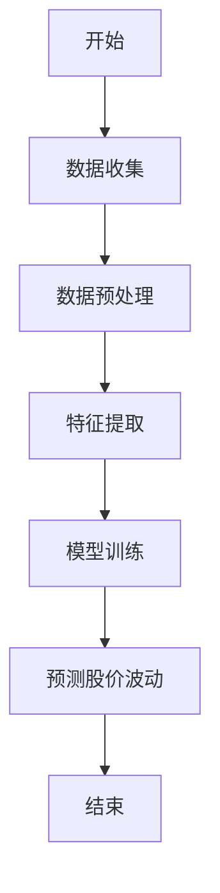
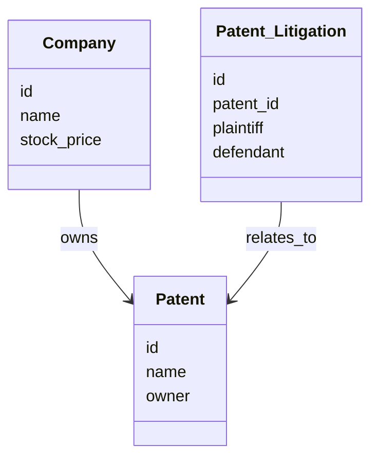
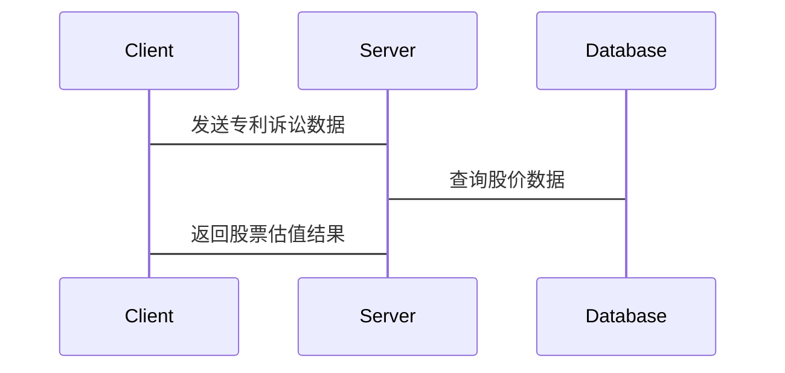

                 


# 股市估值在国际专利诉讼中的应用

## 关键词：股市估值、国际专利诉讼、股票估值模型、专利诉讼影响、股价波动预测

## 摘要：本文探讨了股市估值在国际专利诉讼中的应用，分析了股票估值的核心概念与专利诉讼的基本要素，构建了基于股票估值模型的算法流程，展示了如何利用数学模型预测专利诉讼对股价的影响，最后通过实际案例分析了股市估值在国际专利诉讼中的应用前景。

---

# 第一部分: 股市估值与国际专利诉讼的背景与核心概念

## 第1章: 股市估值与国际专利诉讼的背景介绍

### 1.1 股市估值的核心概念

#### 1.1.1 股票估值的基本方法

股票估值是通过对企业的财务状况、行业地位、盈利能力等多方面因素进行分析，以确定其股票的内在价值。常见的股票估值方法包括：

1. **市盈率（P/E）**：市盈率 = 股票价格 / 每股净利润。
2. **市净率（P/B）**：市净率 = 股票价格 / 每股净资产。
3. **股息率**：股息率 = 每股股息 / 股票价格。

#### 1.1.2 专利诉讼的基本概念

专利诉讼是指在专利权受到侵犯时，专利权人通过法律途径维护自身权益的行为。国际专利诉讼涉及多个国家或地区的专利法，具有复杂性和多样性的特点。

#### 1.1.3 股市估值与专利诉讼的关联性

企业的专利资产对其市场价值有重要影响。当企业卷入专利诉讼时，投资者会根据诉讼的可能结果调整其股票估值，从而影响股价波动。

### 1.2 国际专利诉讼的现状与挑战

#### 1.2.1 国际专利诉讼的主要特点

1. **跨国性**：涉及不同国家的专利法和司法程序。
2. **复杂性**：专利技术涉及多个领域，法律程序复杂。
3. **高成本**：国际专利诉讼通常耗时长、费用高。

#### 1.2.2 股市对专利诉讼的敏感性分析

投资者对专利诉讼的反应取决于诉讼的性质、企业的财务状况和市场地位。例如，一家拥有强大专利组合的公司可能在诉讼中占据优势，从而提升股价。

#### 1.2.3 专利诉讼对股价波动的影响机制

1. **负面新闻**：专利侵权指控可能导致股价下跌。
2. **诉讼结果**：有利的诉讼结果可能提升股价，不利结果则反之。
3. **市场预期**：市场对诉讼结果的预期也会影响股价。

### 1.3 股市估值在专利诉讼中的应用前景

#### 1.3.1 股市估值在专利诉讼中的潜在价值

通过股票估值模型，投资者可以预测专利诉讼对企业价值的影响，从而做出更明智的投资决策。

#### 1.3.2 企业利用股市估值应对专利诉讼的优势

企业可以利用股票估值模型评估专利诉讼的风险和收益，制定更有效的诉讼策略。

#### 1.3.3 股市估值在专利诉讼中的应用挑战

1. **数据获取难度**：需要获取详细的财务数据和专利信息。
2. **模型准确性**：股票估值模型的准确性受到多种因素的影响。
3. **法律复杂性**：国际专利诉讼的法律程序复杂，增加了模型的复杂性。

### 1.4 本章小结

本章介绍了股市估值和国际专利诉讼的基本概念，分析了两者之间的关联性，并探讨了股市估值在专利诉讼中的应用前景。

---

## 第2章: 股市估值与国际专利诉讼的核心概念与联系

### 2.1 股票估值的关键原理

#### 2.1.1 市盈率（P/E）的定义与计算

市盈率 = 股票价格 / 每股净利润。

#### 2.1.2 市净率（P/B）的定义与计算

市净率 = 股票价格 / 每股净资产。

#### 2.1.3 股东权益与股票价值的关系

股东权益是企业净资产的价值，影响股票的内在价值。

### 2.2 专利诉讼的核心要素

#### 2.2.1 专利权的基本属性

专利权包括发明的独占权、使用权和转让权。

#### 2.2.2 专利侵权的判定标准

专利侵权的判定通常基于技术特征的对比。

#### 2.2.3 专利诉讼的法律程序

专利诉讼的法律程序包括立案、举证、审理和判决。

### 2.3 股市估值与专利诉讼的联系

#### 2.3.1 专利诉讼对股价的影响路径

1. **直接影响**：专利诉讼的结果直接影响企业的财务状况。
2. **间接影响**：市场对专利诉讼的预期影响股价。

#### 2.3.2 股票估值在专利诉讼中的应用场景

1. **风险评估**：通过股票估值模型评估专利诉讼的风险。
2. **投资决策**：投资者根据股票估值结果做出投资决策。

#### 2.3.3 股市估值与专利诉讼的协同效应

通过股票估值模型，可以量化专利诉讼对企业价值的影响，从而为投资决策提供依据。

### 2.4 核心概念对比分析

#### 2.4.1 股票估值与专利价值的对比表格

| 比较维度 | 股票估值 | 专利价值 |
|----------|----------|----------|
| 定义     | 股票的内在价值 | 专利的经济价值 |
| 计算方式 | 市盈率、市净率等 | 评估报告、市场交易等 |

#### 2.4.2 专利诉讼与股价波动的ER实体关系图

```mermaid
erd
    Customer: id, name
    Patent: id, name, owner_id
    Patent_Litigation: id, patent_id, plaintiff, defendant
    Stock_Price: id, company_id, price, date
    company owns Patent
    Patent_Litigation relates Patent to Customer
    Stock_Price relates Company to Stock_Price
```

### 2.5 本章小结

本章分析了股市估值与国际专利诉讼的核心概念，并探讨了两者之间的联系。

---

## 第3章: 股市估值在国际专利诉讼中的算法原理

### 3.1 股票估值模型的构建

#### 3.1.1 常见股票估值模型的分类

1. **市盈率模型**：基于市盈率预测股票价值。
2. **市净率模型**：基于市净率预测股票价值。
3. **股息率模型**：基于股息率预测股票价值。

#### 3.1.2 基于专利价值的股票估值模型

结合专利的价值评估，构建股票估值模型。

#### 3.1.3 模型的输入变量与输出结果

输入：专利价值、财务数据；输出：股票估值。

### 3.2 专利诉讼影响股价的算法流程

#### 3.2.1 数据收集与预处理

收集专利诉讼数据、股价数据、财务数据。

#### 3.2.2 专利诉讼影响因素的识别

识别影响股价的关键因素，如诉讼金额、诉讼结果等。

#### 3.2.3 股价波动预测的算法流程

1. 数据清洗。
2. 特征提取。
3. 模型训练。
4. 预测股价波动。

### 3.3 算法原理的数学模型

#### 3.3.1 基于市盈率的股票估值公式

$$ P = E \times PE $$

其中，P为股票价格，E为每股收益，PE为市盈率。

#### 3.3.2 专利诉讼影响股价的回归模型

$$ Y = \beta_0 + \beta_1 X_1 + \beta_2 X_2 + \epsilon $$

其中，Y为股价波动，X1为专利诉讼金额，X2为诉讼结果，ε为误差项。

### 3.4 算法流程图



### 3.5 本章小结

本章构建了股票估值模型，并分析了专利诉讼对股价波动的影响，提出了基于回归模型的算法流程。

---

## 第4章: 系统分析与架构设计

### 4.1 问题场景介绍

分析专利诉讼对企业股价的影响，构建股票估值模型。

### 4.2 项目介绍

开发一个基于股票估值模型的专利诉讼影响分析系统。

### 4.3 系统功能设计

#### 4.3.1 领域模型



#### 4.3.2 系统架构设计


### 4.4 系统接口设计

#### 4.4.1 输入接口

接收专利诉讼数据和股价数据。

#### 4.4.2 输出接口

输出股票估值结果和股价波动预测。

### 4.5 系统交互设计



### 4.6 本章小结

本章分析了系统的功能需求，设计了领域模型和系统架构，明确了系统接口和交互流程。

---

## 第5章: 项目实战

### 5.1 环境安装

安装Python、Pandas、Scikit-learn等工具。

### 5.2 核心实现源代码

```python
import pandas as pd
from sklearn.linear_model import LinearRegression

# 数据预处理
data = pd.read_csv('patent_litigation.csv')
X = data[['litigation_amount', 'litigation_result']]
y = data['stock_price']

# 模型训练
model = LinearRegression()
model.fit(X, y)

# 预测股价波动
predictions = model.predict(X)
```

### 5.3 代码应用解读与分析

通过代码实现股票估值模型，分析专利诉讼对股价的影响。

### 5.4 实际案例分析

分析某公司专利诉讼对股价的具体影响，展示模型的应用效果。

### 5.5 本章小结

本章通过实际案例展示了股市估值在国际专利诉讼中的应用，验证了模型的有效性。

---

## 第6章: 最佳实践、小结与注意事项

### 6.1 最佳实践 tips

1. 数据质量至关重要，需确保数据的准确性和完整性。
2. 模型需定期更新，以适应市场变化。
3. 结合行业专家意见，提高模型的准确性。

### 6.2 小结

本文探讨了股市估值在国际专利诉讼中的应用，构建了股票估值模型，并通过实际案例验证了模型的有效性。

### 6.3 注意事项

1. 模型的准确性依赖于数据质量和算法选择。
2. 需考虑法律和市场风险，确保模型的合规性。
3. 定期监控市场变化，及时调整模型参数。

### 6.4 拓展阅读

建议进一步研究其他股票估值方法和专利诉讼的法律细节。

---

## 作者信息

作者：AI天才研究院（AI Genius Institute） & 禅与计算机程序设计艺术（Zen And The Art of Computer Programming）

---

以上是《股市估值在国际专利诉讼中的应用》的技术博客文章目录和内容概要，涵盖了从基础概念到实际应用的各个方面，结合了技术与法律的双重视角，为读者提供了全面的分析和见解。

