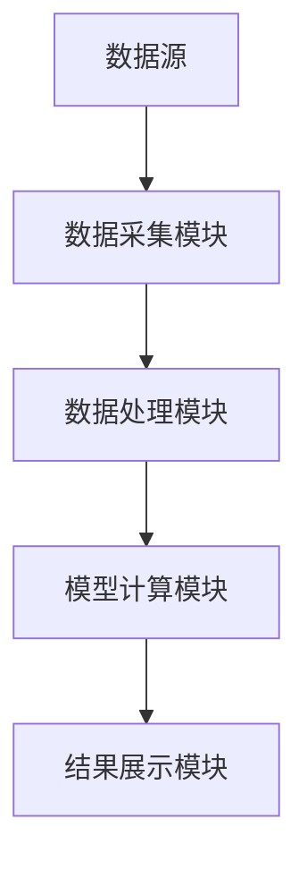

                 


# 股市估值在国际品牌价值评估标准化中的应用

> 关键词：股市估值，品牌价值评估，标准化，多元回归分析，机器学习，系统架构设计

> 摘要：本文探讨了股市估值在国际品牌价值评估中的应用，通过分析品牌价值的构成要素，介绍多元回归分析和机器学习算法在评估中的应用，并设计了基于这些算法的系统架构，展示了如何通过实际案例实现品牌价值的标准化评估。

---

## 第1章：背景介绍

### 1.1 股市估值的基本概念

#### 1.1.1 股市估值的定义与作用
股市估值是指对上市公司股票价值进行评估的过程，目的是确定其在市场上的合理价格。它通过分析公司的财务状况、行业地位和市场表现等多方面因素，为投资者提供决策依据。股市估值不仅是对公司的价值判断，也是对市场预期的反映。

#### 1.1.2 股市估值的核心要素
股市估值的核心要素包括公司财务状况（如收入、利润、负债等）、行业竞争环境、宏观经济因素和市场情绪等。这些要素共同影响着股票的价格波动。

#### 1.1.3 股市估值与企业价值的关系
股市估值是企业价值的市场表现，企业价值高通常意味着股价被高估或低估，反之亦然。通过分析股市估值，可以评估企业的市场地位和投资价值。

### 1.2 国际品牌价值评估的现状

#### 1.2.1 品牌价值评估的定义与方法
品牌价值评估是对品牌资产的量化，通常包括品牌知名度、忠诚度和声誉等因素。常用的方法有资产基础法、市场法和收益法。

#### 1.2.2 国际品牌价值评估的现状与趋势
随着全球化的发展，品牌价值在企业总资产中的比重越来越大。国际品牌评估越来越受到重视，尤其是在跨国公司和上市公司中。

#### 1.2.3 品牌价值评估的挑战与机遇
挑战包括数据收集困难、模型选择和市场波动等；机遇则在于通过技术创新和数据挖掘提高评估的准确性。

---

## 第2章：品牌价值评估的核心概念

### 2.1 品牌价值的构成要素

#### 2.1.1 品牌知名度
品牌知名度是品牌被消费者认知和记忆的程度，直接影响其市场价值。知名度越高，品牌价值通常越高。

#### 2.1.2 品牌忠诚度
品牌忠诚度反映消费者对品牌的偏好程度，高忠诚度意味着品牌有较强的市场竞争力和客户保留能力。

#### 2.1.3 品牌形象与声誉
品牌形象是品牌在消费者心中的整体印象，良好的声誉有助于提升品牌价值和市场地位。

### 2.2 股市估值与品牌价值的关系

#### 2.2.1 股市估值对品牌价值的影响
股市估值反映了市场对品牌价值的认可程度，高估值通常意味着品牌具有较高的市场价值。

#### 2.2.2 品牌价值对股价波动的影响
品牌价值的提升通常会带动股价上涨，反之亦然。品牌负面事件可能导致股价大幅波动。

#### 2.2.3 两者结合的理论基础
股市估值和品牌价值评估都基于企业的财务状况和市场表现，两者结合可以更全面地评估企业的市场价值。

---

## 第3章：品牌价值评估的算法原理

### 3.1 多元回归分析

#### 3.1.1 多元回归模型的建立
多元回归分析通过建立多个自变量与因变量之间的关系模型，用于预测品牌价值。公式如下：

$$ V = \beta_0 + \beta_1x_1 + \beta_2x_2 + \dots + \beta_nx_n + \epsilon $$

其中，$V$ 是品牌价值，$x_i$ 是影响品牌价值的因素，$\beta_i$ 是回归系数，$\epsilon$ 是误差项。

#### 3.1.2 模型的变量选择与假设
选择财务指标、市场地位和消费者认知度等因素作为自变量，假设这些因素对品牌价值有显著影响。

#### 3.1.3 模型的验证与优化
通过逐步回归和变量筛选，优化模型以提高预测准确性。

### 3.2 机器学习算法的应用

#### 3.2.1 支持向量机（SVM）在品牌价值评估中的应用
SVM适用于高维数据分类和回归问题，可用于品牌价值的预测。其工作流程如下：


#### 3.2.2 随机森林算法的实现
随机森林通过构建多个决策树并进行投票，提高模型的准确性和鲁棒性。

#### 3.2.3 神经网络模型的构建
神经网络模型可以处理复杂的非线性关系，适用于品牌价值的深度预测。

---

## 第4章：系统分析与架构设计方案

### 4.1 系统功能设计

#### 4.1.1 数据采集模块
负责收集品牌相关的财务数据、市场数据和消费者反馈。

#### 4.1.2 数据处理模块
对数据进行清洗、转换和标准化处理，确保数据质量。

#### 4.1.3 模型计算模块
应用多元回归分析和机器学习算法进行品牌价值评估。

#### 4.1.4 结果展示模块
以可视化方式展示评估结果，提供直观的决策支持。

### 4.2 系统架构设计

#### 4.2.1 模块化设计
系统分为数据采集、处理、计算和展示四个模块，各模块相对独立，便于维护和扩展。

#### 4.2.2 分层架构图


#### 4.2.3 接口设计与交互流程
系统通过API接口与其他系统交互，确保数据流的顺畅和模块间的高效协作。

---

## 第5章：项目实战

### 5.1 环境安装与配置

#### 5.1.1 开发工具的安装
安装Python、Jupyter Notebook和必要的库（如scikit-learn、pandas）。

#### 5.1.2 数据库的搭建
使用MySQL或MongoDB存储品牌数据和评估结果。

#### 5.1.3 依赖库的安装
通过pip安装必要的库：

```bash
pip install scikit-learn pandas numpy matplotlib
```

### 5.2 核心代码实现

#### 5.2.1 数据预处理
```python
import pandas as pd
data = pd.read_csv('brand_data.csv')
data = data.dropna().reset_index(drop=True)
```

#### 5.2.2 模型训练
```python
from sklearn.model import LinearRegression
model = LinearRegression()
model.fit(X_train, y_train)
```

#### 5.2.3 结果预测
```python
y_pred = model.predict(X_test)
```

### 5.3 案例分析

#### 5.3.1 数据收集与处理
收集某品牌过去5年的财务数据和市场表现数据，进行清洗和标准化处理。

#### 5.3.2 模型训练与验证
使用训练数据训练模型，并在测试数据上验证其准确性。

#### 5.3.3 结果展示与解读
生成可视化图表，展示品牌价值的变化趋势和预测结果。

---

## 第6章：总结与展望

### 6.1 总结
本文探讨了股市估值在国际品牌价值评估中的应用，通过多元回归分析和机器学习算法，构建了品牌价值评估系统，并通过实际案例展示了其应用效果。

### 6.2 展望
未来，随着大数据和人工智能技术的发展，品牌价值评估将更加精准和动态。建议进一步研究如何结合实时数据和复杂模型，提升评估的准确性和实时性。

---

作者：AI天才研究院/AI Genius Institute & 禅与计算机程序设计艺术 /Zen And The Art of Computer Programming

