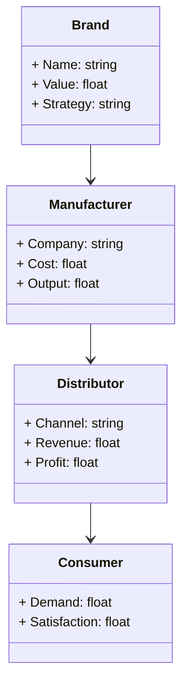

                 


# 股市估值在国际品牌价值链分析中的应用

## 关键词：股市估值、国际品牌价值链、品牌价值、股票分析、企业价值、股票价格、品牌管理

## 摘要：本文探讨了股市估值在国际品牌价值链分析中的应用，从核心概念、理论基础、算法模型到系统设计和实际案例，详细阐述了如何通过股市估值方法优化品牌价值链，提升企业价值。

---

## 第一部分: 股市估值与国际品牌价值链分析的背景与基础

### 第1章: 股市估值与国际品牌价值链分析的背景

#### 1.1 股市估值的核心概念

##### 1.1.1 什么是股市估值
股市估值是指通过对公司财务数据和市场表现的分析，估算其股票的合理价格范围。常见的估值方法包括市盈率（P/E）、市净率（P/B）和市销率（P/S）等。

##### 1.1.2 股市估值的主要方法
- **相对估值法**：基于可比公司的估值，如P/E和EV/EBITDA。
- **绝对估值法**：基于现金流折现模型（DCF）。
- **技术分析法**：通过价格走势预测未来股价。

##### 1.1.3 股市估值与企业价值的关系
股市估值是企业价值的外在表现，反映市场对公司的认可程度。合理估值帮助企业优化资本结构，吸引投资者。

#### 1.2 国际品牌价值链的定义与特点

##### 1.2.1 什么是国际品牌价值链
国际品牌价值链是指品牌在全球范围内从生产到销售的完整链条，包括供应商、制造商、分销商和消费者。

##### 1.2.2 品牌价值链的核心要素
- **供应商**：提供原材料和零部件。
- **制造商**：进行产品加工。
- **分销商**：负责产品的物流和销售。
- **消费者**：购买和使用产品。

##### 1.2.3 国际品牌价值链的独特性
- 全球化：跨越多个国家和地区。
- 多元化：涉及多种产品和服务。
- 复杂性：链条长，涉及多方利益。

#### 1.3 股市估值在品牌价值链中的作用

##### 1.3.1 股市估值与品牌价值的关系
股市估值反映了品牌在市场上的价值，品牌价值是影响股票价格的重要因素。

##### 1.3.2 股市估值在品牌管理中的应用
通过估值分析，企业可以优化品牌策略，提升品牌竞争力。

##### 1.3.3 股市估值对品牌价值链优化的意义
合理估值帮助企业优化价值链，降低运营成本，提升效率。

#### 1.4 本章小结
本章介绍了股市估值和国际品牌价值链的基本概念，分析了两者的关系及其在品牌管理中的作用。

### 第2章: 股市估值与品牌价值链的理论基础

#### 2.1 股市估值的理论框架

##### 2.1.1 市盈率与市净率的定义
- **市盈率（P/E）**：衡量股价与每股收益的比率。
- **市净率（P/B）**：衡量股价与每股净资产的比率。

##### 2.1.2 股东权益与企业价值的关系
股东权益是企业价值的重要组成部分，影响股票价格的高低。

##### 2.1.3 股票价格的决定因素
包括宏观经济环境、公司基本面、市场情绪等。

#### 2.2 品牌价值链的理论模型

##### 2.2.1 品牌价值链的构成要素
- **品牌定位**：明确品牌的目标市场和定位。
- **品牌传播**：通过广告、营销等手段提升品牌知名度。
- **品牌忠诚度**：通过客户满意度和忠诚度提升品牌价值。

##### 2.2.2 品牌价值链的运作机制
从生产到销售的完整链条，确保品牌价值最大化。

##### 2.2.3 品牌价值链的优化路径
通过优化各个环节，提升品牌竞争力和市场占有率。

#### 2.3 股市估值与品牌价值链的关联性分析

##### 2.3.1 股市估值对品牌价值链的影响
股市估值反映了品牌在市场上的表现，影响投资者对品牌的信心。

##### 2.3.2 品牌价值链对股市估值的反作用
品牌价值链的优化会提升企业价值，进而影响股票价格。

##### 2.3.3 两者的协同效应
通过协同效应，企业可以在股市和品牌管理中实现双赢。

#### 2.4 本章小结
本章深入分析了股市估值和品牌价值链的理论基础，探讨了两者之间的协同关系。

### 第3章: 股市估值的核心算法与数学模型

#### 3.1 股市估值的主要指标与公式

##### 3.1.1 市盈率（P/E）公式
$$ P/E = \frac{Stock Price}{Earnings Per Share} $$

##### 3.1.2 市净率（P/B）公式
$$ P/B = \frac{Stock Price}{Book Value Per Share} $$

##### 3.1.3 市销率（P/S）公式
$$ P/S = \frac{Stock Price}{Revenue Per Share} $$

#### 3.2 品牌价值链的评估模型

##### 3.2.1 品牌价值的计算公式
$$ Brand Value = (Revenue - Cost) \times (1 - Tax Rate) $$

##### 3.2.2 品牌价值链的优化公式
$$ Optimal Value Chain = \frac{Maximize Value}{Minimize Cost} $$

#### 3.3 算法实现与案例分析

##### 3.3.1 算法实现
通过Python代码实现市盈率和市净率的计算。

```python
import pandas as pd
import numpy as np

# 示例数据
data = {'Company': ['A', 'B', 'C'],
         'Price': [50, 30, 40],
         'EPS': [5, 2, 3],
         'Book Value': [10, 5, 8]}
df = pd.DataFrame(data)

# 计算市盈率和市净率
df['P/E'] = df['Price'] / df['EPS']
df['P/B'] = df['Price'] / df['Book Value']
print(df)
```

##### 3.3.2 案例分析
以苹果公司为例，分析其市盈率和市净率的变化，评估品牌价值链的优化效果。

### 第4章: 国际品牌价值链的系统架构设计

#### 4.1 问题场景介绍
分析一个国际品牌的产业链，识别关键节点，优化其价值。

#### 4.2 领域模型设计
使用Mermaid类图展示品牌价值链的构成。



#### 4.3 系统架构设计
使用Mermaid架构图展示系统架构。


### 第5章: 项目实战与最佳实践

#### 5.1 项目实战

##### 5.1.1 环境安装
安装Python和相关库（Pandas、NumPy）。

##### 5.1.2 核心代码实现
实现品牌价值链分析的代码。

```python
import pandas as pd
import numpy as np

# 数据读取
data = pd.read_csv('brand_value.csv')

# 数据清洗
data.dropna()

# 数据分析
data['P/E'].describe()

# 可视化
import matplotlib.pyplot as plt
plt.hist(data['P/E'], bins=10)
plt.show()
```

##### 5.1.3 案例分析
分析某品牌的数据，解读结果并提出优化建议。

#### 5.2 最佳实践

##### 5.2.1 小结
总结项目的主要发现和结论。

##### 5.2.2 注意事项
提醒读者在实际操作中需要注意的问题。

##### 5.2.3 拓展阅读
推荐相关书籍和资源，供读者深入学习。

### 第6章: 结论与展望

#### 6.1 结论
总结全文，强调股市估值在品牌价值链分析中的重要性。

#### 6.2 展望
展望未来的研究方向，如人工智能在股票估值中的应用。

---

## 作者：AI天才研究院/AI Genius Institute & 禅与计算机程序设计艺术 /Zen And The Art of Computer Programming

