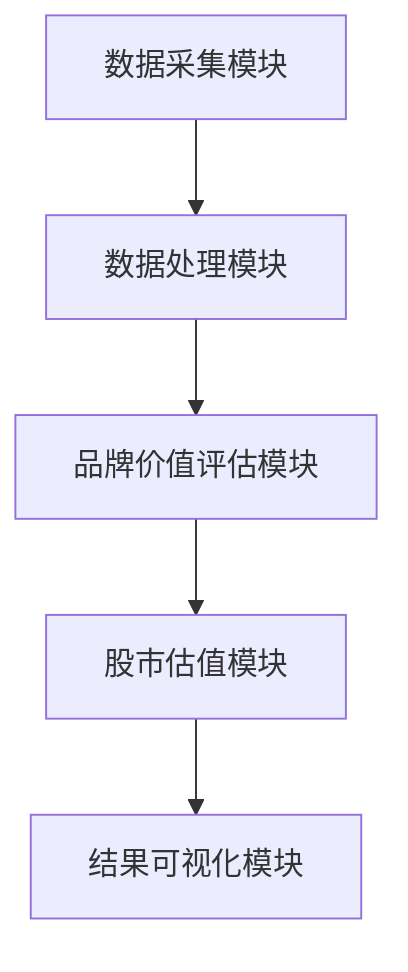

                 


# 股市估值在国际品牌价值链分析中的应用

> 关键词：股市估值、国际品牌、价值链分析、品牌价值、企业估值

> 摘要：本文探讨了股市估值与国际品牌价值链分析的结合，分析了品牌价值对企业估值的影响，提出了品牌价值评估的数学模型，并通过实际案例展示了如何将品牌价值与股市估值相结合。文章从背景介绍、核心概念、数学模型、系统分析、项目实战到总结与展望，全面阐述了股市估值在国际品牌价值链分析中的应用。

---

# 第一部分: 股市估值与国际品牌价值链分析的背景与基础

## 第1章: 股市估值与国际品牌价值链分析的背景

### 1.1 股市估值的基本概念

#### 1.1.1 股市估值的定义与作用
股市估值是指通过对企业的财务数据、市场环境和行业趋势等多方面因素的分析，对其股票的价值进行评估的过程。股市估值的作用在于帮助投资者确定股票的合理价格区间，从而做出投资决策。

#### 1.1.2 股市估值的核心指标
股市估值的核心指标包括市盈率（P/E）、市净率（P/B）、股息率（Dividend Yield）和股权自由现金流（Free Cash Flow to Equity，FCFE）等。

#### 1.1.3 股市估值与企业价值的关系
股市估值是企业价值的反映，企业价值越高，通常对应的股票估值也越高。然而，股市估值不仅仅取决于企业的财务表现，还受到市场情绪、行业竞争环境等多种因素的影响。

### 1.2 国际品牌价值链的基本概念

#### 1.2.1 品牌价值链的定义
品牌价值链是指从品牌创建、品牌推广、品牌维护到品牌收益的整个过程所涉及的价值链。它涵盖了从原材料采购、生产、销售到售后服务的各个环节。

#### 1.2.2 品牌价值链的构成要素
品牌价值链的构成要素包括品牌定位、品牌传播、品牌管理、品牌创新和品牌评估等。

#### 1.2.3 品牌价值链的分析方法
品牌价值链的分析方法包括SWOT分析、价值链分析模型（如迈克尔·波特的价值链理论）和品牌资产评估模型等。

### 1.3 股市估值与国际品牌价值链的关联

#### 1.3.1 品牌价值对企业估值的影响
品牌价值是企业整体价值的重要组成部分，尤其是在品牌驱动型行业（如消费品、奢侈品等），品牌价值对企业的市场估值具有决定性影响。

#### 1.3.2 品牌价值链在股市估值中的应用
通过分析品牌价值链，可以更好地理解企业的核心竞争力和市场地位，从而更准确地进行股市估值。

#### 1.3.3 国际化视角下的品牌价值评估
在全球化背景下，品牌价值的评估需要考虑跨文化因素、国际市场的竞争环境以及品牌在不同地区的认知度和影响力。

### 1.4 本章小结
本章从股市估值和品牌价值链的基本概念出发，分析了两者之间的关联，并强调了品牌价值在股市估值中的重要性。

---

## 第2章: 股市估值与国际品牌价值链分析的核心概念

### 2.1 股市估值的核心模型

#### 2.1.1 市盈率模型
市盈率模型（P/E）是通过将股票价格除以每股收益（EPS）来计算股票的估值。公式为：
$$ P/E = \frac{Stock Price}{Earnings Per Share} $$

#### 2.1.2 市净率模型
市净率模型（P/B）是通过将股票价格除以每股净资产（BPS）来计算股票的估值。公式为：
$$ P/B = \frac{Stock Price}{Book Value Per Share} $$

#### 2.1.3 股权自由现金流模型
股权自由现金流模型（FCFE）是通过预测企业未来股权自由现金流的现值来评估企业价值。公式为：
$$ Value = \sum_{t=1}^{n} \frac{FCFE_t}{(1 + r)^t} $$

### 2.2 国际品牌价值链的构成与分析

#### 2.2.1 品牌资产的构成
品牌资产包括品牌知名度、品牌忠诚度、品牌认知度和品牌形象等。

#### 2.2.2 品牌价值链的分析框架
品牌价值链的分析框架包括上游供应商、品牌持有者、品牌推广者、品牌销售者和品牌消费者。

#### 2.2.3 品牌价值链的量化方法
品牌价值链的量化方法包括品牌价值评估模型、品牌竞争力评估模型和品牌影响力评估模型。

### 2.3 股市估值与品牌价值链的关联模型

#### 2.3.1 品牌价值对股价的影响
品牌价值的提升通常会带来股价的上涨，尤其是在品牌驱动型行业。

#### 2.3.2 品牌价值链的量化与股市估值的关系
通过量化品牌价值链中的各个环节，可以更准确地预测企业的未来收益，从而更准确地进行股市估值。

#### 2.3.3 品牌价值评估的数学模型
品牌价值评估的数学模型包括加权平均模型、回归分析模型和层次分析模型等。

### 2.4 本章小结
本章从股市估值的核心模型和品牌价值链的构成与分析出发，探讨了两者之间的关联，并提出了品牌价值评估的数学模型。

---

## 第3章: 品牌价值评估的数学模型与算法原理

### 3.1 品牌价值评估的数学模型

#### 3.1.1 品牌价值公式
品牌价值的计算公式为：
$$ Brand\ Value = \alpha \times Brand\ Equity + \beta \times Financial\ Performance $$

其中，$\alpha$ 和 $\beta$ 是根据具体情况进行调整的权重系数。

#### 3.1.2 品牌价值评估的步骤
1. 数据采集与清洗
2. 品牌资产的量化
3. 财务数据的分析
4. 品牌价值的计算与验证

### 3.2 股市估值与品牌价值的关系模型

#### 3.2.1 市盈率与品牌价值的关系
市盈率与品牌价值呈正相关关系，品牌价值越高，市盈率通常越高。

#### 3.2.2 市净率与品牌价值的关系
市净率与品牌价值的关系较为复杂，但在品牌驱动型行业，市净率通常较高。

#### 3.2.3 自由现金流与品牌价值的关系
自由现金流与品牌价值呈正相关关系，自由现金流越高，品牌价值通常越高。

### 3.3 品牌价值评估的算法原理

#### 3.3.1 品牌价值评估的步骤
1. 数据预处理与特征提取
2. 品牌价值预测的回归分析
$$ y = \beta_0 + \beta_1x_1 + \beta_2x_2 + ... + \beta_nx_n $$

3. 模型验证与优化

### 3.4 本章小结
本章从品牌价值评估的数学模型和算法原理出发，提出了品牌价值的计算公式，并通过回归分析模型探讨了品牌价值与股市估值的关系。

---

## 第4章: 品牌价值链的系统分析与架构设计

### 4.1 系统分析与需求定义

#### 4.1.1 问题场景介绍
本文以苹果公司为例，分析其品牌价值链的构成和对股市估值的影响。

#### 4.1.2 项目目标与范围
本项目旨在通过分析品牌价值链，建立品牌价值评估模型，并将其应用于股市估值。

#### 4.1.3 系统功能需求
系统功能需求包括数据采集、数据处理、品牌价值评估和股市估值模块。

### 4.2 系统架构设计

#### 4.2.1 系统架构图


### 4.3 系统功能设计

#### 4.3.1 数据采集模块
数据采集模块负责从公开数据源获取企业的财务数据和品牌相关数据。

#### 4.3.2 数据处理模块
数据处理模块对采集到的数据进行清洗、转换和预处理。

#### 4.3.3 品牌价值评估模块
品牌价值评估模块通过回归分析模型计算品牌价值。

#### 4.3.4 股市估值模块
股市估值模块根据品牌价值和财务数据计算股票的合理估值。

#### 4.3.5 结果可视化模块
结果可视化模块将品牌价值和股市估值的结果以图表形式展示。

### 4.4 本章小结
本章从系统分析与架构设计的角度，提出了品牌价值链分析的系统架构，并详细设计了各功能模块。

---

## 第5章: 项目实战

### 5.1 环境安装与配置

#### 5.1.1 安装Python和相关库
```bash
pip install numpy pandas scikit-learn matplotlib
```

#### 5.1.2 数据采集与清洗
使用Python代码从公开数据源获取苹果公司的财务数据和品牌相关数据。

### 5.2 核心实现代码

#### 5.2.1 数据预处理
```python
import pandas as pd
import numpy as np

# 读取数据
df = pd.read_csv('apple_data.csv')

# 数据清洗
df.dropna(inplace=True)
df = df[~df['revenue'].isnull()]
```

#### 5.2.2 品牌价值评估
```python
from sklearn.linear_model import LinearRegression

# 训练回归模型
model = LinearRegression()
model.fit(X_train, y_train)

# 预测品牌价值
y_pred = model.predict(X_test)
```

#### 5.2.3 股市估值计算
```python
# 计算市盈率
pe_ratio = df['stock_price'] / df['eps']

# 计算市净率
pb_ratio = df['stock_price'] / df['book_value_per_share']
```

### 5.3 实际案例分析与解读

#### 5.3.1 苹果公司的品牌价值链分析
通过分析苹果公司的品牌价值链，可以发现其品牌价值对其股市估值具有重要影响。

#### 5.3.2 品牌价值与股市估值的关系
通过回归分析模型，可以发现品牌价值与股市估值之间存在显著的正相关关系。

### 5.4 本章小结
本章通过实际案例展示了如何将品牌价值与股市估值相结合，并通过代码实现品牌价值评估和股市估值的计算。

---

## 第6章: 总结与展望

### 6.1 本章总结
本文从股市估值与国际品牌价值链分析的背景出发，探讨了品牌价值对企业估值的影响，并提出了品牌价值评估的数学模型。通过实际案例展示了如何将品牌价值与股市估值相结合。

### 6.2 未来展望
未来的研究可以进一步探讨品牌价值的动态变化对股市估值的影响，以及如何在跨国公司中应用品牌价值链分析。

---

作者：AI天才研究院/AI Genius Institute & 禅与计算机程序设计艺术 /Zen And The Art of Computer Programming

