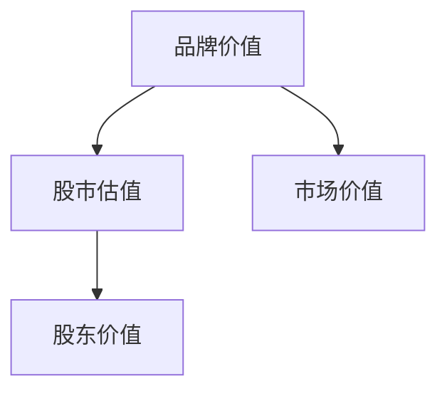
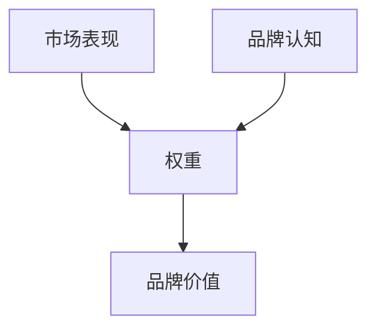
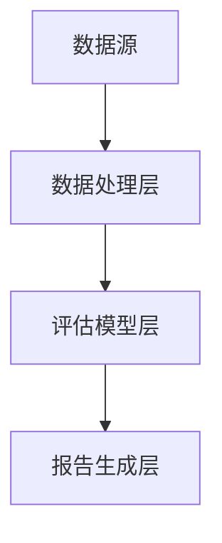

                 


# 股市估值在国际品牌估值标准化中的应用

> 关键词：股市估值、品牌估值、标准化、数学模型、系统架构

> 摘要：本文探讨了如何将股市估值方法应用于国际品牌估值的标准化过程中，通过分析品牌价值与股市估值的关联性，提出了一套基于加权平均法和回归分析法的评估模型，并结合系统架构设计和项目实战，展示了如何在实际中应用这些方法。

---

# 第一部分: 股市估值与国际品牌估值标准化的背景与基础

## 第1章: 股市估值与品牌估值的背景介绍

### 1.1 问题背景
#### 1.1.1 股市估值的核心概念
- 股市估值是通过对公司财务数据和市场表现的分析，确定股票的合理价格。
- 核心指标包括市盈率（P/E）、市净率（P/B）、股息率等。

#### 1.1.2 品牌估值的定义与特征
- 品牌估值是衡量品牌在市场中的价值，通常通过品牌知名度、客户忠诚度和市场表现等因素评估。
- 品牌估值具有动态性、行业特异性和主观性。

#### 1.1.3 股市估值与品牌估值的关联性
- 品牌价值影响公司的市场表现，进而影响股市估值。
- 股市估值可以作为品牌价值的间接指标。

### 1.2 问题描述
#### 1.2.1 品牌价值在股市中的体现
- 品牌价值是公司市值的重要组成部分。
- 强品牌公司通常具有较高的市盈率和市净率。

#### 1.2.2 股市估值对品牌价值的影响
- 市场对品牌的认知影响股市估值。
- 品牌价值的变化会导致股市估值的波动。

#### 1.2.3 国际化品牌估值的特殊性
- 国际化品牌需要考虑全球市场的表现。
- 不同国家的市场环境和消费者行为影响品牌估值。

### 1.3 问题解决
#### 1.3.1 建立品牌价值与股市估值的桥梁
- 通过标准化的评估方法，将品牌价值与股市估值联系起来。
- 使用量化指标将品牌价值转化为可量化的数据。

#### 1.3.2 标准化品牌估值的方法论
- 建立统一的评估指标和评估标准。
- 考虑不同市场环境对品牌价值的影响。

#### 1.3.3 国际化品牌估值的实现路径
- 跨越国界的品牌价值评估。
- 考虑文化差异和市场差异对品牌估值的影响。

### 1.4 边界与外延
#### 1.4.1 股市估值的适用范围
- 适用于上市公司，特别是知名品牌公司。
- 适用于跨国公司，需要考虑多国市场的表现。

#### 1.4.2 品牌估值的局限性
- 品牌价值难以完全量化。
- 市场环境变化会影响品牌估值的准确性。

#### 1.4.3 标准化品牌估值的行业影响
- 有助于行业内的横向比较。
- 为投资者提供更准确的决策依据。

### 1.5 核心概念与联系
#### 1.5.1 核心概念定义
| 概念 | 定义 |
|------|------|
| 品牌价值 | 品牌在市场中的认知价值 |
| 股市估值 | 股票在市场上的定价 |
| 标准化 | 统一的评估方法与标准 |

#### 1.5.2 实体关系图


---

# 第二部分: 国际品牌估值标准化的方法与算法

## 第2章: 核心算法与数学模型

### 2.1 品牌价值评估算法
#### 2.1.1 加权平均法
- 基于市场表现和品牌认知的加权计算。
- 示例公式：$$ 品牌价值 = \alpha \times 市场表现 + \beta \times 品牌认知 $$



#### 2.1.2 回归分析法
- 通过回归分析确定品牌价值与市场表现的关系。
- 示例代码：
```python
import numpy as np
from scipy import stats

# 示例数据
x = np.array([1, 2, 3, 4, 5])
y = np.array([2, 4, 5, 4, 6])

slope, intercept, r_value, p_value, std_err = stats.linregress(x, y)
print(f"回归方程：y = {slope}x + {intercept}")
```

---

## 第3章: 数学模型与公式解析

### 3.1 品牌价值评估的数学模型
- 基于加权平均法的模型：
$$ 品牌价值 = \alpha \times 市场表现 + \beta \times 品牌认知 $$

- 基于回归分析的模型：
$$ 品牌价值 = \beta_0 + \beta_1 \times 市场表现 + \epsilon $$

### 3.2 数学模型的实现
- 通过Python代码实现回归分析：
```python
import numpy as np
from scipy import stats

# 示例数据
x = np.array([1, 2, 3, 4, 5])
y = np.array([2, 4, 5, 4, 6])

slope, intercept, r_value, p_value, std_err = stats.linregress(x, y)
print(f"回归方程：y = {slope}x + {intercept}")
```

---

## 第4章: 系统分析与架构设计

### 4.1 问题场景介绍
- 跨国公司的品牌估值需求。
- 不同市场的品牌表现差异。

### 4.2 系统功能设计
- 数据收集模块：收集品牌在不同市场的表现数据。
- 评估模型模块：应用加权平均法和回归分析法进行品牌估值。
- 报告生成模块：生成标准化的品牌估值报告。

### 4.3 系统架构设计


---

## 第5章: 项目实战与案例分析

### 5.1 项目实战
#### 5.1.1 环境安装
- 安装Python和相关库（如numpy、scipy、pandas）。

#### 5.1.2 核心代码实现
```python
import numpy as np
from scipy import stats

# 示例数据
x = np.array([1, 2, 3, 4, 5])
y = np.array([2, 4, 5, 4, 6])

slope, intercept, r_value, p_value, std_err = stats.linregress(x, y)
print(f"回归方程：y = {slope}x + {intercept}")
```

#### 5.1.3 应用解读与分析
- 通过回归分析确定市场表现对品牌价值的影响程度。

### 5.2 案例分析
- 某跨国公司的品牌估值案例。
- 应用标准化方法评估品牌价值，并生成报告。

---

## 第6章: 结论与展望

### 6.1 核心结论
- 股市估值方法可以有效应用于国际品牌估值的标准化。
- 统一的评估标准和量化模型是实现品牌估值的重要工具。

### 6.2 注意事项
- 数据质量和完整性对评估结果的影响。
- 模型的选择和参数调整需要根据具体情况进行优化。

### 6.3 未来研究方向
- 研究更多因素对品牌估值的影响。
- 探索更复杂的数学模型和算法。

---

作者：AI天才研究院/AI Genius Institute & 禅与计算机程序设计艺术 /Zen And The Art of Computer Programming

