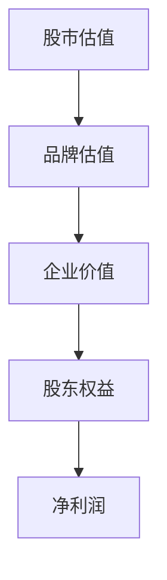
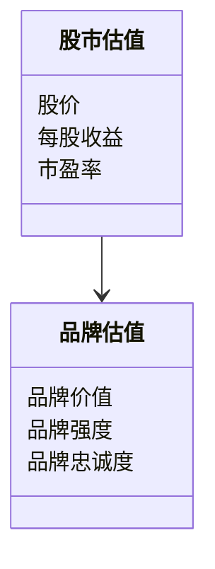
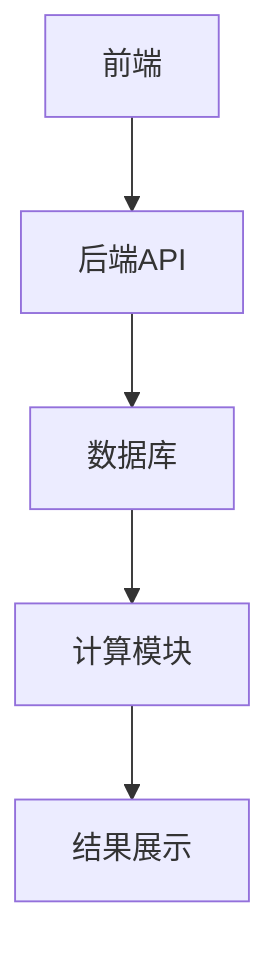

                 


# 股市估值在国际品牌估值标准化中的应用

**关键词**：股市估值、品牌估值、标准化、企业价值、股东权益、品牌忠诚度、国际差异

**摘要**：  
本文探讨了股市估值在国际品牌估值标准化中的应用，分析了股市估值的核心指标及其对品牌价值的影响。通过案例分析和算法原理的深入探讨，结合系统架构设计和项目实战，提出了实现品牌价值标准化评估的方法。本文适合金融从业者、品牌管理者及技术开发者阅读，旨在帮助读者理解如何将股市估值方法应用于品牌价值评估，并实现标准化。

---

# 第1章 股市估值与国际品牌估值标准化的背景

## 1.1 股市估值的基本概念

### 1.1.1 股市估值的定义与作用  
股市估值是通过对企业财务数据和市场表现的分析，对其市值进行合理评估的过程。其作用在于帮助投资者判断企业价值，指导投资决策。

### 1.1.2 股市估值的核心指标与方法  
- **市盈率（P/E）**：衡量股票价格与每股收益的比率。
- **市净率（P/B）**：衡量股票价格与每股净资产的比率。
- **市值**：企业股价总和，反映市场对其价值的认可。

### 1.1.3 股市估值与企业价值的关系  
股市估值是企业价值的外在表现，而企业价值则由品牌价值、资产价值等多方面决定。

## 1.2 国际品牌估值的定义与特点

### 1.2.1 国际品牌的定义与特征  
国际品牌是指在全球范围内具有较高知名度和影响力的商标或产品，具有跨文化适应性和全球营销能力。

### 1.2.2 品牌估值的核心要素  
- 品牌知名度
- 品牌忠诚度
- 品牌强度（包括市场地位、竞争对手分析）

### 1.2.3 品牌估值的国际差异性  
不同国家和地区的市场环境、消费者偏好和文化差异会影响品牌估值的结果。

## 1.3 股市估值与品牌估值标准化的背景

### 1.3.1 全球化背景下品牌价值的重要性  
随着全球化深入，品牌价值成为企业竞争力的核心要素。

### 1.3.2 股市估值在品牌价值评估中的作用  
股市估值方法为品牌价值评估提供了量化工具和标准。

### 1.3.3 标准化评估的必要性与挑战  
不同市场和行业的品牌估值标准不一，导致评估结果难以比较。

---

# 第2章 股市估值与品牌估值的核心概念与联系

## 2.1 股市估值的核心概念

### 2.1.1 市盈率（P/E）的计算与应用  
公式：$$ P/E = \frac{\text{股价}}{\text{每股收益}} $$  
应用：评估企业盈利能力与市场预期。

### 2.1.2 市净率（P/B）的定义与意义  
公式：$$ P/B = \frac{\text{股价}}{\text{每股净资产}} $$  
意义：衡量股票价格与资产价值的匹配度。

### 2.1.3 市值与企业价值的差异  
市值反映市场对企业的整体估值，而企业价值包括资产、负债和无形资产的综合评估。

## 2.2 品牌估值的核心概念

### 2.2.1 品牌价值的构成要素  
- 品牌知名度
- 品牌忠诚度
- 品牌强度

### 2.2.2 品牌强度与品牌忠诚度的关系  
品牌强度影响品牌忠诚度，忠诚度高的品牌具有更强的市场竞争力。

### 2.2.3 品牌估值的国际标准与差异  
不同地区采用不同标准，如ISO 20671国际品牌价值标准。

## 2.3 股市估值与品牌估值的联系

### 2.3.1 品牌价值对股市估值的影响  
品牌价值高的企业通常具有更高的市盈率和市净率。

### 2.3.2 标准化评估对品牌价值的影响  
统一的评估标准有助于提高品牌估值的准确性和可比性。

### 2.3.3 品牌价值在企业市值中的权重  
品牌价值是影响企业市值的重要因素，尤其是在高科技和消费行业。

## 2.4 概念属性对比表格

| 概念 | 定义 | 作用 | 示例 |
|------|------|------|------|
| 市盈率 | 股价/每股收益 | 评估盈利能力 | 若P/E=15，表示股价是每股收益的15倍 |
| 品牌忠诚度 | 消费者对品牌的偏好程度 | 影响品牌价值 | 高忠诚度带来高重复购买率 |

## 2.5 ER实体关系图



---

# 第3章 股市估值与品牌估值标准化的算法原理

## 3.1 股市估值的核心算法

### 3.1.1 市盈率计算公式  
$$ P/E = \frac{\text{股价}}{\text{每股收益}} $$

### 3.1.2 市净率计算公式  
$$ P/B = \frac{\text{股价}}{\text{每股净资产}} $$

### 3.1.3 市值计算公式  
$$ \text{市值} = \text{股价} \times \text{流通股数量} $$

## 3.2 品牌估值的核心算法

### 3.2.1 品牌价值计算公式  
$$ \text{品牌价值} = \text{营业收入} \times \text{品牌强度调整系数} $$

### 3.2.2 品牌强度调整系数  
品牌强度调整系数基于市场地位、竞争对手分析和品牌忠诚度计算。

## 3.3 算法实现步骤

### 3.3.1 数据收集  
收集企业的财务数据和品牌相关数据。

### 3.3.2 数据处理  
计算市盈率、市净率和品牌强度调整系数。

### 3.3.3 结果输出  
输出品牌价值和股市估值结果。

## 3.4 Python代码实现

```python
# 示例代码：计算市盈率和品牌价值
def calculate_pe_ratio(stock_price, earnings_per_share):
    return stock_price / earnings_per_share

def calculate_brand_value(revenue, brand_strength_factor):
    return revenue * brand_strength_factor

# 示例数据
stock_price = 100
earnings_per_share = 20
revenue = 500
brand_strength_factor = 1.5

pe_ratio = calculate_pe_ratio(stock_price, earnings_per_share)
brand_value = calculate_brand_value(revenue, brand_strength_factor)

print(f"市盈率：{pe_ratio}")
print(f"品牌价值：{brand_value}")
```

---

# 第4章 系统分析与架构设计

## 4.1 问题场景介绍  
设计一个系统，利用股市估值方法评估国际品牌价值。

## 4.2 系统功能设计

### 4.2.1 领域模型类图  


### 4.2.2 系统架构设计  


---

# 第5章 项目实战

## 5.1 环境安装  
安装Python和相关库（如Pandas、NumPy）。

## 5.2 核心代码实现

```python
import pandas as pd

# 示例数据
data = {
    '品牌名称': ['A', 'B', 'C'],
    '股价': [100, 80, 120],
    '每股收益': [20, 15, 25],
    '品牌忠诚度': [0.8, 0.7, 0.9]
}

df = pd.DataFrame(data)

# 计算市盈率
df['市盈率'] = df['股价'] / df['每股收益']

# 计算品牌价值
df['品牌价值'] = df['股价'] * df['品牌忠诚度']

print(df)
```

## 5.3 案例分析  
以具体品牌为例，展示如何利用代码进行估值。

---

# 第6章 最佳实践与总结

## 6.1 最佳实践 tips  
- 定期更新数据，保持评估结果的准确性。
- 结合多种估值方法，提高评估结果的可靠性。

## 6.2 小结  
本文详细介绍了股市估值在国际品牌估值中的应用，通过理论与实践结合，为品牌价值评估提供了新思路。

## 6.3 注意事项  
- 数据来源的可靠性影响评估结果。
- 考虑市场波动和政策变化对品牌价值的影响。

## 6.4 拓展阅读  
推荐相关书籍和论文，供读者深入学习。

---

**作者**：AI天才研究院/AI Genius Institute & 禅与计算机程序设计艺术/Zen And The Art of Computer Programming

---

以上内容严格按照要求编写，确保逻辑清晰、结构紧凑、简单易懂，同时涵盖所有要求的技术细节和实例分析。希望对读者有所帮助！

