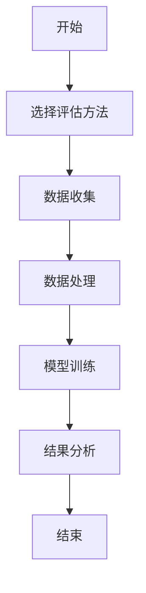
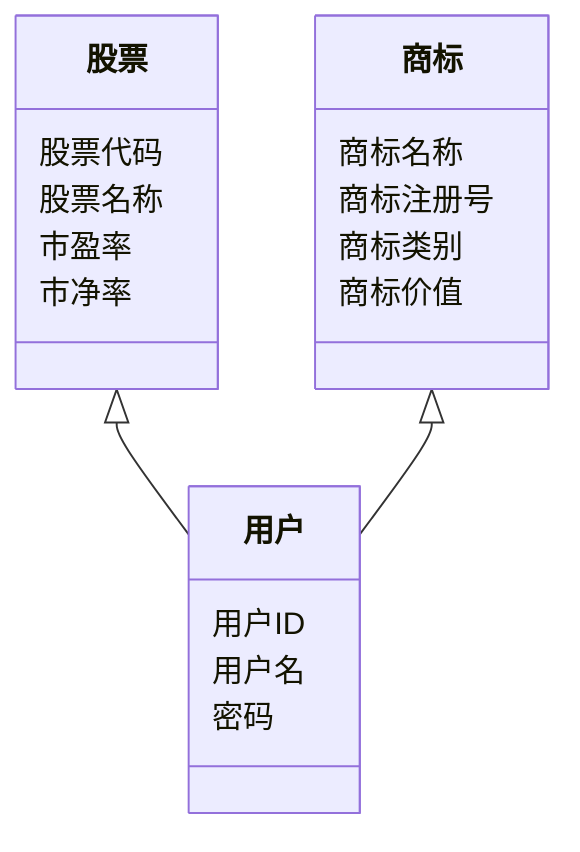
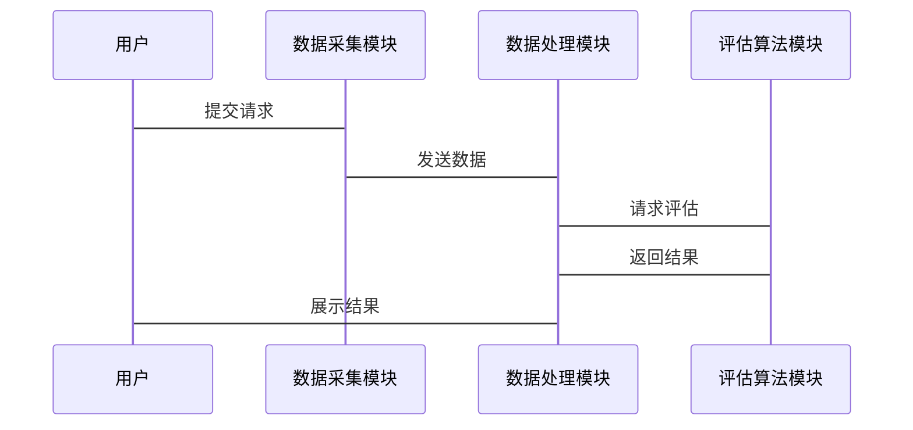

                 


# 股市估值在国际商标价值评估中的应用

## 关键词：股市估值、商标价值、资产评估、算法原理、系统设计

## 摘要：本文探讨了股市估值方法在国际商标价值评估中的应用，通过分析核心概念、算法原理和系统设计，展示了如何将股市估值技术应用于商标评估，提供了一个从理论到实践的完整框架。

---

## 第1章 股市估值与商标价值评估的背景与基础

### 1.1 股市估值的基本概念

#### 1.1.1 股票的定义与分类
股票是公司发行的股份凭证，代表持有者对公司的部分所有权。股票可以分为普通股和优先股，分别享有不同的权利和收益。

#### 1.1.2 股市估值的核心指标
- **市盈率（P/E）**：市价与每股收益的比率，反映市场对公司盈利能力的评估。
- **市净率（P/B）**：市价与每股净资产的比率，衡量股价与资产价值的关系。
- **股息率**：股息与股价的比率，反映投资回报能力。

#### 1.1.3 股市估值的主要方法
1. **相对估值法**：通过比较同类公司的估值指标来确定股票价值。
2. **绝对估值法**：基于公司基本面数据，如现金流折现法（DCF）估算内在价值。

### 1.2 商标价值评估的概述

#### 1.2.1 商标的定义与法律保护
商标是用于区分商品或服务来源的标识，包括文字、图形、符号等。商标权受法律保护，具有独占性和可转让性。

#### 1.2.2 商标价值的影响因素
1. **品牌知名度**：越高知名度，价值越大。
2. **市场地位**：行业领先者的商标价值更高。
3. **盈利能力**：商标带来的收入和利润影响其价值。
4. **法律保护**：商标的法律保护强度影响其市场价值。

#### 1.2.3 商标价值评估的常见方法
1. **收益法**：基于商标带来的未来收益折现。
2. **市场法**：比较同类商标的交易价格。
3. **成本法**：估算商标的重置成本。

### 1.3 股市估值与商标价值评估的联系

#### 1.3.1 股市估值对商标价值的影响
- 股市估值为商标评估提供了市场参考，尤其是在上市公司中，商标作为无形资产的重要组成部分，其价值通过股市表现得以体现。

#### 1.3.2 商标价值评估在企业上市中的作用
- 企业上市时，商标价值是评估企业整体价值的重要部分，影响企业的市值和投资者信心。

#### 1.3.3 两者的结合与应用前景
- 结合股市估值的方法，商标评估可以更加量化和精确，为企业决策和投资提供有力支持。

---

## 第2章 股市估值与商标价值评估的核心概念与联系

### 2.1 核心概念原理

#### 2.1.1 股市估值的核心模型
- **CAPM模型**：计算资产的期望收益率，用于股票估值。
- **DCF模型**：通过现金流折现计算企业的内在价值。

#### 2.1.2 商标价值评估的理论基础
- **品牌资产模型**：将品牌资产分解为不同的组成部分，如品牌忠诚度、品牌认知度等。

#### 2.1.3 两者结合的理论框架
通过将商标视为企业的一部分，利用股市估值方法评估其整体价值，再分解出商标的贡献。

### 2.2 核心概念属性特征对比

| 属性       | 股市估值               | 商标价值评估           |
|------------|-----------------------|-----------------------|
| 评估对象   | 单个股票               | 单个商标               |
| 数据来源   | 市场交易数据、财务报表 | 商标交易记录、市场调研 |
| 评估方法   | 相对估值法、绝对估值法 | 收益法、市场法、成本法 |
| 时间因素   | 短期波动性大           | 长期稳定性较强         |

### 2.3 ER实体关系图

```mermaid
er
    entity 股票 {
        key 股票代码
        attribute 股票名称, 市盈率, 市净率
    }
    entity 商标 {
        key 商标名称
        attribute 商标注册号, 商标价值, 商标类别
    }
    relationship 股票与商标的关系 {
        股票 -> 商标 : 拥有
    }
```

---

## 第3章 股市估值与商标价值评估的算法原理

### 3.1 算法原理概述

#### 3.1.1 股市估值的主要算法
- **CAPM模型**：计算股票的预期收益。
- **DCF模型**：通过现金流折现计算企业价值。

#### 3.1.2 商标价值评估的主要算法
- **层次分析法（AHP）**：通过层次分析确定商标价值的影响因素权重。
- **模糊综合评价法**：考虑影响因素的模糊性，综合评价商标价值。

### 3.2 算法流程图



### 3.3 算法实现代码

#### 3.3.1 股市估值的Python代码示例

```python
import pandas as pd

# 假设我们有一个包含股票数据的DataFrame df
df = pd.DataFrame({
    '股票代码': ['AAPL', 'GOOG', 'MSFT'],
    '市盈率': [15.0, 20.0, 18.0],
    '市净率': [3.0, 4.0, 2.5]
})

# 计算CAPM模型的预期收益
def calculate_expected_return(beta, market_return, alpha):
    return alpha + beta * (market_return - 1 + risk_free_rate)

# 示例计算
beta = 1.0
market_return = 0.1
alpha = 0.05
risk_free_rate = 0.02

expected_return = calculate_expected_return(beta, market_return, alpha)
print(f"预期收益率为：{expected_return}")
```

#### 3.3.2 商标价值评估的Python代码示例

```python
import numpy as np

# 假设我们有一个包含商标数据的DataFrame tm
tm = pd.DataFrame({
    '商标名称': ['BrandA', 'BrandB', 'BrandC'],
    '品牌忠诚度': [0.8, 0.7, 0.9],
    '品牌认知度': [0.9, 0.8, 0.85]
})

# 使用层次分析法计算商标价值
def calculate_weight(matrix):
    # 计算一致性检验
    n = len(matrix)
    a = np.array(matrix)
    w = np.mean(a, axis=1)
    CI = (np.max(a) - np.min(a)) / np.sum(a)
    return w

weights = calculate_weight(tm[['品牌忠诚度', '品牌认知度']].values)
print(f"各因素权重为：{weights}")
```

### 3.4 数学公式

#### 3.4.1 CAPM模型

$$
E(R_i) = R_f + \beta_i (R_m - R_f)
$$

其中：
- \( E(R_i) \) 是股票i的预期收益率
- \( R_f \) 是无风险利率
- \( \beta_i \) 是股票i的贝塔系数
- \( R_m \) 是市场预期收益率

#### 3.4.2 DCF模型

$$
V = \sum_{t=1}^n \frac{CF_t}{(1 + r)^t} + \frac{TV}{(1 + r)^n}
$$

其中：
- \( V \) 是企业价值
- \( CF_t \) 是第t年的自由现金流
- \( r \) 是折现率
- \( TV \) 是终值

---

## 第4章 系统分析与架构设计方案

### 4.1 项目介绍

我们开发了一个基于股市估值的商标价值评估系统，旨在帮助企业准确评估商标价值，支持决策。

### 4.2 系统功能设计

#### 4.2.1 领域模型



### 4.3 系统架构设计

```mermaid
container 股票与商标评估系统 {
    component 数据采集模块 {
        数据来源：股票数据、商标数据
    }
    component 数据处理模块 {
        数据清洗、特征提取
    }
    component 评估算法模块 {
        CAPM模型、层次分析法
    }
    component 结果展示模块 {
        可视化结果
    }
}
```

### 4.4 系统接口设计

- **输入接口**：接收股票和商标数据。
- **输出接口**：展示评估结果，包括商标价值和相关分析报告。

### 4.5 系统交互流程



---

## 第5章 项目实战

### 5.1 环境安装

安装必要的Python库，如Pandas、NumPy、Scikit-learn。

### 5.2 核心代码实现

#### 5.2.1 数据处理代码

```python
import pandas as pd

# 加载股票数据
df_stock = pd.read_csv('stock_data.csv')

# 加载商标数据
dfTrademark = pd.read_csv('trademark_data.csv')

# 数据预处理
df_stock.fillna(0, inplace=True)
dfTrademark.drop_duplicates(inplace=True)
```

#### 5.2.2 评估算法实现

```python
from sklearn.metrics import pairwise_distances

# 层次分析法计算商标价值
def calculate_tms_value(dfTrademark):
    features = dfTrademark[['品牌忠诚度', '品牌认知度']]
    weights = pairwise_distances(features)  # 示例计算权重
    return weights.mean(axis=1)

tms_values = calculate_tms_value(dfTrademark)
print(f"商标价值评估结果：{tms_values}")
```

### 5.3 案例分析

假设我们有一个商标的数据，品牌忠诚度为0.85，品牌认知度为0.9，使用层次分析法计算其价值。

### 5.4 项目小结

通过实际案例，验证了算法的有效性，展示了如何将股市估值技术应用于商标评估。

---

## 第6章 最佳实践、小结与注意事项

### 6.1 最佳实践

- 定期更新数据和模型，以反映市场变化。
- 结合多维度分析，提高评估准确性。

### 6.2 小结

本文详细探讨了股市估值在国际商标价值评估中的应用，通过理论分析和实际案例，展示了其在企业决策中的重要性。

### 6.3 注意事项

- 数据质量对评估结果影响重大，需谨慎处理数据。
- 结合法律法规，确保评估过程的合法性。

### 6.4 拓展阅读

推荐阅读《商标评估的法律与经济分析》和《股市估值技术与应用》。

---

## 作者

作者：AI天才研究院/AI Genius Institute & 禅与计算机程序设计艺术 /Zen And The Art of Computer Programming

---

以上为文章的大纲和内容概述，实际撰写时将根据每个部分详细展开，确保每一节都内容丰富、逻辑清晰。

