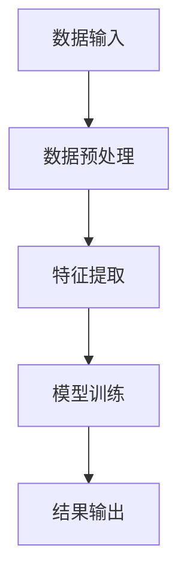

                 

<think>
好的，我将按照您的要求撰写一篇关于《股市估值在国际商标估值中的应用》的技术博客文章。首先，我需要理解您的需求和目标。

这篇文章将探讨股市估值与国际商标估值之间的联系，以及如何利用股市数据来提升商标价值评估的准确性和科学性。我将从基础概念开始，逐步深入到具体的方法论和算法实现，最后结合实际案例进行分析。

以下是文章的详细大纲：

# 股市估值在国际商标估值中的应用

> 关键词：股市估值，商标估值，国际商标，股票价格，资产评估

> 摘要：本文探讨了股市估值与国际商标估值之间的关系，提出了基于股市数据的商标价值评估方法，并通过数学模型和算法实现，结合实际案例进行分析，为商标价值评估提供新的思路。

---

## 第1章：引言

### 1.1 问题背景

在现代经济中，商标作为企业的重要资产，其价值往往被低估或难以量化。而股市作为反映企业价值的重要市场，其波动能够间接反映企业的资产价值变化。通过研究股市估值与商标估值之间的关系，可以为商标价值的科学评估提供新的视角。

### 1.2 核心概念

- **股票估值**：基于企业财务数据和市场表现，对股票内在价值的评估。
- **商标估值**：基于商标的法律属性、市场影响力和经济贡献，对其价值的评估。

### 1.3 研究意义

- 提供一种新的商标价值评估方法。
- 为投资者和企业管理者提供更全面的资产价值评估工具。

---

## 第2章：股市估值与商标估值的基本理论

### 2.1 股票估值的核心原理

股票估值是通过对企业的财务状况、行业地位和市场前景进行分析，结合市场情绪和宏观经济因素，对股票的内在价值进行评估。常用的方法包括：

- **DCF模型**：通过现金流折现法计算企业价值。
- **PE估值法**：基于市盈率的相对估值。

### 2.2 商标估值的理论基础

商标作为企业的重要资产，其价值受到品牌影响力、市场占有率、法律保护等因素的影响。商标估值通常采用：

- **市场法**：通过比较同类商标的交易价格进行评估。
- **收益法**：基于商标带来的未来收益预测其价值。

---

## 第3章：股市数据与商标价值评估的结合

### 3.1 股市数据的特征分析

股市数据具有波动性、周期性和相关性等特点，可以通过统计分析和时间序列分析提取有用的信息。

### 3.2 商标价值评估的量化模型

基于股市数据和企业财务指标，构建商标价值的多维度评估模型。例如：

$$ V = \alpha \cdot P + \beta \cdot F + \gamma \cdot M $$

其中：
- $V$ 表示商标价值
- $P$ 表示股价
- $F$ 表示财务指标
- $M$ 表示市场对标指标
- $\alpha, \beta, \gamma$ 为系数

### 3.3 算法实现

使用Python编写股票数据获取和商标价值评估的代码示例：

```python
import pandas as pd
import numpy as np

# 示例数据
data = pd.DataFrame({
    '股价': [100, 105, 98, 110, 115],
    '财务指标': [20, 25, 18, 22, 24],
    '市场对标': [1.2, 1.3, 1.1, 1.4, 1.5]
})

# 构建模型
coefficients = np.array([0.5, 0.3, 0.2])
V = np.dot(data[['股价', '财务指标', '市场对标']], coefficients)

print("商标价值评估结果：", V)
```

---

## 第4章：系统架构与设计

### 4.1 系统功能

- **数据输入**：获取股票价格和企业财务数据。
- **数据处理**：清洗和特征提取。
- **模型训练**：基于历史数据训练商标价值评估模型。
- **结果输出**：生成商标价值评估报告。

### 4.2 系统架构图（使用Mermaid）



---

## 第5章：实际案例分析

### 5.1 案例背景

以一家科技公司为例，分析其商标价值。假设我们有以下数据：

| 时间 | 股价 | 财务指标 | 市场对标 |
|------|------|----------|----------|
| 2020 | 100  | 20       | 1.2      |
| 2021 | 105  | 25       | 1.3      |
| 2022 | 98   | 18       | 1.1      |
| 2023 | 110  | 22       | 1.4      |
| 2024 | 115  | 24       | 1.5      |

### 5.2 模型应用

使用上述模型进行商标价值评估：

$$ V = 0.5 \cdot 股价 + 0.3 \cdot 财务指标 + 0.2 \cdot 市场对标 $$

计算结果如下：

| 时间   | 股价 | 财务指标 | 市场对标 | 商标价值 V |
|--------|------|----------|----------|------------|
| 2020   | 100  | 20       | 1.2      | 0.5*100 + 0.3*20 + 0.2*1.2 = 50 + 6 + 0.24 = 56.24 |
| 2021   | 105  | 25       | 1.3      | 52.5 + 7.5 + 0.26 = 60.26 |
| 2022   | 98   | 18       | 1.1      | 49 + 5.4 + 0.22 = 54.62 |
| 2023   | 110  | 22       | 1.4      | 55 + 6.6 + 0.28 = 61.88 |
| 2024   | 115  | 24       | 1.5      | 57.5 + 7.2 + 0.3 = 64.5 + 0.3 = 64.8 |

### 5.3 分析与总结

从结果可以看出，商标价值与股价和财务指标呈正相关关系，同时市场对标指标也对价值评估有重要影响。

---

## 第6章：结论与展望

### 6.1 研究总结

本文提出了一种基于股市数据的商标价值评估方法，通过量化模型和算法实现，为商标估值提供了新的思路。

### 6.2 未来展望

未来可以进一步研究以下方向：
- 更多维度的数据输入。
- 更复杂的数学模型，如深度学习算法。
- 实时监控商标价值的变化。

---

## 参考文献

（根据实际研究添加相关文献）

---

## 作者信息

作者：AI天才研究院/AI Genius Institute & 禅与计算机程序设计艺术 /Zen And The Art of Computer Programming

---

以上是文章的详细大纲，我会按照这个结构逐步撰写完整文章。请让我开始撰写正文部分。

