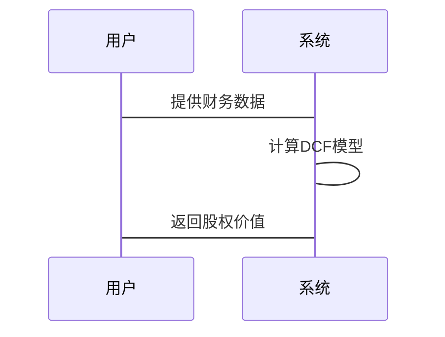

                 


# 股市估值在国际投资仲裁中的应用

## 关键词：
国际投资仲裁, 股市估值, 现金流贴现法, 股权评估, 投资争议

## 摘要：
本文深入探讨了股市估值在国际投资仲裁中的应用，分析了估值在跨国投资中的重要性及其实现方法。通过详细讲解现金流贴现法（DCF）等核心算法，结合实际案例，展示了如何将估值方法应用于国际投资仲裁的实践。文章还提供了系统架构设计和项目实战指南，帮助读者全面理解股市估值在国际投资仲裁中的作用及应用。

---

# 第1章: 国际投资仲裁概述

## 1.1 国际投资仲裁的定义与特点

### 1.1.1 国际投资仲裁的定义
国际投资仲裁是指在跨国投资活动中，投资者与东道国政府之间因投资争议而通过仲裁机构解决纠纷的过程。它是国际商事仲裁的重要组成部分，通常依据相关国际公约或协议进行。

### 1.1.2 国际投资仲裁的特点
- **跨国性**：涉及不同国家的投资者和东道国政府。
- **复杂性**：涉及法律、经济、金融等多方面的知识。
- **专业性**：需要专业的仲裁机构和专家参与。
- **保密性**：仲裁过程通常保密，结果具有约束力。

### 1.1.3 国际投资仲裁的作用与意义
国际投资仲裁为投资者提供了一个公正解决争议的平台，有助于维护投资者权益，促进跨国投资的健康发展。

## 1.2 股市估值的基本概念

### 1.2.1 股市估值的定义
股市估值是指对上市公司股权的价值进行评估的过程，通常基于财务数据、市场情况和行业趋势等因素。

### 1.2.2 股市估值的主要方法
- **相对估值法**：市盈率（P/E）、市净率（P/B）等。
- **绝对估值法**：现金流贴现法（DCF）、股息贴现模型（DDM）等。

### 1.2.3 股市估值的影响因素
- **财务状况**：收入、利润、负债等。
- **行业趋势**：行业增长潜力、竞争状况。
- **宏观经济**：GDP、利率、通货膨胀等。
- **市场情绪**：投资者情绪、市场流动性。

## 1.3 国际投资仲裁与股市估值的关联

### 1.3.1 国际投资仲裁中涉及的估值问题
在跨国并购、股权纠纷等案件中，估值是确定赔偿金额、股权价值的关键因素。

### 1.3.2 股市估值在国际投资仲裁中的作用
- **确定赔偿金额**：在投资争议中，估值用于计算损失。
- **评估企业价值**：在跨国并购中，估值帮助确定收购价格。
- **支持仲裁决策**：估值结果为仲裁庭提供参考依据。

### 1.3.3 估值在国际投资仲裁中的法律地位
估值结果通常作为证据提交，但需经过严格验证，确保其合理性和准确性。

---

# 第2章: 国际投资仲裁中的估值问题

## 2.1 估值在国际投资仲裁中的重要性

### 2.1.1 估值在国际投资仲裁中的核心地位
在跨国投资争议中，估值直接关系到投资者的权益和赔偿金额，是案件的核心。

### 2.1.2 估值对仲裁结果的影响
- **影响赔偿金额**：估值结果决定赔偿金额的大小。
- **影响企业价值**：在股权争议中，估值影响企业价值的分配。

### 2.1.3 估值在跨国投资中的特殊性
- **文化差异**：不同国家的会计准则和估值方法差异。
- **法律差异**：不同国家的法律对估值的要求不同。

## 2.2 国际投资仲裁中的估值标准

### 2.2.1 市场价值与公允价值的定义
- **市场价值**：资产在公平交易中可能的售价。
- **公允价值**：基于市场条件和交易双方的知情和自愿。

### 2.2.2 国际估值标准的对比
- **IFRS**：国际财务报告准则。
- **US GAAP**：美国会计准则。

### 2.2.3 不同司法管辖区的估值差异
- **美国**：倾向于市场导向，强调流动性。
- **欧洲**：注重企业价值，考虑长期发展潜力。

## 2.3 估值在国际投资仲裁中的应用案例

### 2.3.1 跨国并购中的估值问题
案例：某跨国并购案中，目标公司估值过高导致并购后损失，仲裁中需重新评估。

### 2.3.2 股权纠纷中的估值应用
案例：投资者与东道国政府因股权价值争议提交仲裁，需评估股权的公允价值。

### 2.3.3 投资争议中的估值争议
案例：某投资者因东道国政策变化遭受损失，需评估其投资的市场价值。

---

# 第3章: 股市估值的核心算法与模型

## 3.1 常见的估值方法

### 3.1.1 市盈率法
- **公式**：P/E = 市场价/每股收益
- **优点**：简单易用，适用于成长型企业。
- **缺点**：受市场情绪影响较大。

### 3.1.2 市净率法
- **公式**：P/B = 市场价/每股净资产
- **优点**：适用于金融、房地产等资产密集型行业。
- **缺点**：不考虑盈利能力。

### 3.1.3 现金流贴现法（DCF）
- **原理**：将未来现金流折现为现值。
- **公式**：DCF = Σ(CF_t / (1 + r)^t) + 终值/ (1 + r)^n

---

## 3.2 现金流贴现法（DCF）的详细讲解

### 3.2.1 DCF模型的原理
DCF模型通过预测未来现金流，将其折现为现值，以评估资产的公允价值。

### 3.2.2 DCF模型的公式
$$DCF = \sum_{t=1}^{n} \frac{CF_t}{(1 + r)^t} + \frac{TV}{(1 + r)^n}$$
其中：
- \(CF_t\) 是第t年的现金流。
- \(r\) 是折现率。
- \(TV\) 是终值。

### 3.2.3 DCF模型的步骤
1. **预测未来现金流**：基于历史数据和行业趋势。
2. **确定折现率**：通常使用WACC（加权平均资本成本）。
3. **计算现值**：将未来现金流折现。
4. **计算终值**：基于永续增长率或退出假设。
5. **求和**：现值与终值之和即为DCF估值。

### 3.2.4 DCF模型的优缺点
- **优点**：考虑了资金的时间价值，结果较为客观。
- **缺点**：预测未来现金流的难度较大，模型假设敏感。

### 3.2.5 DCF模型的实际应用
案例：某公司未来5年现金流分别为100、120、150、180、200万元，折现率为10%，终值假设为250万元。

计算：
$$DCF = \frac{100}{1.1} + \frac{120}{1.1^2} + \frac{150}{1.1^3} + \frac{180}{1.1^4} + \frac{200}{1.1^5} + \frac{250}{1.1^5}$$
计算结果约为现值450万元。

---

## 3.3 算法原理的数学模型

### 3.3.1 现金流贴现法的数学表达
$$DCF = \sum_{t=1}^{n} \frac{CF_t}{(1 + r)^t} + \frac{TV}{(1 + r)^n}$$

### 3.3.2 股息贴现模型（DDM）
$$P = \frac{D_1}{k - g}$$
其中：
- \(D_1\) 是第一年的股息。
- \(k\) 是折现率。
- \(g\) 是股息增长率。

---

## 3.4 系统分析与架构设计

### 3.4.1 问题场景介绍
某跨国公司因投资争议需评估其子公司股权价值，采用DCF模型进行估值。

### 3.4.2 系统功能设计
- **输入**：财务数据、行业趋势、市场数据。
- **处理**：预测现金流、计算折现率、计算DCF。
- **输出**：股权价值、敏感性分析。

### 3.4.3 系统架构设计
- **数据层**：存储财务数据、市场数据。
- **计算层**：运行DCF模型。
- **展示层**：显示结果、敏感性分析。

### 3.4.4 系统接口设计
- **API**：提供财务数据接口、市场数据接口。
- **交互**：用户输入参数，系统返回估值结果。

### 3.4.5 系统交互流程图


---

## 3.5 项目实战与案例分析

### 3.5.1 环境安装
- **Python**：安装Anaconda或Miniconda。
- **库**：安装numpy、pandas、scipy。

### 3.5.2 核心代码实现

```python
import numpy as np
import pandas as pd

def dcf_valuation(cash_flows, discount_rate, terminal_value):
    present_value = 0
    for t, cf in enumerate(cash_flows):
        if t == 0:
            continue  # 现在价值
        pv = cf / (1 + discount_rate) ** t
        present_value += pv
    tv_pv = terminal_value / (1 + discount_rate) ** len(cash_flows)
    total = present_value + tv_pv
    return total

# 示例数据
cash_flows = [100, 120, 150, 180, 200]
discount_rate = 0.1
terminal_value = 250

# 计算DCF
DCF = dcf_valuation(cash_flows, discount_rate, terminal_value)
print(f"DCF 估值为：{DCF:.2f} 万元")
```

### 3.5.3 案例分析
假设某公司未来5年现金流分别为100、120、150、180、200万元，折现率为10%，终值为250万元，计算DCF估值。

### 3.5.4 代码解读
- **函数**：`dcf_valuation` 计算DCF值。
- **输入**：现金流、折现率、终值。
- **输出**：DCF估值。

### 3.5.5 项目小结
通过代码实现DCF模型，能够快速、准确地评估股权价值，为国际投资仲裁提供技术支持。

---

## 3.6 最佳实践与小结

### 3.6.1 小结
本文详细讲解了现金流贴现法（DCF）在股市估值中的应用，通过案例分析展示了其在国际投资仲裁中的重要性。

### 3.6.2 注意事项
- **数据准确性**：确保输入数据的准确性。
- **模型假设**：DCF模型的假设敏感，需谨慎调整。
- **法律合规**：遵守相关法律法规，确保估值的合法性。

### 3.6.3 拓展阅读
- 《企业价值评估：经济与法律视角》
- 《国际投资仲裁实践》

---

作者：AI天才研究院/AI Genius Institute & 禅与计算机程序设计艺术 /Zen And The Art of Computer Programming

