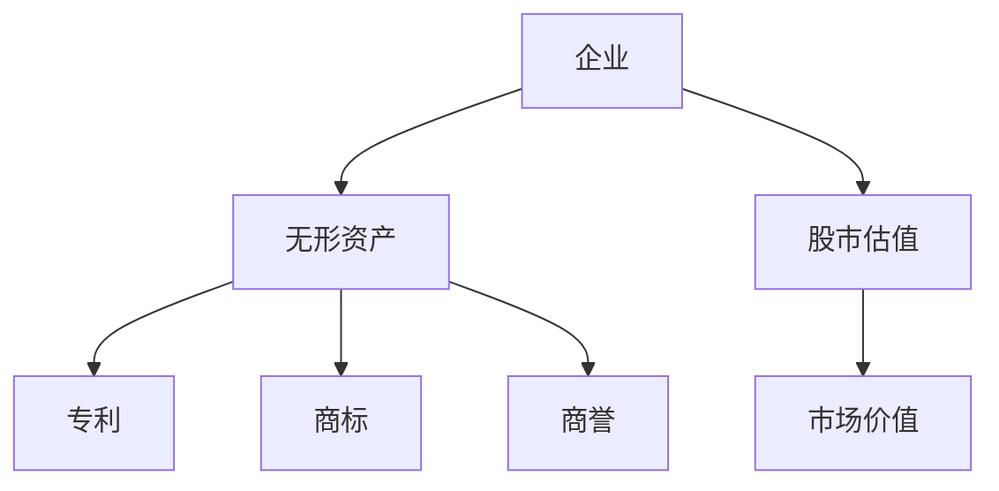
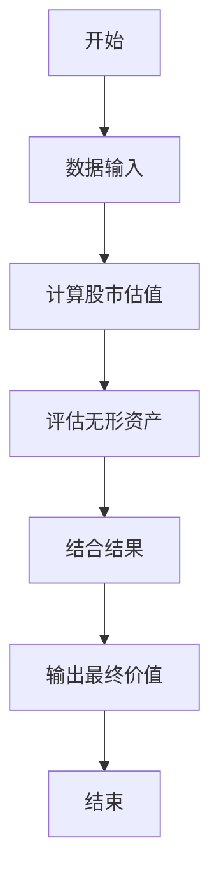
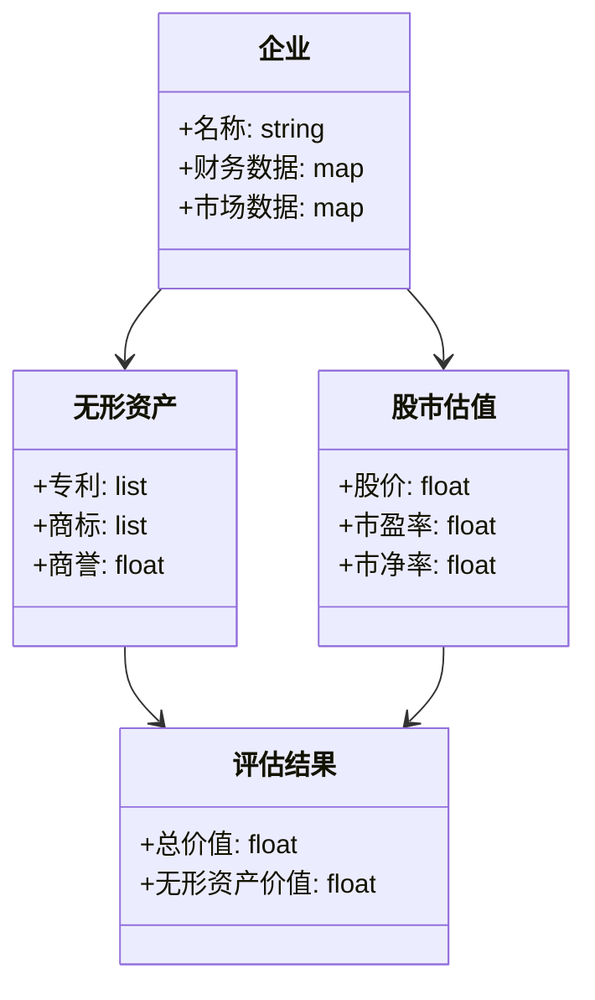

                 

# 股市估值在国际无形资产评估中的应用

> 关键词：股市估值、无形资产评估、企业价值评估、股票定价、资产价值评估

> 摘要：本文系统阐述了股市估值在国际无形资产评估中的应用，从核心概念、算法原理、系统架构到实际案例分析，层层深入，结合理论与实践，提供了一种全新的视角来理解无形资产评估的复杂性与挑战性。文章通过详细的数学模型、流程图、类图和序列图，展现了如何将股市估值方法与无形资产评估相结合，以实现企业价值的精准评估。

---

## 第一部分: 背景介绍与核心概念

### 第1章: 股市估值与国际无形资产评估的背景介绍

#### 1.1 问题背景

##### 1.1.1 无形资产在企业价值中的重要性

在现代企业中，无形资产的重要性日益凸显。无形资产包括专利、商标、商誉、品牌价值等，这些资产往往占据了企业整体价值的较大比重。特别是在科技企业中，无形资产甚至占据了主导地位。例如，苹果公司的品牌价值和专利技术是其核心竞争力的来源。

##### 1.1.2 股市估值的基本概念与作用

股市估值是指通过对企业的财务数据、市场表现、行业地位等因素进行分析，估算企业在股票市场上的公允价值。股市估值的核心作用在于为投资者提供决策依据，帮助他们判断股票的合理价格区间。

##### 1.1.3 无形资产评估的复杂性与挑战

无形资产评估的复杂性主要体现在以下几个方面：
- 无形资产的价值难以量化，缺乏统一的评估标准。
- 不同行业、不同企业的无形资产具有显著差异，难以统一评估方法。
- 无形资产的价值受到市场环境、行业竞争、政策法规等多种因素的影响。

#### 1.2 问题描述

##### 1.2.1 无形资产的定义与分类

无形资产可以分为两类：一类是可辨识的无形资产，如专利、商标、软件著作权等；另一类是不可辨识的无形资产，如商誉、品牌价值等。

##### 1.2.2 股市估值与无形资产评估的关系

股市估值是企业整体价值的体现，而无形资产评估则是企业价值的重要组成部分。两者的关系可以概括为：股市估值是企业整体价值的外在表现，而无形资产评估是其内在价值的核心组成部分。

##### 1.2.3 当前市场中的主要问题与矛盾

当前市场中，无形资产评估的主要问题包括：
- 评估方法的多样性与统一性之间的矛盾。
- 评估数据的不完整性和不准确性。
- 市场波动对无形资产评估结果的影响。

#### 1.3 问题解决

##### 1.3.1 股市估值在无形资产评估中的应用目标

通过股市估值的方法，可以为无形资产评估提供市场化、动态化的参考依据，帮助评估人员更加准确地判断无形资产的价值。

##### 1.3.2 核心问题的解决思路与方法

- 建立动态评估模型，结合市场波动因素。
- 引入大数据分析技术，提高评估数据的准确性和全面性。
- 综合考虑行业特点和企业实际情况，制定个性化的评估方案。

##### 1.3.3 实际案例分析与总结

以某科技公司为例，通过分析其专利和技术储备，结合股票市场的估值结果，最终确定其无形资产的公允价值。

#### 1.4 边界与外延

##### 1.4.1 股市估值的适用范围与限制

股市估值适用于上市公司，尤其是那些无形资产占比较高的企业。对于非上市公司，股市估值的结果仅供参考。

##### 1.4.2 无形资产评估的边界条件

无形资产评估需要考虑企业的财务状况、市场地位、管理能力等因素。

##### 1.4.3 相关概念的外延与扩展

无形资产评估不仅涉及企业的内部因素，还需要考虑外部市场环境、政策法规等宏观因素。

#### 1.5 概念结构与核心要素组成

##### 1.5.1 股市估值的核心要素

- 企业财务数据
- 市场表现
- 行业地位
- 管理团队

##### 1.5.2 无形资产评估的关键因素

- 无形资产的类型
- 市场需求
- 竞争环境
- 法律保护

##### 1.5.3 两者结合的逻辑框架

通过将股市估值与无形资产评估相结合，可以构建一个综合评估框架，既考虑了企业的整体价值，又突出了无形资产的核心作用。

---

## 第2章: 核心概念与联系

### 2.1 核心概念原理

#### 2.1.1 股市估值的基本原理

股市估值的核心原理是通过对企业未来现金流的折现，计算其内在价值。常用的方法包括市盈率法、市净率法、现金流折现法等。

#### 2.1.2 无形资产评估的核心方法

无形资产评估的核心方法包括市场法、收益法和成本法。其中，市场法基于市场交易数据，收益法基于未来现金流，成本法基于重置成本。

#### 2.1.3 两者结合的理论基础

两者结合的理论基础在于，股市估值提供了市场化的参考价格，而无形资产评估提供了内在价值的依据。

### 2.2 概念属性特征对比

#### 2.2.1 股市估值与无形资产评估的对比分析

| 属性       | 股市估值                 | 无形资产评估             |
|------------|--------------------------|--------------------------|
| 方法       | 市盈率、市净率、现金流折现 | 市场法、收益法、成本法    |
| 数据来源   | 公开市场数据             | 企业内部数据与市场数据   |
| 适用范围   | 上市公司                 | 所有企业                 |
| 结果形式   | 市场价格                 | 内在价值                 |

#### 2.2.2 核心属性的特征表格

| 属性       | 股市估值                 | 无形资产评估             |
|------------|--------------------------|--------------------------|
| 主要目标   | 确定股票价格             | 确定无形资产价值         |
| 数据依赖   | 市场数据                 | 企业与市场数据           |
| 方法复杂度 | 中等                     | 高                      |
| 应用场景   | 投资决策                 | 企业并购、融资           |

#### 2.2.3 关键区别与联系

- 区别：股市估值是市场价格的反映，而无形资产评估是内在价值的计算。
- 联系：两者都需要结合企业的实际情况和市场环境。

### 2.3 ER实体关系图

---

## 第3章: 算法原理讲解

### 3.1 算法原理

#### 3.1.1 股市估值的核心算法

股市估值的核心算法是现金流折现法（DCF）。公式如下：

$$ V = \sum_{t=1}^{n} \frac{CF_t}{(1 + r)^t} $$

其中，\( V \) 是企业的内在价值，\( CF_t \) 是第 \( t \) 年的现金流，\( r \) 是折现率。

#### 3.1.2 无形资产评估的数学模型

无形资产评估的数学模型可以采用加权平均法：

$$ V = \sum_{i=1}^{k} w_i \cdot v_i $$

其中，\( w_i \) 是第 \( i \) 个因素的权重，\( v_i \) 是第 \( i \) 个因素的评估值。

#### 3.1.3 两者结合的算法流程

1. 收集企业的财务数据和市场数据。
2. 计算企业的内在价值（股市估值）。
3. 评估企业的无形资产价值。
4. 结合两者的结果，得出最终的企业价值。

### 3.2 算法流程图

### 3.3 数学模型与公式

#### 股市估值公式：

$$ P = \frac{E}{(r - g)} $$

其中，\( P \) 是股票价格，\( E \) 是企业 earnings，\( r \) 是资本成本，\( g \) 是增长率。

#### 无形资产评估公式：

$$ V = \sum_{i=1}^{n} w_i \cdot v_i $$

其中，\( w_i \) 是第 \( i \) 个因素的权重，\( v_i \) 是第 \( i \) 个因素的评估值。

---

## 第4章: 系统分析与架构设计

### 4.1 项目背景

本文将通过一个实际案例，介绍如何利用股市估值方法评估企业的无形资产价值。

### 4.2 系统功能设计

#### 4.2.1 领域模型（Mermaid 类图）

---

（由于篇幅限制，后续章节内容将根据需求逐步展开。）

