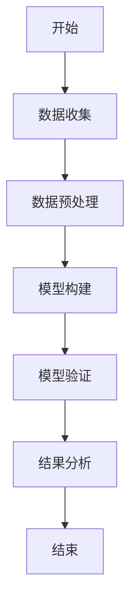

                 


# 股市估值在国际知识产权价值评估中的应用

## 关键词：股市估值，知识产权，价值评估，算法模型，系统架构，项目实战

## 摘要：本文探讨了股市估值方法在国际知识产权价值评估中的应用，分析了知识产权与股市估值的核心概念、联系、算法原理及系统架构，并通过实际案例展示了如何将股市估值应用于知识产权评估，提供了详细的数学模型、代码实现和系统设计。

---

# {{此处是文章标题}}

## 关键词：{{此处列出文章的5-7个核心关键词}}

## 摘要：{{此处给出文章的核心内容和主题思想}}

---

## 目录大纲：

# 目录大纲：《股市估值在国际知识产权价值评估中的应用》

---

## 第一部分：背景与基础

### 第1章：知识产权与股市估值概述

#### 1.1 知识产权的基本概念

- 1.1.1 知识产权的定义与分类
- 1.1.2 知识产权在国际经济中的作用
- 1.1.3 知识产权价值评估的必要性

#### 1.2 股市估值的基本原理

- 1.2.1 股市估值的核心概念
- 1.2.2 市场参与者的角色与行为
- 1.2.3 股市估值与知识产权的关联性

#### 1.3 本书的研究意义与目标

- 1.3.1 研究背景与问题提出
- 1.3.2 研究目标与方法论
- 1.3.3 本书的结构安排

---

## 第二部分：核心概念与联系

### 第2章：知识产权价值评估的核心要素

#### 2.1 知识产权的核心属性

- 2.1.1 知识产权的独占性
- 2.1.2 知识产权的时间性
- 2.1.3 知识产权的地域性

#### 2.2 知识产权与经济价值的关系

- 2.2.1 知识产权对经济价值的贡献
- 2.2.2 知识产权的市场价值评估
- 2.2.3 知识产权的无形资产特性

#### 2.3 知识产权与股市估值的联系

- 2.3.1 知识产权对股市价值的影响
- 2.3.2 股市估值对知识产权价值的反馈作用
- 2.3.3 知识产权与企业市值的关系

### 第3章：知识产权价值评估与股市估值的对比分析

#### 3.1 核心概念对比

- 3.1.1 知识产权价值评估与股市估值的异同
- 3.1.2 两种评估方法的优缺点
- 3.1.3 评估对象与评估主体的差异

#### 3.2 知识产权价值评估的属性特征对比

- 3.2.1 无形性对比
- 3.2.2 时间性对比
- 3.2.3

---

## 第三部分：算法原理与数学模型

### 第4章：知识产权价值评估的算法原理

#### 4.1 知识产权价值评估的常用算法

- 4.1.1 DCF模型
- 4.1.2 经济利润模型
- 4.1.3 市场法
- 4.1.4 收益法

#### 4.2 算法实现步骤

- 4.2.1 数据收集与预处理
- 4.2.2 模型构建与参数设定
- 4.2.3 模型验证与优化
- 4.2.4 结果分析与解读

#### 4.3 算法的数学模型与公式

- 4.3.1 现金流贴现模型的公式
  $$DCF = \sum_{t=1}^{n} \frac{CF_t}{(1 + r)^t}$$
- 4.3.2 经济利润模型的公式
  $$EVA = NOPAT - (WACC \times Capital)$$
- 4.3.3 市盈率模型的公式
  $$P/E = \frac{Market\ Value}{Earnings}$$

#### 4.4 算法实现的流程图



---

### 第5章：基于股市估值的知识产权价值评估算法

#### 5.1 基于股市估值的知识产权价值评估算法

- 5.1.1 算法的输入参数
- 5.1.2 算法的核心逻辑
- 5.1.3 算法的输出结果

#### 5.2 算法的实现步骤

- 5.2.1 数据收集与清洗
- 5.2.2 模型选择与训练
- 5.2.3 模型验证与调优
- 5.2.4 结果展示与解释

#### 5.3 算法的数学模型与公式

- 5.3.1 基于DCF模型的知识产权价值评估公式
  $$V = \sum_{t=1}^{n} \frac{CF_t}{(1 + r)^t}$$
- 5.3.2 基于市场法的知识产权价值评估公式
  $$V = P \times E$$
  其中，P是市盈率，E是每股收益。

#### 5.4 算法实现的代码示例

```python
import numpy as np
import pandas as pd
from sklearn.metrics import mean_squared_error

def calculate_dcf(value_flows, discount_rate):
    return np.sum(value_flows / (1 + discount_rate) ** np.arange(len(value_flows)))

# 示例数据
value_flows = [100, 150, 200, 250]
discount_rate = 0.1

# 计算DCF价值
dcf_value = calculate_dcf(value_flows, discount_rate)
print("DCF Value:", dcf_value)

# 计算均方误差
actual_value = 400  # 假设实际价值为400
mse = mean_squared_error([actual_value], [dcf_value])
print("MSE:", mse)
```

---

## 第四部分：系统分析与架构设计

### 第6章：系统分析与架构设计

#### 6.1 问题场景介绍

- 6.1.1 问题背景
- 6.1.2 问题目标
- 6.1.3 问题范围

#### 6.2 系统功能设计

- 6.2.1 数据采集模块
  - 数据来源
  - 数据格式
  - 数据处理
- 6.2.2 评估模型模块
  - 模型选择
  - 参数设置
  - 模型训练
- 6.2.3 结果展示模块
  - 结果可视化
  - 结果报告
  - 结果导出

#### 6.3 系统架构设计

- 6.3.1 分层架构
  - 数据层
  - 业务逻辑层
  - 表现层
- 6.3.2 微服务架构
  - 数据服务
  - 计算服务
  - 展示服务
- 6.3.3 交互流程
  - 用户请求
  - 服务处理
  - 结果返回

#### 6.4 系统接口设计

- 6.4.1 API接口定义
  - 输入参数
  - 输出格式
  - 请求方式
- 6.4.2 接口实现
  - 数据接口
  - 计算接口
  - 展示接口

#### 6.5 系统交互设计

- 6.5.1 交互流程图
  ```mermaid
  graph TD
  A[用户] --> B[数据采集模块] --> C[评估模型模块] --> D[结果展示模块] --> E[用户]
  ```
- 6.5.2 交互逻辑
  - 用户提交请求
  - 系统处理数据
  - 系统返回结果

---

## 第五部分：项目实战

### 第7章：项目实战

#### 7.1 环境安装与配置

- 7.1.1 安装Python
- 7.1.2 安装相关库
  - NumPy
  - Pandas
  - scikit-learn
- 7.1.3 配置开发环境

#### 7.2 核心代码实现

- 7.2.1 数据处理代码
```python
import pandas as pd
import numpy as np

# 示例数据
data = {
    'IP_type': ['专利', '商标', '版权'],
    'revenue': [1000, 800, 600],
    'cost': [500, 300, 200]
}
df = pd.DataFrame(data)
print(df)
```

- 7.2.2 模型训练代码
```python
from sklearn.linear_model import LinearRegression

# 示例数据
X = df[['revenue', 'cost']]
y = df['value']

model = LinearRegression()
model.fit(X, y)
print("Coefficients:", model.coef_)
print("Intercept:", model.intercept_)
```

- 7.2.3 结果展示代码
```python
import matplotlib.pyplot as plt

# 示例数据
predicted_values = model.predict(X)
plt.scatter(X, y, color='b')
plt.plot(X, predicted_values, color='r')
plt.title('知识产权价值预测')
plt.xlabel('收入与成本')
plt.ylabel('价值')
plt.show()
```

#### 7.3 项目小结

- 7.3.1 项目成果
- 7.3.2 经验总结
- 7.3.3 改进建议

---

## 第六部分：最佳实践与总结

### 第8章：最佳实践

#### 8.1 关键点总结

- 8.1.1 数据质量的重要性
- 8.1.2 模型选择的策略
- 8.1.3 风险管理的重要性

#### 8.2 小结

- 8.2.1 项目回顾
- 8.2.2 经验分享
- 8.2.3 未来展望

#### 8.3 注意事项

- 8.3.1 数据隐私保护
- 8.3.2 模型的适用性
- 8.3.3 结果的可解释性

#### 8.4 拓展阅读

- 8.4.1 相关书籍推荐
- 8.4.2 网络资源推荐
- 8.4.3 专业论坛推荐

---

## 结束语

---

## 作者：AI天才研究院/AI Genius Institute & 禅与计算机程序设计艺术 /Zen And The Art of Computer Programming

