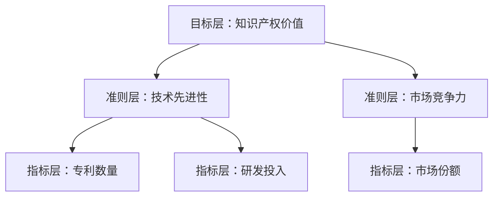
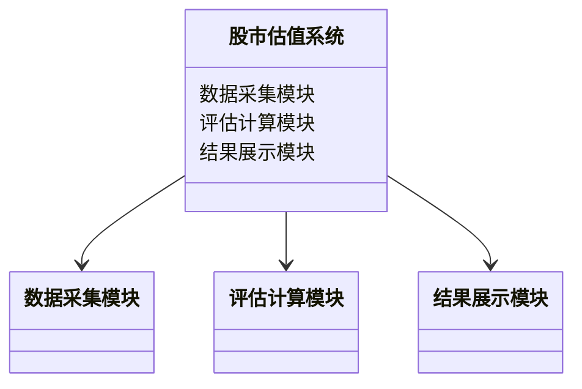

                 


```markdown
# 股市估值在国际知识产权价值链中的应用

> 关键词：股市估值、知识产权、价值链、资产评估、技术经济

> 摘要：本文探讨了股市估值在国际知识产权价值链中的应用，分析了知识产权对企业价值的影响，提出了基于知识产权的价值评估模型，并通过实际案例展示了如何利用这些模型进行股市估值。文章还讨论了相关算法的实现和系统架构设计，为投资者和企业提供了实用的参考。

---

## 第一部分: 股市估值与国际知识产权价值链的背景介绍

### 第1章: 股市估值的基本概念

#### 1.1 股市估值的定义与作用
股市估值是指通过对企业的财务数据、市场环境和行业状况等多方面因素进行分析，估算公司股票的内在价值。其作用在于帮助投资者做出理性投资决策，避免因市场波动盲目跟风。

#### 1.2 股市估值的核心要素
- **财务数据**：收入、利润、资产负债等。
- **市场环境**：宏观经济、行业趋势。
- **公司基本面**：管理团队、竞争优势。

#### 1.3 股市估值与企业价值的关系
股市估值是企业价值的外在表现，企业价值决定股票价格。

### 第2章: 国际知识产权价值链的概念

#### 2.1 知识产权的基本概念
知识产权是保护创新成果的法律工具，包括专利、商标、版权等。

#### 2.2 知识产权的价值链
- **创造**：研发新产品。
- **保护**：申请专利。
- **运用**：商业化应用。
- **管理**：维护和运营。

#### 2.3 知识产权在国际贸易中的地位
知识产权是国际贸易中的重要资产，直接影响企业的市场竞争力和利润。

### 第3章: 股市估值与知识产权价值链的关联

#### 3.1 知识产权对股市估值的影响
- **技术创新**：提升企业竞争力。
- **市场垄断**：增加企业利润。

#### 3.2 知识产权价值链对股市估值的启示
- 通过分析企业的知识产权布局，评估其市场竞争力和未来发展潜力。

---

## 第二部分: 知识产权价值评估的核心概念

### 第4章: 知识产权价值评估的基本原理

#### 4.1 知识产权评估的必要性
- 企业知识产权的价值直接影响其市场估值。

#### 4.2 知识产权评估的主要方法
- **成本法**：基于研发投入评估。
- **市场法**：参考类似资产的市场价格。
- **收益法**：基于未来收益的现值。

#### 4.3 各种方法的优缺点对比

| 方法 | 优点 | 缺点 |
|------|------|------|
| 成本法 | 简单易行 | 高估研发投入 |
| 市场法 | 精确性高 | 数据获取难 |
| 收益法 | 全面考虑未来收益 | 需准确预测 |

---

## 第三部分: 基于知识产权的股市估值算法

### 第5章: 层次分析法（AHP）在知识产权评估中的应用

#### 5.1 层次分析法的基本原理
- 将问题分解为多个因素，构建层次结构。
- 通过专家评分确定各因素的权重。

#### 5.2 知识产权评估的层次结构
- **目标层**：知识产权价值。
- **准则层**：技术先进性、市场竞争力。
- **指标层**：专利数量、研发投入。

#### 5.3 算法实现


### 第6章: 模糊综合评价法在股市估值中的应用

#### 6.1 模糊综合评价法的基本原理
- 用于处理评估中的模糊性问题。

#### 6.2 算法步骤
1. 确定评价指标。
2. 建立模糊评价矩阵。
3. 计算模糊合成结果。
4. 得出最终评价。

#### 6.3 代码实现
```python
import pandas as pd

def fuzzy_evaluation(data, weights):
    return pd.dot(data, weights)

data = pd.DataFrame({
    '专利数量': [100, 200],
    '研发投入': [50, 100]
})
weights = [0.4, 0.6]
result = fuzzy_evaluation(data, weights)
print(result)
```

---

## 第四部分: 系统架构与实现

### 第7章: 系统功能设计

#### 7.1 功能模块
- 数据采集模块。
- 评估计算模块。
- 结果展示模块。

#### 7.2 系统架构设计


### 第8章: 系统实现

#### 8.1 环境安装
```bash
pip install pandas numpy
```

#### 8.2 核心代码实现
```python
import numpy as np

def calculate_value(ip_assets, market_share):
    return np.dot(ip_assets, market_share)

ip_assets = np.array([100, 200])
market_share = np.array([0.5, 0.8])
result = calculate_value(ip_assets, market_share)
print(result)
```

---

## 第五部分: 项目实战与总结

### 第9章: 项目实战

#### 9.1 案例分析
- 某科技公司知识产权评估。
- 应用层次分析法和模糊评价法进行估值。

#### 9.2 结果分析
- 通过算法得出的估值结果。
- 对比实际股价，验证算法的有效性。

### 第10章: 总结与展望

#### 10.1 总结
本文提出了基于知识产权的股市估值方法，通过实际案例验证了其可行性。

#### 10.2 展望
未来可结合机器学习模型，进一步提升估值精度。

---

## 第六部分: 最佳实践与注意事项

### 第11章: 最佳实践

#### 11.1 选择合适的评估模型
- 根据具体需求选择层次分析法或模糊评价法。

#### 11.2 数据处理注意事项
- 确保数据准确性和完整性。

#### 11.3 结果验证
- 对比实际市场数据，验证模型的有效性。

---

## 作者

作者：AI天才研究院/AI Genius Institute & 禅与计算机程序设计艺术 /Zen And The Art of Computer Programming
```

